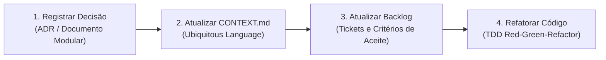

# GovFlow Architecture & Documentation Sync Protocol

Este protocolo deve ser executado sempre que uma nova funcionalidade for planejada, um refactor for iniciado ou uma decisão de design/entidade for tomada no ecossistema do GovFlow.

---

## 1. Princípios de Arquitetura Flexível (Guardrails)

1. **Arquitetura Hexagonal Estrita (Ports & Adapters)**:
   - Toda lógica de negócio reside exclusivamente em `domain/model` e `application/service`.
   - Controladores REST (`infrastructure/adapter/in/rest`) e Listeners AMQP (`infrastructure/adapter/in/amqp`) devem depender unicamente de Inbound Ports (`application/port/in`).
   - Repositórios JPA (`infrastructure/adapter/out/persistence`) e clientes externos (S3/MinIO, APIs externas) devem implementar Outbound Ports (`application/port/out`).
   - Nenhuma anotação de framework (JPA `@Entity`, Jackson `@JsonProperty`, Spring `@Service` ou `@Component`) deve poluir as classes e agregados de domínio puro.

2. **Extensibilidade de Dados (Híbrido Relacional + JSONB)**:
   - Campos universais e pesquisáveis com frequência devem ser colunas relacionais tipadas e indexadas (`id`, `tenant_id`, `convenio_id`, `fase_ciclo_vida`, `status`).
   - Dados especializados ou variáveis por categoria documental (ex: BMs, ARTs, Licenças Ambientais, Notas Fiscais) devem residir em colunas `JSONB` (`metadados_json`, `dados_extracao_ia_json`) ou tabelas satélites 1:1, permitindo evolução sem migrations destrutivas.

3. **Desacoplamento por Eventos (EDA)**:
   - A comunicação assíncrona entre módulos (WhatsApp, IA, Core GED e Cockpit) transita obrigatoriamente via mensageria RabbitMQ, utilizando payloads de eventos imutáveis com cabeçalhos de rastreamento (`X-Correlation-Id`, `X-Tenant-Id`).

4. **Isolamento Multi-Tenant e Escopo de Acesso**:
   - Todo acesso a dados corporativos filtra estritamente por `tenant_id`.
   - Se o usuário autenticado possuir o papel `AGENTE`, o escopo é adicionalmente restrito às prefeituras vinculadas em `tb_usuario_prefeituras`. O papel `ADMIN` possui visão global sobre o tenant.

---

## 2. Protocolo de Sincronização em 4 Passos

Sempre que realizar uma alteração arquitetural, execute este ciclo rigoroso:

### Passo 1: Documentação Modular de Arquitetura
Antes de qualquer linha de código, verifique e atualize a especificação técnica do módulo afetado em `docs/architecture/`:
- **Módulo 1 (IAM & Onboarding)**: [`docs/architecture/20_modulo_iam_onboarding_e_governanca.md`](file:///c:/projetos/estudo%20spring/govflow/docs/architecture/20_modulo_iam_onboarding_e_governanca.md).
- **Módulo 2 (GED & Ficheiro Digital)**: [`docs/architecture/21_modulo_ged_ficheiro_digital_convenio.md`](file:///c:/projetos/estudo%20spring/govflow/docs/architecture/21_modulo_ged_ficheiro_digital_convenio.md).
- **Módulo 3 (Comunicação WhatsApp & IA)**: [`docs/architecture/22_modulo_comunicacao_whatsapp_e_ia_contexto.md`](file:///c:/projetos/estudo%20spring/govflow/docs/architecture/22_modulo_comunicacao_whatsapp_e_ia_contexto.md).
- **Módulo 4 (Cockpit & Ciclo de Vida)**: [`docs/architecture/23_modulo_cockpit_ciclo_vida_operacional.md`](file:///c:/projetos/estudo%20spring/govflow/docs/architecture/23_modulo_cockpit_ciclo_vida_operacional.md).
- Descreva as tabelas SQL, diagramas de sequência Mermaid e endpoints REST envolvidos.

### Passo 2: Sincronização da Linguagem Ubíqua (`CONTEXT.md`)
Ao introduzir ou refinar entidades, conceitos ou papéis de atores:
- Atualize [`CONTEXT.md`](file:///c:/projetos/estudo%20spring/govflow/CONTEXT.md) mantendo o formato oficial:
  - Nome do termo em negrito.
  - Definição formal e responsabilidades no domínio.
  - Seção `_Avoid_` com jargões ambíguos ou termos proibidos.
- Garanta que a nomenclatura em código (classes, métodos, variáveis e endpoints) reflita 1:1 o termo acordado.

### Passo 3: Atualização do Backlog de Tickets (`24_plano_de_refatoracao_e_backlog_de_tickets.md`)
Mantenha o rastreamento em [`docs/architecture/24_plano_de_refatoracao_e_backlog_de_tickets.md`](file:///c:/projetos/estudo%20spring/govflow/docs/architecture/24_plano_de_refatoracao_e_backlog_de_tickets.md):
- Cada ticket deve declarar seu ID (`[TICKET-MODULO-XX]`), serviço impactado, lista de arquivos previstos e entregáveis.
- Ao concluir a implementação e testes de um ticket, atualize o status para concluído `[x]`.

### Passo 4: Implementação com Testes e Sem Regressão
- Aplique TDD: escreva ou atualize os testes unitários e de integração antes de finalizar a implementação.
- Valide as suítes automatizadas para assegurar zero regressões:
  - Backend: `mvn test -f services/core-service/pom.xml`
  - Gateway: `mvn test -f gateway/pom.xml`
  - WhatsApp: `mvn test -f services/whatsapp-service/pom.xml`
  - Frontend: `npm test -- --watch=false`
