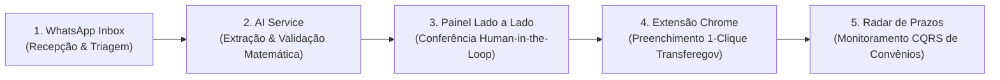

# GovFlow — Copiloto Inteligente do Transferegov para Consultorias Municipais

> **Plataforma B2B SaaS desenvolvida para empresas de assessoria e consultoria em gestão pública municipal.**  
> Automatiza a recepção de notas fiscais via WhatsApp, extrai dados com Inteligência Artificial (*Human-in-the-Loop*), monitora prazos críticos de transferências federais e injeta formulários de liquidação com 1 clique no portal oficial **Transferegov.br** por meio de extensão de navegador.

---

## 🚀 Simulação Interativa (Protótipo Web Autocontido)

O projeto conta com uma simulação web interativa completa em HTML/CSS/JS puro, sem dependências externas, demonstrando todo o fluxo ponta a ponta:

* **Arquivo:** [`simulation/index.html`](file:///c:/projetos/estudo%20spring/govflow/simulation/index.html)
* **Como executar no Windows:**
  ```powershell
  Start-Process "simulation/index.html"
  ```
  *(Ou simplesmente abra o arquivo no Google Chrome, Edge ou Firefox com duplo clique)*

---

## 🎯 O Cenário Real: Por que o GovFlow Existe?

1. **A Realidade dos Municípios:**
   * Mais de **85% dos municípios** no interior do Brasil (como na Paraíba) possuem menos de 20.000 habitantes e não têm secretarias de projetos ou contadores especializados em convênios federais.
   * Quase 100% dessas prefeituras terceirizam o serviço para **empresas privadas de consultoria municipal**.
2. **A Dor do Analista de Consultoria:**
   * Cada analista gerencia de **5 a 10 prefeituras** simultaneamente.
   * Recebe fotos de notas amassadas e áudios caóticos no WhatsApp pessoal.
   * Gasta de 20 a 35 minutos redigitando manualmente cada documento hábil em telas lentas do Transferegov.br.
   * Convive com o risco diário de glosas, bloqueio no **CAUC/SIAFI** e **multas de 1% ao dia (STF ADPF 854)** por atrasos em planos de trabalho de Emendas Pix.

---

## 🔄 O Ciclo Operacional do GovFlow (5 Etapas)



1. **Recepção Inteligente no WhatsApp:** Triagem automática de notas e transcrição de áudios via Evolution API e armazenamento seguro no MinIO S3.
2. **Extração Multimodal e Auditoria Matemática (IA):** Motor VLM (Google Gemini 3.x Flash) com extração de bounding boxes e conferência rígida:  
   $$\text{Valor Bruto} - \sum \text{Retenções (INSS + ISS + IRRF)} \equiv \text{Valor Líquido}$$
3. **Conferência Lado a Lado (*Side-by-Side Review*):** O analista visualiza o PDF com caixas delimitadoras interativas à esquerda e o formulário estruturado à direita, validando em menos de 30 segundos.
4. **Preenchimento 1-Clique no Transferegov:** Extensão segura de navegador (Manifest V3 com Shadow DOM) injeta os valores diretamente no formulário oficial do governo com disparo de eventos sintéticos nativos.
5. **Radar Proativo de Prazos:** Monitoramento diário das transferências com alertas preventivos de cláusula suspensiva (14 dias), vigência e geração de boletins executivos *white-label* para o Prefeito.

---

## 🏛️ Modelo de Domínio e Linguagem Ubíqua

O projeto segue as práticas de **Domain-Driven Design (DDD)** e arquitetura limpa:

* 📖 **[CONTEXT.md](./CONTEXT.md):** Glossário canônico de Linguagem Ubíqua.
* 📄 **[09_modelo_de_dominio_e_entidades.md](./docs/architecture/09_modelo_de_dominio_e_entidades.md):** Especificação completa das entidades:
  * **`Prefeitura`**: Ente convenente com dados políticos, CAUC e contatos municipais.
  * **`Convenio`**: Instrumento federal pactuado com a União/Caixa no Transferegov.
  * **`ContratoExecucao`**: Contrato administrativo decorrente de licitação municipal firmado com a empreiteira.
  * **`Medicao`**: Boletim periódico de avanço físico-financeiro com atesto do engenheiro fiscal.
  * **`DocumentoHabil`**: Nota fiscal com retenções tributárias detalhadas para liquidação.
  * **`OrdemPagamento`**: Movimentação financeira via OBTV na conta vinculada do convênio.

---

## 🏗️ Arquitetura dos Microsserviços

| Microsserviço | Tecnologia | Padrão Arquitetural | Porta |
| :--- | :--- | :--- | :--- |
| `api-gateway` | Java 21 / Spring Cloud Gateway | Clean Architecture Reativa | `8080` |
| `core-service` | Java 21 / Spring Boot 3 / JPA / PostgreSQL | Hexagonal (Ports & Adapters) / DDD | `8081` |
| `transferegov-service` | Java 21 / Spring Boot 3 | CQRS & Streaming CSV | `8082` |
| `whatsapp-service` | Java 21 / Spring Boot 3 / AMQP | Event-Driven & Strategy Pattern | `8083` |
| `ai-service` | Python 3.12+ / FastAPI / Gemini SDK | Clean Pipeline & Active Learning | `8000` |
| `frontend` | Angular 19/20 Standalone / Signals | Feature-Sliced Design (FSD) | `4200` |
| `extension` | TypeScript / Chrome Manifest V3 | Shadow DOM & DOM Injector Strategy | - |

### Entrega atual (branch `delta`) — API Gateway

A etapa do **API Gateway** já está implementada neste repositório. Para o administrador avaliar merge, leia o relatório de entrega:

* 📦 **[`gateway/README.md`](./gateway/README.md)** — o que foi feito, decisões, como validar e escopo fora desta etapa  
* ✅ Auditoria das etapas: [`docs/audits/test_results.json`](./docs/audits/test_results.json)

Subir só o gateway + stubs:

```powershell
docker compose up -d stub-core stub-transferegov stub-whatsapp stub-ai api-gateway
```

---

## 📚 Documentação Técnica Completa

Para aprofundamento detalhado, consulte os documentos em [`docs/`](./docs/):

1. [Visão Geral, Concepção e Proposta de Valor](./docs/00_visao_geral_e_ideia_do_projeto.md)
2. [API Gateway (Clean Architecture Reativa)](./docs/architecture/01_arquitetura_api_gateway_clean_arch.md)
3. [Core Document Service (Hexagonal / Multi-Tenant)](./docs/architecture/02_arquitetura_core_service_hexagonal.md)
4. [Transferegov Service (Streaming CSV e CQRS)](./docs/architecture/03_arquitetura_transferegov_service_cqrs.md)
5. [WhatsApp Service (Event-Driven e Evolution API)](./docs/architecture/04_arquitetura_whatsapp_service_eda.md)
6. [AI Service (FastAPI, Visão Multimodal e Active Learning)](./docs/architecture/05_arquitetura_ai_service_clean_pipeline.md)
7. [Frontend Angular e Extensão Chrome Manifest V3](./docs/architecture/06_arquitetura_frontend_e_extensao.md)
8. [Deep Research: Transferegov CSV Dumps vs APIs](./docs/architecture/07_deep_research_transferegov_csv_vs_api.md)
9. [Validação Arquitetural e Guia Pre-Mortem](./docs/architecture/08_deep_research_validacao_arquitetura_e_pitfalls.md)
10. [Modelo de Domínio e Entidades (Prefeitura, Convênios, Contratos e Medições)](./docs/architecture/09_modelo_de_dominio_e_entidades.md)
11. [Contexto da Plataforma, Containers C4 e ADRs](./docs/architecture/contexto_arquitetura_plataforma.md)
12. [Estratégia de Escopo, ROI e Pitch Comercial](./docs/architecture/estrategia_pitch_escopo_consultorias.md)
13. [Relatório de Pesquisa: Ecossistema GovTech Paraíba](./docs/architecture/relatorio_deep_research_govtech_paraiba.md)
