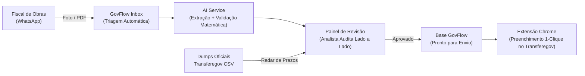

# GovFlow — Copiloto Inteligente de Gestão do Transferegov para Consultorias Municipais

> **Documento de Visão, Concepção e Proposta de Valor**  
> **Versão:** 1.0 — MVP Transferegov  
> **Público-alvo deste documento:** Fundadores, Engenharia de Produto, Designers e Investidores  

---

## 1. O que é o GovFlow? (Elevator Pitch)

O **GovFlow** é uma plataforma B2B SaaS desenvolvida especificamente para **empresas de consultoria e assessoria em gestão pública municipal**. 

Ele atua como um **copiloto operacional de alta confiança**, eliminando o trabalho braçal e repetitivo dos analistas de convênios. A plataforma centraliza a recepção de documentos fiscais via WhatsApp, utiliza Inteligência Artificial com validação humana (*Human-in-the-Loop*) para auditoria e extração de dados, monitora prazos críticos de transferências federais e preenche automaticamente os formulários de prestação de contas no portal oficial **Transferegov.br** por meio de uma extensão segura de navegador.

---

## 2. O Cenário Real: Por que este Projeto Existe?

### 2.1 A Realidade dos Municípios (O Caso da Paraíba)
No Brasil profundo — em especial no Nordeste e na Paraíba —, a imensa maioria dos municípios é de pequeno porte:
* **85,7% dos municípios paraibanos** possuem menos de 20.000 habitantes (Censo IBGE 2022).
* Essas prefeituras não dispõem de secretarias de projetos estruturadas nem de engenheiros ou contadores concursados dedicados a prestar contas das verbas federais.
* **A solução adotada por quase 100% das prefeituras:** contratar **empresas privadas de consultoria municipal** (escritórios sediados em polos como João Pessoa, Campina Grande, Patos e Sousa). 

### 2.2 O Dia a Dia Caótico do Analista de Consultoria
O verdadeiro cliente do GovFlow não é o prefeito nem o secretário, mas o **analista técnico da consultoria**. Cada analista gerencia entre **5 a 10 prefeituras simultaneamente**. Sua rotina é marcada por:

1. **Caos de Canais e Formatos:** Fiscais de obras, secretários de finanças e empreiteiros enviam fotos de notas fiscais amassadas tiradas no capô do carro, PDFs escanados tortos e planilhas de medição em horários aleatórios pelo WhatsApp pessoal.
2. **Organização Manual em Pastas:** O analista precisa baixar arquivo por arquivo, renomear e salvar em pastas locais do Windows ou Google Drive (`/Prefeitura X/Obras/2024/Creche/Medição 02 (1).pdf`).
3. **Redigitação Exaustiva de "Documentos Hábeis":** Para cada nota fiscal e medição de obra, o analista precisa abrir o portal do **Transferegov.br** (antigo SICONV), navegar por dezenas de telas lentas, digitar manualmente CNPJs, códigos de barras, dados bancários, valores brutos, retenções tributárias (INSS, ISS, IRRF) e itens de medição.
4. **O Medo Constante de Prazos e Multas:** Perder a data-limite de uma prestação de contas ou de uma liquidação gera bloqueio imediato do município no CAUC/SIAFI, retenção de verbas e multas diárias de até 1% (STF ADPF 854). Quando algo atrasa, a culpa recai sobre o analista e a consultoria corre risco de rescisão contratual.

---

## 3. O Posicionamento do Produto: Foco no Analista e na Confiança

> [!IMPORTANT]
> **O GovFlow não é uma ferramenta punitiva nem de fiscalização externa.**  
> O GovFlow foi desenhado para ser o **melhor amigo do trabalhador da consultoria**, um assistente que assume o fardo burocrático e devolve a ele a capacidade de fazer gestão técnica de alto nível sem sobrecarga emocional.

### O Princípio da Confiança e Resiliência (Human-in-the-Loop)
Em sistemas governamentais, **um erro de um centavo ou uma vírgula deslocada rejeita a prestação de contas inteira**. Por isso:
* **A IA NUNCA opera de forma 100% autônoma às cegas.** O analista nunca é substituído; ele é promovido a **auditor**.
* A IA extrai, pré-calcula a matemática, identifica as inconsistências e **apresenta uma proposta visual lado a lado** (*Side-by-Side Review*).
* O analista bate o olho, vê o índice de confiança verde (> 95%) e apenas clica em **"Aprovar"** ou faz ajustes em segundos com 1 clique.
* O sistema aprende com os acertos e correções (*Active Learning*), ficando cada vez mais afinado com os fornecedores e empreiteiras daquela região.

---

## 4. Como a Solução Funciona na Prática (Fluxo Operacional)

O ciclo de vida de uma medição no GovFlow possui 5 etapas fluidas:

### Etapa 1: Recepção Inteligente via WhatsApp
* O fiscal da prefeitura ou o empreiteiro envia a nota fiscal e a medição no número de WhatsApp corporativo da consultoria.
* O bot inteligente faz uma triagem simples e amigável: *"Identifiquei que este documento é da Prefeitura de Pombal, referente à Creche Proinfância. Confirma?"*
* O arquivo é armazenado com segurança em nuvem (S3/MinIO), sem perdas em grupos de WhatsApp.

### Etapa 2: Extração Multimodal e Auditoria Matemática (IA)
* O documento é processado pelo motor de IA (Google Gemini 3.x Flash).
* O sistema extrai todos os campos exigidos pelo formulário de **Documento Hábil** do Transferegov:
  * Número do Documento, Série e Data de Emissão.
  * CNPJ e Razão Social do Fornecedor / Credor.
  * Valor Bruto da Nota.
  * Deduções Tributárias (ISS, INSS, IRRF).
  * Valor Líquido a Pagar.
* **Validação Algorítmica Rígida:** O motor de backend roda uma verificação matemática determinística:
  $$\text{Valor Bruto} - \sum (\text{Retenções}) == \text{Valor Líquido}$$
  Se a matemática não bater perfeitamente, o campo é sinalizado em vermelho como prioridade de revisão.

### Etapa 3: Conferência Lado a Lado (Side-by-Side Review)
* No painel web do GovFlow (Angular), o analista abre a medição pendente.
* A interface exibe:
  * **Lado Esquerdo:** O documento original em alta resolução, com caixas delimitadoras coloridas destacando exatamente onde a IA leu cada informação.
  * **Lado Direito:** Os campos estruturados prontos, com chips de confiança visual (Verde: alta certeza; Amarelo: conferência recomendada; Vermelho: inconsistência matemática).
* O analista valida ou corrige em menos de **30 segundos** (processo que antes levava de 15 a 25 minutos de digitação manual).

### Etapa 4: Preenchimento Automático via Extensão Chrome no Transferegov
* O governo federal não disponibiliza API pública de gravação de dados para o módulo SICONV/Discricionárias.
* **A inovação da GovFlow:** Uma **Extensão de Chrome (Manifest V3)** oficial e segura.
* O analista loga no portal oficial `transferegov.sistema.gov.br` com sua conta Gov.br (preservando todas as credenciais e conformidade de segurança).
* Ao entrar na tela de inclusão de "Documento Hábil" do convênio, a extensão GovFlow detecta o convênio e exibe uma barra flutuante: *"1 Documento Aprovado disponível para injeção"*.
* Com **1 clique no botão "Preencher Formulário"**, a extensão injeta com segurança todos os campos nos inputs correspondentes, contornando máscaras e validando eventos nativos. O analista apenas clica em "Salvar" no portal do governo.

### Etapa 5: Radar de Prazos do Transferegov (Monitor Proativo)
* Todos os dias, às 07h da manhã, o GovFlow consome o dump diário oficial do Transferegov e faz o filtro imediato dos convênios da Paraíba.
* O painel exibe um **Radar de Risco de Prazos**:
  * Prazos de vigência prestes a expirar (60, 30, 15 dias).
  * Pendências de prestação de contas pendentes de aprovação pelo órgão repassador (ministérios/FNDE/Caixa Econômica).
  * O analista sabe exatamente onde colocar o foco do seu dia antes que qualquer multa ou bloqueio ocorra.

---

## 5. Por que Esta Solução Vence? (Vantagens Competitivas)

| Solução Atual / Alternativas | Como o GovFlow Faz Diferente |
| :--- | :--- |
| **Pastas do Windows + Planilhas Excel:** Descentralizado, propenso a perda de arquivos quando um analista sai da empresa. | **Hub Centralizado Multi-Tenant:** Todos os documentos, histórico de extrações e status de convênios ficam protegidos na nuvem da consultoria. |
| **Tentativas de "Robôs RPA" Frágeis:** Robôs de tela que quebram com CAPTCHAs, instabilidade de rede ou atualizações de layout do governo. | **Extensão Assistida (Human-in-the-Loop):** O login Gov.br é feito pelo próprio analista. O robô só auxilia o preenchimento, nunca fica travado por CAPTCHA. |
| **Sistemas Tradicionais de Gestão Pública:** Focam apenas na contabilidade interna da prefeitura e ignoram o fluxo de trabalho da consultoria privada terceirizada. | **Desenhado para Consultorias:** Permite que 1 único analista gerencie múltiplas prefeituras alternando facilmente de contexto em uma só tela. |
| **Promessas de "IA que faz tudo":** IAs genéricas erram números de notas e geram multas e glosas de convênios. | **Dupla Blindagem:** A IA sugere, a matemática determinística valida e o analista aprova com clareza visual total. |

---

## 6. Proposta de Valor e Retorno sobre o Investimento (ROI)

Para o dono e para a equipe da consultoria:

1. **Aumento de Capacidade Operacional em 3x a 4x:**
   * Tempo médio de inclusão manual de um documento hábil: **20 a 35 minutos**.
   * Tempo com GovFlow (conferência visual + injeção na extensão): **2 minutos**.
   * Uma consultoria que antes atendia 10 prefeituras com 3 analistas no limite do estresse passa a conseguir atender **25 a 30 prefeituras** com a mesma equipe, trabalhando com tranquilidade.
2. **Eliminação de Glosas e Multas:**
   * Redução a zero de lançamentos com números trocados ou retenções tributárias calculadas erroneamente.
3. **Retenção e Satisfação dos Analistas:**
   * Redução drástica do *burnout* de fim de mês e de feriados passados redigitando notas fiscais acumuladas.
4. **Segurança Institucional da Consultoria:**
   * Se um analista adoece ou pede demissão, a consultoria não perde o histórico nem os documentos das prefeituras: tudo está catalogado e auditado no sistema.

---

## 7. Modelo de Negócio

* **SaaS B2B por Assinatura Recorrente:**
  * Cobrança mensal baseada na faixa de prefeituras ativas geridas pela consultoria:
    * **Plano Starter:** Até 3 municípios (ideal para consultores autônomos ou pequenos escritórios).
    * **Plano Professional:** Até 10 municípios (o padrão da maioria das consultorias regionais).
    * **Plano Enterprise:** Municípios ilimitados + instâncias dedicadas de WhatsApp.
* **Período de Teste com Prova de Valor:**
  * Onboarding assistido no primeiro mês com a prefeitura mais problemática da consultoria para comprovar a redução de horas gastas em menos de 15 dias.

---

## 8. Links para a Arquitetura e Especificações Técnicas

Para detalhes aprofundados sobre a engenharia, consulte os documentos dedicados no repositório:

* [Contexto Arquitetural, Containers C4 e ADRs](file:///c:/projetos/estudo%20spring/govflow/docs/architecture/contexto_arquitetura_plataforma.md)
* [Gateway de API (Clean Architecture Reativa)](file:///c:/projetos/estudo%20spring/govflow/docs/architecture/01_arquitetura_api_gateway_clean_arch.md)
* [Core Document Service (Hexagonal / Multi-Tenant)](file:///c:/projetos/estudo%20spring/govflow/docs/architecture/02_arquitetura_core_service_hexagonal.md)
* [Transferegov Service (Streaming CSV e CQRS)](file:///c:/projetos/estudo%20spring/govflow/docs/architecture/03_arquitetura_transferegov_service_cqrs.md)
* [WhatsApp Service (Event-Driven e Evolution API)](file:///c:/projetos/estudo%20spring/govflow/docs/architecture/04_arquitetura_whatsapp_service_eda.md)
* [AI Service (FastAPI, Visão Multimodal e Active Learning)](file:///c:/projetos/estudo%20spring/govflow/docs/architecture/05_arquitetura_ai_service_clean_pipeline.md)
* [Frontend Angular e Extensão Chrome Manifest V3](file:///c:/projetos/estudo%20spring/govflow/docs/architecture/06_arquitetura_frontend_e_extensao.md)
* [Validação da Arquitetura e Guia Pre-Mortem](file:///c:/projetos/estudo%20spring/govflow/docs/architecture/08_deep_research_validacao_arquitetura_e_pitfalls.md)
* [Modelo de Domínio e Entidades (Prefeitura, Convênios, Contratos e Medições)](file:///c:/projetos/estudo%20spring/govflow/docs/architecture/09_modelo_de_dominio_e_entidades.md)
* [Deep Research: Ciclo de Vida Integral de Convênios Federais (Transferegov)](file:///c:/projetos/estudo%20spring/govflow/docs/architecture/10_deep_research_ciclo_de_vida_convenios.md)
