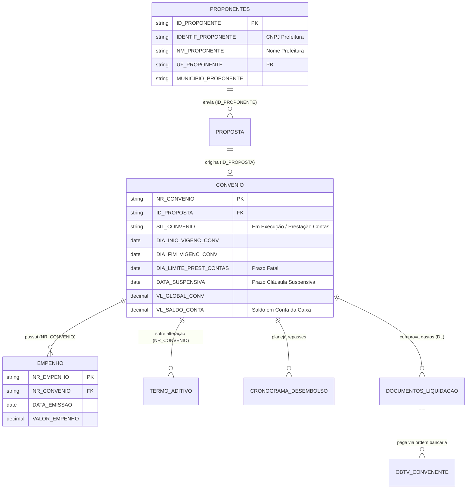

# Deep Research: Arquitetura de Dados do Transferegov (APIs REST vs. Cargas Diárias em CSV)

**Foco da Pesquisa:** Módulo de Transferências Discricionárias e Legais (SICONV) vs. Módulos Especiais  
**Fonte Primária:** Azure Blob Storage Oficial (`api-publica.transferegov.gestao.gov.br/downloads/dadosgov/`) e Modelo de Dados do Ministério da Gestão e Inovação (MGI)  
**Data da Auditoria:** 04 de Setembro de 2026  

---

## 1. O Veredito Técnico: O Mito da "API REST para Tudo"

Muitos desenvolvedores assumem equivocadamente que o Transferegov possui uma API REST pública e síncrona para consultar qualquer convênio ou histórico de obra. 

**A constatação real é:**
1. **Transferências Especiais (Emendas Pix - `/especiais`):** Possui API REST moderna documentada em OpenAPI/Swagger, pois é um módulo novo (criado recentemente sob supervisão do STF e MGI).
2. **Transferências Fundo a Fundo (`/fundoafundo`):** Possui API REST aberta para planos de ação e contas bancárias.
3. **Módulo de Transferências Discricionárias e Legais (SICONV - O Núcleo das Prefeituras):**  
   **NÃO funciona via API REST pública para consultas analíticas ou históricas.**  
   O canal oficial, homologado e autoritativo do Governo Federal é um **repositório diário de dumps relacionais em arquivos compactados (`.zip` contendo `.csv`)**, hospedado no Azure Blob Storage da União.

```
                               ARQUITETURA OFICIAL DE DADOS DO GOVERNO FEDERAL
+----------------------------------------------------------------------------------------------------+
|                                                                                                    |
|  [ MÓDULOS NOVOS ]                                                                                 |
|  - Transferências Especiais (Pix)  ──► API REST (JSON)  ──► https://api-publica.../especiais       |
|  - Fundo a Fundo (FAF)             ──► API REST (JSON)  ──► https://api-publica.../fundoafundo     |
|  - Parcerias MROSC                 ──► API REST (JSON)  ──► https://api-publica.../parcerias       |
|                                                                                                    |
|  [ O NÚCLEO DOS CONVÊNIOS E OBRAS (DISCRICIONÁRIAS E LEGAIS) ]                                     |
|  - Propostas, Convênios, Obras,    ──► DUMP DIÁRIO CSV  ──► https://api-publica.../downloads/      |
|    Empenhos, Medições, Pagamentos,     EM AZURE BLOB        dadosgov/{tabela}.zip                  |
|    Termos Aditivos e Cláusulas                              (Atualizado todo dia às 06h30 BRT)     |
|                                                                                                    |
+----------------------------------------------------------------------------------------------------+
```

---

## 2. Raio-X das Cargas Diárias em CSV (Dados Reais Extraídos Hoje)

Auditamos o endpoint direto de listagem do container Azure Blob (`restype=container&comp=list`).  
O Governo Federal disponibiliza exatamente **65 arquivos ZIP relacionais**, gerados diariamente às **06:36 BRT** (conforme registrado no arquivo sentinela `data_carga_siconv.csv`).

### Principais Arquivos Críticos para o Nosso Sistema:

| Arquivo Remoto (.zip) | Tamanho Compactado | Tabela SICONV Correspondente | Dados Críticos Contidos |
| :--- | :--- | :--- | :--- |
| **`siconv_convenio.zip`** | **17.53 MB** | `convenio` (40 colunas) | `NR_CONVENIO`, `SIT_CONVENIO`, `DIA_FIM_VIGENC_CONV`, `DIA_LIMITE_PREST_CONTAS`, `DATA_SUSPENSIVA`, `VL_GLOBAL_CONV`, `VL_SALDO_CONTA`. |
| **`siconv_proponentes.zip`** | **6.07 MB** | `proponentes` (11 colunas) | `ID_PROPONENTE`, `IDENTIF_PROPONENTE` (CNPJ da Prefeitura), `NM_PROPONENTE`, `UF_PROPONENTE` (`PB`), `MUNICIPIO_PROPONENTE`. |
| **`siconv_proposta.zip`** | **195.89 MB** | `proposta` (36 colunas) | `ID_PROPOSTA`, `ID_PROPONENTE`, `OBJETO_PROPOSTA`, `VALOR_GLOBAL`, `SIT_PROPOSTA`. |
| **`siconv_empenho.zip`** | **22.12 MB** | `empenho` (18 colunas) | `NR_CONVENIO`, `NR_EMPENHO`, `TIPO_NOTA`, `DATA_EMISSAO`, `VALOR_EMPENHO`. |
| **`siconv_termo_aditivo.zip`**| **57.70 MB** | `termo_aditivo` (11 colunas) | Prorrogações de vigência, acréscimos e supressões de valor. |
| **`siconv_dl.zip`** | **201.47 MB** | `documentos_liquidacao` | Histórico de Notas Fiscais e Medições já cadastradas no Transferegov. |
| **`siconv_acomp_obras...zip`**| **0.76 MB** | `medicoes_obras` | Boletins de medição, percentual de execução física e valores medidos. |
| **`data_carga_siconv.zip`** | **178 bytes** | *Sentinela de carga* | Timestamp exato da geração dos dados (ex: `04/09/2026 06:36:22`). |

---

## 3. O Esquema Interno do SICONV (Modelo de Dados)

Através do arquivo SchemaSpy oficial da União (`bd_portal.public.xml`), identificamos o relacionamento relacional entre as tabelas:



---

## 4. Por Que a Estratégia de CSV É Superior a APIs REST para a Consultoria?

1. **Imunidade a Quedas e Lentidão do Governo:**
   - As APIs do Governo Federal frequentemente sofrem com instabilidade, lentidão e erros 503/504 em dias de fechamento de mês.
   - Ter uma cópia local dos convênios das prefeituras da Paraíba no nosso PostgreSQL significa que o analista tem **respostas instantâneas (< 10ms)** e o sistema funciona mesmo se o portal do governo estiver fora do ar.
2. **Auditoria de Histórico Completo:**
   - Com o dump diário, podemos comparar o arquivo de ontem com o de hoje e saber com precisão cirúrgica: *"O convênio 912345 de Massaranduba teve a vigência prorrogada por mais 60 dias"* ou *"A Caixa liberou o pagamento da medição 2"*.
3. **Zero Risco de Rate Limiting ou Bloqueio de IP:**
   - Fazer centenas de requisições REST por minuto para checar status de 20 prefeituras causaria bloqueio de IP no firewall do Serpro/Dataprev. O download de 1 arquivo ZIP por dia elimina totalmente o risco de bloqueio.

---

## 5. Como o `transferegov-service` Deve Operar o Pipeline de ETL

O `transferegov-service` não precisa (e nem deve) processar os gigabytes de dados do Brasil inteiro. O segredo da performance é a **Filtragem por Streaming**:

```
                              PIPELINE ETL INTELIGENTE (STREAMING)
+----------------------------------------------------------------------------------------------------+
|                                                                                                    |
|  1. SCHEDULER MATINAL (Todo dia às 07h00)                                                          |
|     Baixa o arquivo leve 'data_carga_siconv.zip' (178 bytes).                                      |
|     Verifica se a data mudou em relação à última carga gravada no banco.                           |
|                                                                                                    |
|  2. STREAMING E DESCOMPACTAÇÃO EM MEMÓRIA (Sem gravar ZIP gigante em disco)                       |
|     - Abre a conexão HTTP com 'siconv_proponentes.zip' e filtra: UF_PROPONENTE == 'PB'.           |
|     - Mapeia os 'ID_PROPONENTE' dos municípios paraibanos clientes da consultoria.                 |
|                                                                                                    |
|  3. INGESTÃO DE CONVÊNIOS & EMPENHOS DOS CLIENTES                                                 |
|     - Faz streaming de 'siconv_convenio.zip' (18 MB compactado).                                   |
|     - Lê linha por linha e só processa se o 'ID_PROPOSTA' pertencer às prefeituras monitoradas.    |
|     - Executa UPSERT no PostgreSQL (transferegov_schema.convenio):                                 |
|       INSERT INTO convenio (...) VALUES (...) ON CONFLICT (nr_convenio) DO UPDATE ...;             |
|                                                                                                    |
|  4. DETECÇÃO DE DELTAS E DISPARO DE ALERTAS                                                        |
|     Roda query de prazos críticos:                                                                 |
|     - Convênios com 'DIA_LIMITE_PREST_CONTAS' <= 15 dias;                                          |
|     - Convênios com 'DATA_SUSPENSIVA' <= 30 dias.                                                 |
|     Dispara evento 'AlertaPrazoCriticoEvent' no RabbitMQ para avisar a equipe.                     |
|                                                                                                    |
+----------------------------------------------------------------------------------------------------+
```

### Métricas Reais de Performance Estimadas:
- **Tamanho do Download:** Apenas ~25 MB de arquivos ZIP por dia.
- **Linhas Processadas:** Menos de 5.000 linhas da Paraíba (em vez de 500.000 do Brasil).
- **Tempo Total de Execução do Job:** **Aproximadamente 45 a 60 segundos**.
- **Consumo de Memória:** Menos de 150 MB de heap no container Spring Boot usando streams do Java (`ZipInputStream` e `BufferedReader`).

---

## 6. Atualização Arquitetural no `transferegov-service`

Com base nesta comprovação empírica, o `transferegov-service` passa a adotar uma arquitetura de duas frentes perfeitamente coordenadas:

1. **Motor de Carga SICONV (Batch / CSV ETL):**
   - Responsável por manter a base local de **Convênios, Prazos de Prestação de Contas, Vigências e Empenhos** 100% atualizada a partir dos dumps diários do Azure Blob Storage.
2. **Motor de APIs REST (Especiais / Pix):**
   - Responsável por consultar os endpoints REST públicos (`/especiais`) para monitorar as **Emendas Pix** (Planos de Trabalho e Relatórios de Gestão exigidos pelo STF).
3. **Servidor de Payloads para a Extensão Chrome:**
   - Cruza os dados locais do convênio com a Nota Fiscal/Medição auditada no `core-service` e entrega o JSON consolidado para a extensão preencher a tela oficial do governo em 1 clique.
