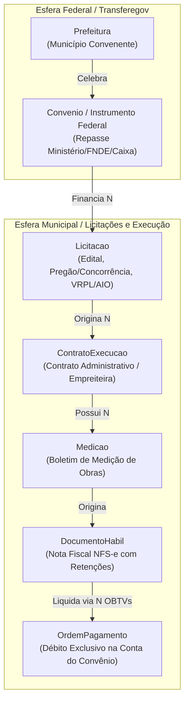
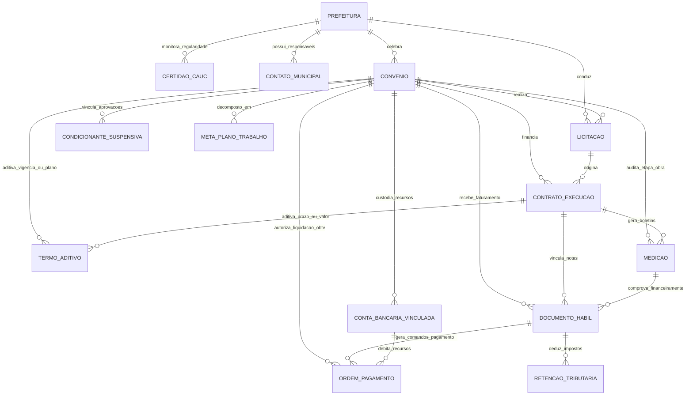

# Modelo de Domínio e Especificação de Entidades: Gestão Integral de Convênios Federais

> **Roteamento de Engenharia (`/ask-matt` & `/domain-modeling`):**  
> Este documento formaliza o Modelo de Domínio Tático (DDD) do **GovFlow Core**. Ele cobre com **100% de fidelidade as 10 fases do ciclo de vida dos convênios e contratos de repasse federais (Transferegov.br)**, desambigua o conceito sobrecarregado de *"Contrato"*, modela a **relação 1:N entre Convênio e Licitações**, define o vocabulário canônico (Linguagem Ubíqua), detalha todos os atributos, relacionamentos, agregados, invariantes matemáticas e consolida o DDL do PostgreSQL 16 (Flyway V1, V2, V3 e V4).

---

## 1. Roteamento de Vocabulário: Desambiguação de "Contrato" e Licitações

No setor público municipal e na operação do Transferegov.br, a palavra **"Contrato"** é frequentemente sobrecarregada para significar duas coisas completamente distintas. Além disso, **um único Convênio pode comportar múltiplas Licitações** (ex.: uma concorrência para a obra civil e pregões separados para supervisão técnica e aquisição de equipamentos). O GovFlow organiza esses conceitos em Agregados com fronteiras bem definidas:



1. **`Convenio` (Instrumento Federal de Transferência):**
   * **Partes:** Governo Federal (Ministério Concedente / Mandatária Caixa) $\leftrightarrow$ Prefeitura (Convenente).
   * **Finalidade:** O repasse financeiro da União para o município executar um objeto público (ex: Creche Proinfância, Pavimentação Asfáltica).
   * **Identificador Primário Oficial:** Número Transferegov / SICONV (ex: `912345/2024`).

2. **`Licitacao` (Certame Municipal de Contratação Pública - 1:N):**
   * **Partes:** Prefeitura (Órgão Licitante) $\leftrightarrow$ Licitantes Concorrentes.
   * **Finalidade:** Seleção da proposta mais vantajosa (Lei nº 14.133/2021). Um convênio pode comportar múltiplos certames independentes (obras civis, fiscalização terceirizada, equipamentos).
   * **Identificador Primário Oficial:** Número do Processo / Edital Licitatório e Protocolo VRPL no Transferegov.

3. **`ContratoExecucao` (Contrato Administrativo Decorrente de Licitação):**
   * **Partes:** Prefeitura (Contratante) $\leftrightarrow$ Empresa Privada / Empreiteira Vencedora (Contratada).
   * **Finalidade:** A execução física dos serviços de engenharia ou fornecimento de materiais oriundos do certame licitatório aprovado.
   * **Identificador Primário Oficial:** Número do Contrato Municipal (ex: `CT-042/2024-CPL`).

---

## 2. Diagrama Entidade-Relacionamento (ERD Completo de Domínio)



---

## 3. Especificação Detalhada dos Agregados e Entidades

### 3.1 Agregado 1: Prefeitura (Root Entity) & Radar CAUC
Representa a pessoa jurídica de direito público municipal atendida pela consultoria.

```
Entidade: Prefeitura (Aggregate Root)
Schema: core_schema.tb_prefeituras
```

| Campo | Tipo | Nulo? | Descrição e Regras |
| :--- | :--- | :--- | :--- |
| `id` | `UUID` | Não | Chave primária (v7 / Time-ordered) |
| `tenant_id` | `UUID` | Não | ID da consultoria municipal dona da conta (Multi-tenant) |
| `cnpj` | `VARCHAR(18)` | Não | CNPJ oficial com máscara (ex: `08.923.456/0001-12`), único por tenant |
| `razao_social` | `VARCHAR(200)` | Não | Razão social oficial na Receita Federal |
| `nome_municipio` | `VARCHAR(100)` | Não | Nome do município (ex: `Pombal`, `Massaranduba`) |
| `uf` | `CHAR(2)` | Não | Sigla da Unidade Federativa (ex: `PB`) |
| `codigo_ibge` | `VARCHAR(7)` | Não | Código oficial de 7 dígitos do IBGE (ex: `2512101`) |
| `porte_municipio` | `VARCHAR(30)` | Não | `PEQUENO_PORTE_1`, `PEQUENO_PORTE_2`, `MEDIO_PORTE`, `GRANDE_PORTE` |
| `nome_prefeito` | `VARCHAR(150)` | Sim | Nome completo do gestor em exercício |
| `cpf_prefeito` | `VARCHAR(14)` | Sim | CPF do gestor (para validações no Gov.br e TCE) |
| `inicio_mandato` | `DATE` | Sim | Início do mandato atual |
| `fim_mandato` | `DATE` | Sim | Fim previsto do mandato |
| `status_cauc` | `VARCHAR(30)` | Não | Situação consolidada no CAUC/SIAFI (`ADIMPLENTE`, `BLOQUEADO`) |
| `ativo` | `BOOLEAN` | Não | Flag indicando se a consultoria ainda atende este município |

#### Entidade-Filha do Agregado: CertidaoCauc (Fase 0 - Radar Granular da LRF)
```
Entidade: CertidaoCauc (Entity)
Schema: core_schema.tb_certidoes_cauc
```
Controla os 16 itens do CAUC com validades independentes, permitindo semáforos de risco preventivo.
* `id`: UUID (PK)
* `tenant_id`: UUID
* `prefeitura_id`: UUID (FK -> `tb_prefeituras.id`)
* `tipo_exigencia`: `VARCHAR(50)` (`RECEITA_FEDERAL_PGFN`, `FGTS`, `CNDT_TRABALHISTA`, `PRESTACAO_CONTAS_SIAFI`, `RREO_RGF_SICONFI`, `LIMITE_PESSOAL_LRF`, `LIMITE_SAUDE_15`, `LIMITE_EDUCACAO_25`, `CADIN`)
* `numero_certidao`: `VARCHAR(100)`
* `data_emissao`: `DATE`
* `data_validade`: `DATE` (Alimenta o semáforo de risco: verde > 30d, amarelo 15-30d, vermelho < 15d)
* `situacao`: `VARCHAR(30)` (`REGULAR`, `IRREGULAR`, `EM_RISCO`)
* `dias_para_vencer`: `INTEGER` (Calculado / Coluna gerada)
* `s3_key_comprovante`: `VARCHAR(500)`

---

### 3.2 Agregado 2: Convenio (Instrumento Federal / Transferegov)
Representa a transferência de verba federal celebrada com a União via Ministério ou Mandatária.

```
Entidade: Convenio (Aggregate Root)
Schema: core_schema.tb_convenios
```

#### Atributos e Tipos Completos (Cobrem as 10 Fases):

| Campo | Tipo | Nulo? | Fase / Descrição e Regras |
| :--- | :--- | :--- | :--- |
| `id` | `UUID` | Não | Chave primária |
| `tenant_id` | `UUID` | Não | Chave da consultoria (Multi-tenant) |
| `prefeitura_id` | `UUID` | Não | FK para `core_schema.tb_prefeituras` |
| `numero_siconv` | `VARCHAR(30)` | Não | Número oficial Transferegov / SICONV (ex: `912345/2024`) |
| `numero_proposta_siconv` | `VARCHAR(30)` | Sim | Fase 0: Número original da proposta preliminar |
| `numero_processo` | `VARCHAR(50)` | Sim | Número do processo SEI no Ministério Concedente |
| `tipo_instrumento` | `VARCHAR(50)` | Não | `CONVENIO_TRADICIONAL`, `CONTRATO_REPASSE_CAIXA`, `TERMO_COMPROMISSO_FNDE`, `EMENDA_ESPECIAL_PIX` |
| `modalidade_emenda` | `VARCHAR(30)` | Sim | Fase 0: `INDIVIDUAL_RP6`, `BANCADA_RP7`, `COMISSAO_RP8`, `EXTRAEMENDA_RP2` |
| `gnd_despesa` | `VARCHAR(30)` | Sim | Fase 0: `GND_3_DESPESAS_CORRENTES`, `GND_4_INVESTIMENTOS` |
| `nome_parlamentar_autor` | `VARCHAR(150)` | Sim | Nome do Deputado/Senador que aportou o recurso |
| `numero_emenda` | `VARCHAR(30)` | Sim | Número da emenda na Lei Orçamentária Anual (LOA) |
| `numero_nota_empenho_siafi` | `VARCHAR(50)` | Sim | Fase 0: Número da Nota de Empenho (NE) no SIAFI |
| `data_empenho` | `DATE` | Sim | Data formal em que o recurso foi empenhado no OGU |
| `status_analise_proposta` | `VARCHAR(35)` | Não | Fase 0: `EM_CADASTRAMENTO`, `ENVIADA_PARA_ANALISE`, `EM_DILIGENCIA`, `APROVADA_EMPENHADA`, `IMPEDIMENTO_TECNICO` |
| `data_limite_saneamento_diligencia`| `DATE` | Sim | Fase 0: Prazo fatal de 15 a 30 dias para sanear apontamentos da SOF/SIOP |
| `orgao_concedente` | `VARCHAR(150)` | Não | Ministério ou Autarquia Concedente (ex: `Ministério das Cidades`) |
| `mandataria` | `VARCHAR(50)` | Sim | Fase 1: `CAIXA_GIGOV`, `BANCO_DO_BRASIL`, `DIRETO_MINISTERIO` |
| `objeto` | `TEXT` | Não | Descrição detalhada do objeto pactuado |
| `valor_global` | `NUMERIC(15,2)` | Não | $Valor Repasse + Valor Contrapartida$ |
| `valor_repasse` | `NUMERIC(15,2)` | Não | Parcela transferida pelo Governo Federal |
| `valor_contrapartida` | `NUMERIC(15,2)` | Não | Aporte financeiro obrigatório do município |
| `percentual_contrapartida_calculado`| `NUMERIC(5,2)`| Sim | Fase 0: Percentual mínimo exigido pela LDO vigente |
| `dotacao_orcamentaria_contrapartida_loa`| `VARCHAR(100)`| Sim | Fase 0: Dotação orçamentária na LOA municipal |
| `s3_key_plano_trabalho_proposta`| `VARCHAR(500)`| Sim | Fase 0: PDF do Plano de Trabalho submetido |
| `s3_key_dossie_declaracoes_proposta`| `VARCHAR(500)`| Sim | Fase 0: Pacote das 6 declarações + Folha da LOA assinados |
| `data_assinatura` | `DATE` | Sim | Fase 1: Data de assinatura digital do instrumento |
| `data_publicacao_dou` | `DATE` | Sim | Fase 1: Data de publicação do extrato no DOU (eficácia jurídica) |
| `link_dou` | `VARCHAR(500)` | Sim | Link oficial para a página no Diário Oficial da União |
| `s3_key_termo_convenio_assinado`| `VARCHAR(500)`| Sim | Fase 1: PDF integral do Termo de Convênio/Contrato de Repasse com assinaturas Gov.br |
| `s3_key_extrato_dou` | `VARCHAR(500)`| Sim | Fase 1: PDF da certidão/página publicada no Diário Oficial da União |
| `data_inicio_vigencia` | `DATE` | Sim | Marco inicial da vigência |
| `data_fim_vigencia` | `DATE` | Sim | Marco final pactuado (monitorado com alertas de 90, 60, 30 dias) |
| `possui_clausula_suspensiva` | `BOOLEAN` | Não | Fase 2: Flag indicando condição suspensiva de eficácia |
| `prazo_clausula_suspensiva` | `DATE` | Sim | Fase 2: Prazo fatal para aprovação de projetos (180 dias) |
| `status_clausula_suspensiva` | `VARCHAR(30)` | Não | `NAO_APLICA`, `PENDENTE`, `SUPERADA`, `VENCIDA_EXTINTA` |
| `prorrogacao_solicitada` | `BOOLEAN` | Não | Fase 2: Indica se houve protocolo tempestivo de prorrogação de prazo |
| `novo_prazo_prorrogado` | `DATE` | Sim | Fase 2: Novo termo final deferido pela autoridade concedente |
| `data_superacao_clausula_suspensiva` | `DATE` | Sim | Data formal do Laudo LAE/SPA da Caixa levantando a trava |
| `s3_key_termo_retirada_suspensiva`| `VARCHAR(500)`| Sim | Fase 2: PDF do Termo de Retirada da Cláusula Suspensiva (Transferegov) |
| `data_limite_prestacao_contas` | `DATE` | Sim | Fase 7: Prazo final para prestação de contas (60 dias após vigência) |
| `data_envio_prestacao_contas` | `DATE` | Sim | Data em que o prefeito assinou o envio do RCO no Transferegov |
| `situacao_prestacao_contas` | `VARCHAR(50)` | Não | `EM_EXECUCAO`, `AGUARDANDO_PRESTACAO_CONTAS`, `PRESTACAO_CONTAS_ENVIADA`, `APROVADO_INTEGRAL`, `APROVADO_COM_RESSALVA`, `REJEITADO_COM_GLOSA` |
| `tipo_procedimento_analise` | `VARCHAR(30)` | Sim | Fase 8: `INFORMATIZADO_60D`, `CONVENCIONAL_180D` |
| `status_parecer_tecnico` | `VARCHAR(30)` | Sim | Fase 8: `EM_ANALISE`, `APROVADO_SEM_RESSALVA`, `APROVADO_COM_RESSALVA`, `REJEITADO` |
| `status_parecer_financeiro` | `VARCHAR(30)` | Sim | Fase 8: `EM_ANALISE`, `APROVADO_SEM_RESSALVA`, `APROVADO_COM_RESSALVA`, `REJEITADO` |
| `data_homologacao_prestacao_contas`| `DATE` | Sim | Fase 8: Data do despacho decisório final emitido pelo concedente |
| `valor_saldo_remanescente_devolvido`| `NUMERIC(15,2)`| Não | Fase 7: Devolução de saldo de repasse não utilizado via GRU |
| `valor_rendimentos_devolvidos` | `NUMERIC(15,2)` | Não | Fase 7: Devolução de rendimentos de aplicação via GRU |
| `numero_gru_devolucao` | `VARCHAR(50)` | Sim | Número do comprovante da Guia de Recolhimento da União |
| `s3_key_relatorio_cumprimento_objeto`| `VARCHAR(500)`| Sim | PDF do Relatório de Cumprimento do Objeto (RCO) no MinIO |
| `s3_key_comprovante_gru` | `VARCHAR(500)` | Sim | Arquivo da GRU com autenticação bancária no MinIO |
| `s3_key_termo_recebimento_definitivo`| `VARCHAR(500)`| Sim | Termo de Recebimento Definitivo da Obra (art. 140 Lei 14.133) |
| `s3_key_termo_encerramento_conta`| `VARCHAR(500)`| Sim | Declaração bancária Caixa/BB de saldo zerado e encerramento |
| `s3_key_parecer_tecnico_concedente`| `VARCHAR(500)`| Sim | Parecer Técnico Final de Engenharia da Caixa/Ministério |
| `s3_key_parecer_financeiro_concedente`| `VARCHAR(500)`| Sim | Parecer Financeiro Final de Conformidade Contábil |
| `status_inadimplencia_siafi` | `VARCHAR(30)` | Não | Fase 9: `ADIMPLENTE`, `NOTIFICADO_45_DIAS`, `INADIMPLENTE_SUSPENSO`, `INADIMPLENTE_BLOQUEADO` |
| `motivo_inadimplencia` | `VARCHAR(50)` | Sim | `OMISSAO_PRESTACAO_CONTAS`, `GLOSA_REJEICAO_CONTAS`, `FALTA_FUNCIONALIDADE`, `DESVIO_FINALIDADE`, `DANO_AO_ERARIO` |
| `fase_tce` | `VARCHAR(30)` | Não | `NAO_INSTAURADA`, `NOTIFICACAO_PREVIA`, `FASE_INTERNA_MINISTERIO`, `AUDITORIA_CGU`, `FASE_EXTERNA_TCU`, `JULGADA_CONDENATORIA`, `ARQUIVADA_QUITADA`, `PRESCRITA` |
| `data_notificacao_cgu` | `DATE` | Sim | Fase 9: Data da notificação formal com prazo fatal de 45 dias |
| `data_limite_defesa_45_dias` | `DATE` | Sim | Data final para recolher ou sanear pendência sob taxa SELIC |
| `valor_glosa_apurado` | `NUMERIC(15,2)` | Não | Fase 9: Montante impugnado pelo Concedente/TCU |
| `valor_debito_atualizado_selic`| `NUMERIC(15,2)`| Sim | Valor corrigido pela taxa SELIC para recolhimento (Portaria 33, art. 91) |
| `processo_tce_numero_tcu` | `VARCHAR(50)` | Sim | Fase 9: Número do processo de Tomada de Contas Especial no TCU |
| `amparado_sumula_230_tcu` | `BOOLEAN` | Não | Fase 9: Flag indicando ação do prefeito sucessor contra antecessor |
| `numero_processo_judicial_sucessor`| `VARCHAR(100)`| Sim | Número da Ação de Ressarcimento / Representação no MPF |
| `data_ajuizamento_sumula_230`| `DATE` | Sim | Data do protocolo judicial pelo prefeito sucessor |
| `s3_key_notificacao_cgu` | `VARCHAR(500)`| Sim | PDF da notificação formal de 45 dias expedida pelo concedente |
| `s3_key_defesa_previa` | `VARCHAR(500)`| Sim | PDF da defesa técnica administrativa no prazo de 45 dias |
| `s3_key_peticao_judicial_sucessor`| `VARCHAR(500)`| Sim | Petição inicial e certidão judicial para suspensão no CAUC (Súmula 230) |
| `s3_key_acordao_tcu` | `VARCHAR(500)`| Sim | Cópia digital do Acórdão proferido pelo TCU |

#### Entidades-Filhas do Convênio:

1. **`tb_condicionantes_suspensivas` (Fase 2 - Checklist Caixa/GIGOV):**
   * Rastreia os 3 pilares da cláusula suspensiva: `ENGENHARIA_PROJETOS_SINAPI`, `LICENCIAMENTO_AMBIENTAL` e `TITULARIDADE_IMOVEL`.
   * Campos: `id`, `tenant_id`, `convenio_id`, `tipo_condicionante`, `status` (`PENDENTE`, `EM_ANALISE_CAIXA`, `DILIGENCIA_EMITIDA`, `APROVADO`), `numero_documento_comprobatorio`, `data_aprovacao`, `data_validade`, `data_limite_saneamento`, `observacoes_analise_caixa`, `valor_orcamento_aprovado_caixa`, `percentual_bdi_aprovado`, `numero_art_rrt`, `orgao_emissor`, `s3_key_documento`, `s3_key_laudo_pendencias`.

2. **`tb_contas_bancarias_vinculadas` (Fase 1 & 5 - Custódia & Rendimentos):**
   * Conta bloqueada aberta no Banco do Brasil ou Caixa para movimentação exclusiva via OBTV.
   * Campos: `id`, `tenant_id`, `convenio_id`, `banco`, `agencia`, `numero_conta`, `tipo_bloqueio`, `saldo_total_disponivel`, `saldo_repasse_disponivel`, `saldo_contrapartida_disponivel`, `rendimentos_aplicacao_acumulados`, `total_desembolsado_uniao`, `total_aportado_contrapartida`, `data_ultimo_extrato`, `s3_key_comprovante_abertura`, `s3_key_ultimo_extrato`.

3. **`tb_metas_plano_trabalho` (Fase 0, 4 e 5 - Metas do Plano de Trabalho):**
   * Decomposição física do convênio para associação de medições e notas fiscais.
   * Campos: `id`, `tenant_id`, `convenio_id`, `numero_meta`, `titulo_meta`, `descricao`, `valor_previsto`, `valor_executado_acumulado`, `percentual_fisico_concluido`.

---

### 3.3 Agregado 3: Licitacao (Fase 3 - Contratação Pública & Homologação Transferegov)
Representa o certame ou procedimento licitatório municipal regido pela Lei nº 14.133/2021. **Um convênio pode ter 1 ou N licitações distintas** (ex: Concorrência de obras, Pregão de equipamentos, Pregão de fiscalização). O resultado do certame é submetido ao Concedente no Transferegov para obtenção do **VRPL** e da consequente emissão da **AIO** (Autorização de Início de Objeto).

```
Entidade: Licitacao (Aggregate Root)
Schema: core_schema.tb_licitacoes
```

| Campo | Tipo | Nulo? | Descrição e Regras |
| :--- | :--- | :--- | :--- |
| `id` | `UUID` | Não | Chave primária |
| `tenant_id` | `UUID` | Não | Chave da consultoria (Multi-tenant) |
| `convenio_id` | `UUID` | Não | FK para `core_schema.tb_convenios` (Relação 1:N) |
| `prefeitura_id` | `UUID` | Não | FK para `core_schema.tb_prefeituras` |
| `numero_processo_administrativo` | `VARCHAR(50)` | Sim | Número do processo administrativo interno (ex: `PA-104/2024`) |
| `numero_licitacao` | `VARCHAR(50)` | Não | Número oficial do certame (ex: `PE 012/2024`, `CC 002/2024`) |
| `modalidade` | `VARCHAR(50)` | Não | `PREGAO_ELETRONICO`, `CONCORRENCIA_ELETRONICA`, `CONCURSO`, `LEILAO`, `DIALOGO_COMPETITIVO`, `DISPENSA`, `INEXIGIBILIDADE` (Lei 14.133) |
| `criterio_julgamento` | `VARCHAR(50)` | Sim | `MENOR_PRECO`, `MAIOR_DESCONTO`, `MELHOR_TECNICA`, `TECNICA_E_PRECO`, `MAIOR_LANCE` |
| `regime_execucao` | `VARCHAR(50)` | Sim | `EMPREITADA_PRECO_GLOBAL`, `EMPREITADA_PRECO_UNITARIO`, `CONTRATACAO_INTEGRADA`, `CONTRATACAO_SEMI_INTEGRADA`, `FORNECIMENTO` |
| `objeto` | `TEXT` | Não | Descrição sucinta e clara do objeto licitado neste certame |
| `valor_estimado` | `NUMERIC(15,2)` | Não | Valor orçado de referência (Termo de Referência) |
| `valor_homologado` | `NUMERIC(15,2)` | Sim | Valor total arrematado / homologado no certame |
| `percentual_desconto` | `NUMERIC(5,2)` | Sim | Economia percentual obtida frente ao valor estimado |
| `cnpj_vencedor` | `VARCHAR(18)` | Sim | CNPJ da empresa vencedora adjudicada no certame |
| `razao_social_vencedor` | `VARCHAR(200)` | Sim | Razão social da empresa arrematante |
| `situacao` | `VARCHAR(50)` | Não | `PLANEJAMENTO`, `EDITAL_PUBLICADO`, `IMPUGNADO`, `EM_DISPUTA`, `JULGAMENTO`, `HOMOLOGADA`, `DESERTA`, `FRACASSADA`, `REVOGADA`, `ANULADA` |
| `data_publicacao_edital` | `DATE` | Sim | Data de publicação no Diário Oficial e PNCP |
| `data_abertura_propostas`| `DATE` | Sim | Data da sessão pública de disputa de lances |
| `data_homologacao` | `DATE` | Sim | Data em que a autoridade competente homologou o certame |
| `link_pncp` | `VARCHAR(500)` | Sim | Link oficial no Portal Nacional de Contratações Públicas |
| `link_transferegov` | `VARCHAR(500)` | Sim | Vínculo no módulo de licitações do Transferegov.br |
| `link_sistema_compras` | `VARCHAR(500)` | Sim | Portal operacional (Compras.gov.br, BBMNET, BLL Compras) |
| `numero_vrpl_transferegov`| `VARCHAR(50)`| Sim | Protocolo de Verificação do Resultado do Processo Licitatório |
| `status_vrpl` | `VARCHAR(30)` | Não | `NAO_ENVIADO`, `EM_ANALISE_CAIXA`, `DILIGENCIA`, `ACEITO_HOMOLOGADO`, `REJEITADO` |
| `data_envio_vrpl` | `DATE` | Sim | Data de submissão do resultado à Caixa/Ministério |
| `data_aceite_vrpl` | `DATE` | Sim | Data da aprovação técnica da licitação pelo Concedente |
| `numero_aio` | `VARCHAR(50)` | Sim | Número da Autorização de Início de Objeto formal |
| `data_emissao_aio` | `DATE` | Sim | Data de emissão da AIO pela Mandatária |
| `status_aio` | `VARCHAR(30)` | Não | `NAO_EMITIDO`, `SOLICITADO`, `EMITIDO` |
| `s3_key_edital` | `VARCHAR(500)` | Sim | Arquivo do edital completo armazenado no MinIO |
| `s3_key_proposta_vencedora`| `VARCHAR(500)`| Sim | Proposta final e planilha orçamentária contratada com desconto |
| `s3_key_ata_sessao` | `VARCHAR(500)` | Sim | Ata da sessão pública eletrônica contendo lances e recursos |
| `s3_key_termo_homologacao`| `VARCHAR(500)`| Sim | Termo de Homologação assinado pelo Prefeito |
| `s3_key_parecer_vrpl` | `VARCHAR(500)` | Sim | Parecer conclusivo da Caixa aprovando a licitação |
| `s3_key_autorizacao_aio`| `VARCHAR(500)`| Sim | Documento oficial da AIO autorizando início físico |

---

### 3.4 Agregado 4: ContratoExecucao (Contrato Administrativo Municipal)
Representa a contratação jurídica entre o Município e a Construtora/Prestadora decorrente de uma Licitação para execução do objeto do convênio, regida pela Lei nº 14.133/2021. **Uma licitação pode gerar 1 ou N contratos** (ex: divisão em lotes com vencedores distintos).

```
Entidade: ContratoExecucao (Aggregate Root)
Schema: core_schema.tb_contratos_execucao
```

| Campo | Tipo | Nulo? | Descrição e Regras |
| :--- | :--- | :--- | :--- |
| `id` | `UUID` | Não | Chave primária |
| `tenant_id` | `UUID` | Não | Chave da consultoria (Multi-tenant) |
| `prefeitura_id` | `UUID` | Não | FK para `core_schema.tb_prefeituras` |
| `convenio_id` | `UUID` | Não | FK para `core_schema.tb_convenios` |
| `licitacao_id` | `UUID` | Sim | FK para `core_schema.tb_licitacoes` (Certame originário) |
| `numero_contrato_municipal` | `VARCHAR(50)` | Não | Número administrativo interno (ex: `CT-042/2024-CPL`) |
| `numero_licitacao` | `VARCHAR(50)` | Sim | Número do certame (denormalizado para rastreabilidade) |
| `modalidade_licitacao` | `VARCHAR(50)` | Sim | `CONCORRENCIA`, `PREGAO_ELETRONICO`, `DISPENSA`, `INEXIGIBILIDADE` |
| `objeto_contratado` | `TEXT` | Sim | Objeto contratado da empreiteira |
| `cnpj_contratada` | `VARCHAR(18)` | Não | CNPJ da empresa executora |
| `razao_social_contratada`| `VARCHAR(200)` | Não | Razão social oficial da contratada |
| `dados_bancarios_credor`| `JSONB` | Sim | Banco, Agência, Conta da contratada para injeção na OBTV |
| `valor_total_contrato` | `NUMERIC(15,2)` | Não | Valor arrematado no certame licitatório |
| `valor_contratado_atual`| `NUMERIC(15,2)` | Sim | Valor após aditivos de valor/reequilíbrio econômico |
| `valor_acumulado_medido`| `NUMERIC(15,2)` | Não | Soma cumulativa de todas as medições atestadas |
| `valor_acumulado_pago` | `NUMERIC(15,2)` | Não | Soma cumulativa de todas as OBTVs liquidadas |
| `saldo_contratual_restante`| `NUMERIC(15,2)`| Sim | $Valor Contratado Atual - Valor Medido Acumulado$ |
| `percentual_execucao_fisica`| `NUMERIC(5,2)`| Não | Avanço físico ponderado da obra (%) |
| `data_assinatura` | `DATE` | Sim | Data da celebração do contrato municipal |
| `data_ordem_servico` | `DATE` | Sim | Data de emissão da Ordem de Início dos Serviços (OIS) |
| `numero_art_execucao` | `VARCHAR(50)` | Sim | ART/RRT de execução da construtora contratada |
| `data_inicio_vigencia` | `DATE` | Sim | Início do prazo de execução |
| `data_fim_vigencia` | `DATE` | Sim | Fim do prazo contratual |
| `status_contrato` | `VARCHAR(30)` | Não | `VIGENTE`, `PARALISADO`, `CONCLUIDO`, `RESCINDIDO` |
| `s3_key_contrato_assinado`| `VARCHAR(500)`| Sim | PDF do contrato municipal assinado no MinIO |
| `s3_key_ordem_servico` | `VARCHAR(500)`| Sim | PDF da Ordem de Serviço formal assinada pelo Prefeito |

---

### 3.4 Agregado Transversal: TermoAditivo (Fase 6 - Governança de Alterações)
Garante a integridade histórica de prorrogações de vigência e aditivos de valor, tanto no Convênio Federal quanto no Contrato Municipal.

```
Entidade: TermoAditivo
Schema: core_schema.tb_termos_aditivos
```

* `id`: `UUID` (PK)
* `tenant_id`: `UUID`
* `tipo_instrumento_aditivado`: `VARCHAR(30)` (`CONVENIO_FEDERAL` ou `CONTRATO_MUNICIPAL`)
* `convenio_id`: `UUID` (FK -> `tb_convenios.id`, opcional)
* `contrato_id`: `UUID` (FK -> `tb_contratos_execucao.id`, opcional)
* `numero_aditivo`: `INTEGER` (Sequencial: 1, 2, 3...)
* `tipo_aditivo`: `VARCHAR(50)` (`PRORROGACAO_VIGENCIA`, `VALOR_ACRESCIMO`, `VALOR_SUPRESSAO`, `REMANEJAMENTO_METAS`, `REEQUILIBRIO_ECONOMICO`, `APOSTILAMENTO_REAJUSTE`)
* `data_assinatura`: `DATE`
* `data_publicacao_dou_ou_dom`: `DATE` (Publicação em diário oficial)
* `nova_data_fim_vigencia`: `DATE`
* `valor_aditado`: `NUMERIC(15,2)`
* `percentual_aditado`: `NUMERIC(5,2)` (Percentual de acréscimo ou supressão frente ao valor inicial - validação dos tetos de 25% e 50% da Lei 14.133/21)
* `parecer_tecnico_caixa`: `VARCHAR(50)` (Protocolo do Parecer Técnico de Engenharia da Caixa GIGOV)
* `status_aprovacao_concedente`: `VARCHAR(30)` (`EM_ELABORACAO`, `SUBMETIDO_CAIXA`, `DILIGENCIA_CAIXA`, `APROVADO_CONCEDENTE`, `REJEITADO`)
* `data_limite_solicitacao_tempestiva`: `DATE` (Prazo fatal de 30 dias antes do fim da vigência - Portaria 33/2023, art. 57)
* `justificativa`: `TEXT`
* `s3_key_justificativa_tecnica`: `VARCHAR(500)` (Laudo técnico do engenheiro municipal com memória de cálculo)
* `s3_key_planilha_comparativa`: `VARCHAR(500)` (Planilha orçamentária comparativa SINAPI - previsto x proposto)
* `s3_key_parecer_caixa`: `VARCHAR(500)` (Parecer Técnico de Engenharia / SPA de Reprogramação da Caixa GIGOV)
* `s3_key_aditivo`: `VARCHAR(500)` (Termo Aditivo bilateral formalmente assinado)
* `s3_key_extrato_publicacao`: `VARCHAR(500)` (Certidão de publicação no DOU ou PNCP/DOM para eficácia legal)

---

### 3.5 Entidade de Engenharia: Medicao (Fase 4 - Execução Física e RAE)
Representa cada ciclo de aferição técnica da obra realizada pela empreiteira, atestada pelo fiscal municipal e auditada pela Caixa.

```
Entidade: Medicao
Schema: core_schema.tb_medicoes
```

* `id`: `UUID` (PK)
* `tenant_id`: `UUID`
* `contrato_id`: `UUID` (FK -> `tb_contratos_execucao.id`)
* `convenio_id`: `UUID` (FK -> `tb_convenios.id`)
* `numero_medicao`: `INTEGER` (1 para 1ª Medição, etc.)
* `data_inicio_periodo`: `DATE`
* `data_fim_periodo`: `DATE`
* `valor_medicao_periodo`: `NUMERIC(15,2)`
* `valor_medicao_acumulado`: `NUMERIC(15,2)`
* `percentual_medicao_periodo`: `NUMERIC(5,2)`
* `percentual_acumulado_obra`: `NUMERIC(5,2)`
* `status_medicao`: `VARCHAR(30)` (`EM_CONFERENCIA`, `ATESTADA_FISCAL`, `AFERIDA_CAIXA`, `REJEITADA`)
* `nome_fiscal_atestante`: `VARCHAR(150)`
* `registro_crea_fiscal`: `VARCHAR(30)`
* `numero_art_fiscalizacao`: `VARCHAR(40)` (ART de fiscalização registrada no CREA)
* `data_atesto_fiscal`: `DATE`
* `numero_rae_caixa`: `VARCHAR(50)` (Relatório de Acompanhamento de Engenharia da Caixa)
* `percentual_aferido_caixa`: `NUMERIC(5,2)` (Percentual oficial chancelado pelo engenheiro da Caixa)
* `valor_aferido_caixa`: `NUMERIC(15,2)` (Valor monetário aprovado no RAE e liberado para pagamento)
* `valor_glosado_caixa`: `NUMERIC(15,2)` (Valor retido preventivamente pela Caixa por inconformidade)
* `data_vistoria_caixa`: `DATE`
* `s3_key_planilha_medicao`: `VARCHAR(500)`
* `s3_key_relatorio_fotografico`: `VARCHAR(500)`
* `s3_key_diario_obras`: `VARCHAR(500)` (Diário de Obra Digital - art. 88 da Lei 14.133/21)
* `s3_key_laudo_rae`: `VARCHAR(500)` (Cópia do Laudo RAE oficial emitido pela Caixa GIGOV)
* `georreferenciamento_validado`: `BOOLEAN` (Validação de coordenadas GPS e data/hora nas fotos da obra)

---

### 3.6 Entidade Crítica Fiscal: DocumentoHabil (Fase 5 - Faturamento Fiscal)
Representa a Nota Fiscal Eletrônica recebida via WhatsApp, auditada pelo motor Gemini e injetada no Transferegov.

```
Entidade: DocumentoHabil
Schema: core_schema.tb_documentos_habeis
```

* `id`: `UUID` (PK)
* `tenant_id`: `UUID`
* `medicao_id`: `UUID` (FK -> `tb_medicoes.id`)
* `contrato_id`: `UUID` (FK -> `tb_contratos_execucao.id`)
* `convenio_id`: `UUID` (FK -> `tb_convenios.id`)
* `tipo_documento_habil`: `VARCHAR(30)` (`NOTA_FISCAL_SERVICOS`, `NOTA_FISCAL_MERCADORIAS`, `RECIBO_LEGAL`)
* `numero_documento`: `VARCHAR(50)`
* `serie_documento`: `VARCHAR(10)`
* `chave_acesso_nfe`: `VARCHAR(44)` (Chave oficial eletrônica)
* `data_emissao`: `DATE`
* `data_atesto_liquidacao`: `DATE` (Data do atesto de recebimento e liquidação - Lei 4.320/64, art. 63)
* `cnpj_favorecido`: `VARCHAR(18)`
* `razao_social_favorecido`: `VARCHAR(200)`
* `valor_bruto`: `NUMERIC(15,2)`
* `valor_total_deducoes`: `NUMERIC(15,2)` ($\sum \text{Retenções}$)
* `valor_liquido`: `NUMERIC(15,2)` ($V_{\text{bruto}} - \sum \text{Retenções}$)
* `status_validacao_matematica`: `BOOLEAN` (`TRUE` se $V_{\text{bruto}} - \sum \text{Retenções} \equiv V_{\text{líquido}}$ com tolerância zero)
* `confidence_score_geral`: `NUMERIC(4,3)` (Pontuação da IA VLM)
* `bounding_boxes_json`: `JSONB` (Coordenadas para visualização lado a lado no frontend)
* `status_revisao`: `VARCHAR(30)` (`PENDENTE_REVISAO`, `APROVADO_ANALISTA`, `REJEITADO_DEVOLVIDO`, `INJETADO_NO_GOVERNO`)
* `analista_responsavel_id`: `UUID`
* `data_aprovacao_revisao`: `TIMESTAMP WITH TIME ZONE`
* `injetado_transferegov`: `BOOLEAN` (Injeção via Extensão Chrome Manifest V3)
* `s3_key_pdf_original`: `VARCHAR(500)`
* `s3_key_xml_documento`: `VARCHAR(500)` (Arquivo XML original da NF-e / NFS-e para auditoria)

#### Entidade-Filha: RetencaoTributaria (Deduções Fiscais Detalhadas)
```
Entidade: RetencaoTributaria
Schema: core_schema.tb_retencoes_tributarias
```
* `id`: `UUID` (PK)
* `documento_habil_id`: `UUID` (FK -> `tb_documentos_habeis.id`)
* `tipo_tributo`: `VARCHAR(20)` (`INSS`, `ISS`, `IRRF`, `PIS`, `COFINS`, `CSLL`)
* `base_calculo`: `NUMERIC(15,2)`
* `aliquota_percentual`: `NUMERIC(5,2)`
* `valor_retido`: `NUMERIC(15,2)`
* `codigo_receita_darf`: `VARCHAR(20)` (Código oficial de recolhimento, ex: `0588` para IRRF, `2631` para INSS)
* `codigo_barras_guia`: `VARCHAR(100)` (Linha digitável do DARF/DAM com código de barras)
* `data_vencimento_guia`: `DATE` (Prazo fatal para recolhimento sem juros e mora)
* `s3_key_guia_recolhimento`: `VARCHAR(500)` (PDF da guia DARF / DAM / DCTFWeb)
* `confidence_score`: `NUMERIC(4,3)`

---

### 3.7 Entidade de Liquidação Bancária: OrdemPagamento (Fase 5 & 7 - OBTV Transferegov)
Registra cada comando de liquidação debitado exclusivamente da conta vinculada do convênio. Permite relação $1:N$ com Documento Hábil (uma nota fiscal gera OBTV do líquido para a empreiteira e OBTVs de tributos para DARF/DAM). Suporta o rito do Duplo Comando do Governo Federal.

```
Entidade: OrdemPagamento
Schema: core_schema.tb_ordens_pagamento
```

* `id`: `UUID` (PK)
* `tenant_id`: `UUID`
* `documento_habil_id`: `UUID` (FK -> `tb_documentos_habeis.id`, opcional em devoluções GRU)
* `convenio_id`: `UUID` (FK -> `tb_convenios.id`)
* `conta_bancaria_id`: `UUID` (FK -> `tb_contas_bancarias_vinculadas.id`)
* `numero_obtv`: `VARCHAR(50)` (Número oficial gerado pelo Transferegov)
* `tipo_obtv`: `VARCHAR(30)` (`OBTV_FORNECEDOR`, `OBTV_TRIBUTOS_DARF_DAM`, `OBTV_DEVOLUCAO_SALDO_GRU`)
* `favorecido_nome`: `VARCHAR(200)`
* `favorecido_cnpj_cpf`: `VARCHAR(18)`
* `dados_bancarios_destino`: `JSONB`
* `chave_pix_favorecido`: `VARCHAR(100)` (Chave Pix do credor para liquidação instantânea)
* `codigo_barras_guia`: `VARCHAR(100)` (Código de barras para pagamento de DARF, DAM ou GRU)
* `valor_pago`: `NUMERIC(15,2)`
* `data_emissao_obtv`: `DATE`
* `data_debito_efetivo`: `DATE` (Data de compensação no extrato bancário oficial)
* `situacao_obtv`: `VARCHAR(40)` (`AGUARDANDO_ASSINATURA_GESTOR`, `ENVIADA_BANCO`, `PAGA_CONFIRMADA`, `ESTORNADA`)
* `autenticacao_bancaria`: `VARCHAR(100)`
* `assinante_1_nome`: `VARCHAR(150)` (1º Comando: Prefeito Municipal ou Ordenador)
* `data_assinatura_1`: `TIMESTAMP WITH TIME ZONE` (Data/hora da assinatura do 1º comando)
* `assinante_2_nome`: `VARCHAR(150)` (2º Comando: Secretário de Finanças ou Tesoureiro)
* `data_assinatura_2`: `TIMESTAMP WITH TIME ZONE` (Data/hora da assinatura do 2º comando)
* `s3_key_comprovante_obtv`: `VARCHAR(500)` (Comprovante bancário de compensação da OBTV)

---

## 4. Invariantes e Regras Rígidas de Domínio (Business Rules)

1. **Invariante Matemática Perfeita:**  
   $$V_{\text{bruto}}(\text{DocumentoHabil}) - \sum_{i=1}^{n} V_{\text{retido}}(\text{RetencaoTributaria}_i) \equiv V_{\text{líquido}}(\text{DocumentoHabil})$$  
   Se houver divergência de qualquer fração de centavo ($|Diferença| > 0.00$), o status é travado como inconsistente, bloqueando a injeção na extensão Chrome.

2. **Invariante de Múltiplas OBTVs por Documento Hábil:**  
   Para cada nota fiscal faturada:  
   $$\sum \text{OBTV}_{\text{Fornecedor}} + \sum \text{OBTV}_{\text{Tributos}} \equiv V_{\text{bruto}}(\text{DocumentoHabil})$$

3. **Invariante de Cláusula Suspensiva:**  
   Nenhum convênio sob condição suspensiva pode transitar para `EM_EXECUCAO` ou emitir OBTV antes que todas as 3 condicionantes (`ENGENHARIA_PROJETOS_SINAPI`, `LICENCIAMENTO_AMBIENTAL` e `TITULARIDADE_IMOVEL`) estejam com status `APROVADO` e data de superação registrada.

4. **Invariante de Blindagem de Saldo Contratual:**  
   $$\sum V_{\text{medido\_acumulado}} \le V_{\text{contratado\_atual}}$$

5. **Invariante de Vigências Concomitantes:**  
   $$\text{Data da Medição} \le \text{Data Fim Contrato} \le \text{Data Fim Vigência Convênio}$$

6. **Invariante de Devolução de Saldos (GRU):**  
   Ao término da vigência, o saldo disponível na conta vinculada deve ser zerado ($R\$ 0,00$) mediante recolhimento da soma exata de `valor_saldo_remanescente_devolvido` e `valor_rendimentos_devolvidos` ao Tesouro Nacional.

7. **Invariante de Múltiplas Licitações e Teto Global:**  
   Para um convênio que contemple $K$ licitações homologadas:  
   $$\sum_{j=1}^{K} V_{\text{homologado}}(\text{Licitação}_j) \le V_{\text{global}}(\text{Convênio})$$  
   Além disso, nenhum contrato decorrente pode iniciar obras físicas ou receber medições sem que a respectiva Licitação possua o resultado homologado aceito pelo Concedente (`status_vrpl = 'ACEITO_HOMOLOGADO'`) e a Autorização de Início de Objeto formalmente emitida pela Mandatária (`status_aio = 'EMITIDO'`).

---

## 5. Rastreabilidade das Migrations Flyway (DDL Consolidado)

O banco de dados relacional (PostgreSQL 16) é versionado estritamente através do Flyway:

| Versão | Arquivo | Finalidade no Domínio | Tabelas Afetadas / Criadas |
| :--- | :--- | :--- | :--- |
| **V1** | `V1__init_whatsapp_schema.sql` | Schema de recepção assíncrona WhatsApp | `whatsapp_schema.tb_instancias_whatsapp`, `tb_contatos_prefeitura`, `tb_mensagens_inbound`, `tb_mensagens_outbound` |
| **V2** | `V2__init_core_schema.sql` | Estrutura inicial do core administrativo | `core_schema.tb_prefeituras`, `tb_convenios`, `tb_contratos_execucao` |
| **V3** | `V3__complete_core_lifecycle_schema.sql` | Expansão integral das 10 fases do ciclo de vida | `core_schema.tb_certidoes_cauc`, `tb_condicionantes_suspensivas`, `tb_contas_bancarias_vinculadas`, `tb_metas_plano_trabalho`, `tb_termos_aditivos`, `tb_medicoes`, `tb_documentos_habeis`, `tb_retencoes_tributarias`, `tb_ordens_pagamento` |
| **V4** | `V4__create_licitacoes_table.sql` | Desacoplamento de Licitação (Relação 1:N com Convênio) | `core_schema.tb_licitacoes` (criada), `core_schema.tb_contratos_execucao` (`licitacao_id` adicionado) |
| **V5** | `V5__enhance_fase_0_proposal_fields.sql` | Refinamento da Fase 0 (GND, LOA, Diligências e Dossiê S3) | `core_schema.tb_convenios` (novos campos operacionais da proposta e índice) |

### DDL da Nova Tabela: `core_schema.tb_licitacoes` (Flyway V4)

```sql
CREATE TABLE IF NOT EXISTS core_schema.tb_licitacoes (
    id UUID PRIMARY KEY DEFAULT gen_random_uuid(),
    tenant_id UUID NOT NULL,
    convenio_id UUID NOT NULL REFERENCES core_schema.tb_convenios(id) ON DELETE CASCADE,
    prefeitura_id UUID NOT NULL REFERENCES core_schema.tb_prefeituras(id) ON DELETE CASCADE,
    
    numero_processo_administrativo VARCHAR(50),
    numero_licitacao VARCHAR(50) NOT NULL,
    modalidade VARCHAR(50) NOT NULL,
    criterio_julgamento VARCHAR(50),
    regime_execucao VARCHAR(50),
    objeto TEXT NOT NULL,
    
    valor_estimado NUMERIC(15, 2) NOT NULL,
    valor_homologado NUMERIC(15, 2),
    percentual_desconto NUMERIC(5, 2),
    
    situacao VARCHAR(50) NOT NULL DEFAULT 'PLANEJAMENTO',
    data_publicacao_edital DATE,
    data_abertura_propostas DATE,
    data_homologacao DATE,
    
    link_pncp VARCHAR(500),
    link_transferegov VARCHAR(500),
    link_sistema_compras VARCHAR(500),
    
    numero_vrpl_transferegov VARCHAR(50),
    status_vrpl VARCHAR(30) NOT NULL DEFAULT 'NAO_ENVIADO',
    data_envio_vrpl DATE,
    data_aceite_vrpl DATE,
    numero_aio VARCHAR(50),
    data_emissao_aio DATE,
    status_aio VARCHAR(30) NOT NULL DEFAULT 'NAO_EMITIDO',
    
    s3_key_edital VARCHAR(500),
    s3_key_termo_homologacao VARCHAR(500),
    s3_key_parecer_vrpl VARCHAR(500),
    s3_key_autorizacao_aio VARCHAR(500),
    
    created_at TIMESTAMP WITH TIME ZONE NOT NULL DEFAULT CURRENT_TIMESTAMP,
    updated_at TIMESTAMP WITH TIME ZONE NOT NULL DEFAULT CURRENT_TIMESTAMP,
    
    CONSTRAINT uk_licitacao_convenio_numero UNIQUE (convenio_id, numero_licitacao)
);

ALTER TABLE core_schema.tb_contratos_execucao
    ADD COLUMN IF NOT EXISTS licitacao_id UUID REFERENCES core_schema.tb_licitacoes(id) ON DELETE SET NULL;
```

### DDL de Expansão da Fase 0: `core_schema.tb_convenios` (Flyway V5)

```sql
ALTER TABLE core_schema.tb_convenios
    ADD COLUMN IF NOT EXISTS gnd_despesa VARCHAR(30) DEFAULT 'GND_4_INVESTIMENTOS',
    ADD COLUMN IF NOT EXISTS dotacao_orcamentaria_contrapartida_loa VARCHAR(100),
    ADD COLUMN IF NOT EXISTS percentual_contrapartida_calculado NUMERIC(5, 2),
    ADD COLUMN IF NOT EXISTS status_analise_proposta VARCHAR(35) NOT NULL DEFAULT 'EM_CADASTRAMENTO',
    ADD COLUMN IF NOT EXISTS data_limite_saneamento_diligencia DATE,
    ADD COLUMN IF NOT EXISTS s3_key_plano_trabalho_proposta VARCHAR(500),
    ADD COLUMN IF NOT EXISTS s3_key_dossie_declaracoes_proposta VARCHAR(500);

CREATE INDEX IF NOT EXISTS idx_convenios_diligencia_proposta 
    ON core_schema.tb_convenios (status_analise_proposta, data_limite_saneamento_diligencia);
```

### DDL de Expansão da Fase 1: Dossiê de Celebração e Custódia (Flyway V6)

```sql
-- Armazenamento de Arquivos da Celebração e Eficácia no S3/MinIO
ALTER TABLE core_schema.tb_convenios
    ADD COLUMN IF NOT EXISTS s3_key_termo_convenio_assinado VARCHAR(500), -- Termo de Convênio com assinaturas Gov.br
    ADD COLUMN IF NOT EXISTS s3_key_extrato_dou VARCHAR(500);            -- Certidão/Página do DOU

-- Armazenamento da Ficha Cadastral da Conta Corrente Bloqueada
ALTER TABLE core_schema.tb_contas_bancarias_vinculadas
    ADD COLUMN IF NOT EXISTS s3_key_comprovante_abertura VARCHAR(500);   -- Ficha cadastral Caixa (Op 006) ou BB
```

### DDL de Expansão da Fase 2: Gestão de Cláusula Suspensiva & SPA (Flyway V7)

```sql
-- 1. Expansão de tb_convenios: Prorrogação de Prazo e Termo de Retirada
ALTER TABLE core_schema.tb_convenios
    ADD COLUMN IF NOT EXISTS prorrogacao_solicitada BOOLEAN NOT NULL DEFAULT FALSE,
    ADD COLUMN IF NOT EXISTS novo_prazo_prorrogado DATE,
    ADD COLUMN IF NOT EXISTS s3_key_termo_retirada_suspensiva VARCHAR(500);

-- 2. Expansão de tb_condicionantes_suspensivas: Gestão de Diligências Caixa & Parâmetros SPA
ALTER TABLE core_schema.tb_condicionantes_suspensivas
    ADD COLUMN IF NOT EXISTS data_limite_saneamento DATE,
    ADD COLUMN IF NOT EXISTS s3_key_laudo_pendencias VARCHAR(500),
    ADD COLUMN IF NOT EXISTS valor_orcamento_aprovado_caixa NUMERIC(15, 2),
    ADD COLUMN IF NOT EXISTS percentual_bdi_aprovado NUMERIC(5, 2),
    ADD COLUMN IF NOT EXISTS numero_art_rrt VARCHAR(50),
    ADD COLUMN IF NOT EXISTS orgao_emissor VARCHAR(100);

CREATE INDEX IF NOT EXISTS idx_condicionantes_saneamento 
    ON core_schema.tb_condicionantes_suspensivas (status, data_limite_saneamento);
```

### DDL de Expansão da Fase 3: Empresa Vencedora e Dossiê VRPL (Flyway V8)

```sql
ALTER TABLE core_schema.tb_licitacoes
    ADD COLUMN IF NOT EXISTS cnpj_vencedor VARCHAR(18),
    ADD COLUMN IF NOT EXISTS razao_social_vencedor VARCHAR(200),
    ADD COLUMN IF NOT EXISTS s3_key_proposta_vencedora VARCHAR(500), -- Proposta e Planilha de Preços com desconto adjudicado
    ADD COLUMN IF NOT EXISTS s3_key_ata_sessao VARCHAR(500);         -- Ata da sessão pública eletrônica com histórico de lances

CREATE INDEX IF NOT EXISTS idx_licitacoes_vencedor 
    ON core_schema.tb_licitacoes (cnpj_vencedor);
```

### DDL de Expansão da Fase 4: Medições, Aferição RAE e Ordem de Serviço (Flyway V9)

```sql
-- 1. Expansão de tb_medicoes: Valores do Laudo RAE e Dossiê S3
ALTER TABLE core_schema.tb_medicoes
    ADD COLUMN IF NOT EXISTS valor_aferido_caixa NUMERIC(15, 2),
    ADD COLUMN IF NOT EXISTS valor_glosado_caixa NUMERIC(15, 2) NOT NULL DEFAULT 0.00,
    ADD COLUMN IF NOT EXISTS s3_key_diario_obras VARCHAR(500), -- Diário de Obra Digital (art. 88 da Lei 14.133/2021)
    ADD COLUMN IF NOT EXISTS s3_key_laudo_rae VARCHAR(500);    -- Relatório de Acompanhamento de Engenharia da Caixa

-- 2. Expansão de tb_contratos_execucao: Controle de Ordem de Serviço pós-AIO
ALTER TABLE core_schema.tb_contratos_execucao
    ADD COLUMN IF NOT EXISTS data_ordem_servico DATE,
    ADD COLUMN IF NOT EXISTS s3_key_ordem_servico VARCHAR(500),
    ADD COLUMN IF NOT EXISTS numero_art_execucao VARCHAR(50);
```


