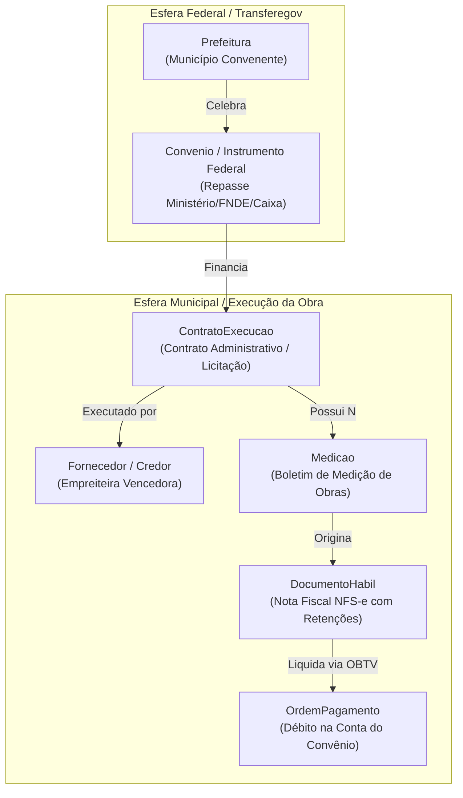
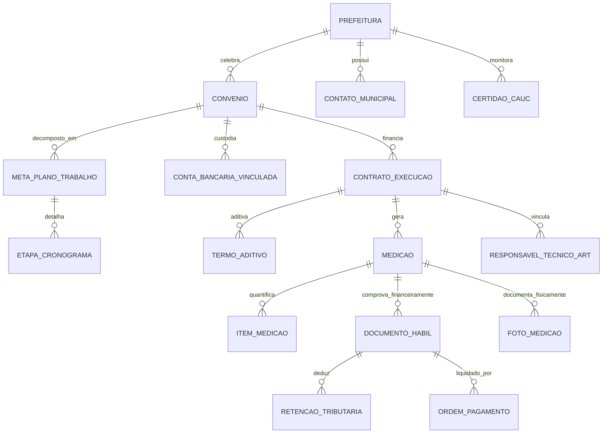

# Modelo de Domínio e Especificação de Entidades: Prefeitura, Convênios e Contratos

> **Roteamento de Engenharia (`/ask-matt` & `/domain-modeling`):**  
> Este documento formaliza o Modelo de Domínio Tático (DDD) do **GovFlow Core**. Ele resolve a ambiguidade da palavra sobrecarregada *"Contrato"* no contexto público municipal, estabelece o vocabulário canônico (Linguagem Ubíqua) e detalha todos os atributos, relacionamentos, agregados, invariantes matemáticas e mapeamentos de banco de dados (PostgreSQL/JPA).

---

## 1. Roteamento de Vocabulário: Desambiguação de "Contrato"

No setor público municipal e na operação do Transferegov.br, a palavra **"Contrato"** é frequentemente sobrecarregada para significar duas coisas completamente distintas. O GovFlow separa esse conceito em dois Agregados com fronteiras bem definidas:



1. **`Convenio` (Instrumento Federal de Transferência):**
   * **Partes:** Governo Federal (Ministério Concedente / Mandatária Caixa) $\leftrightarrow$ Prefeitura (Convenente).
   * **Finalidade:** O repasse financeiro da União para o município executar um objeto público (ex: Creche Proinfância, Pavimentação Asfáltica).
   * **Identificador Primário Oficial:** Número Transferegov / SICONV (ex: `912345/2024`).

2. **`ContratoExecucao` (Contrato Administrativo / Licitação da Obra):**
   * **Partes:** Prefeitura (Contratante) $\leftrightarrow$ Empresa Privada / Empreiteira (Contratada).
   * **Finalidade:** A execução física dos serviços de engenharia ou fornecimento de materiais, regida pela Lei de Licitações (Lei nº 14.133/2021).
   * **Identificador Primário Oficial:** Número do Contrato Municipal (ex: `CT-042/2024-CPL`).

---

## 2. Diagrama Entidade-Relacionamento (ERD Completo)



---

## 3. Especificação Detalhada dos Agregados e Entidades

### 3.1 Agregado 1: Prefeitura (Root Entity)

Representa a pessoa jurídica de direito público municipal contratante da consultoria.

```
Entidade: Prefeitura (Aggregate Root)
Schema: core_schema.tb_prefeituras
```

#### Atributos e Tipos:

| Campo | Tipo | Nulo? | Descrição e Regras |
| :--- | :--- | :--- | :--- |
| `id` | `UUID` | Não | Chave primária (v7 / Time-ordered) |
| `tenant_id` | `UUID` | Não | ID da consultoria municipal dona do workspace (Multi-tenant) |
| `cnpj` | `VARCHAR(18)` | Não | CNPJ da Prefeitura (ex: `08.923.456/0001-12`), único por tenant |
| `razao_social` | `VARCHAR(200)` | Não | Razão social oficial na Receita Federal |
| `nome_municipio` | `VARCHAR(100)` | Não | Nome do município (ex: `Pombal`, `Massaranduba`) |
| `uf` | `CHAR(2)` | Não | Sigla da Unidade Federativa (ex: `PB`) |
| `codigo_ibge` | `VARCHAR(7)` | Não | Código oficial de 7 dígitos do IBGE (ex: `2512101` para Pombal) |
| `porte_municipio` | `ENUM` | Não | `PEQUENO_PORTE_1`, `PEQUENO_PORTE_2`, `MEDIO_PORTE`, `GRANDE_PORTE` |
| `nome_prefeito` | `VARCHAR(150)` | Não | Nome completo do(a) gestor(a) em exercício |
| `cpf_prefeito` | `VARCHAR(14)` | Não | CPF do prefeito (para validações no Gov.br e TCE) |
| `inicio_mandato` | `DATE` | Não | Início do mandato atual (ex: `2025-01-01`) |
| `fim_mandato` | `DATE` | Não | Fim previsto do mandato (ex: `2028-12-31`) |
| `status_cauc` | `ENUM` | Não | `ADIMPLENTE`, `ADVERTENCIA`, `BLOQUEADO` (CAUC/SIAFI) |
| `ativo` | `BOOLEAN` | Não | Flag indicando se a consultoria ainda atende este município |
| `created_at` | `TIMESTAMP WITH TIME ZONE` | Não | Data/hora de cadastro no GovFlow |
| `updated_at` | `TIMESTAMP WITH TIME ZONE` | Não | Data/hora da última alteração |

#### Entidades-Filhas Diretas da Prefeitura:

* **`ContatoMunicipal`:**
  * `id`: UUID, `prefeitura_id`: UUID
  * `tipo_cargo`: `SECRETARIO_FINANCAS`, `SECRETARIO_OBRAS`, `FISCAL_OBRAS`, `PREFEITO`, `CONTROLADOR_INTERNO`
  * `nome`: VARCHAR(150), `telefone_whatsapp`: VARCHAR(20) (E.164 padronizado para WhatsApp Service)
  * `email`: VARCHAR(150), `ativo`: BOOLEAN

* **`CertidaoCauc` (Radar de Regularidade Fiscal do Município):**
  * `id`: UUID, `prefeitura_id`: UUID
  * `tipo_exigencia`: `RECEITA_FEDERAL_INSS`, `FGTS`, `CNDT_TRABALHISTA`, `PRESTACAO_CONTAS_REPASSES`, `TCE_FOLHA`
  * `data_emissao`: DATE, `data_validade`: DATE, `situacao`: `REGULAR`, `IRREGULAR`
  * `dias_para_vencer`: INTEGER (Calculado dinamicamente para alimentar o semáforo de riscos)

---

### 3.2 Agregado 2: Convenio (Instrumento Federal / Transferegov)

Representa a transferência de verba federal celebrada com a União via Ministério ou Mandatária.

```
Entidade: Convenio (Aggregate Root)
Schema: transfere_schema.tb_convenios
```

#### Atributos e Tipos:

| Campo | Tipo | Nulo? | Descrição e Regras |
| :--- | :--- | :--- | :--- |
| `id` | `UUID` | Não | Chave primária |
| `tenant_id` | `UUID` | Não | Chave da consultoria |
| `prefeitura_id` | `UUID` | Não | FK para `core_schema.tb_prefeituras` |
| `numero_transferegov` | `VARCHAR(20)` | Não | Número oficial SICONV/Transferegov (ex: `912345/2024`) |
| `numero_processo` | `VARCHAR(30)` | Sim | Número do processo SEI no Ministério Concedente |
| `ano_celebracao` | `INTEGER` | Não | Ano do convênio (ex: `2024`) |
| `tipo_instrumento` | `ENUM` | Não | `CONVENIO_TRADICIONAL`, `CONTRATO_REPASSE_CAIXA`, `TERMO_COMPROMISSO_FNDE`, `EMENDA_ESPECIAL_PIX` |
| `objeto` | `TEXT` | Não | Descrição detalhada do objeto (ex: "Construção de Creche Proinfância Tipo 1 no Bairro dos Pereiros") |
| `orgao_concedente` | `VARCHAR(150)` | Não | Nome do Ministério ou Autarquia (ex: `Ministério da Educação / FNDE`) |
| `mandataria` | `VARCHAR(100)` | Sim | Instituição financeira mandatária (ex: `Caixa Econômica Federal`) |
| `valor_global` | `NUMERIC(15,2)` | Não | Valor total pactuado no plano de trabalho |
| `valor_repasse` | `NUMERIC(15,2)` | Não | Parcela transferida pelo Governo Federal |
| `valor_contrapartida` | `NUMERIC(15,2)` | Não | Parcela financeira que a prefeitura se obrigou a aportar |
| `valor_desembolsado` | `NUMERIC(15,2)` | Não | Total de verba federal já creditada na conta vinculada |
| `saldo_conta` | `NUMERIC(15,2)` | Não | Saldo atual disponível para pagamento de fornecedores |
| `data_assinatura` | `DATE` | Não | Data em que o termo de convênio foi assinado |
| `data_publicacao_dou` | `DATE` | Sim | Data de publicação no Diário Oficial da União |
| `data_inicio_vigencia` | `DATE` | Não | Marco inicial da vigência |
| `data_fim_vigencia` | `DATE` | Não | Marco final pactuado (monitorado com alertas de 60, 30, 15 dias) |
| `data_limite_clausula_suspensiva` | `DATE` | Sim | Data-limite para aprovação do projeto/licença ambiental (Risco crítico!) |
| `data_limite_prestacao_contas` | `DATE` | Não | Prazo final para envio da prestação de contas após vigência |
| `situacao_transferegov` | `ENUM` | Não | `EM_EXECUCAO`, `AGUARDANDO_PRESTACAO_CONTAS`, `PRESTACAO_CONTAS_ENVIADA`, `APROVADO`, `INADIMPLENTE_SUSPENSO` |
| `risco_stf_adpf854` | `BOOLEAN` | Não | Alerta de conformidade da multa de 1% para Emendas Pix |

#### Entidades-Filhas do Convênio:

* **`ContaBancariaVinculada`:**
  * `id`: UUID, `convenio_id`: UUID
  * `banco`: `BANCO_DO_BRASIL` ou `CAIXA_ECONOMICA`
  * `agencia`: VARCHAR(10), `numero_conta`: VARCHAR(20)
  * `tipo_bloqueio`: `CONTA_BLOQUEADA_OBTV` (Movimentação permitida exclusivamente via autorização no Transferegov)

* **`MetaPlanoTrabalho`:**
  * `id`: UUID, `convenio_id`: UUID, `numero_meta`: INTEGER (ex: Meta 1: "Serviços Preliminares e Fundação")
  * `descricao`: TEXT, `valor_previsto`: NUMERIC(15,2), `percentual_executado`: NUMERIC(5,2)

---

### 3.3 Agregado 3: ContratoExecucao (Contrato Administrativo / Licitação)

Representa a contratação jurídica entre o Município e a Construtora/Prestadora para execução do objeto do convênio.

```
Entidade: ContratoExecucao (Aggregate Root)
Schema: core_schema.tb_contratos_execucao
```

#### Atributos e Tipos:

| Campo | Tipo | Nulo? | Descrição e Regras |
| :--- | :--- | :--- | :--- |
| `id` | `UUID` | Não | Chave primária |
| `tenant_id` | `UUID` | Não | Chave da consultoria |
| `prefeitura_id` | `UUID` | Não | FK para `core_schema.tb_prefeituras` |
| `convenio_id` | `UUID` | Não | FK para `transfere_schema.tb_convenios` |
| `numero_contrato` | `VARCHAR(30)` | Não | Número administrativo interno (ex: `CT-042/2024`) |
| `numero_licitacao` | `VARCHAR(50)` | Não | Processo licitatório (ex: `Concorrência Eletrônica Nº 005/2024`) |
| `modalidade_licitacao` | `ENUM` | Não | `CONCORRENCIA`, `PREGAO_ELETRONICO`, `TOMADA_PRECOS`, `DISPENSA`, `INEXIGIBILIDADE` |
| `objeto_contratado` | `TEXT` | Não | Objeto contratual contratado da empreiteira |
| `cnpj_contratada` | `VARCHAR(18)` | Não | CNPJ da empresa executora (ex: `08.123.456/0001-90`) |
| `razao_social_contratada`| `VARCHAR(200)` | Não | Razão social (ex: `CONSTRUTORA EXEMPLO LTDA`) |
| `dados_bancarios_credor`| `JSONB` | Não | Banco, Agência, Conta Corrente da contratada para injeção na OBTV |
| `valor_contratado_original`| `NUMERIC(15,2)`| Não | Valor arrematado no certame licitatório |
| `valor_contratado_atual` | `NUMERIC(15,2)` | Não | Valor após aditivos de valor/reequilíbrio econômico |
| `valor_acumulado_medido` | `NUMERIC(15,2)` | Não | Soma cumulativa de todas as medições atestadas |
| `valor_acumulado_pago`   | `NUMERIC(15,2)` | Não | Soma cumulativa de todas as ordens de pagamento liquidadas |
| `saldo_contratual_restante`| `NUMERIC(15,2)`| Não | $Valor Atual - Valor Medido$ |
| `percentual_execucao_fisica`| `NUMERIC(5,2)` | Não | Avanço físico ponderado da obra (%) |
| `data_assinatura` | `DATE` | Não | Data da celebração com a empresa |
| `data_ordem_servico` | `DATE` | Sim | Data de emissão da Ordem de Início dos Serviços (OIS) |
| `data_inicio_vigencia` | `DATE` | Não | Início do prazo de execução |
| `data_fim_vigencia` | `DATE` | Não | Fim do prazo contratual |
| `status_contrato` | `ENUM` | Não | `VIGENTE`, `PARALISADO`, `CONCLUIDO`, `RESCINDIDO` |

#### Entidades-Filhas do Contrato de Execução:

* **`TermoAditivo` (Histórico de Modificações):**
  * `id`: UUID, `contrato_id`: UUID, `numero_aditivo`: INTEGER (ex: 1º Termo Aditivo)
  * `tipo_aditivo`: `PRAZO`, `VALOR_ACRESCIMO`, `VALOR_SUPRESSAO`, `QUALITATIVO`
  * `dias_prorrogados`: INTEGER, `valor_aditivo`: NUMERIC(15,2), `justificativa`: TEXT

* **`ResponsavelTecnicoArt` (Engenharia Legal):**
  * `id`: UUID, `contrato_id`: UUID
  * `tipo_vinculo`: `RESPONSAVEL_TECNICO_EMPRESA` ou `FISCAL_OBRAS_PREFEITURA`
  * `nome_profissional`: VARCHAR(150), `registro_crea_cau`: VARCHAR(30)
  * `numero_art_rrt`: VARCHAR(40) (Anotação de Responsabilidade Técnica), `data_quitacao`: DATE

---

### 3.4 Entidade-Filha do Contrato: Medicao (Boletim de Medição de Obras)

Representa cada ciclo de aferição técnica da obra realizada pela empreiteira e atestada pelo fiscal municipal.

```
Entidade: Medicao
Schema: core_schema.tb_medicoes
```

#### Atributos e Tipos:

| Campo | Tipo | Nulo? | Descrição e Regras |
| :--- | :--- | :--- | :--- |
| `id` | `UUID` | Não | Chave primária |
| `contrato_id` | `UUID` | Não | FK para `core_schema.tb_contratos_execucao` |
| `numero_medicao` | `INTEGER` | Não | Sequencial da medição (ex: 1 para 1ª Medição, 2 para 2ª Medição) |
| `data_inicio_periodo` | `DATE` | Não | Data de início do período medido |
| `data_fim_periodo` | `DATE` | Não | Data de encerramento do período medido |
| `valor_medicao_periodo`| `NUMERIC(15,2)` | Não | Valor financeiro dos serviços apurados nesta medição |
| `valor_medicao_acumulado`| `NUMERIC(15,2)`| Não | Total medido desde o início da obra até esta medição |
| `percentual_medicao_periodo`| `NUMERIC(5,2)`| Não | % físico executado exclusivamente neste ciclo |
| `percentual_acumulado` | `NUMERIC(5,2)` | Não | % total acumulado da obra |
| `status_medicao` | `ENUM` | Não | `EM_CONFERENCIA`, `ATESTADA`, `DOCUMENTADA`, `ENVIADA_TRANSFEREGOV`, `REJEITADA` |
| `data_atesto_fiscal` | `DATE` | Sim | Data formal em que o engenheiro fiscal atestou a planilha |
| `nome_fiscal_atestante`| `VARCHAR(150)` | Sim | Nome do engenheiro que carimbou/assinou a medição |
| `s3_key_planilha_medicao`| `VARCHAR(255)` | Não | Caminho no MinIO/S3 da planilha assinada |
| `s3_key_relatorio_fotografico`| `VARCHAR(255)`| Sim | Caminho no MinIO/S3 do relatório com fotos da obra |

---

### 3.5 Entidade Crítica de Liquidação: DocumentoHabil (Nota Fiscal & Retenções)

Representa a Nota Fiscal Eletrônica e o conjunto de obrigações tributárias enviadas ao Transferegov.br para liquidação financeira.

```
Entidade: DocumentoHabil
Schema: core_schema.tb_documentos_habeis
```

#### Atributos e Tipos:

| Campo | Tipo | Nulo? | Descrição e Regras |
| :--- | :--- | :--- | :--- |
| `id` | `UUID` | Não | Chave primária |
| `tenant_id` | `UUID` | Não | Chave da consultoria |
| `medicao_id` | `UUID` | Não | FK para `core_schema.tb_medicoes` |
| `contrato_id` | `UUID` | Não | FK para `core_schema.tb_contratos_execucao` |
| `tipo_documento_habil` | `ENUM` | Não | `NOTA_FISCAL_SERVICOS`, `NOTA_FISCAL_MERCADORIAS`, `RECIBO`, `FATURA` |
| `numero_documento` | `VARCHAR(50)` | Não | Número da NF (ex: `0001542`) |
| `serie_documento` | `VARCHAR(10)` | Sim | Série da nota fiscal |
| `data_emissao` | `DATE` | Não | Data em que o prestador emitiu a nota |
| `cnpj_favorecido` | `VARCHAR(18)` | Não | CNPJ do credor (validado contra o contrato) |
| `razao_social_favorecido`| `VARCHAR(200)`| Não | Razão social do credor |
| `valor_bruto` | `NUMERIC(15,2)` | Não | Valor total faturado no documento fiscal |
| `valor_total_deducoes` | `NUMERIC(15,2)` | Não | Soma total das retenções tributárias ($\sum Retenções$) |
| `valor_liquido` | `NUMERIC(15,2)` | Não | Valor líquido final a pagar ($\text{Bruto} - \text{Deduções}$) |
| `status_validacao_matematica` | `BOOLEAN` | Não | `TRUE` se $\text{Bruto} - \sum Retenções \equiv \text{Líquido}$ |
| `confidence_score_geral`| `NUMERIC(4,3)` | Não | Confiança da extração VLM Gemini (ex: `0.984` = 98.4%) |
| `bounding_boxes_json` | `JSONB` | Sim | Coordenadas visuais de cada campo no PDF para o review |
| `status_revisao` | `ENUM` | Não | `PENDENTE_REVISAO`, `APROVADO_ANALISTA`, `REJEITADO_DEVOLVIDO`, `INJETADO_NO_GOVERNO` |
| `analista_responsavel_id`| `UUID` | Sim | FK para o usuário que validou na tela lado a lado |
| `data_aprovacao_revisao`| `TIMESTAMP WITH TIME ZONE`| Sim | Data e hora exatas da aprovação humana |
| `injetado_transferegov`| `BOOLEAN` | Não | Flag sinalizando injeção bem-sucedida via Extensão Chrome |
| `s3_key_pdf_original` | `VARCHAR(255)` | Não | Arquivo original recebido via WhatsApp/Upload |

#### Entidade-Filha: RetencaoTributaria (Deduções Fiscais Detalhadas)

```
Entidade: RetencaoTributaria
Schema: core_schema.tb_retencoes_tributarias
```

| Campo | Tipo | Nulo? | Descrição |
| :--- | :--- | :--- | :--- |
| `id` | `UUID` | Não | Chave primária |
| `documento_habil_id` | `UUID` | Não | FK para `core_schema.tb_documentos_habeis` |
| `tipo_tributo` | `ENUM` | Não | `INSS`, `ISS`, `IRRF`, `PIS`, `COFINS`, `CSLL` |
| `base_calculo` | `NUMERIC(15,2)` | Não | Base de cálculo da retenção (ex: 50% de mão de obra) |
| `aliquota_percentual` | `NUMERIC(5,2)` | Não | Alíquota do tributo (ex: 11.00% INSS, 5.00% ISS) |
| `valor_retido` | `NUMERIC(15,2)` | Não | Valor retido a recolher para a Previdência/Município/União |
| `confidence_score` | `NUMERIC(4,3)` | Não | Pontuação de acerto da IA para este campo específico |

---

### 3.6 Entidade de Execução Bancária: OrdemPagamento (OBTV / Transferegov)

Registra a liquidação formal debitada da conta do convênio para crédito na conta da empreiteira.

```
Entidade: OrdemPagamento
Schema: transfere_schema.tb_ordens_pagamento
```

| Campo | Tipo | Nulo? | Descrição |
| :--- | :--- | :--- | :--- |
| `id` | `UUID` | Não | Chave primária |
| `documento_habil_id` | `UUID` | Não | FK para `core_schema.tb_documentos_habeis` |
| `numero_obtv` | `VARCHAR(30)` | Sim | Número gerado pelo Transferegov ao autorizar o pagamento |
| `tipo_pagamento` | `ENUM` | Não | `OBTV_FORNECEDOR`, `OBTV_TRIBUTOS_DARF_DAM`, `DEVOLUCAO_SALDO` |
| `data_emissao_obtv` | `DATE` | Não | Data do comando no Transferegov |
| `data_debito_conta` | `DATE` | Sim | Data efetiva do débito no extrato da Caixa/BB |
| `valor_pago` | `NUMERIC(15,2)` | Não | Valor transferido |
| `situacao_obtv` | `ENUM` | Não | `AGUARDANDO_ASSINATURA_GESTOR`, `ENVIADA_BANCO`, `PAGA_CONFIRMADA`, `ESTORNADA` |
| `autenticacao_bancaria`| `VARCHAR(100)` | Sim | Código de autenticação do comprovante bancário |

---

## 4. Invariantes e Regras de Negócio Rígidas (Domain Rules)

No núcleo Java do `core-service`, as seguintes regras são aplicadas de forma determinística antes de qualquer persistência:

### Regra 1: Validação Matemática Perfeita do Documento Hábil
$$V_{\text{líquido}} = V_{\text{bruto}} - \sum_{i=1}^{n} R_{i}$$
Se a soma do valor líquido com todas as deduções tributárias divergir do valor bruto por **qualquer fração de centavo ($|Diferença| > 0.00$)**, o sistema bloqueia o status para `STATUS_MATEMATICA_INVALIDA`, impedindo o envio à extensão do Chrome até que o analista ajuste o campo na conferência lado a lado.

### Regra 2: Blindagem de Saldo do Contrato Administrativo
$$\sum V_{\text{medido\_acumulado}} \le V_{\text{contratado\_atual}}$$
Uma medição nunca pode ser aprovada se o somatório das medições ultrapassar o valor total contratado com a empreiteira (incluindo termos aditivos). Se o valor exceder, a entidade lança a exceção de domínio `SaldoContratualInsuficienteException`.

### Regra 3: Validação de Vigência Concomitante
$$\text{Data da Medição} \le \text{Data Fim Vigência Contrato} \le \text{Data Fim Vigência Convênio}$$
O documento hábil ou medição não pode possuir data de execução posterior ao término do contrato administrativo nem ao término da vigência federal do convênio.

### Regra 4: Consistência de CNPJ Credor
$$\text{CNPJ}(\text{DocumentoHabil}) \equiv \text{CNPJ}(\text{ContratoExecucao})$$
O CNPJ do favorecido na nota fiscal deve ser estritamente idêntico ao CNPJ da empresa arrematante do contrato administrativo, prevenindo pagamentos indevidos a terceiros não homologados.

---

## 5. DDL de Referência para o PostgreSQL 16+

```sql
-- SCHEMA CORE (Transacional da Consultoria)
CREATE SCHEMA IF NOT EXISTS core_schema;

CREATE TABLE core_schema.tb_prefeituras (
    id UUID PRIMARY KEY DEFAULT gen_random_uuid(),
    tenant_id UUID NOT NULL,
    cnpj VARCHAR(18) NOT NULL UNIQUE,
    razao_social VARCHAR(200) NOT NULL,
    nome_municipio VARCHAR(100) NOT NULL,
    uf CHAR(2) NOT NULL,
    codigo_ibge VARCHAR(7) NOT NULL,
    porte_municipio VARCHAR(30) NOT NULL,
    nome_prefeito VARCHAR(150) NOT NULL,
    cpf_prefeito VARCHAR(14) NOT NULL,
    inicio_mandato DATE NOT NULL,
    fim_mandato DATE NOT NULL,
    status_cauc VARCHAR(30) NOT NULL DEFAULT 'ADIMPLENTE',
    ativo BOOLEAN NOT NULL DEFAULT TRUE,
    created_at TIMESTAMP WITH TIME ZONE DEFAULT CURRENT_TIMESTAMP,
    updated_at TIMESTAMP WITH TIME ZONE DEFAULT CURRENT_TIMESTAMP
);

CREATE TABLE core_schema.tb_contratos_execucao (
    id UUID PRIMARY KEY DEFAULT gen_random_uuid(),
    tenant_id UUID NOT NULL,
    prefeitura_id UUID NOT NULL REFERENCES core_schema.tb_prefeituras(id),
    convenio_id UUID NOT NULL,
    numero_contrato VARCHAR(30) NOT NULL,
    numero_licitacao VARCHAR(50) NOT NULL,
    modalidade_licitacao VARCHAR(30) NOT NULL,
    objeto_contratado TEXT NOT NULL,
    cnpj_contratada VARCHAR(18) NOT NULL,
    razao_social_contratada VARCHAR(200) NOT NULL,
    dados_bancarios_credor JSONB NOT NULL,
    valor_contratado_original NUMERIC(15,2) NOT NULL,
    valor_contratado_atual NUMERIC(15,2) NOT NULL,
    valor_acumulado_medido NUMERIC(15,2) NOT NULL DEFAULT 0.00,
    valor_acumulado_pago NUMERIC(15,2) NOT NULL DEFAULT 0.00,
    saldo_contratual_restante NUMERIC(15,2) NOT NULL,
    percentual_execucao_fisica NUMERIC(5,2) NOT NULL DEFAULT 0.00,
    data_assinatura DATE NOT NULL,
    data_ordem_servico DATE,
    data_inicio_vigencia DATE NOT NULL,
    data_fim_vigencia DATE NOT NULL,
    status_contrato VARCHAR(30) NOT NULL DEFAULT 'VIGENTE',
    created_at TIMESTAMP WITH TIME ZONE DEFAULT CURRENT_TIMESTAMP
);

CREATE TABLE core_schema.tb_medicoes (
    id UUID PRIMARY KEY DEFAULT gen_random_uuid(),
    contrato_id UUID NOT NULL REFERENCES core_schema.tb_contratos_execucao(id),
    numero_medicao INTEGER NOT NULL,
    data_inicio_periodo DATE NOT NULL,
    data_fim_periodo DATE NOT NULL,
    valor_medicao_periodo NUMERIC(15,2) NOT NULL,
    valor_medicao_acumulado NUMERIC(15,2) NOT NULL,
    percentual_medicao_periodo NUMERIC(5,2) NOT NULL,
    percentual_acumulado NUMERIC(5,2) NOT NULL,
    status_medicao VARCHAR(30) NOT NULL DEFAULT 'EM_CONFERENCIA',
    data_atesto_fiscal DATE,
    nome_fiscal_atestante VARCHAR(150),
    s3_key_planilha_medicao VARCHAR(255) NOT NULL,
    s3_key_relatorio_fotografico VARCHAR(255),
    created_at TIMESTAMP WITH TIME ZONE DEFAULT CURRENT_TIMESTAMP,
    CONSTRAINT uk_contrato_num_medicao UNIQUE (contrato_id, numero_medicao)
);

CREATE TABLE core_schema.tb_documentos_habeis (
    id UUID PRIMARY KEY DEFAULT gen_random_uuid(),
    tenant_id UUID NOT NULL,
    medicao_id UUID NOT NULL REFERENCES core_schema.tb_medicoes(id),
    contrato_id UUID NOT NULL REFERENCES core_schema.tb_contratos_execucao(id),
    tipo_documento_habil VARCHAR(30) NOT NULL,
    numero_documento VARCHAR(50) NOT NULL,
    serie_documento VARCHAR(10),
    data_emissao DATE NOT NULL,
    cnpj_favorecido VARCHAR(18) NOT NULL,
    razao_social_favorecido VARCHAR(200) NOT NULL,
    valor_bruto NUMERIC(15,2) NOT NULL,
    valor_total_deducoes NUMERIC(15,2) NOT NULL DEFAULT 0.00,
    valor_liquido NUMERIC(15,2) NOT NULL,
    status_validacao_matematica BOOLEAN NOT NULL DEFAULT FALSE,
    confidence_score_geral NUMERIC(4,3) NOT NULL,
    bounding_boxes_json JSONB,
    status_revisao VARCHAR(30) NOT NULL DEFAULT 'PENDENTE_REVISAO',
    analista_responsavel_id UUID,
    data_aprovacao_revisao TIMESTAMP WITH TIME ZONE,
    injetado_transferegov BOOLEAN NOT NULL DEFAULT FALSE,
    s3_key_pdf_original VARCHAR(255) NOT NULL,
    created_at TIMESTAMP WITH TIME ZONE DEFAULT CURRENT_TIMESTAMP
);

CREATE TABLE core_schema.tb_retencoes_tributarias (
    id UUID PRIMARY KEY DEFAULT gen_random_uuid(),
    documento_habil_id UUID NOT NULL REFERENCES core_schema.tb_documentos_habeis(id) ON DELETE CASCADE,
    tipo_tributo VARCHAR(20) NOT NULL,
    base_calculo NUMERIC(15,2) NOT NULL,
    aliquota_percentual NUMERIC(5,2) NOT NULL,
    valor_retido NUMERIC(15,2) NOT NULL,
    confidence_score NUMERIC(4,3) NOT NULL
);
```
