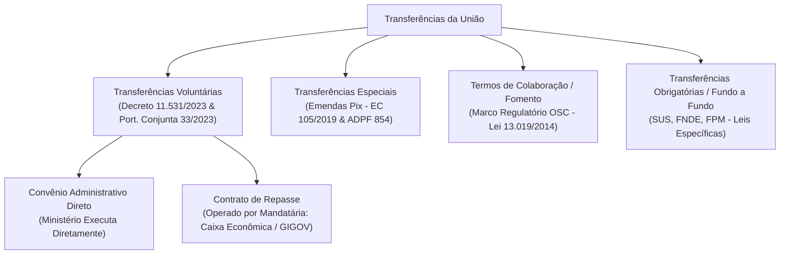
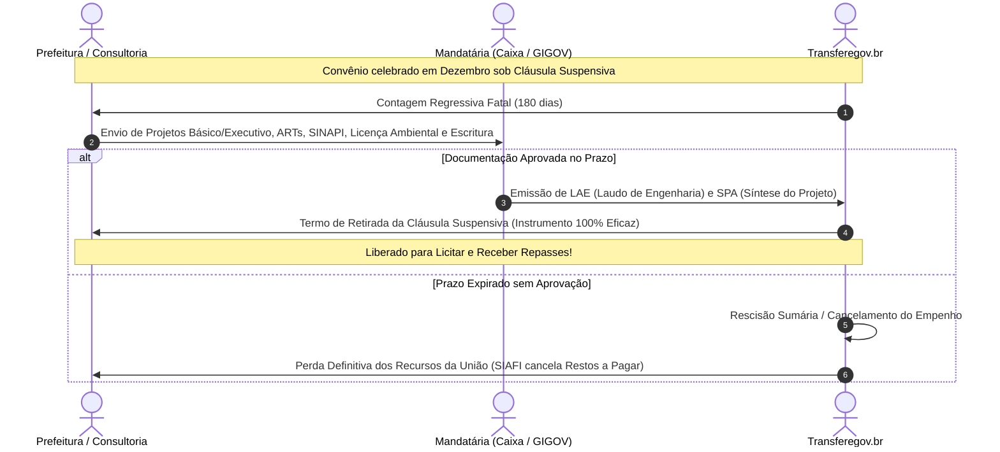
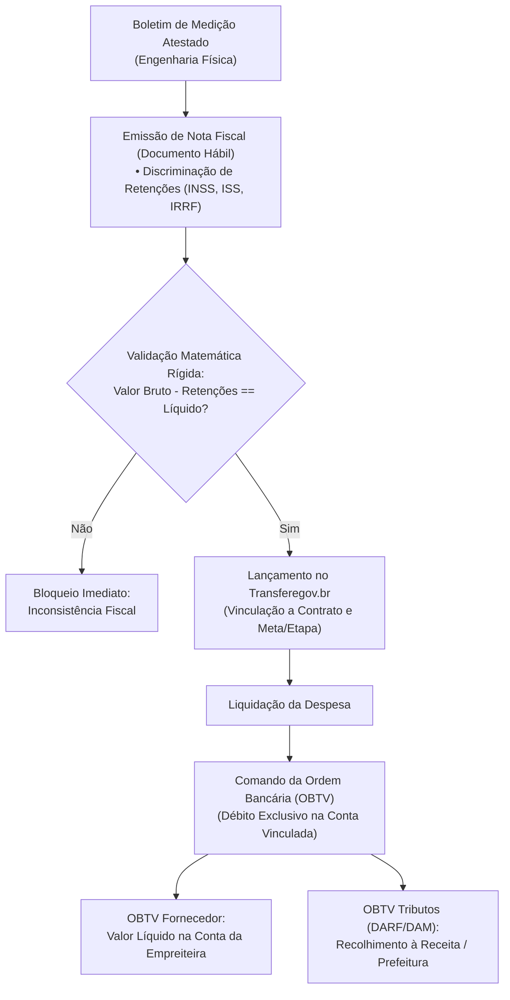
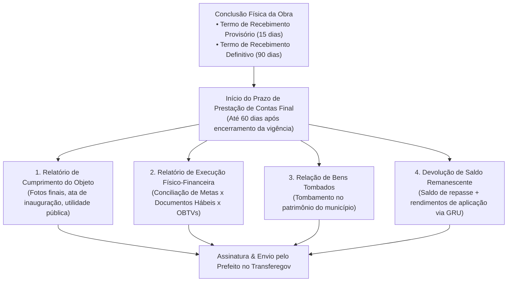
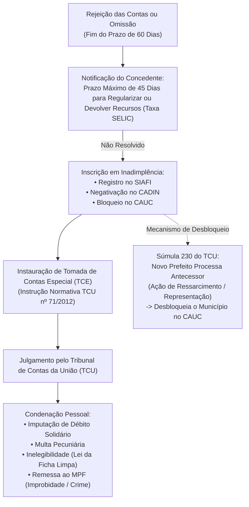

# Deep Research: Ciclo de Vida Integral de Convênios e Contratos de Repasse Federais

> **Status:** Pesquisa Aprofundada & Especificação Canônica de Domínio  
> **Sistemas de Referência:** Transferegov.br (antigo SICONV / Plataforma +Brasil), SIAFI, CAUC, SICONFI, Caixa Econômica Federal (GIGOV)  
> **Marco Legal:** CF/88 (arts. 165, 166, 166-A), LC 101/2000 (LRF art. 25), Lei 4.320/1964, Lei 14.133/2021 (art. 184), Decreto nº 11.531/2023, Portaria Conjunta MGI/MF/CGU nº 33/2023 (atualizada pela nº 29/2024 e nº 45/2026), Portaria Interministerial nº 424/2016 e Jurisprudência TCU (Súmulas 230 e 286) / STF (ADPF 854).  
> **Destinação no GovFlow:** Mapeamento de regras de negócio, alertas proativos, pipeline de extração de IA e arquitetura dos serviços `transferegov-service` e `core-service`.

---

## 1. Sumário Executivo & Fundamentação Jurídico-Institucional

No Direito Financeiro e Administrativo brasileiro, a transferência de recursos do Orçamento Geral da União (OGU) para estados e municípios rege-se pelo princípio da **mútua cooperação para a consecução de objetivos de interesse comum**. Diferente de um contrato de compra e venda ordinário (onde há interesses contrapostos), no convênio as partes convergem para o mesmo fim público.

Existem quatro modalidades principais de transferências no ecossistema federal:

1. **Convênio Administrativo Tradicional:** Firmado diretamente entre um Ministério Concedente e a Prefeitura (Convenente). A própria pasta ministerial faz a análise técnica e o acompanhamento das medições.
2. **Contrato de Repasse (CR):** Instrumento em que a União delega a uma instituição financeira pública oficial (quase 100% dos casos a **Caixa Econômica Federal**, por meio de suas Gerências Executivas de Governo - **GIGOV**) o papel de **Mandatária da União**. A Caixa atua como fiscalizadora rigorosa de engenharia, custos (SINAPI/SICRO) e licitações.
3. **Transferência Especial ("Emenda Pix" - Art. 166-A da CF/88):** Recursos repassados diretamente ao fundo municipal sem vinculação prévia a plano de trabalho tradicional. *Nota Crítica:* Por determinação recente do STF (ADPF 854), mesmo as Emendas Pix hoje exigem transparência ativa, cadastramento de plano de trabalho e inserção de dados de liquidação no Transferegov.br sob pena de suspensão e bloqueio.
4. **Termo de Compromisso:** Instrumento simplificado utilizado em programas estratégicos federais (ex: Novo PAC - Lei nº 11.578/2007; obras de educação básica via FNDE - Lei nº 12.695/2012).

---

## 2. Visão Panorâmica: O Macro-Ciclo de Vida de Ponta a Ponta

O ciclo de vida completo de um convênio federal é composto por **10 fases sequenciais e interdependentes**, iniciando muito antes da existência do instrumento jurídico e estendendo-se por anos após o término das obras físicas:

```mermaid
flowchart TD
    F0["Fase -1 / 0: Pré-Convênio\n• Articulação Política (Emenda/Edital)\n• Proposta no Transferegov\n• Habilitação & Radar CAUC\n• Plano de Trabalho & Pareceres\n• Nota de Empenho (SIAFI)"] --> F1["Fase 1: Celebração & Formalização\n• Assinatura Digital do Termo\n• Abertura de Conta Vinculada Bloqueada\n• Publicação Obrigatória no DOU"]
    
    F1 --> F2["Fase 2: Cláusula Suspensiva\n• Projetos Básico/Executivo & ART\n• Licenças Ambientais\n• Titularidade da Terra / Imóvel\n• Análise da Caixa (SPA / LAE)\n• Prazo Fatal (180 dias)"]
    
    F2 --> F3["Fase 3: Licitação Municipal\n• Edital Conforme SPA/SINAPI (Lei 14.133/21)\n• Homologação & Contrato com Empreiteira\n• Envio ao Transferegov (VRPL)\n• Emissão da Autorização de Início (AIO)"]
    
    F3 --> F4["Fase 4: Execução Física\n• Ordem de Início dos Serviços (OIS)\n• Diário de Obras & Medições do Fiscal\n• Vistoria Caixa / RAE\n• Comprovação de Avanço Físico"]
    
    F4 --> F5["Fase 5: Execução Financeira\n• Depósito da Contrapartida Municipal\n• Liberação de Parcelas pelo Concedente\n• Documento Hábil (NF com Retenções)\n• Liquidação & Pagamento via OBTV\n• Nexo Causal & Rendimentos Poupança"]
    
    F5 --> F6["Fase 6: Aditivos & Governança\n• Prorrogação de Vigência Tempestiva\n• Reformulação do Plano de Trabalho\n• Aditivos Contratuais & Reequilíbrio"]
    
    F6 --> F7["Fase 7: Prestação de Contas\n• Concomitante ao Longo da Execução\n• Recebimento Definitivo da Obra\n• Relatórios de Cumprimento do Objeto\n• Devolução de Saldo via GRU (60 dias)"]
    
    F7 --> F8["Fase 8: Análise & Julgamento\n• Parecer Técnico & Financeiro do Concedente\n• Procedimento Informatizado / Convencional\n• Aprovação / Ressalvas / Rejeição"]
    
    F8 -->|Se Inadimplente / Omissão| F9["Fase 9: Tomada de Contas Especial (TCE)\n• Notificação 45 dias para Devolução\n• Bloqueio CAUC/CADIN/SIAFI\n• Processo no TCU contra Gestores\n• Súmula 230 TCU (Prefeito Sucessor)"]
```

---

## 3. Fase -1 e 0: O Pré-Convênio (Antes de Existir o Instrumento Jurídico)

Nesta fase, a prefeitura e a consultoria municipal trabalham contra o relógio para transformar uma promessa orçamentária em uma reserva legal (Nota de Empenho).

### 3.1 Origem da Demanda e Classificação Orçamentária
O recurso federal nasce no Orçamento Geral da União (OGU) por meio de duas vias principais:
1. **Emendas Parlamentares (Impositivas):**
   * **Individuais (RP6):** Recursos indicados por Deputados Federais ou Senadores com execução orçamentária obrigatória pela Constituição.
   * **Bancada Estadual (RP7):** Recursos definidos pela bancada de parlamentares do estado para grandes obras estruturantes.
   * **Comissões Permanentes (RP8):** Indicações técnicas feitas pelas comissões temáticas da Câmara e do Senado.
2. **Transferências Discricionárias / Programas Setoriais (RP2):**
   * Editais e chamamentos públicos abertos pelos Ministérios (Cidades, Educação/FNDE, Saúde, Esporte, Integração e Desenvolvimento Regional). As prefeituras concorrem mediante pontuação técnica ou atendimento a critérios sociodemográficos.

### 3.2 Disponibilização do Programa no Transferegov.br
O órgão concedente cadastra o **Programa de Trabalho** no Transferegov, definindo:
* Objeto temático e elegibilidade (quais municípios podem pleitear).
* Prazos de envio da proposta.
* Percentuais mínimos de **Contrapartida Financeira Municipal**, definidos na Lei de Diretrizes Orçamentárias (LDO) federal daquele ano, variando conforme a população e a região do município (municípios do semiárido e pequeno porte possuem contrapartidas reduzidas, ex: 1% a 2%, enquanto municípios ricos podem ser exigidos em 10% a 20%).

### 3.3 Cadastramento da Proposta de Trabalho
O analista da consultoria acessa o Transferegov.br e cadastra a proposta da prefeitura:
* **Identificação do Objeto:** Descrição precisa e inequívoca (ex: *"Pavimentação em paralelepípedo de vias urbanas nos bairros X e Y no município de Pombal/PB"*). Objetos vagos ("infraestrutura urbana") são sumariamente rejeitados.
* **Justificativa Técnica e Social:** Dados demográficos, carências da população, problemas causados pela poeira/lama e benefício socioeconômico esperado.
* **Capacidade Técnica e Operacional:** Declaração formal subscrita pelo prefeito de que o município possui corpo técnico ou assessoria capaz de fiscalizar e executar a intervenção.
* **Estimativa Financeira Preliminar:** Valor global pretendido (Repasse Federal + Contrapartida Municipal).

### 3.4 O Gargalo Crítico: Verificação de Regularidade Fiscal (CAUC)
Nenhuma transferência voluntária pode ser empenhada ou celebrada se o município estiver inscrito no **CAUC (Sistema de Informações sobre Requisitos Fiscais)**, mantido pela Secretaria do Tesouro Nacional (STN).
O analista monitora 16 itens mandatórios do art. 25 da Lei de Responsabilidade Fiscal (LRF):
* **Grupo 1 (Obrigações Tributárias e Previdenciárias):** Certidão Negativa de Débitos Federais (CND RFB/PGFN), Certificado de Regularidade do FGTS (CRF Caixa), Certidão Negativa de Débitos Trabalhistas (CNDT Justiça do Trabalho).
* **Grupo 2 (Transparência e Contabilidade Pública):** Envio da Matriz de Saldos Contábeis (MSC) ao SICONFI e publicação do RREO (Relatório Resumido da Execução Orçamentária) e RGF (Relatório de Gestão Fiscal).
* **Grupo 3 (Limites Constitucionais e Legais):** Cumprimento da aplicação mínima de 25% em Educação, 15% em Saúde e limite de Despesa Total com Pessoal (< 54% da Receita Corrente Líquida).
* **Grupo 4 (Adimplência Financeira e Convênios Anteriores):** Regularidade perante o CADIN e ausência de inscrições de inadimplência no SIAFI decorrentes de convênios federais anteriores com prestação de contas reprovada.

### 3.5 Estruturação do Plano de Trabalho
Aprovada a proposta inicial, a prefeitura deve estruturar o **Plano de Trabalho**:
* **Decomposição em Metas e Etapas:** Uma meta representa uma entrega física autônoma (ex: *Meta 1: Drenagem Pluvial; Meta 2: Pavimentação e Meio-Fio*). As etapas são as frações cronológicas dessas metas.
* **Cronograma Físico-Financeiro:** Tabela matricial cruzando as metas/etapas com os meses previstos de execução e os desembolsos exigidos.
* **Plano de Aplicação Detalhado (PAD):** Classificação orçamentária dos itens (natureza de despesa, ex: 44.90.51 - Obras e Instalações).

### 3.6 Análise Governamental e Nota de Empenho (NE)
1. **Pareceres Técnicos e Jurídicos:** O Concedente ou a Mandatária emite laudos analisando a aderência do plano de trabalho ao programa. Se houver falhas, emite-se notificação de diligência com prazo curto (5 a 15 dias).
2. **Aprovação do Plano de Trabalho.**
3. **Emissão da Nota de Empenho (NE):** No encerramento do exercício (frequentemente entre novembro e dezembro), o Ministério emite a NE no SIAFI, reservando formalmente o saldo orçamentário da União a favor daquele CNPJ municipal. O dinheiro está garantido na rubrica de **Restos a Pagar**.

---

## 4. Fase 1: Celebração e Formalização Jurídica (O Nascimento do Convênio)

Com o empenho orçamentário emitido, nasce a relação contratual formal entre a União e o Município.

### 4.1 Assinatura Digital do Termo
* O instrumento jurídico (Termo de Convênio ou Contrato de Repasse) é gerado diretamente no portal Transferegov.br.
* É assinado digitalmente via conta Gov.br (nível Ouro ou certificado ICP-Brasil) pela autoridade máxima do Concedente/Mandatária e pelo Prefeito Municipal.

### 4.2 Abertura da Conta Bancária Vinculada e Bloqueada
* O próprio Transferegov comunica-se eletronicamente com as instituições financeiras oficiais de custódia (**Banco do Brasil** ou **Caixa Econômica Federal**).
* Uma conta corrente específica e exclusiva para aquele convênio é aberta sob o CNPJ da prefeitura.
* **Mecanismo de Travamento (Conta Bloqueada):** Essa conta nasce com regime de bloqueio total para saques na boca do caixa, emissão de cheques, cartão magnético ou transferências comuns (TED/Pix). A movimentação financeira é permitida **exclusivamente via Ordem Bancária de Transferências Voluntárias (OBTV)** autorizada dentro da plataforma Transferegov.br.
* **Regime de Aplicação Automática:** Todo recurso que entrar na conta vinculada deve ser mantido obrigatoriamente aplicado em caderneta de poupança (para recursos com previsão de desembolso igual ou superior a um mês) ou em fundo de aplicação de curto prazo lastreado em títulos públicos federais (art. 116 da Lei 8.666/93 e art. 13 do Decreto 11.531/2023). Os rendimentos integram o patrimônio do convênio.

### 4.3 Publicação no Diário Oficial da União (DOU)
* **Condição de Eficácia:** Nenhum convênio tem validade jurídica contra terceiros ou gera efeitos financeiros antes da publicação do seu extrato no DOU (art. 61, parágrafo único da Lei 8.666/93 / art. 94 da Lei 14.133/2021 / Decreto 11.531/2023).
* O concedente possui o prazo legal de até **20 dias da assinatura** para veicular a publicação no DOU.
* Após a publicação, o convênio assume status oficial de `VIGENTE` (ou `VIGENTE COM CLÁUSULA SUSPENSIVA`) e recebe seu identificador público de 6 dígitos no Transferegov (ex: `912345/2024`).

---

## 5. Fase 2: Superação de Condicionantes — A Cláusula Suspensiva

Esta é a fase em que morre a maior parte dos convênios de infraestrutura no Brasil. Compreendê-la a fundo é a maior vantagem competitiva do GovFlow.

### 5.1 O que é e por que existe a Cláusula Suspensiva?
Em virtude do princípio da anualidade orçamentária, os ministérios precisam empenhar todas as suas verbas até o último dia útil de dezembro. As prefeituras pequenas, no entanto, não dispõem de projetos de engenharia complexos, estudos de sondagem de solo nem licenças ambientais prontas a tempo.
A legislação (art. 10 do Decreto 11.531/2023 e art. 16 da Portaria Conjunta 33/2023) permite a celebração do convênio com **condição suspensiva de eficácia**.
* **Efeito prático:** O empenho federal fica garantido no SIAFI, mas o município está terminantemente proibido de iniciar obras ou receber qualquer repasse de dinheiro da União até sanear todas as pendências técnicas de engenharia e ambientais.

### 5.2 O Pacote Documental Mandatório
Para levantar a cláusula suspensiva, a consultoria deve providenciar e submeter à Caixa (GIGOV):
1. **Projeto Básico / Executivo de Engenharia:** Plantas arquitetônicas, estruturais, hidrossanitárias, elétricas, memorial descritivo e especificações técnicas de materiais.
2. **Orçamento Referencial Detalhado:** Planilha orçamentária orçada estritamente pelas tabelas de preços públicos federais: **SINAPI** (Caixa/IBGE) para edificações e saneamento, ou **SICRO** (DNIT) para obras rodoviárias e terraplanagem.
   * **BDI (Bonificação e Despesas Indiretas):** O BDI da planilha deve respeitar estritamente os percentuais e limites estipulados pelo Acórdão TCU nº 2622/2013.
3. **Anotação de Responsabilidade Técnica (ART/CREA ou RRT/CAU):** ART de autoria dos projetos e ART de elaboração do orçamento assinadas por engenheiro devidamente registrado no conselho de classe com certidão de quitação.
4. **Licenciamento Ambiental:** Licença Prévia (LP) e Licença de Instalação (LI), ou Declaração de Inexigibilidade/Dispensa de Licença Ambiental emitida pelo órgão estadual ou municipal competente.
5. **Comprovação do Exercício Pleno da Propriedade do Imóvel:**
   * Certidão Vintenária de Inteiro Teor do Cartório de Registro de Imóveis comprovando que o terreno é de propriedade do município.
   * Alternativas admitidas: Decreto de desapropriação com imissão provisória na posse expedida pelo Poder Judiciário, ou Termo de Doação/Cessão de Uso expedido por órgão estadual/federal com interveniência legal.

### 5.3 Análise Técnica pela Mandatária e os Prazos Fatais
* A equipe de engenharia da Caixa Econômica Federal analisa minunciosamente a documentação. Havendo inconsistências (ex: sobrepreço em itens do SINAPI), emitem-se notificações com prazos de reenvio.
* **Prazos Normativos:** O prazo fixado no instrumento é geralmente de **180 dias** da celebração (podendo ser prorrogado justificadamente uma única vez por igual período pela autoridade ministerial).
* **Consequência Fatal:** Se a cláusula suspensiva não for levantada até o termo final, o Decreto nº 11.531/2023 e a Portaria Conjunta nº 33/2023 impõem a **extinção imediata do instrumento**, com cancelamento automático da Nota de Empenho no SIAFI e reversão dos recursos ao Tesouro Nacional. O município perde a emenda parlamentar de forma definitiva e irreversível.
* **Aprovação Formal:** Saneadas as exigências, a Caixa emite o **LAE (Laudo de Análise de Engenharia)** e a **SPA (Síntese do Projeto Aprovado)** e lavra-se o Termo de Retirada da Cláusula Suspensiva no Transferegov.

---

## 6. Fase 3: Licitação e Contratação na Esfera Municipal

Com o projeto de engenharia formalmente chancelado pelo Governo Federal, a prefeitura pode licitar os serviços de execução da obra ou aquisição dos bens.

### 6.1 O Processo Licitatório Municipal (Lei Federal nº 14.133/2021)
* A prefeitura publica o edital de licitação em suas plataformas e no Diário Oficial.
* **Vinculação Estrita à SPA/SINAPI:** O edital não pode alterar o projeto nem admitir preços unitários superiores à planilha referencial aprovada pelo concedente. O orçamento estimativo da licitação é exatamente aquele aprovado na Caixa.
* Modalidades mais frequentes: Concorrência Eletrônica (obras de engenharia comuns ou de grande porte) ou Pregão Eletrônico (aquisição de equipamentos padronizados, veículos e maquinários).

### 6.2 Lançamento e Aceite no Transferegov (O Módulo de Licitações)
Homologado o certame municipal e assinado o contrato administrativo com a empreiteira vencedora, a consultoria insere todo o procedimento no módulo de licitações do Transferegov:
* Edital e anexos.
* Proposta comercial da empresa vencedora.
* Ata da sessão pública e despacho de julgamento de recursos.
* Termo de Adjudicação e Termo de Homologação assinados pela autoridade municipal.
* Contrato Administrativo de Execução (`ContratoExecucao`) firmado com a construtora.
* ART de Fiscalização da Obra emitida pelo engenheiro fiscal da prefeitura.

### 6.3 VRPL (Verificação do Resultado do Processo Licitatório)
A Caixa ou o Ministério procede à auditoria do certame licitatório:
* **Verificação do Desconto Licitado:** O desconto obtido na licitação municipal incide proporcionalmente sobre o convênio, reduzindo o valor de repasse da União e/ou a contrapartida municipal.
* **Vedação ao Jogo de Planilha:** O concedente confere se a proposta vencedora não majorou preços de itens que futuramente sofrerão aditivos (prática coibida pelo TCU).
* **Emissão da AIO:** Estando a documentação estritamente em conformidade, o concedente emite a **AIO (Autorização de Início de Objeto)** ou o Termo de Aceite da Licitação. Antes da emissão deste documento oficial, nenhuma obra pode começar.

---

## 7. Fase 4: Execução Física (Obras e Serviços em Campo)

### 7.1 Ordem de Início dos Serviços (OIS)
A prefeitura emite a **OIS (Ordem de Início dos Serviços)** para a construtora. A data de assinatura da OIS marca o início formal do prazo de execução do contrato municipal.

### 7.2 O Diário de Obra e a Fiscalização Municipal
* A empreiteira inicia a mobilização de canteiro, terraplanagem, fundações e alvenaria.
* É obrigatório manter o **Diário de Obra** assinado diariamente pelo responsável técnico da contratada e pelo fiscal municipal designado por portaria.

### 7.3 Medição de Obras Periódica (Boletim de Medição)
Ao término de cada ciclo (geralmente mensal ou a cada meta concluída):
1. O engenheiro da construtora levanta as quantidades físicas de serviços efetivamente executados no período e elabora a planilha de medição.
2. O **Fiscal de Obras da Prefeitura** realiza a vistoria presencial para atestar o boletim:
   * Confere as medidas no local (espessura de asfalto, ferragem de pilares, área de reboco).
   * Elabora o **Relatório Fotográfico Georreferenciado**, contendo fotos com carimbo automático de data/hora, latitude e longitude.
   * Assina e carimba o **Boletim de Medição**, atestando formalmente a liquidação física daquela etapa.

### 7.4 Vistorias Federais e Relatório de Acompanhamento de Engenharia (RAE)
* Em convênios operados pela Caixa Econômica Federal (GIGOV), engenheiros fiscais da Caixa realizam vistorias de campo periódicas.
* A Caixa emite o **RAE (Relatório de Acompanhamento de Engenharia)**, fixando a evolução física percentual oficial da intervenção (ex: *Obra com 34,20% executada fisicamente*).
* Apenas as etapas atestadas pelo RAE são liberadas financeiramente para repasse e pagamento.

---

## 8. Fase 5: Execução Financeira e Liquidação via OBTV

A execução financeira no Transferegov obedece às mais estritas regras de controle do Direito Financeiro público nacional.

### 8.1 Abertura de Torneira Financeira e Contrapartida
* **Desembolso em Parcelas:** A União não repassa todo o dinheiro de uma vez. O repasse ocorre em parcelas proporcionais ao avanço físico atestado nas vistorias anteriores.
* **Depósito da Contrapartida:** Conforme determinação expressa do art. 28 da Portaria Conjunta 33/2023, para cada liberação de recursos federais, o município é obrigado a aportar previamente na conta vinculada a parcela proporcional da sua contrapartida financeira pactuada. Se a prefeitura não depositar sua cota, os recursos da União não são autorizados para desbloqueio.

### 8.2 Faturamento e o "Documento Hábil"
A empreiteira emite a Nota Fiscal Eletrônica de Serviços (NFS-e) ou de Mercadorias (NF-e) contra a Prefeitura Municipal, contendo no corpo da nota menção expressa ao **número do convênio e do contrato**.
A nota deve discriminar com precisão cirúrgica:
* **Valor Bruto dos Serviços Faturados.**
* **Retenções Tributárias Obrigatórias na Fonte:**
  * **INSS (Previdência Social):** Retenção de 11% sobre a cessão de mão de obra (ou apuração pelo regime de desoneração da folha).
  * **ISS (Imposto Sobre Serviços de Qualquer Natureza):** Imposto municipal recolhido para o erário local (alíquotas de 2% a 5% conforme a Lei Complementar 116/2003 e Código Tributário Municipal).
  * **IRRF (Imposto de Renda Retido na Fonte):** Conforme jurisprudência do STF (Tema 1130) e IN RFB 2.145/2023, o IRRF de obras públicas pertence ao município, exigindo retenção conforme tabelas da Receita.
* **Valor Líquido da Fatura:** $V_{\text{líquido}} = V_{\text{bruto}} - (R_{\text{INSS}} + R_{\text{ISS}} + R_{\text{IRRF}})$.

### 8.3 O Nexo de Causalidade Financeira
O Tribunal de Contas da União (TCU) possui jurisprudência inflexível sobre o **Nexo de Causalidade**:
> *Não basta provar que a obra existe fisicamente no município; é mandatório provar documentalmente que a obra foi paga especificamente com os recursos debitados da conta corrente vinculada do convênio, vinculados às notas fiscais correspondentes daquela empresa contratada.*

Se a prefeitura pagar a empreiteira usando recursos da conta de arrecadação própria e depois tentar se ressarcir sacando da conta do convênio, o TCU considera a despesa **irregular com imputação de débito e obrigação de devolução integral dos recursos ao erário federal**.

### 8.4 Liquidação e Ordem Bancária de Transferências Voluntárias (OBTV)
No Transferegov, o pagamento nunca ocorre via cheque ou aplicativo comum de banco:
1. O analista cadastra os dados do Documento Hábil e anexa o PDF da nota fiscal e da planilha de medição.
2. Associa cada item de despesa à **Meta e Etapa** correspondente do Plano de Trabalho.
3. Cadastra os comandos de OBTV:
   * **OBTV Favorecido / Fornecedor:** Transfere o valor líquido diretamente para a conta bancária da empreiteira (cadastrada no CNPJ vencedor da licitação).
   * **OBTV Tributos (DARF/DAM):** Transfere os valores retidos para os cofres públicos por meio de código de barras ou débito autorizado da guia de recolhimento tributário.
4. **Assinatura Eletrônica:** O Prefeito Municipal e o Secretário de Finanças (ou ordenador de despesa formalmente habilitado) acessam o Transferegov com seus certificados digitais e assinam a autorização da OBTV. O sistema bancário (Banco do Brasil ou Caixa) processa a ordem automaticamente e compensa os valores.

---

## 9. Fase 6: Governança de Alterações e Termos Aditivos

Ao longo da execução, imprevistos geológicos, chuvas torrenciais ou atrasos de repasse da própria União exigem adequações formais.

### 9.1 Prorrogação de Vigência
* **Prorrogação de Ofício:** Quando a União atrasa o repasse financeiro de parcelas pactuadas, o concedente é obrigado a prorrogar a vigência do convênio pelo exato período correspondente ao atraso (art. 29 do Decreto 11.531/2023).
* **Prorrogação por Solicitação da Prefeitura:** Quando o atraso decorre de fatores locais (intempéries, paralisação por chuvas, entraves de licenciamento), a prefeitura deve formalizar o pedido no Transferegov com antecedência mínima obrigatória (geralmente **30 ou 60 dias antes do término da vigência**).
* *Risco Crítico:* Se o prazo de vigência expirar sem que o pedido de aditivo tenha sido aprovado e publicado, o convênio morre juridicamente. O Transferegov trava para qualquer nova despesa ou medição.

### 9.2 Reformulação do Plano de Trabalho
Quando há necessidade de remanejar saldos entre itens ou etapas (ex: sobrou saldo de terraplanagem que precisa ser aportado em drenagem complementar):
* Não pode alterar substancialmente o **objeto pactuado**.
* Deve ser submetido à análise e aprovação prévia do Concedente/Mandatária antes da execução dos serviços.

### 9.3 Aditivos Contratuais e Reequilíbrio Econômico-Financeiro
Os aditivos firmados no contrato municipal com a empreiteira (acréscimos ou supressões de até 25% conforme o art. 125 da Lei nº 14.133/2021) devem ser inseridos imediatamente no módulo de contratos do Transferegov para compatibilização orçamentária.

---

## 10. Fase 7: Conclusão e Prestação de Contas (Transferegov.br)

A prestação de contas no Transferegov baseia-se em dois grandes pilares: **Concomitância** e **Comprovação da Eficácia Social do Objeto**.

### 10.1 Conclusão do Objeto Físico
* Concluídos todos os serviços, a comissão de fiscalização municipal emite o **Termo de Recebimento Provisório**.
* Após o período de testes e garantia técnica, a administração emite o **Termo de Recebimento Definitivo** (art. 140 da Lei 14.133/2021).

### 10.2 O Princípio da Concomitância
No modelo moderno do Transferegov, a prestação de contas não é uma pilha de papéis montada apenas no final. A cada Documento Hábil anexado, a cada medição lançada e a cada OBTV emitida ao longo da execução, a prestação de contas financeira está sendo gerada em tempo real.

### 10.3 O Pacote de Prestação de Contas Final
No prazo fatal de **até 60 dias** contados do término da vigência ou da conclusão do objeto (o que ocorrer primeiro), a consultoria finaliza o envio das seguintes peças:
1. **Relatório de Cumprimento do Objeto:** Demonstração cabal de que a obra foi concluída e está **em pleno funcionamento e gerando benefício público** (ex: creche com alunos matriculados e merenda sendo servida; posto de saúde com médicos atendendo). Se a obra estiver concluída, mas abandonada e sem utilidade pública, o TCU julga as contas irregulares com imputação de débito total.
2. **Relatório de Execução Físico-Financeira:** Confronto entre as metas físicas aprovadas e os valores financeiros liquidados.
3. **Relação de Pagamentos e Bens Adquiridos:** Catálogo de equipamentos e certidão de tombamento no patrimônio público municipal.
4. **Devolução do Saldo Remanescente de Recursos:** Todo centavo remanescente na conta bancária vinculada — incluindo o saldo de repasse não gasto e a totalidade dos **rendimentos de aplicação financeira** acumulados ao longo dos anos — deve ser obrigatoriamente recolhido à Conta Única do Tesouro Nacional por meio de **Guia de Recolhimento da União (GRU)**. O comprovante da GRU com autenticação bancária é anexado no sistema.
5. **Conciliação Bancária:** Extrato bancário analítico completo, desde a data de abertura da conta até a data em que o saldo é reduzido a zero centavos ($R\$ 0,00$).

---

## 11. Fase 8: Análise, Julgamento e Decisão pelo Concedente

O Concedente dispõe de prazos e ritos normativos para analisar a documentação enviada e proferir o julgamento definitivo de quitação.

### 11.1 Ritos de Análise (Portaria Conjunta nº 33/2023)
A nova regulamentação federal dividiu as análises em dois procedimentos:
1. **Procedimento Informatizado (Baseado em Risco / IA / Trilha de Auditoria):**
   * Aplicável a convênios de menor complexidade e menor valor financeiro.
   * Utiliza cruzamento automatizado de dados (SIAFI, Receita Federal, notas fiscais eletrônicas e relatórios de satélite).
   * **Prazo Máximo de Conclusão:** **60 dias**.
2. **Procedimento Convencional (Auditoria Tradicional por Amostragem e Análise Pessoal):**
   * Aplicável a obras de engenharia de grande porte ou instrumentos com indícios de inconsistência detectados pelo sistema.
   * **Prazo Máximo de Conclusão:** **180 dias**, prorrogável por igual período sob despacho motivado.

### 11.2 Pareceres Conclusivos
* **Parecer Técnico de Execução Física:** Avalia o atingimento das metas e a funcionalidade do objeto.
* **Parecer Financeiro:** Avalia a legitimidade das despesas, a conciliação bancária, o cumprimento da contrapartida e o nexo causal.

### 11.3 A Decisão do Ordenador de Despesas Federal
A autoridade do Ministério emite despacho publicado no Transferegov com uma de três decisões possíveis:
* **Aprovação Integral:** As contas são julgadas regulares. Emite-se a certidão de quitação e o convênio é formalmente arquivado.
* **Aprovação com Ressalva:** Ocorre quando são constatadas falhas meramente formais que não causaram prejuízo ao erário federal nem desvio de finalidade (ex: atraso formal no envio de um relatório intermediário).
* **Rejeição das Contas (Total ou Parcial):** Ocorre quando há inexecução física, dano ao erário, falta de devolução de saldo de rendimentos ou ausência de nexo causal financeiro.

---

## 12. Fase 9: A Fase Excepcional — Inadimplência, CAUC e Tomada de Contas Especial (TCE)

Quando as contas são rejeitadas ou a prefeitura se omite no dever constitucional de prestar contas, deflagra-se o procedimento sancionatório.

### 12.1 A Notificação Fatal de 45 Dias
Se o convenente omitir a prestação de contas ou tiver as contas rejeitadas:
* O concedente expede notificação formal com prazo improrrogável de **até 45 dias** para sanear a documentação ou recolher o montante do débito apurado, acrescido de juros e atualização monetária calculados pela taxa **SELIC** (art. 58 da Portaria Conjunta 33/2023).

### 12.2 Bloqueio Institucional do Município (CAUC/SIAFI/CADIN)
Expirados os 45 dias sem quitação:
* O concedente registra a inadimplência no **Transferegov.br** e no **SIAFI**.
* O município é imediatamente negativado no **CADIN** e tem a certidão travada no **CAUC**.
* **Impacto Drástico:** A prefeitura fica legalmente impedida de receber novas transferências voluntárias da União, impedida de firmar novos convênios e proibida de contratar operações de crédito com bancos públicos.

### 12.3 Tomada de Contas Especial (TCE) perante o TCU
A autoridade federal tem o dever legal de instaurar a **Tomada de Contas Especial (TCE)** no prazo máximo de 180 dias da omissão, conforme a Instrução Normativa TCU nº 71/2012:
1. O processo é instruído com o relatório de auditoria interna da CGU (Controladoria-Geral da União).
2. Os autos são remetidos ao **Tribunal de Contas da União (TCU)**.
3. São citados como responsáveis solidários:
   * O(A) Prefeito(a) signatário(a) e executor(a);
   * O Secretário de Finanças e/ou engenheiro fiscal (por dolo ou culpa grave no atesto irregular);
   * A **Empreiteira / Empresa Contratada** que recebeu os pagamentos por serviços não executados (solidariedade passiva - Súmula nº 286 do TCU).
4. O Acórdão condenatório do TCU gera **Título Executivo Extrajudicial**, permitindo à Advocacia-Geral da União (AGU) penhorar bens particulares dos envolvidos, além de ensejar **inelegibilidade política** (Lei da Ficha Limpa) e ação penal perante o Ministério Público Federal (MPF).

### 12.4 O Princípio da Continuidade Administrativa e a Súmula 230 do TCU
Frequentemente, o mandato do prefeito que cometeu o desvio termina e assume um novo prefeito adversário com a prefeitura totalmente bloqueada no CAUC:
* **Súmula nº 230 do TCU:**
  > *"Compete ao prefeito sucessor apresentar a prestação de contas referente aos recursos federais recebidos por seu antecessor, quando este não o tiver feito, ou, na impossibilidade de fazê-lo, adotar as medidas legais visando ao resguardo do patrimônio público com a instauração da competente Tomada de Contas Especial, sob pena de co-responsabilidade."*
* **A Regra de Ouro do Desbloqueio:** O prefeito sucessor comprova perante a Caixa e o Ministério o ajuizamento de uma **Ação Civil Pública de Ressarcimento ao Erário** e uma **Representação ao Ministério Público Federal** contra o ex-prefeito. Com esse protocolo, a União suspende a inadimplência e libera a certidão do município no CAUC, permitindo que a nova gestão volte a celebrar convênios.

---

## 13. Matriz Síntese: Fases, Prazos, Riscos e Oportunidades GovFlow

| Fase | Marco Temporal Crítico | Responsáveis | Maior Risco de Glosa / Perda | Oportunidade do GovFlow |
| :--- | :--- | :--- | :--- | :--- |
| **Fase 0: Pré-Convênio** | Período de abertura de emendas e editais (Nov/Dez) | Consultoria, Prefeito e Parlamentar | Certidão vencida no CAUC no momento da celebração | **Radar CAUC:** Notificação preventiva de certidões municipais com menos de 30 dias de validade. |
| **Fase 1: Celebração** | Até 20 dias após a assinatura | Concedente e Prefeito | Falta de publicação no DOU anula a eficácia do convênio | Monitor de publicação oficial via diários eletrônicos. |
| **Fase 2: Cláusula Suspensiva** | Prazo fatal de **180 dias** (prorrogável 1x) | Consultoria, Fiscal de Obras e Engenharia Caixa | Perda total da emenda e cancelamento dos Restos a Pagar no SIAFI por atraso de projeto/licença | **Contagem Regressiva Visual de Risco Crítico** e checklist assistido de documentação de engenharia. |
| **Fase 3: Licitação** | Conforme cronograma do convênio | CPL / Agente de Contratação e Empreiteira | Planilha licitada com divergência de preços unitários em relação ao SINAPI aprovado na SPA | Comparador automático da proposta licitada contra a SPA oficial para evitar glosa na VRPL da Caixa. |
| **Fase 4: Execução Física** | Conforme Cronograma Físico-Financeiro | Construtora e Fiscal de Obras Municipal | Medição atestada sem memorial de cálculo detalhado ou fotos georreferenciadas | **Recepção via WhatsApp:** Triagem de fotos e boletins de medição com validação de metadados EXIF/GPS. |
| **Fase 5: Execução Financeira** | A cada faturamento mensal | Empreiteira, Analista da Consultoria e Finanças | 1. Divergência matemática nas retenções (INSS/ISS/IRRF) 2. Pagamento fora da conta vinculada (quebra do nexo causal) | **Motor VLM Gemini + Validação Algorítmica Rígida:** Extração e conferência matemática exata com injeção 1-clique no Transferegov via Extensão. |
| **Fase 6: Aditivos** | Mínimo de **30 a 60 dias antes** de vencer a vigência | Consultoria e Concedente | Expiração da vigência sem pedido de prorrogação tempestivo (morte do convênio) | **Alertas Automáticos de Vigência:** Gatilhos proativos em 90, 60 e 30 dias para protocolo de aditivo. |
| **Fase 7: Prestação de Contas** | Até **60 dias** após término da vigência | Analista da Consultoria e Prefeito | Falta de devolução de saldo remanescente ou rendimentos de poupança via GRU | **Relatório Consolidado:** Pré-preenchimento da prestação de contas com vínculo exato entre medição, nota e OBTV. |
| **Fase 8: Julgamento** | 60 dias (Informatizado) ou 180 dias (Convencional) | Ministério Concedente e CGU | Rejeição por falta de demonstração da funcionalidade pública da obra | Dossier automatizado de cumprimento do objeto pronto para envio ao concedente. |
| **Fase 9: TCE e Passivo** | 45 dias para defesa / 180 dias para TCE | TCU, Prefeito Atual e Prefeito Sucessor | Bloqueio imediato da Prefeitura no CAUC/SIAFI/CADIN e imputação de débito solidário | **Blindagem Jurídica:** Histórico imutável de todas as evidências auditadas e suporte à minuta de Súmula 230 TCU. |

---

## 14. Conclusão e Diretrizes para a Arquitetura do GovFlow

Este profundo mapeamento evidencia que a gestão de convênios federais não é uma simples rotina de escritório, mas uma **operação de altíssimo risco jurídico e financeiro**. Um atraso de 24 horas no protocolo de uma cláusula suspensiva ou um erro de centavos no cálculo de retenções do INSS em uma OBTV pode resultar no cancelamento de milhões de reais em investimentos e na paralisação administrativa de uma prefeitura inteira.

Ao automatizar a triagem, blindar a consistência matemática dos documentos fiscais e fornecer um radar de prazos em tempo real, o **GovFlow** não apenas economiza horas de digitação do analista, mas se estabelece como a **blindagem institucional e o copiloto definitivo de segurança pública** para consultorias e prefeituras em todo o território nacional.
