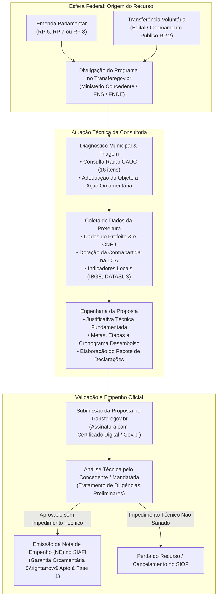
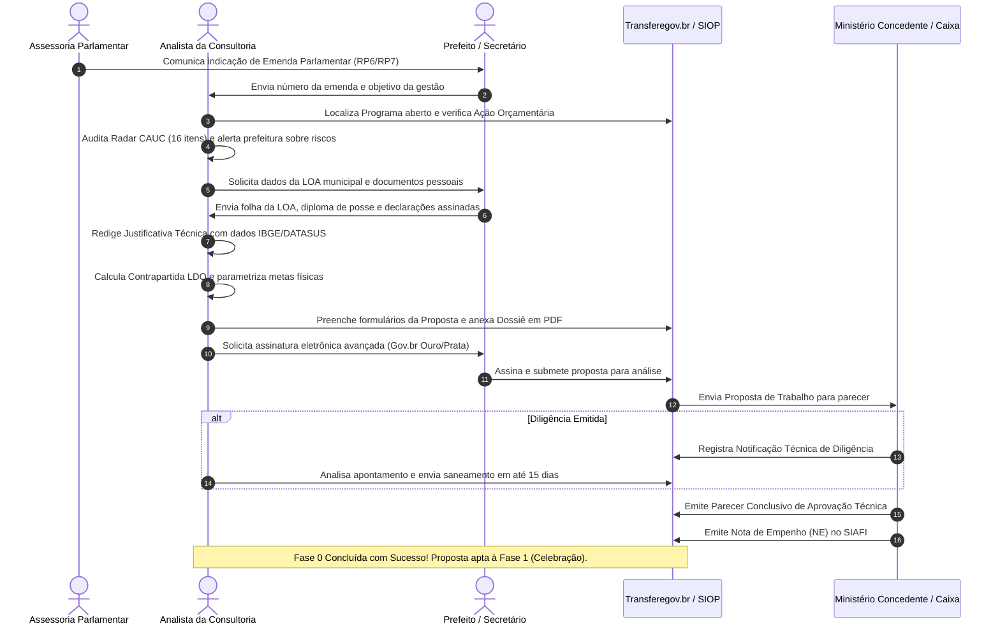

# Deep Research Especializado: Fase 0 — Origem Orçamentária, Habilitação e Pré-Convênio

> **Roteamento de Engenharia (`/deep-research` & `/domain-modeling`):**  
> Este documento constitui o guia definitivo e exaustivo sobre a **Fase 0 (Pré-Celebração)** dos convênios e contratos de repasse federais operados via Transferegov.br. Ele disseca as exigências legais vigentes (Decreto nº 11.531/2023, Portaria Conjunta MGI/MF/CGU nº 33/2023, LC nº 101/2000 - LRF, LC nº 210/2024 e LDO federal), mapeia minuciosamente o papel operacional da consultoria de gestão municipal, detalha todos os **dados** requeridos e cataloga a **documentação documental e declarações obrigatórias** necessárias para garantir a aprovação da proposta e a emissão da Nota de Empenho (NE) no SIAFI.

---

## 1. Visão Geral e Marco Regulatório da Fase 0

A **Fase 0** (também denominada etapa de pré-proposta, cadastramento ou originação orçamentária) é o alicerce jurídico, técnico e financeiro de qualquer transferência voluntária ou impositiva da União. Ela compreende o intervalo temporal que se inicia na **indicação orçamentária do recurso público federal** e se encerra no momento em que o Ministério Concedente emite a **Nota de Empenho (NE)** no SIAFI, reservando os recursos no Orçamento Geral da União (OGU) para a futura celebração do instrumento.

### Principais Normas Regulatórias:
1. **Decreto nº 11.531/2023**: Estabelece os princípios de planejamento, viabilidade técnica, plano de trabalho padronizado e requisitos prévios à celebração.
2. **Portaria Conjunta MGI/MF/CGU nº 33/2023**: Normatiza os atos preparatórios, critérios de análise do concedente, conteúdo do plano de trabalho (art. 20) e limites da contrapartida.
3. **Lei de Responsabilidade Fiscal (LC nº 101/2000, art. 25)**: Condiciona qualquer transferência voluntária à comprovação de regularidade fiscal, orçamentária e previdenciária pelo convenente (aferida pelo CAUC).
4. **Lei Complementar nº 210/2024**: Novo marco federal de rastreabilidade e publicidade de emendas parlamentares (após ADPF 854/STF), exigindo vinculação estrita a objetos identificáveis e plano de trabalho prévio no Transferegov.br, inclusive para transferências especiais.
5. **Portarias Interministeriais MPO/MGI/SRI do Exercício (Ex: Portaria Conjunta nº 2/2026)**: Fixam anualmente o cronograma fatal da Secretaria de Orçamento Federal (SOF/MPO) para indicação, envio de propostas, análise e saneamento de **Impedimentos de Ordem Técnica** no SIOP.

---

## 2. Tipologias de Origem do Recurso Federal

A consultoria municipal precisa identificar imediatamente a natureza orçamentária do recurso, pois os prazos e a discricionariedade mudam drasticamente:

| Tipologia do Recurso | Código Orçamentário | Regime Jurídico | Características e Prazos Operacionais |
| :--- | :---: | :--- | :--- |
| **Emenda Individual com Finalidade Definida** | **RP 6** | Impositivo (CF, art. 166) | O parlamentar indica o CNPJ da prefeitura. O Ministério abre programa específico no Transferegov. A execução é obrigatória, salvo impedimento de ordem técnica formalmente justificado. |
| **Emenda Individual Especial ("Emenda Pix")** | **RP 6** | Impositivo (CF, art. 166-A) | Recurso direto. **Sob a LC 210/2024**, o município é obrigado a cadastrar no Transferegov o plano de aplicação, objeto e conta específica antes do empenho e desembolso. |
| **Emenda de Bancada Estadual** | **RP 7** | Impositivo (CF, art. 166) | Destinada por bancadas de deputados/senadores a grandes obras estruturantes municipais ou rateios regionais. |
| **Emenda de Comissão** | **RP 8** | Discricionário | Destinada pelas Comissões Permanentes da Câmara/Senado. Depende de disponibilidade financeira e critérios do Ministério. |
| **Transferência Voluntária Tradicional (Edital)** | **RP 2** | Discricionário | Editais de chamamento público abertos pelos Ministérios (Cidades, Saúde/FNS, Educação/FNDE, Esporte, Integração, Turismo). Competitivo. |

---

## 3. O Papel da Consultoria de Gestão Municipal na Fase 0

A consultoria é o cérebro técnico do município. No Brasil, mais de 80% das prefeituras de pequeno e médio porte não possuem corpo técnico especializado em elaboração de projetos e linguagem do Transferegov. O papel da consultoria divide-se em 5 macrofunções:

1. **Monitoramento e Triagem de Oportunidades**: Monitorar diariamente o painel de programas abertos no Transferegov e as emendas destinadas ao município no SIOP/SICONV.
2. **Auditoria Prévia de Regularidade (Radar CAUC)**: Verificar se a prefeitura está apta a receber recursos da União antes de iniciar a redação de qualquer projeto.
3. **Engenharia de Redação e Modelagem da Proposta**: Elaborar a justificativa técnica, dimensionar metas, montar o cronograma de desembolso e adequar o objeto às diretrizes do Ministério concedente.
4. **Alinhamento Orçamentário e Contrapartida**: Calcular a contrapartida exata pela LDO e localizar a dotação orçamentária correspondente na LOA da prefeitura.
5. **Defesa e Tratamento de Diligências**: Monitorar o parecer preliminar dos técnicos ministeriais/Caixa e responder esclarecimentos no prazo legal improrrogável para evitar o cancelamento da emenda por "impedimento de ordem técnica".

---

## 4. Dicionário de Dados Necessários (O que a Consultoria Precisa Coletar)

Para cadastrar com sucesso a proposta no Transferegov.br, a consultoria precisa solicitar da Prefeitura ou extrair dos sistemas oficiais um conjunto estruturado de dados:

### 4.1 Dados Institucionais do Ente e do Gestor
* `cnpj_prefeitura`: CNPJ oficial ativo e cadastrado na Receita Federal sob natureza jurídica 103-1 (Órgão Público do Poder Executivo Municipal).
* `codigo_ibge`: Código geográfico de 7 dígitos do município.
* `dados_prefeito`: Nome completo, CPF, RG (com órgão emissor e UF), data de nascimento, título de eleitor, endereço residencial completo, e-mail institucional e telefone celular pessoal (para duplo fator Gov.br).
* `nivel_govbr_prefeito`: Conta Gov.br nível Prata ou Ouro com papel de Proponente/Representante Legal vinculado ao CNPJ da Prefeitura.
* `certificado_digital`: Existência de certificado e-CPF do prefeito (A1 ou A3) ou assinatura digital avançada via portal Gov.br.
* `porte_municipio`: Classificação populacional segundo o IBGE (crucial para o cálculo da contrapartida na LDO).

### 4.2 Dados Orçamentários e Parlamentares da Origem
* `numero_programa_transferegov`: Código do programa disponibilizado pelo Ministério (ex: `5600020240001`).
* `tipo_instrumento_previsto`: `CONVENIO_TRADICIONAL`, `CONTRATO_REPASSE_CAIXA` ou `TERMO_COMPROMISSO_FNDE`.
* `numero_emenda_parlamentar`: Código da emenda (ex: `38920005`), nome do parlamentar autor, partido político e modalidade (RP6, RP7, RP8).
* `acao_orcamentaria_uniao`: Código da ação no OGU (ex: `10HR - Apoio à Política Nacional de Desenvolvimento Urbano`).
* `gnd_despesa`: Grupo de Natureza de Despesa:
  * **GND 3 (Custeio/Despesas Correntes)**: Material de consumo, capacitações, serviços de terceiros.
  * **GND 4 (Investimento/Capital)**: Obras civis, reformas, aquisição de máquinas, veículos e equipamentos permanentes.

### 4.3 Dados da Contrapartida e Dotação Municipal
* `valor_repasse_solicitado`: Montante transferido pela União (exato ao valor da emenda parlamentar).
* `percentual_contrapartida_minima`: Calculado automaticamente com base na LDO federal vigente:
  * Municípios até 50.000 habitantes no semiárido / faixa de fronteira / Norte e Nordeste: tipicamente **0,1% a 2%**.
  * Demais municípios até 50.000 habitantes: **1% a 5%**.
  * Municípios de 50.001 a 200.000 habitantes: **5% a 10%**.
  * Municípios acima de 200.000 habitantes ou capitais: **10% a 20%**.
* `valor_contrapartida_calculado`: Valor financeiro que o município obrigatoriamente aportará ($V_{\text{repasse}} \times \%_{\text{contrapartida}}$).
* `valor_global_proposta`: $V_{\text{global}} = V_{\text{repasse}} + V_{\text{contrapartida}}$.
* `classificacao_orcamentaria_loa`: Código orçamentário municipal que suportará o pagamento da contrapartida:
  * Exemplo: `02.05.10.301.0012.2045.4.4.90.51.00 - Fonte 1.500.0000` (Secretaria de Saúde $\rightarrow$ Atenção Primária $\rightarrow$ Construção de UBS $\rightarrow$ Obras e Instalações $\rightarrow$ Recursos Próprios).

### 4.4 Dados Técnicos do Objeto e Dimensionamento
* `objeto_padronizado`: Descrição concisa iniciando obrigatoriamente por verbo no infinitivo, detalhando a finalidade e a localização física.  
  * *Exemplo aprovado*: "Construção de Unidade Básica de Saúde porte I, localizada na Rua Projetada A, Bairro Esperança, no Município de Massaranduba - PB".  
  * *Exemplo rejeitado por diligência*: "Aquisição de materiais e apoio ao município" (vago, sem localização e sem meta quantificável).
* `justificativa_diagnostica`: Texto técnico estruturado em 4 seções:
  1. **Situação Problema**: Descrição da carência da população local (ex: saturação da UBS atual, distância de 8 km até o centro médico, déficit de atendimento de 3.500 famílias).
  2. **Dados Socioeconômicos Oficiais**: Inserção de dados do IBGE (população, IDHM), DATASUS (número de atendimentos ambulatoriais), IDEB (para educação) ou CadÚnico.
  3. **Público Beneficiário Direto**: Quantidade estimada de pessoas atendidas diretamente e perfil de vulnerabilidade.
  4. **Sustentabilidade Operacional**: Demonstração de como o município manterá a estrutura em funcionamento após a conclusão da obra (recursos próprios para médicos, remédios, energia, segurança).
* `metas_etapas_preliminares`: Decomposição lógica em parcelas executáveis (Meta 1: Edificação Civil; Meta 2: Mobiliário; Meta 3: Equipamentos de Climatização).
* `cronograma_execucao`: Prazo de execução físico em meses (ex: 12 meses).
* `cronograma_desembolso`: Previsão mês a mês da liberação das parcelas de repasse e contrapartida.

---

## 5. Checklist Documental Exigido (O que a Consultoria Precisa Submeter)

Para instruir a proposta e anexar no Transferegov.br, a consultoria deve reunir e emitir o seguinte dossiê documental, segregado em 4 blocos:

```mermaid
classDiagram
    class Bloco1_HabilitacaoJuridica {
        +Diploma de Posse do Prefeito (TRE)
        +Ata de Posse da Câmara de Vereadores
        +Documento de Identidade (RG/CNH) e CPF
        +Comprovante de Endereço Oficial
        +Decreto/Portaria de Delegação de Poderes
    }
    class Bloco2_DossieCAUC {
        +CND Conjunta RFB/PGFN
        +Certificado de Regularidade FGTS (CRF)
        +Certidão Negativa Trabalhista (CNDT)
        +Consulta Regularidade CADIN
        +Extrato Homologação SICONFI (RREO & RGF)
        +Cumprimento Limite Pessoal (art. 19 LRF)
        +Aplicação Mínima Saúde 15% (SIOPS)
        +Aplicação Mínima Educação 25% (SIOPE)
        +Regularidade Previdenciária (CRP)
    }
    class Bloco3_DeclaracoesObrigatorias {
        +Declaração de Capacidade Técnica e Gerencial
        +Declaração de Previsão Orçamentária de Contrapartida
        +Declaração de Não Duplicidade de Convênios
        +Declaração de Sustentabilidade Operacional
        +Declaração de Transparência Pública (LAI)
        +Declaração de Movimentação em Conta Vinculada
    }
    class Bloco4_EngenhariaOuCompras {
        +Croqui de Localização & Coordenadas GPS
        +Memorial Descritivo Preliminar / EVTE
        +Estimativa de Custos Baseada no SINAPI/SICRO
        +Termo de Referência Preliminar (Compras)
        +Pesquisa Mercadológica (3 orçamentos / Painel Preços)
        +Comprovação Dominial Preliminar ou Opção por Cláusula Suspensiva
    }
```

### Bloco 1: Habilitação Jurídica e Institucional do Proponente
1. **Diploma Eleitoral do Prefeito**: Emitido pela Justiça Eleitoral atestando a vitória e legitimidade democrática do gestor.
2. **Ata de Posse da Câmara Municipal**: Termo de posse lavrado no Poder Legislativo municipal no início da legislatura.
3. **Documento Oficial de Identidade (RG e CPF) do Prefeito**: Documento legível em PDF.
4. **Portaria / Decreto de Delegação de Competência (se houver)**: Caso a proposta seja assinada por Secretário Municipal ou Procurador-Geral, é obrigatório juntar o decreto do prefeito delegando formalmente tais poderes.

### Bloco 2: Dossiê de Regularidade Fiscal e Contábil (Radar CAUC - 16 Itens da LRF)
A prefeitura precisa estar com status **ADIMPLENTE** no CAUC no ato de envio da proposta e, primordialmente, no ato da emissão da Nota de Empenho (NE). A consultoria deve monitorar:
1. **CND Conjunta da Receita Federal e Procuradoria-Geral da Fazenda Nacional (PGFN)** (Tributos Federais e Dívida Ativa).
2. **Certificado de Regularidade do FGTS (CRF)** emitido pela Caixa Econômica Federal.
3. **Certidão Negativa de Débitos Trabalhistas (CNDT)** emitida pela Justiça do Trabalho.
4. **Extrato de Regularidade no CADIN Federal** (inexistência de inscrições restritivas).
5. **Extrato SIAFI / SIAFI Web**: Comprovação de inexistência de inadimplência em convênios federais anteriores (ausência de omissão de contas ou glosas não pagas).
6. **Comprovante de Homologação do RREO no SICONFI**: Relatório Resumido da Execução Orçamentária dos bimestres do ano corrente.
7. **Comprovante de Homologação do RGF no SICONFI**: Relatório de Gestão Fiscal dos quadrimestres/semestres do exercício anterior e corrente.
8. **Comprovação do Limite de Despesas com Pessoal**: Despesa total com pessoal do Poder Executivo abaixo do teto legal de 54% da Receita Corrente Líquida (RCL).
9. **Extrato de Cumprimento de Limite Constitucional em Educação**: Aplicação mínima de 25% da receita de impostos (art. 212 da CF) homologada no sistema SIOPE/FNDE.
10. **Extrato de Cumprimento de Limite Constitucional em Saúde**: Aplicação mínima de 15% da receita própria (LC nº 141/2012) homologada no sistema SIOPS/Ministério da Saúde.
11. **Certificado de Regularidade Previdenciária (CRP)**: Emitido pelo Ministério da Previdência Social para regimes próprios de previdência (RPPS) ou comprovação de quitação com o RGPS.

### Bloco 3: Declarações Formais Obrigatórias (Assinadas Eletronicamente pelo Prefeito)
Modelos textuais padronizados que devem ser anexados na aba "Anexos da Proposta" no Transferegov.br:
1. **Declaração de Capacidade Técnica e Gerencial**: Atesta formalmente que a prefeitura possui quadro funcional capacitado (engenheiros, fiscais, setor de licitações) para executar e fiscalizar o objeto pretendido.
2. **Declaração de Previsão de Recursos de Contrapartida**: Assinada conjuntamente pelo **Prefeito** e pelo **Contador do Município**, declarando que o valor da contrapartida consta expressamente na Lei Orçamentária Anual (LOA) do exercício ou em Crédito Adicional Suplementar aprovado pela Câmara. Deve acompanhar **cópia da folha da LOA municipal** destacando a dotação.
3. **Declaração de Não Duplicidade de Instrumento**: Atesta que o objeto, meta ou serviço pretendido não foi, não é e não será objeto de financiamento por outro convênio, contrato de repasse ou fonte pública, afastando a ocorrência de *bis in idem* punível pelo TCU.
4. **Declaração de Sustentabilidade Operacional do Objeto**: Compromisso formal de que a prefeitura arcará com as despesas de manutenção, abastecimento, insumos e pessoal para manter a benfeitoria funcionando após sua inauguração.
5. **Declaração de Transparência Pública**: Atesta a existência de sítio eletrônico oficial da Prefeitura (Portal da Transparência) em conformidade com a Lei de Acesso à Informação (Lei nº 12.527/2011) e com a Lei de Responsabilidade Fiscal.
6. **Declaração de Inexistência de Cobrança de Taxa de Administração**: Garante que o município não deduzirá valores a título de taxas de administração interna sobre os recursos repassados pela União.

### Bloco 4: Documentação Técnica Prévia do Objeto (Engenharia ou Aquisições)
* **Para Obras e Intervenções de Engenharia**:
  1. **Croqui ou Mapa de Localização**: Identificação da rua, bairro e polígono com **coordenadas geodésicas (Latitude e Longitude)** obtidas por GPS.
  2. **Memorial Descritivo Preliminar**: Descrição sumária da tipologia construtiva, metragem quadrada e padrão de acabamento.
  3. **Estimativa de Custo Global Paramétrica**: Planilha preliminar baseada em referenciais oficiais (custo médio por m² do SINAPI, SICRO ou tabelas de referência do FNDE/FNS).
  4. **Caracterização Dominial Preliminar**: Indicação se a prefeitura já possui escritura pública/matrícula no Cartório de Registro de Imóveis ou se o instrumento será assinado sob a égide da **Cláusula Suspensiva** (Fase 2).
* **Para Aquisição de Veículos, Máquinas e Equipamentos Permanentes**:
  1. **Termo de Referência (TR) Preliminar**: Descritivo técnico com especificações mínimas, potência, capacidade de carga e padrão de conformidade (sem indicação de marca comercial ou direcionamento).
  2. **Pesquisa Mercadológica Tripla**: No mínimo 3 cotações de preços com fornecedores distintos do ramo ou extração oficial do **Painel de Preços do Governo Federal** / Banco de Preços em Saúde (BPS), calculando o valor médio de mercado.
  3. **Justificativa de Necessidade e Dimensionamento**: Cálculo demonstrando que a prefeitura possui demanda compatível com o maquinário solicitado (ex: comprovação de quilometragem de estradas vicinais para pleitear uma Motoniveladora).

---

## 6. Fluxograma Operacional Passo a Passo da Consultoria na Fase 0

---

## 7. Principais Armadilhas, Diligências e Causas de Perda de Recursos

A consultoria que domina a Fase 0 protege o prefeito contra as causas mais frequentes de cancelamento de repasses federais:

1. **A Armadilha do CAUC no "Dia 31 de Dezembro"**:
   * O Ministério aprova o plano de trabalho, mas no dia da emissão da Nota de Empenho no SIAFI (geralmente no fechamento contábil de dezembro), uma certidão do CAUC (ex: FGTS ou Receita Federal) caducou no dia anterior.
   * **Consequência**: O SIAFI trava a emissão do empenho por impedimento legal estrito (art. 25 da LRF), e o recurso da emenda é cancelado sem volta.
2. **Justificativa Genérica ("Cópia e Cola")**:
   * O analista utiliza um modelo padrão com frases vagas como *"Este recurso visa melhorar as condições de vida dos munícipes através do desenvolvimento sustentável"*.
   * **Consequência**: Diligência do Ministério reprovando a proposta por falta de nexo causal e falta de caracterização de demanda e público-alvo.
3. **Incompatibilidade de GND (Custeio vs. Capital)**:
   * A emenda parlamentar foi carimbada pelo autor no OGU como **GND 3 (Despesas Correntes/Custeio)**, mas a prefeitura cadastra proposta para construir uma creche ou praça (**GND 4 - Investimento/Obras**).
   * **Consequência**: Impedimento técnico insanável no SIOP por desvio de modalidade orçamentária.
4. **Cálculo Errado da Contrapartida (Abaixo do Piso da LDO)**:
   * O analista calcula uma contrapartida de 0,1% para um município com mais de 50.000 habitantes fora do semiárido, cujo piso da LDO federal é de 2% ou 5%.
   * **Consequência**: Rejeição sumária pelo sistema no ato da submissão.
5. **Perda dos Prazos da Portaria de Impedimentos Técnicos**:
   * O Concedente aponta uma diligência técnica no Transferegov com prazo de 15 dias. A prefeitura demora a responder e perde o prazo.
   * **Consequência**: A Secretaria de Orçamento Federal (SOF) registra o **Impedimento de Ordem Técnica Total**, cancelando a emenda parlamentar no SIOP e remanejando o saldo orçamentário.

---

## 8. Como o GovFlow Automatiza a Fase 0 para a Consultoria

Com base nesta pesquisa de domínio, o software **GovFlow** resolve esses gargalos operacionais:

* **Radar CAUC Preditivo**: Alertas automáticos via WhatsApp e Dashboard para a consultoria avisando sobre certidões que vencerão nos próximos 30, 15 e 5 dias, com link direto para emissão da nova certidão.
* **Validador de Contrapartida Automático**: Cálculo instantâneo do valor mínimo de contrapartida cruzando o porte do município (código IBGE) com as regras vigentes da LDO.
* **Gerador Inteligente de Justificativas**: IA integrada ao GovFlow que consome o código IBGE e os bancos de dados oficiais (DATASUS, IDEB, Censo Escolar) para redigir a justificativa técnica com dados socioeconômicos reais do município.
* **Centralizador de Dossiê e Gerador de Declarações**: Preenchimento automático dos 6 modelos oficiais de declaração com dados do prefeito e da LOA municipal prontos para assinatura digital via Gov.br.
* **Monitor de Diligências no Transferegov**: Rastreamento constante de atualizações no status da proposta para alertar o analista no exato minuto em que o concedente solicitar correções.
