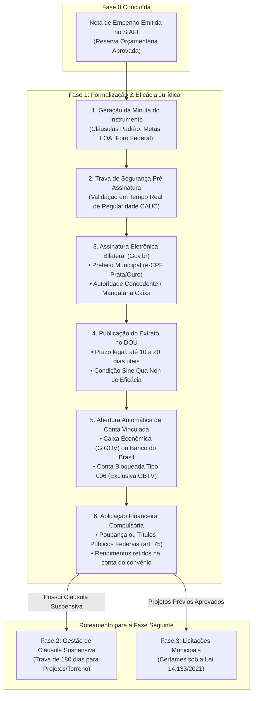
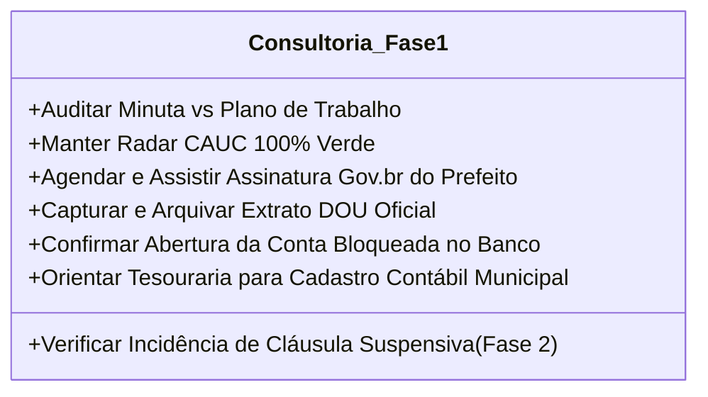
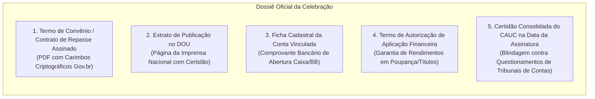

# Deep Research Especializado: Fase 1 — Celebração, Formalização e Custódia Financeira

> **Roteamento de Engenharia (`/deep-research` & `/domain-modeling`):**  
> Este documento formaliza o estudo aprofundado sobre a **Fase 1 (Celebração, Publicidade Oficial e Custódia Financeira)** dos convênios e contratos de repasse federais no Transferegov.br. Ele disseca o rito de assinatura bilateral eletrônica via Gov.br, a condição jurídica de eficácia no DOU, o papel das mandatárias públicas (Caixa GIGOV e Banco do Brasil), as regras bancárias de conta vinculada bloqueada e aplicação financeira compulsória (Portaria Conjunta MGI/MF/CGU nº 33/2023 e Decreto nº 11.531/2023), além do papel tático da consultoria municipal, dados e documentação envolvidos.

---

## 1. Visão Geral e Enquadramento Legal da Fase 1

A **Fase 1** representa o momento em que a promessa orçamentária da Fase 0 (Nota de Empenho federal no SIAFI) se transmuda em um **negócio jurídico bilateral perfeito e vinculante** entre a União e o Município.

### Principais Marcos Legais:
1. **Decreto nº 11.531/2023 (arts. 12 a 18)**: Disciplina os requisitos para celebração, competências delegadas, cláusulas obrigatórias e condições de eficácia jurídica.
2. **Portaria Conjunta MGI/MF/CGU nº 33/2023 (arts. 28 a 34 e art. 75)**: 
   * *Art. 28 a 34:* Rito de assinatura eletrônica, conteúdo obrigatório da minuta e prazos de publicação do extrato no Diário Oficial da União.
   * *Art. 75:* Regime financeiro de conta corrente específica, bloqueio de movimentação fora do Transferegov e obrigatoriedade de aplicação financeira automática.
3. **Portaria Conjunta MGI/MF/CGU nº 29/2024**: Ajustou o escopo da Portaria nº 33/2023, estabelecendo o "regime simplificado" para instrumentos com valor global de até **R$ 1,5 milhão**, focando em celeridade e menos burocracia documental prévia.
4. **Lei nº 4.320/1964 (art. 60)**: Princípio da prévia dotação orçamentária e empenho antes de qualquer compromisso firmado pela administração.
5. **Instruções Normativas da Secretaria do Tesouro Nacional (STN)**: Normas de controle da Conta Única do Tesouro e relacionamento com bancos oficiais.

---

## 2. Tipologias de Instrumentos Celebrados

A consultoria municipal precisa compreender a diferença fundamental entre as espécies de instrumentos formalizados na Fase 1:

| Tipo de Instrumento | Partes Envolvidas | Órgão Operacional | Campo de Aplicação Típico |
| :--- | :--- | :--- | :--- |
| **Contrato de Repasse** | União $\leftrightarrow$ Prefeitura com interveniência de Mandatária | **Caixa Econômica Federal (GIGOV)** ou Banco do Brasil | Obras de infraestrutura urbana, habitação, pontes, pavimentação, saneamento e equipamentos esportivos (Ministério das Cidades, Integração, Esporte). A Caixa audita projetos, licitações, medições e pagamentos. |
| **Convênio Tradicional** | Ministério Concedente $\leftrightarrow$ Prefeitura (Direto) | Próprio Ministério (Fundo a Fundo ou Setorial) | Saúde (FNS), Ações Sociais (MDS), Cultura (MinC), Agricultura (MAPA). A análise técnica e de contas é feita diretamente pelos servidores federais da pasta. |
| **Termo de Compromisso** | Autarquia Federal $\leftrightarrow$ Prefeitura | **FNDE** (Educação) ou Ministério da Saúde | Obras escolares (Creches Proinfância, Escolas Padrão FNDE) e unidades de saúde no âmbito do Novo PAC. Instrumento com regime célere de execução continuada. |
| **Termo de Adesão e Plano de Aplicação (Emenda Especial / Pix)** | União $\leftrightarrow$ Município | Secretaria de Relações Institucionais (SRI/PR) e Transferegov | Transferência especial (CF, art. 166-A). Após a **LC nº 210/2024**, exige formalização de termo no Transferegov indicando o objeto, conta bancária específica e plano de aplicação antes da liberação do recurso. |

---

## 3. O Rito Procedimental da Celebração Passo a Passo

### Passo 1: Elaboração e Disponibilização da Minuta no Transferegov
Aprovada a proposta e emitida a Nota de Empenho (NE), o sistema Transferegov gera automaticamente a minuta padronizada do instrumento.  
**Cláusulas Obrigatórias Inegociáveis (art. 28 da Portaria nº 33/2023)**:
* Objeto detalhado e metas vinculadas ao Plano de Trabalho.
* Obrigações expressas do Concedente e do Convenente.
* Valor global, valor de repasse da União e valor da contrapartida municipal.
* Indicação das notas de empenho da União no SIAFI e da dotação na LOA municipal.
* Prazos de vigência inicial e final.
* Estipulação de **Cláusula Suspensiva** (quando o projeto de engenharia ou terreno ainda dependem de aprovação Caixa).
* Identificação da conta bancária vinculada e regras de aplicação financeira.
* Foro da **Justiça Federal** (Seção Judiciária da capital do estado) para dirimir litígios.

### Passo 2: Verificação do CAUC em Tempo Real (Trava Pré-Assinatura)
No momento em que o sistema abre a tela de assinatura, o Transferegov executa uma consulta automatizada ao barramento do **CAUC/SIAFI**.
> [!CAUTION]
> Se qualquer uma das 16 certidões estiver vencida ou se houver inscrição restritiva no CADIN no exato minuto da assinatura, o sistema bloqueia o botão de assinatura eletrônica do Prefeito, impedindo a celebração. A consultoria precisa manter o Radar CAUC 100% verde.

### Passo 3: Assinatura Eletrônica Bilateral via Gov.br
A assinatura física em papel foi completamente abolida nas transferências federais:
* **Assinatura do Prefeito**: Realizada por meio da identidade digital **Gov.br (Nível Prata ou Ouro)** ou Certificado Digital ICP-Brasil (e-CPF). O prefeito acessa o Transferegov com seu login, revisa o instrumento e assina digitalmente.
* **Assinatura do Concedente / Mandatária**: Assinada pelo Ministro de Estado, Secretário Nacional ou pelo Superintendente Regional / Gerente da GIGOV da Caixa Econômica Federal.
* O sistema gera o documento final com carimbo de tempo (*timestamp*) e hash criptográfico SHA-256.

### Passo 4: Publicação no Diário Oficial da União (Condição de Eficácia)
* **Regra de Ouro**: A assinatura confere existência e validade ao contrato, mas **a eficácia jurídica só nasce com a publicação oficial**.
* **Prazo Legal**: O Concedente ou a Caixa providencia a publicação do extrato no Diário Oficial da União (DOU) no prazo de **até 10 a 20 dias úteis** a contar da assinatura.
* **Consequência Prática**: Qualquer ato executado antes da data de circulação do DOU (como publicação de edital de licitação ou emissão de ordem de serviço) é considerado nulo de pleno direito perante os órgãos de controle.

### Passo 5: Abertura e Vinculação Automática da Conta Bloqueada
* **Processo 100% Automatizado**: A celebração dispara um webhook automático entre o Transferegov e a instituição financeira oficial (Caixa Econômica Federal ou Banco do Brasil).
* O banco abre a **Conta Corrente Vinculada Exclusiva**:
  * Titular: Prefeitura Municipal de [Nome] (CNPJ oficial).
  * Vínculo: Número do Instrumento Transferegov.
  * Regime de Operação: **"Conta Bloqueada" (Operação 006 na Caixa)**. A prefeitura não possui cartão magnético, talão de cheques nem autorização para efetuar transferências avulsas (TED/Pix) no caixa ou internet banking. Toda e qualquer movimentação é governada exclusivamente por ordens de pagamento eletrônicas (**OBTV**) geradas dentro do Transferegov.
  * **Isenção Tarifária**: A conta vinculada de convênio federal é isenta de tarifas bancárias regulares de manutenção.

### Passo 6: Aplicação Financeira Compulsória (art. 75 da Portaria nº 33/2023)
* Todos os saldos mantidos na conta vinculada (repasses da União ou aportes de contrapartida) são **compulsoriamente aplicados pelo banco**:
  * Em **caderneta de poupança**, quando a previsão de uso for igual ou superior a um mês;
  * Em **fundo de aplicação financeira de curto prazo** ou operação de mercado aberto lastreada em títulos da dívida pública federal, quando a utilização for em prazos inferiores a um mês.
* **Propriedade dos Rendimentos**: Os juros e rendimentos auferidos pertencem ao convênio e ficam retidos na própria conta vinculada. Eles só podem ser utilizados para ampliação do objeto pactuado (mediante termo aditivo prévio) ou deverão ser **integralmente devolvidos ao Tesouro Nacional via GRU** na prestação de contas final (Fase 7).

---

## 4. O Papel da Consultoria de Gestão Municipal na Fase 1

Na Fase 1, a consultoria atua com foco em **agilidade, blindagem jurídica e sincronização bancária**:

1. **Auditoria da Minuta**: Conferir linha por linha se a minuta gerada pelo Transferegov respeita as metas, valores de repasse e, principalmente, o percentual de contrapartida aprovado.
2. **Plantão de Assinatura do Prefeito**: Monitorar o sistema e notificar o prefeito no minuto em que o documento estiver pronto para assinatura, evitando a expiração do prazo ministerial.
3. **Vigilância Diária do DOU**: Acompanhar as edições diárias da Imprensa Nacional para capturar a data exata de publicação do extrato, registrando o link e o PDF para dar início seguro à fase de contratação.
4. **Sincronização com a Secretaria de Finanças/Tesouraria**:
   * Fornecer ao setor de contabilidade o número da nova conta vinculada e os códigos de dotação orçamentária para que a prefeitura abra a conta contábil no sistema de gestão financeira municipal (Betha, Fiorilli, Aspec, Elotech, etc.).
   * Planejar a data de aporte da contrapartida municipal sem desequilibrar o fluxo de caixa da prefeitura.
5. **Roteamento Imediato de Engenharia (Cláusula Suspensiva)**: Se o convênio foi celebrado com Cláusula Suspensiva, a consultoria deve acionar imediatamente os engenheiros municipais ou projetistas contratados, pois o prazo fatal de 180 dias começa a fluir.

---

## 5. Dicionário de Dados Necessários e Gerados na Fase 1

A formalização da celebração gera um conjunto de metadados cruciais para o rastreamento do convênio no GovFlow:

| Atributo de Domínio | Tipo de Dado | Regra de Negócio / Origem |
| :--- | :---: | :--- |
| `numero_instrumento_federal` | `VARCHAR(30)` | Número oficial atribuído no Transferegov (ex: `912345/2024`). |
| `data_assinatura_convenente` | `DATE` | Data em que o prefeito assinou digitalmente com Gov.br. |
| `data_assinatura_concedente` | `DATE` | Data em que a autoridade federal / Caixa assinou. |
| `hash_assinatura_digital` | `VARCHAR(256)` | Hash criptográfico SHA-256 gerado pelo Gov.br/ICP-Brasil. |
| `data_publicacao_dou` | `DATE` | Data de circulação no Diário Oficial da União (marco inicial de eficácia). |
| `secao_dou`, `pagina_dou`, `edicao_dou` | `VARCHAR(20)` | Identificadores da publicação na Imprensa Nacional. |
| `link_dou` | `VARCHAR(500)` | URL pública oficial de visualização no portal in.gov.br. |
| `data_inicio_vigencia` | `DATE` | Início pactuado dos efeitos operacionais. |
| `data_fim_vigencia` | `DATE` | Prazo fatal de encerramento contratual. |
| `banco_vinculado` | `VARCHAR(50)` | `CAIXA_ECONOMICA_FEDERAL` (104) ou `BANCO_DO_BRASIL` (001). |
| `agencia_vinculada` | `VARCHAR(10)` | Código da agência bancária de custódia com dígito. |
| `numero_conta_vinculada` | `VARCHAR(20)` | Número da conta corrente vinculada exclusiva. |
| `tipo_bloqueio_conta` | `VARCHAR(30)` | `CONTA_BLOQUEADA_EXCLUSIVA_OBTV` (Operação 006 Caixa). |
| `possui_clausula_suspensiva` | `BOOLEAN` | Indica se o convênio foi assinado sob condição resolutiva (Fase 2). |
| `prazo_clausula_suspensiva` | `DATE` | Data fatal correspondente a 180 dias após a assinatura/publicação. |

---

## 6. Checklist Documental da Fase 1 (O Dossiê da Celebração)

Ao concluir a celebração, a consultoria deve compor e arquivar o seguinte dossiê:

1. **Termo de Convênio / Contrato de Repasse Assinado (PDF)**:
   * Cópia integral do instrumento contratual contendo todas as cláusulas, anexos, assinaturas digitais verificáveis e número de processo SEI.
2. **Certidão / Extrato de Publicação no Diário Oficial da União**:
   * Cópia digitalizada da página do DOU contendo o extrato oficial publicado pela Imprensa Nacional.
3. **Comprovante de Abertura da Conta Corrente Bancária Vinculada**:
   * Extrato ou termo bancário formal emitido pela Caixa ou Banco do Brasil comprovando os dados da conta exclusiva (Agência, Conta e Vinculação ao CNPJ da Prefeitura).
4. **Termo de Adesão à Aplicação Financeira Automática**:
   * Instrumento bancário comprovando que a conta está parametrizada para rentabilizar saldos diários em caderneta de poupança ou fundos públicos federais.
5. **Certidão Negativa Consolidada do CAUC da Data da Assinatura**:
   * Impressão do extrato do CAUC gerado no mesmo dia da assinatura, arquivado para comprovar perante o TCU e TCE que a celebração atendeu rigorosamente ao art. 25 da LRF.

---

## 7. Principais Armadilhas e Riscos Operacionais na Fase 1

1. **Assinatura Bloqueada por Queda do CAUC na "Hora H"**:
   * A proposta foi empenhada em novembro, mas a celebração foi agendada para 28 de dezembro. No dia 27, a certidão do FGTS da prefeitura venceu.
   * **Consequência**: O Transferegov trava a assinatura digital. Se o mandato do prefeito ou o prazo da portaria orçamentária se encerrar sem a assinatura, o convênio não se aperfeiçoa e o empenho federal é cancelado.
2. **Execução Antecipada sem Publicação no DOU**:
   * O prefeito e o ministro assinam o convênio na sexta-feira. Na segunda-feira seguinte, a prefeitura publica o edital de licitação da obra, mas o extrato do convênio só é publicado no DOU na quinta-feira.
   * **Consequência**: O Tribunal de Contas da União (TCU) e a Caixa consideram a licitação nula por ausência de vigência e eficácia do instrumento financiador.
3. **Não Ativação da Aplicação Financeira Automática**:
   * Se por falha operacional da agência bancária os recursos transferidos ficarem parados na conta corrente sem rentabilização automática em poupança ou títulos públicos.
   * **Consequência**: Na prestação de contas (Fase 7), o concedente e a CGU apuram o valor dos **rendimentos teóricos que deveriam ter sido auferidos** e cobram a reposição desse montante com juros do próprio cofre municipal.
4. **Desconhecimento da Cláusula Suspensiva**:
   * A consultoria celebra o contrato de repasse, arquiva o PDF e não percebe que a Cláusula Suspensiva está ativa. Passam-se 180 dias sem que a engenharia envie os projetos complementares e o laudo da Caixa.
   * **Consequência**: O convênio é compulsoriamente extinto sem possibilidade de recurso e os recursos voltam para o Tesouro Nacional.

---

## 8. Como o GovFlow Automatiza a Fase 1

O **GovFlow** transforma a Fase 1 em um processo auditado, proativo e à prova de falhas:

* **Sentinela CAUC para Assinatura**: O sistema monitora a fila de propostas aprovadas aguardando celebração e emite alertas prioritários no WhatsApp da consultoria se qualquer certidão estiver a menos de 5 dias do vencimento.
* **Notificação Instantânea de Liberação de Minuta**: Alerta imediato ao analista e envio de mensagem com link seguro para o WhatsApp do Prefeito para assinatura em 1 clique via Gov.br.
* **Crawler Automático do Diário Oficial da União (DOU)**: O GovFlow varre diariamente a base da Imprensa Nacional, localiza automaticamente a publicação do extrato do convênio do município conveniado, extrai data, página e link oficial, e atualiza o status do convênio para `PUBLICADO_VIGENTE`.
* **Rastreador de Conta Vinculada**: Captura os dados bancários criados pelo Transferegov e já prepara a conta para a recepção de parcelas e o registro contábil na LOA municipal.
* **Disparo do Cronômetro da Cláusula Suspensiva**: Caso o convênio possua a condição suspensiva, o GovFlow inicia imediatamente a contagem regressiva de 180 dias na interface e envia o checklist dos 3 pilares técnicos (Projetos/SINAPI, Ambiental e Titularidade) para o setor de engenharia.
