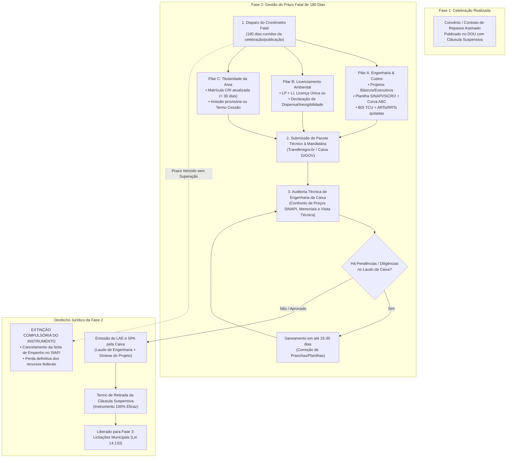
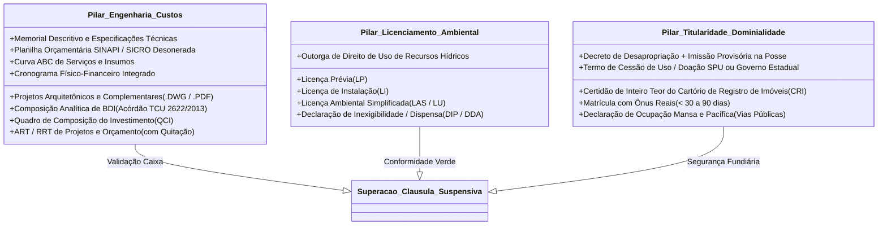
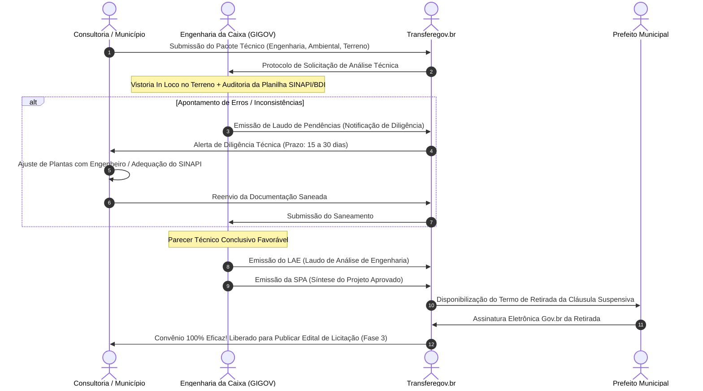
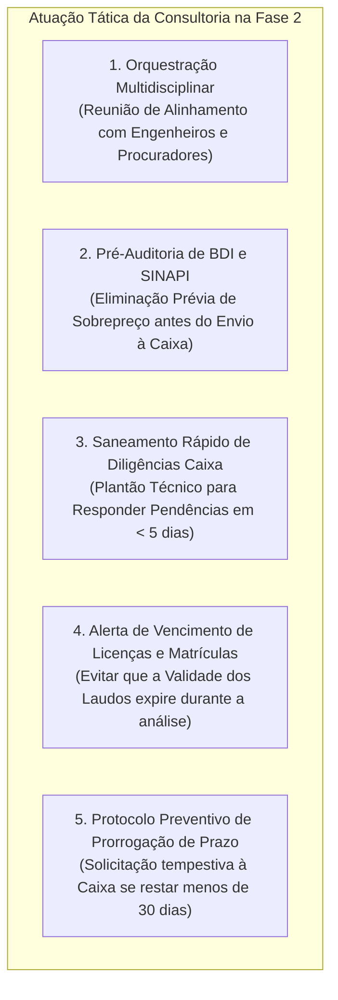

# Deep Research Especializado: Fase 2 — Gestão e Superação da Cláusula Suspensiva

> **Roteamento de Engenharia (`/deep-research` & `/domain-modeling`):**  
> Este documento formaliza o estudo aprofundado sobre a **Fase 2 (Gestão e Superação da Cláusula Suspensiva)** dos convênios e contratos de repasse federais no Transferegov.br. A Cláusula Suspensiva é a principal causa de cancelamento prematuro de emendas parlamentares e transferências de infraestrutura no Brasil. Este estudo disseca os fundamentos legais (Decreto nº 11.531/2023, Portaria Conjunta MGI/MF/CGU nº 33/2023, Portaria nº 29/2024), os manuais e ritos de engenharia da mandatária federal (**Caixa Econômica Federal — GIGOV / MN AE099**), os 3 pilares técnicos condicionantes, o papel tático da consultoria municipal, o checklist documental e a modelagem de dados para o **GovFlow**.

---

## 1. Visão Geral e Enquadramento Legal da Cláusula Suspensiva

### 1.1 O que é a Cláusula Suspensiva e por que ela existe?
No direito financeiro público brasileiro, vigora o **princípio da anualidade orçamentária** (Lei nº 4.320/1964). Os Ministérios e órgãos concedentes precisam empenhar integralmente os recursos das emendas parlamentares até o último dia útil de dezembro.  

No entanto, a elaboração de projetos completos de engenharia, a realização de sondagens de solo, a obtenção de licenças ambientais e a regularização fundiária de terrenos urbanos demandam de 4 a 12 meses — tempo incompatível com o calendário orçamentário.  

Para evitar a perda dos recursos federais, a legislação instituiu a **Cláusula Suspensiva de Eficácia**:
* **Conceito:** É uma condição resolutiva fixada no instrumento celebrado (Contrato de Repasse ou Convênio) que **suspende a eficácia do contrato e proíbe terminantemente qualquer desembolso de recursos federais ou início físico de obras** até que o município apresente e tenha aprovados todos os projetos de engenharia, licenças ambientais e a comprovação da propriedade da área.
* **Segurança Orçamentária:** Com a celebração sob cláusula suspensiva, a Nota de Empenho (NE) emitida no SIAFI é preservada em rubrica de **Restos a Pagar Não Processados**, blindando o montante orçamentário conquistado pelo município.

### 1.2 Principais Dispositivos Legais e Regulamentares

1. **Decreto Federal nº 11.531/2023 (art. 10, § 1º a § 6º):**
   * Estabelece a previsão da condição suspensiva no instrumento pactuado.
   * Fixa a obrigatoriedade de estipulação de prazo no contrato para a apresentação e aprovação das condições.
   * Determina expressamente que a não superação das condicionantes no prazo avençado acarreta a **rescisão unilateral ou extinção sumária do instrumento**, cancelando-se o empenho federal.
2. **Portaria Conjunta MGI/MF/CGU nº 33/2023 (arts. 16, 21 a 27, e 30):**
   * Disciplina o prazo padrão de **180 dias corridos** para o cumprimento da cláusula suspensiva.
   * Permite prorrogação do prazo mediante justificativa técnica formal acolhida pela Mandatária/Concedente, desde que não ultrapasse os limites fixados para a liquidação de Restos a Pagar.
   * Detalha os requisitos mínimos do Projeto Básico e do Projeto Executivo.
3. **Portaria Conjunta MGI/MF/CGU nº 29/2024 (Regime Simplificado):**
   * Para transferências voluntárias com valor global de até **R$ 1,5 milhão**, estabelece rito simplificado de análise de projetos e flexibilização na apresentação de ensaios geotécnicos complexos, priorizando a celeridade.
4. **Normativos Internos da Caixa Econômica Federal (Mandatária da União):**
   * **MN AE099 (Manual de Atividades de Engenharia da Caixa):** Disciplina as regras de análise de projetos, custos, vistorias técnicas no local da obra e emissão dos laudos de engenharia.
   * **Acórdão TCU nº 2622/2013-Plenário:** Tabela oficial com as faixas de BDI aceitáveis para cada tipologia de obra pública federal (edificações, pavimentação, redes de saneamento, etc.).
5. **Lei nº 14.133/2021 (Nova Lei de Licitações e Contratos):**
   * Art. 6º, XXV: Definição legal e elementos obrigatórios do **Projeto Básico**.
   * Art. 6º, XXVI: Definição de **Projeto Executivo**.
   * Art. 23: Diretrizes de fixação de preços estimativos vinculados aos sistemas referenciais públicos (**SINAPI** e **SICRO**).

---

## 2. Os Três Pilares Técnicos da Cláusula Suspensiva

Para que a mandatária (Caixa / GIGOV) ou o ministério concedente emita o laudo favorável e levante a cláusula suspensiva, o município precisa comprovar a regularidade integral em **3 pilares inegociáveis**:

---

### 2.1 Pilar 1: Engenharia e Custos (Projetos, Orçamentos e BDI)

Este pilar consome cerca de 80% do esforço técnico da Fase 2. A equipe de engenharia da Caixa GIGOV realiza um pente-fino cirúrgico:

#### A. Projetos Básicos e Executivos
* **Pranchas Gráficas:** Devem ser assinadas digitalmente pelo autor do projeto com registro ativo no CREA ou CAU.
  * Planta de Situação e Locação com coordenadas geográficas (Datum SIRGAS 2000).
  * Plantas Baixas, Cortes Transversais e Longitudinais, Fachadas e Detalhamento Construtivo.
  * Projetos de Fundações e Estrutural (com memorial de cálculo).
  * Projetos de Instalações Elétricas, Hidrossanitárias, Drenagem Pluvial e Combate a Incêndio.
  * Prancha Específica de **Acessibilidade Universal** (conforme normas NBR 9050 e Decreto nº 5.296/2004 — rampa de acesso, piso tátil, banheiros adaptados).
* **Memorial Descritivo e Caderno de Encargos:** Texto técnico minucioso detalhando método de execução, normas ABNT aplicáveis e especificações de acabamentos. **Vedado direcionamento de marca** (Lei 14.133/2021).

#### B. Planilha Orçamentária e Preços Públicos Federais (SINAPI / SICRO)
* **Princípio da Tipicidade de Custos:** Cada item da planilha de obra deve ser codificado com uma composição de custo unitário referencial:
  * **SINAPI (Sistema Nacional de Pesquisa de Custos e Índices da Construção Civil):** Administrado pela Caixa e IBGE. Obrigatório para edificações, saneamento, reformas, praças e equipamentos públicos urbanos.
  * **SICRO (Sistema de Custos Rodoviários):** Mantido pelo DNIT. Obrigatório para infraestrutura de transportes, rodovias, pavimentação asfáltica pesada e terraplenagem de grande porte.
* **Mês-Base da Planilha:** A planilha deve adotar a tabela do SINAPI mais recente disponível. Se a análise da Caixa demorar mais de 6 meses, a GIGOV exigirá a **reprogramação orçamentária para a tabela vigente**, o que pode alterar o valor global do projeto.
* **Desoneração da Folha de Pagamento:** Indicação expressa se o orçamento adota o regime *Desonerado* ou *Não-Desonerado*, em conformidade com a legislação tributária vigente e instruções da Receita Federal.
* **Curva ABC (Princípio de Pareto):** A planilha deve apresentar a Curva ABC de Serviços e Insumos. A Caixa analisa prioritariamente os itens do quadrante A (itens que representam 80% do custo total da obra).

#### C. Bonificação e Despesas Indiretas (BDI)
O percentual de BDI adotado na planilha orçamentária é estritamente confrontado com a jurisprudência vinculante do Tribunal de Contas da União (**Acórdão TCU nº 2622/2013-Plenário**):

| Tipologia da Intervenção | Limite Mínimo (Quartil 1) | Limite Médio | Limite Máximo (Quartil 3) |
| :--- | :---: | :---: | :---: |
| **Construção de Edifícios (Escolas, Postos de Saúde)** | 20,34% | 22,12% | 25,00% |
| **Redes de Abastecimento de Água e Esgoto** | 20,76% | 24,18% | 26,44% |
| **Obras Portuárias, Marítimas e Fluviais** | 18,99% | 22,23% | 24,42% |
| **Pavimentação e Vias Urbanas** | 19,60% | 20,97% | 24,23% |
| **Fornecimento de Materiais e Equipamentos** | 11,10% | 14,02% | 16,85% |

> [!CAUTION]
> Se o BDI inserido pelo engenheiro municipal ultrapassar em 0,1% o teto do 3º quartil da tipologia, o sistema de engenharia da Caixa GIGOV rejeita a planilha preliminarmente por indício de superfaturamento.

#### D. Cronograma Físico-Financeiro e QCI
* **QCI (Quadro de Composição do Investimento):** Documento oficial que consolida o Valor de Repasse Federal, a Contrapartida Municipal e eventuais valores de despesas não elegíveis.
* **Cronograma Integrado:** Distribuição dos percentuais de evolução da obra ao longo dos meses previstos de execução (ex: Mês 1: 8%, Mês 2: 15%, etc.).
* **PLE (Planilha de Levantamento de Eventos):** Nos contratos de repasse com regime de execução por eventos/marcos, detalha a entrega de cada etapa funcional (fundação concluída, alvenaria concluída, cobertura pronta).

#### E. ART / RRT com Comprovante de Pagamento Bancário
* Anotação de Responsabilidade Técnica (ART/CREA) ou Registro de Responsabilidade Técnica (RRT/CAU).
* Deve haver ART específica para **Autoria dos Projetos de Engenharia** e ART específica para **Elaboração do Orçamento e Cronograma**.
* **Armadilha Frequente:** A Caixa **não aceita comprovante de agendamento bancário**. O documento deve vir acompanhado do comprovante de pagamento definitivo da taxa do conselho profissional.

---

### 2.2 Pilar 2: Licenciamento Ambiental

Nenhuma intervenção que altere o meio ambiente natural ou antrópico pode ter sua cláusula suspensiva superada sem a devida chancela ambiental (Lei Federal nº 6.938/1981 e Resolução CONAMA nº 237/1997).

#### Modalidades de Atendimento Admitidas pela Mandatária:
1. **Licenciamento Trifásico Tradicional:**
   * **Licença Prévia (LP):** Atesta a viabilidade locacional e ambiental do empreendimento.
   * **Licença de Instalação (LI):** Autoriza expressamente o início das obras civis. É a exigida para o levantamento definitivo da cláusula suspensiva antes da licitação.
2. **Licenciamento Ambiental Simplificado (LAS) / Licença Única (LU):**
   * Aplicável a obras de pequeno potencial poluidor (ex: reformas prediais, praças, pequenos canais de drenagem urbana). Emitida em etapa única pelo órgão competente.
3. **Declaração de Inexigibilidade / Dispensa de Licença Ambiental (DIP / DDA):**
   * Quando o objeto se enquadra nas hipóteses de dispensa estadual ou municipal (ex: pavimentação de ruas em área urbana consolidada que já contam com drenagem e saneamento preexistentes).
   * **Requisito Crucial:** A declaração deve ser emitida formalmente pelo **órgão ambiental oficial** (Estadual, como SUDEMA, CETESB, INEA, ou Municipal, se o município for formalmente habilitado pelo Conselho Estadual de Meio Ambiente — COEMA). Não tem validade mera autodeclaração do prefeito.
4. **Outorga de Direito de Uso de Recursos Hídricos:**
   * Obrigatória caso a obra envolva captação de água em poços/rios, travessia de cursos d'água com pontes/bueiros ou lançamento de efluentes tratados em corpos hídricos.

---

### 2.3 Pilar 3: Titularidade da Área de Intervenção (Dominialidade)

O Governo Federal está constitucionalmente impedido de aportar recursos públicos a fundo perdido em imóveis privados ou cuja posse não esteja juridicamente consolidada a favor do ente municipal.

#### Modalidades de Comprovação da Propriedade (Regulamento Transferegov):
1. **Certidão de Inteiro Teor e Ônus Reais do Cartório de Registro de Imóveis (CRI):**
   * É a prova-rainha. Matrícula individualizada do terreno em nome do Município.
   * **Validade:** Deve ser uma certidão recente, expedida pelo cartório no prazo máximo de **30 a 90 dias** anteriores à submissão na Caixa.
   * Não pode haver gravames que impeçam a alienação ou destinação pública (como penhoras fiscais, hipotecas privadas ou indisponibilidade de bens determinada pela Justiça).
2. **Desapropriação em Andamento (Amigável ou Judicial):**
   * Se o município estiver desapropriando uma área privada para a construção (ex: uma creche ou hospital):
   * Exige-se o **Decreto Municipal de Utilidade Pública** publicado na imprensa oficial; e
   * Cópia do **Auto / Termo de Imissão Provisória na Posse** concedido pelo juiz no âmbito da Ação Judicial de Desapropriação (com o depósito prévio judicial devidamente comprovado, conforme art. 15 do Decreto-Lei nº 3.365/1941).
3. **Cessão de Uso, Doação ou Afetação Pública de Bens da União / Estado:**
   * Se a obra for em terreno da União (terreno de marinha, margens de ferrovias federais): Termo de Entrega ou Cessão de Uso emitido pela **SPU (Secretaria de Patrimônio da União)**.
   * Se o imóvel pertencer ao Governo Estadual: Termo de Cessão de Uso com publicação no Diário Oficial do Estado.
4. **Declaração de Ocupação Mansa e Pacífica (Exceção Específica para Pavimentação):**
   * **Restrição Severa:** Esta modalidade **NÃO se aplica a edificações novas** (escolas, postos, galpões).
   * É admitida **exclusivamente para obras viárias urbanas** (asfalto, paralelepípedo, calçadas e drenagem), onde a prefeitura declara solenemente que as vias públicas pertencem ao domínio público consolidado do município por uso contínuo, pacífico e ininterrupto há mais de 10 anos.

---

## 3. O Rito de Análise da Caixa (GIGOV) e Emissão do LAE/SPA

Quando a consultoria realiza o upload de todos os arquivos no Transferegov.br, a Mandatária (Caixa) assume a análise por meio de sua Gerência de Governo (GIGOV):

### Documentos Formais Emitidos no Encerramento da Fase 2:
1. **LAE (Laudo de Análise de Engenharia):** Documento formal elaborado pelo engenheiro civil ou arquiteto da Caixa atestando que os projetos foram auditados e cumprem os regulamentos técnicos federais e normas da ABNT.
2. **SPA (Síntese do Projeto Aprovado):** Documento oficial que consolida o resumo das metas físicas aprovadas, a área construída ou extensão em metros quadrados, os valores finais orçados e o cronograma vinculante. **A SPA é o documento que trava o orçamento estimativo da licitação na Fase 3**.
3. **Termo de Retirada da Cláusula Suspensiva:** Instrumento jurídico bilateral no Transferegov que retira a trava suspensiva, tornando o convênio juridicamente eficaz e apto a licitar e receber repasses.

---

## 4. O Papel Estratégico da Consultoria de Gestão Municipal na Fase 2

A Fase 2 é o divisor de águas onde a consultoria municipal demonstra seu maior valor técnico. Se a consultoria for passiva, o convênio morre. A atuação deve ser proativa e orquestrada:

1. **Reunião de Partida (Kick-off Técnico):** No dia seguinte à celebração do convênio, a consultoria convoca a Secretaria de Obras, os projetistas contratados, o setor de meio ambiente e o cartório de imóveis, apresentando a data limite exata dos 180 dias.
2. **Auditoria Prévia de Engenharia:**
   * A consultoria não apenas repassa projetos: ela audita se o BDI está na faixa do Acórdão TCU 2622/2013, se a prancha de acessibilidade possui rampa com inclinação NBR 9050 e se as ARTs têm os comprovantes bancários autenticados.
3. **Interlocução Direta com a GIGOV:**
   * Acompanhamento semanal do analista da Caixa designado para o processo.
   * Participação em reuniões técnicas de saneamento para esclarecer dúvidas conceituais diretamente com os fiscais federais.
4. **Gestão do Cronômetro Fatal (Prorrogação Tempestiva):**
   * Se a Caixa demorar na emissão de pareceres ou se um estudo ambiental complexo atrasar, a consultoria deve redigir e protocolar o **Ofício de Pedido de Prorrogação de Cláusula Suspensiva** com pelo menos **30 dias de antecedência do termo final**. O pedido extemporâneo é indeferido sumariamente pela autoridade ministerial.

---

## 5. Dicionário de Dados Especializado para a Fase 2 (GovFlow)

A modelagem de dados do GovFlow deve capturar cada elemento técnico dos 3 pilares para alimentar automações e semáforos:

| Entidade / Tabela | Atributo de Domínio | Tipo de Dado | Regra de Negócio / Descrição |
| :--- | :--- | :---: | :--- |
| `tb_convenios` | `status_clausula_suspensiva` | `VARCHAR(30)` | `NAO_APLICA`, `PENDENTE`, `SUPERADA`, `VENCIDA_EXTINTA` |
| `tb_convenios` | `prazo_clausula_suspensiva` | `DATE` | Data fatal de 180 dias após celebração/publicação |
| `tb_convenios` | `data_superacao_clausula_suspensiva` | `DATE` | Data em que a Caixa emitiu o LAE/SPA e levantou a trava |
| `tb_convenios` | `prorrogacao_solicitada` | `BOOLEAN` | Indica se o município protocolou ofício pedindo dilação de prazo |
| `tb_convenios` | `novo_prazo_prorrogado` | `DATE` | Nova data fatal autorizada pelo Ministério |
| `tb_condicionantes_suspensivas` | `tipo_condicionante` | `VARCHAR(50)` | `ENGENHARIA_PROJETOS_SINAPI`, `LICENCIAMENTO_AMBIENTAL`, `TITULARIDADE_IMOVEL` |
| `tb_condicionantes_suspensivas` | `status` | `VARCHAR(30)` | `PENDENTE`, `EM_ANALISE_CAIXA`, `DILIGENCIA_EMITIDA`, `APROVADO` |
| `tb_condicionantes_suspensivas` | `numero_documento_comprobatorio`| `VARCHAR(100)`| Número do LAE/SPA, da Licença de Instalação ou da Matrícula CRI |
| `tb_condicionantes_suspensivas` | `data_aprovacao` | `DATE` | Data formal do aceite pela Caixa |
| `tb_condicionantes_suspensivas` | `data_validade` | `DATE` | Validade da certidão ou licença ambiental (alerta preventivo) |
| `tb_condicionantes_suspensivas` | `observacoes_analise_caixa` | `TEXT` | Histórico dos apontamentos das notas técnicas da GIGOV |
| `tb_condicionantes_suspensivas` | `s3_key_documento` | `VARCHAR(500)` | Arquivo digitalizado do laudo, certidão ou projeto no MinIO |
| `tb_condicionantes_suspensivas` | `s3_key_laudo_pendencias` | `VARCHAR(500)` | Laudo de Pendências emitido pela Caixa quando houver diligência |

---

## 6. Checklist Documental da Fase 2 (O Dossiê da Cláusula Suspensiva)

Para superar com 100% de sucesso a Fase 2, o GovFlow organizará o arquivo digital nos seguintes documentos:

```mermaid
graph LR
    subgraph DossieFase2 [Dossiê Técnico da Cláusula Suspensiva]
        D1["1. Pranchas Técnicas Arquitetura e Complementares (.PDF / .DWG)"]
        D2["2. Memorial Descritivo e Especificações (.PDF)"]
        D3["3. Planilha Orçamentária SINAPI/SICRO + Curva ABC (.XLSX + .PDF)"]
        D4["4. Composição Analítica de BDI (.PDF)"]
        D5["5. Cronograma Físico-Financeiro Integrado (.PDF)"]
        D6["6. ARTs/RRTs de Projetos e Orçamento + Comprovante de Quitação (.PDF)"]
        D7["7. Licença Ambiental (LP/LI ou Dispensa Oficial) (.PDF)"]
        D8["8. Certidão Vintenária do CRI / Auto de Imissão de Posse (.PDF)"]
        D9["9. LAE e SPA Emitidos pela Caixa GIGOV (.PDF)"]
        D10["10. Termo de Retirada da Cláusula Suspensiva Transferegov (.PDF)"]
    end
```

---

## 7. Principais Riscos Operacionais e Armadilhas na Fase 2

1. **Perda do Prazo Fatal de 180 Dias por Inércia:**
   * O prazo expira sem que os projetos tenham sido aprovados ou sem que um pedido de prorrogação formal tenha sido aprovado pelo Ministério.
   * **Consequência:** O sistema cancela a Nota de Empenho no SIAFI. O recurso federal retorna ao Tesouro e a emenda é perdida de forma irrevogável.
2. **Tabela SINAPI Vencida / Desatualizada:**
   * O engenheiro elabora a planilha em janeiro adotando a tabela de setembro do ano anterior. A Caixa recusa a planilha no primeiro dia de triagem.
   * **Consequência:** Perda de 30 a 45 dias no retrabalho e recalculo de todos os custos unitários.
3. **BDI em Desconformidade com o TCU:**
   * Inclusão de tributos vedados no BDI (ex: IRPJ e CSLL, que conforme a jurisprudência do TCU devem correr por conta exclusiva da contratada e não podem incidir sobre o orçamento público).
   * **Consequência:** Diligência obrigatória da Caixa exigindo expurgo dos tributos e rebalanceamento da taxa.
4. **Matrícula do Terreno Desatualizada ou em Nome de Terceiro:**
   * Apresentação de certidão do CRI emitida há mais de 90 dias ou terreno registrado em nome de associação comunitária, doações verbais ou áreas de preservação permanente (APP) sem autorização especial.
   * **Consequência:** A Caixa não aprova o laudo dominial e trava o processo até a lavratura de escritura pública.
5. **Agendamento Bancário de ART:**
   * Engenheiro anexa comprovante de agendamento bancário da ART. A Caixa só valida o processo com o comprovante de liquidação efetiva. Se a conta não tiver fundos na data programada, o documento é considerado inexistente.

---

## 8. Como o GovFlow Automatiza e Blinda a Fase 2

O GovFlow atua como uma fortaleza técnica para que nenhuma prefeitura perca recursos na Fase 2:

1. **Cronômetro Regressivo Multicanal (Radar 180 Dias):**
   * Contagem diária regressiva visível no dashboard.
   * Semáforo de Risco: Verde (> 90 dias), Amarelo (30 a 90 dias), Vermelho (< 30 dias).
   * Disparo automático de alertas semanais no WhatsApp do Secretário de Obras, Engenheiro Responsável e Prefeito.
2. **Sentinela Pré-Caixa (Auditoria de BDI e ART):**
   * O módulo valida automaticamente se o BDI inserido respeita os intervalos interquartílicos do Acórdão TCU nº 2622/2013 para a tipologia selecionada.
   * Checklist automatizado de validação de autenticação bancária nas ARTs/RRTs.
3. **Rastreador de Validade de Certidões e Licenças:**
   * Alertas preventivos com 30 e 15 dias de antecedência caso a Certidão do Registro de Imóveis ou a Licença Ambiental apresentada esteja próxima de atingir a data de expiração antes da homologação da Caixa.
4. **Gerador Automático de Ofício de Prorrogação de Prazo:**
   * Se o convênio atingir 45 dias para o vencimento sem laudo conclusivo emitido pela GIGOV, o GovFlow gera automaticamente a minuta fundamentada de **Ofício de Solicitação de Prorrogação da Cláusula Suspensiva** com os artigos do Decreto nº 11.531/2023, pronta para assinatura do Prefeito no Gov.br e envio à Caixa.
5. **Transição Instantânea para a Fase 3:**
   * Assim que a Caixa anexa o LAE e a SPA no Transferegov, o GovFlow captura os dados do orçamento aprovado, extrai a planilha final e cria automaticamente o registro na tabela `tb_licitacoes`, preparando o edital sob a Lei nº 14.133/2021.
