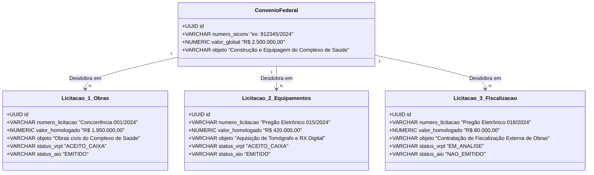
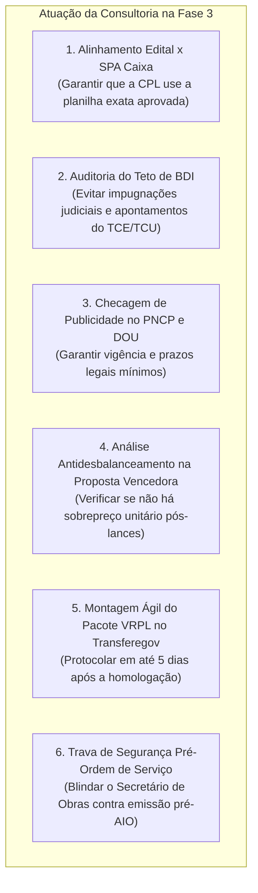

# Deep Research Especializado: Fase 3 — Licitações Municipais, VRPL e Autorização de Início de Objeto (AIO)

> **Roteamento de Engenharia (`/deep-research` & `/domain-modeling`):**  
> Este documento formaliza o estudo aprofundado sobre a **Fase 3 (Licitações Municipais, Análise de VRPL e Emissão de AIO)** dos convênios e contratos de repasse federais no Transferegov.br. Ele disseca a transição pós-superação da cláusula suspensiva, as regras da **Nova Lei de Licitações e Contratos (Lei nº 14.133/2021)**, as exigências da **Portaria Conjunta MGI/MF/CGU nº 33/2023** e **Decreto nº 11.531/2023**, a publicidade obrigatória no **PNCP**, a auditoria de preços e jogo de planilhas pela Mandatária (**Caixa Econômica Federal — GIGOV / MN AE099**), a relação $1:N$ entre convênio e licitações, a emissão da **AIO**, os papéis da consultoria e a modelagem de dados no **GovFlow**.

---

## 1. Visão Geral e Enquadramento Legal da Fase 3

A **Fase 3** representa a ponte entre o projeto de engenharia formalmente aprovado pelo Governo Federal na Fase 2 e a contratação do terceiro privado que executará fisicamente as obras ou fornecerá os bens.

```mermaid
flowchart TD
    subgraph Fase2Concluida [Pré-Requisito: Fase 2 Superada]
        SPA["Síntese do Projeto Aprovado (SPA)\n+ Laudo de Engenharia (LAE) da Caixa\n+ Retirada da Cláusula Suspensiva"]
    end

    subgraph RitoLicitatorio [Fase 3A: Certame Licitatório Municipal]
        SPA --> EDITAL["1. Elaboração do Edital Municipal\n• Orçamento Estimativo estritamente vinculado à SPA\n• BDI limitado ao teto do Acórdão TCU 2622/2013\n• Regras da Lei Federal nº 14.133/2021"]
        EDITAL --> PNCP["2. Publicidade Obrigatória (art. 54 Lei 14.133)\n• Portal Nacional de Contratações Públicas (PNCP)\n• Diário Oficial da União (DOU) / DOM / DOE\n• Condição Sine Qua Non de Eficácia"]
        PNCP --> SESSAO["3. Sessão Pública Eletrônica\n• Concorrência Eletrônica ou Pregão Eletrônico\n• Julgamento de Preços, Lances e Habilitação\n• Vedação a 'Jogo de Planilhas' (Desconto Linear)"]
        SESSAO --> HOMOLOGACAO["4. Adjudicação e Homologação pelo Prefeito"]
    end

    subgraph RitoTransferegov [Fase 3B: Controle Federal no Transferegov.br]
        HOMOLOGACAO --> VRPL_SUBMIT["5. Submissão do VRPL no Transferegov\n(Verificação do Resultado do Processo Licitatório)"]
        VRPL_SUBMIT --> CAIXA_VRPL["6. Auditoria de VRPL pela Caixa GIGOV\n• Confronto da Planilha Vencedora vs SPA Original\n• Aceite dos Preços Unitários e do Desconto\n• Reprogramação Orçamentária da Economia"]
        CAIXA_VRPL --> AIO["7. Emissão da AIO (Autorização de Início de Objeto)\n• Autorização formal para assinar Contrato e OS\n• Serviços antes da AIO são GLOSADOS sumariamente"]
        AIO --> F4["Liberado para Fase 4:\nAssinatura de Contrato e Execução Física"]
    end
```

### Principais Marcos Legais e Normativos:
1. **Lei nº 14.133/2021 (Nova Lei de Licitações e Contratos Administrativos):**
   * *Art. 28:* Modalidades de licitação (Pregão e Concorrência como modalidades mandatórias para compras e obras federais).
   * *Art. 54:* Publicidade obrigatória no **Portal Nacional de Contratações Públicas (PNCP)** como requisito de eficácia jurídica de todo edital e contrato administrativo.
   * *Art. 59, § 2º a § 4º:* Parâmetros de **exequibilidade de propostas** em obras de engenharia (critério do limite de 75% do valor orçado pela administração).
2. **Decreto Federal nº 11.531/2023 (arts. 19 a 25):**
   * Disciplina o regime de contratação nas transferências voluntárias da União.
   * Impõe a obrigatoriedade da realização de certames no formato eletrônico, salvo comprovada impossibilidade técnica.
3. **Portaria Conjunta MGI/MF/CGU nº 33/2023 (arts. 40 a 52):**
   * *Art. 41:* Regras de submissão do resultado licitatório no Transferegov.br.
   * *Art. 45:* Procedimentos de **VRPL** e fixação do valor homologado.
   * *Art. 48:* Tratamento da **economia de licitação** (redimensionamento proporcional de repasse e contrapartida).
   * *Art. 51:* Emissão obrigatória da **Autorização de Início de Objeto (AIO)** antes da ordem de serviço.
4. **Normativos Internos da Caixa Econômica Federal (MN AE099):**
   * Procedimentos técnicos de conferência de VRPL pelos engenheiros da GIGOV, análise de sobrepreço unitário na planilha contratada e regras de emissão da AIO.

---

## 2. A Relação 1:N entre Convênio e Licitações

Um dos maiores erros em sistemas legados é assumir que um convênio possui apenas uma licitação.  
Na gestão pública real de prefeituras, **um único convênio federal comporta rotineiramente múltiplas licitações independentes**:

* **Independência Operacional:** Cada licitação tramita em ritmo próprio, gera seu edital, possui sua data de abertura, seus lances, seu processo administrativo e, fundamentalmente, **seu próprio protocolo de VRPL e sua própria AIO** no Transferegov.br.

---

## 3. O Rito Procedimental da Fase 3 Passo a Passo

### Passo 1: Elaboração e Vinculação Estrita à SPA/SINAPI
O município não tem liberdade para licitar valor superior ou projeto divergente daquele chancelado pelo Ministério/Caixa na Fase 2:
* **Orçamento Estimativo:** Deve reproduzir exatamente as quantidades, itens de serviço e preços unitários da planilha aprovada na **Síntese do Projeto Aprovado (SPA)**.
* **Teto de BDI:** O edital deve fixar expressamente o limite máximo de BDI permitido para os proponentes, respeitando as faixas do **Acórdão TCU nº 2622/2013**.
* **Qualificação Técnica:** As exigências de atestados e capacidade técnico-operacional devem guardar rigorosa proporcionalidade com as parcelas de maior relevância e valor significativo da obra (art. 67 da Lei 14.133), vedando cláusulas que restrinjam a competitividade.

### Passo 2: Publicidade Obrigatória e Integração com o PNCP
* **Condição de Eficácia:** Nos termos do art. 54 da Lei nº 14.133/2021, **a publicidade no PNCP é obrigatória e condiciona a validade de todos os atos**.
* **Meios Complementares:** Publicação de aviso resumido no Diário Oficial da União (DOU) — exigência da Portaria nº 33/2023 por se tratar de verba federal —, no Diário Oficial do Município (DOM) e no portal eletrônico da prefeitura.
* **Prazos de Divulgação Mínimos:**
  * Obras civis comuns: no mínimo **10 a 15 dias úteis** entre o edital e a abertura.
  * Obras de engenharia de grande porte ou regime de contratação integrada: no mínimo **25 a 60 dias úteis**.

### Passo 3: Sessão Pública, Lances e Julgamento
* Realizada por meio de plataforma eletrônica oficial (ex: Compras.gov.br, Portal de Compras Públicas, BBMNet, BLL Compras).
* **Vedação a Jogo de Planilhas (Desconto Linear ou Justificado):**
  * Se a licitante vencedora concede um desconto global de 10%, a Caixa exige que os preços unitários de todos os itens sejam ajustados proporcionalmente, ou que não haja itens isolados com preços unitários superiores ao SINAPI referencial.
  * O Tribunal de Contas da União (TCU) proíbe a chamada "pedalada de custos", onde o licitante joga preços altos nas primeiras etapas (terraplenagem/fundação) e preços baixos nas etapas finais (acabamentos/paisagismo).

### Passo 4: Homologação Municipal e Submissão do VRPL no Transferegov
Concluído o julgamento e julgados os recursos, o Prefeito homologa o certame.  
A consultoria municipal acessa o Transferegov.br e abre o processo de **VRPL (Verificação do Resultado do Processo Licitatório)**:
* **Cadastramento dos Metadados:** Número da licitação, modalidade, data de publicação do edital, data de abertura, data de homologação, CNPJ/Razão Social da vencedora, valor estimado inicial e valor final homologado.
* **Upload das Peças Obrigatórias do Dossiê:**
  1. Cópia integral do Edital de Licitação com todos os anexos e projetos.
  2. Comprovantes de publicação do aviso no PNCP e no DOU.
  3. Ata da Sessão Pública com histórico de lances e julgamento de recursos.
  4. Proposta Final de Preços com a Planilha Orçamentária Contratada detalhada.
  5. Composição Analítica do BDI da contratada.
  6. Termo de Adjudicação e Homologação assinado pelo Prefeito.
  7. Parecer Jurídico Conclusivo emitido pela Procuradoria Municipal (art. 53 da Lei 14.133/2021).

### Passo 5: Auditoria de VRPL pela Mandatária (Caixa GIGOV)
A equipe de engenharia e operações da Caixa audita a conformidade do certame:
* **Confronto da Planilha:** O engenheiro da Caixa confronta linha por linha a planilha da empresa vencedora com a SPA original. Nenhum preço unitário pode ultrapassar o teto original do SINAPI.
* **Tratamento da Economia de Licitação (Desconto):**
  * Se a obra foi orçada na SPA em R$ 1.000.000,00 (Repasse: R$ 900.000, Contrapartida: R$ 100.000) e o certame foi homologado por R$ 900.000,00 (10% de economia):
  * **Regra Geral da Portaria nº 33/2023:** A economia é rateada proporcionalmente. O repasse cai para R$ 810.000,00 e a contrapartida cai para R$ 90.000,00.
  * **Exceção (Aditivo de Metas):** O município pode pleitear a retenção do saldo de economia para ampliar metas físicas da mesma obra (ex: asfaltar 2 ruas adjacentes a mais), desde que justifique tecnicamente antes da homologação final da Caixa.

### Passo 6: Emissão da AIO (Autorização de Início de Objeto)
Aprovado o VRPL, a Caixa emite formalmente o documento denominado **AIO (Autorização de Início de Objeto)**:

> [!CAUTION]
> **A REGRA DE OURO DA ENGENHARIA FEDERAL:**  
> A prefeitura está terminantemente proibida de emitir a Ordem de Serviço (OS) ou autorizar a empreiteira a colocar máquinas no canteiro de obras **antes da data de emissão da AIO pela Caixa Econômica Federal**.  
> Qualquer medição física executada antes da data da AIO é considerada **despesa inelegível**, gerando **glosa de 100% dos valores** pelo TCU e Concedente. A consultoria municipal deve ser intransigente nessa fiscalização.

---

## 4. O Papel da Consultoria de Gestão Municipal na Fase 3

Na Fase 3, a consultoria municipal atua como um escudo de conformidade licitatória:

1. **Blindagem do Edital:** Fornecer à Comissão de Contratação / Agente de Contratação a pasta técnica completa da SPA/LAE, impedindo que a prefeitura altere composições ou inclua itens sem lastro no SINAPI.
2. **Fiscalização dos Prazos do PNCP:** Assegurar que a contagem de dias úteis respeite rigorosamente o art. 55 da Lei 14.133, evitando anulações de certames pelo Tribunal de Contas do Estado (TCE).
3. **Auditoria da Proposta Vencedora:** Antes de o prefeito homologar, auditar se a planilha da empresa vencedora não possui itens com valores acima da tabela referencial.
4. **Agilidade no VRPL:** A Caixa costuma demorar de 15 a 45 dias para analisar o VRPL. Quanto mais rápido a consultoria protocolar o processo completo no Transferegov, mais rápido a obra começa.
5. **Vigilância da AIO:** Notificar formalmente o Secretário de Obras, Prefeito e Fiscal do Contrato sobre a proibição legal de emissão de Ordem de Serviço antes da AIO.

---

## 5. Dicionário de Dados e Atributos da Fase 3 no GovFlow

A tabela dedicada `core_schema.tb_licitacoes` (criada na migration Flyway V4) e `core_schema.tb_contratos_execucao` modelam com máxima fidelidade os eventos da Fase 3:

| Entidade / Tabela | Atributo de Domínio | Tipo de Dado | Regra de Negócio / Descrição |
| :--- | :--- | :---: | :--- |
| `tb_licitacoes` | `convenio_id` | `UUID (FK)` | Vinculação com o Convênio Federal (relação 1:N) |
| `tb_licitacoes` | `numero_licitacao` | `VARCHAR(50)` | Identificador do certame (ex: `Concorrência nº 002/2024`) |
| `tb_licitacoes` | `modalidade` | `VARCHAR(50)` | `CONCORRENCIA_ELETRONICA`, `PREGAO_ELETRONICO`, `DISPENSA_14133` |
| `tb_licitacoes` | `criterio_julgamento` | `VARCHAR(50)` | `MENOR_PRECO`, `MAIOR_DESCONTO` |
| `tb_licitacoes` | `regime_execucao` | `VARCHAR(50)` | `EMPREITADA_PRECO_UNITARIO`, `EMPREITADA_PRECO_GLOBAL` |
| `tb_licitacoes` | `valor_estimado` | `NUMERIC(15,2)`| Valor de referência fixado na SPA aprovada na Caixa |
| `tb_licitacoes` | `valor_homologado` | `NUMERIC(15,2)`| Valor final vencedor do certame após a disputa |
| `tb_licitacoes` | `percentual_desconto` | `NUMERIC(5,2)` | Economia percentual obtida em relação à estimativa inicial |
| `tb_licitacoes` | `situacao` | `VARCHAR(50)` | `PLANEJAMENTO`, `EDITAL_PUBLICADO`, `EM_DISPUTA`, `HOMOLOGADA`, `REVOGADA_ANULADA` |
| `tb_licitacoes` | `link_pncp` | `VARCHAR(500)` | Link oficial do certame no Portal Nacional de Contratações Públicas |
| `tb_licitacoes` | `link_transferegov` | `VARCHAR(500)` | URL da aba de licitações dentro do Transferegov.br |
| `tb_licitacoes` | `numero_vrpl_transferegov`| `VARCHAR(50)` | Número do protocolo de envio do VRPL no Transferegov |
| `tb_licitacoes` | `data_envio_vrpl` | `DATE` | Data em que a consultoria submeteu a documentação |
| `tb_licitacoes` | `status_vrpl` | `VARCHAR(30)` | `NAO_ENVIADO`, `EM_ANALISE_CAIXA`, `DILIGENCIA_EMITIDA`, `ACEITO_CAIXA`, `REJEITADO` |
| `tb_licitacoes` | `data_aceite_vrpl` | `DATE` | Data formal em que a GIGOV aprovou o resultado |
| `tb_licitacoes` | `numero_aio` | `VARCHAR(50)` | Número da Autorização de Início de Objeto expedida pela Caixa |
| `tb_licitacoes` | `data_emissao_aio` | `DATE` | **Marco legal intransponível** para emissão de Ordens de Serviço |
| `tb_licitacoes` | `status_aio` | `VARCHAR(30)` | `NAO_EMITIDO`, `SOLICITADO`, `EMITIDO` |
| `tb_licitacoes` | `s3_key_edital` | `VARCHAR(500)` | Edital completo e anexos em PDF no MinIO |
| `tb_licitacoes` | `s3_key_termo_homologacao`| `VARCHAR(500)`| Termo de Adjudicação/Homologação assinado |
| `tb_licitacoes` | `s3_key_parecer_vrpl` | `VARCHAR(500)` | Parecer técnico conclusivo de VRPL da Caixa |
| `tb_licitacoes` | `s3_key_autorizacao_aio` | `VARCHAR(500)` | Cópia do documento oficial da AIO emitida pela Caixa |

---

## 6. Checklist Documental da Fase 3 (O Dossiê do VRPL)

Para que o VRPL seja aprovado pela Caixa sem diligências, a consultoria deve compor o seguinte arquivo digital:

```mermaid
graph LR
    subgraph DossieVRPL [Dossiê Oficial de VRPL e AIO]
        D1["1. Edital de Licitação + Projetos + SPA (.PDF)"]
        D2["2. Comprovantes de Publicação PNCP + DOU + DOM (.PDF)"]
        D3["3. Ata de Realização da Sessão Pública com Lances (.PDF)"]
        D4["4. Proposta Vencedora com Planilha de Preços Contratada (.XLSX + .PDF)"]
        D5["5. Composição de BDI da Empresa Vencedora (.PDF)"]
        D6["6. Termo de Homologação e Adjudicação (.PDF)"]
        D7["7. Parecer Jurídico da Procuradoria Municipal (.PDF)"]
        D8["8. Parecer de Aceite de VRPL da Caixa GIGOV (.PDF)"]
        D9["9. Autorização de Início de Objeto - AIO (.PDF)"]
    end
```

---

## 7. Principais Riscos Operacionais e Armadilhas na Fase 3

1. **Emissão de Ordem de Serviço Antes da AIO:**
   * O prefeito tem urgência política e manda iniciar a obra no dia da assinatura do contrato municipal, antes da Caixa emitir a AIO.
   * **Consequência:** A Caixa glosa integralmente a primeira medição. O município é obrigado a pagar a empreiteira com recursos próprios do tesouro municipal, sem direito a ressarcimento federal.
2. **Falta de Publicidade no PNCP:**
   * A prefeitura publica o edital no diário oficial local, mas esquece de alimentar a API do Portal Nacional de Contratações Públicas.
   * **Consequência:** Violação frontal do art. 54 da Lei nº 14.133/2021. A Caixa rejeita o VRPL e exige a anulação do certame ou republicação integral do edital, perdendo de 30 a 60 dias.
3. **Jogo de Planilhas / Sobrepreço em Itens Unitários:**
   * O licitante oferece 15% de desconto global, mas aumenta o preço unitário do concreto e do asfalto acima da planilha SINAPI da SPA.
   * **Consequência:** A Caixa bloqueia o VRPL, emitindo laudo de inconformidade por sobrepreço localizado.
4. **Descompasso entre Licitação e Contrato Administrativo:**
   * A empreiteira vence por R$ 950.000,00, mas o contrato municipal é assinado por R$ 1.000.000,00 com base no valor inicial da estimativa.
   * **Consequência:** Crime de responsabilidade e glosa imediata no Transferegov.
5. **Não Redimensionamento da Contrapartida:**
   * Havendo desconto no certame, o município não reprograma o plano de trabalho no Transferegov para ajustar proporcionalmente o valor de repasse e contrapartida.
   * **Consequência:** Trava sistêmica na liberação das parcelas financeiras pela Caixa.

---

## 8. Como o GovFlow Automatiza e Blinda a Fase 3

1. **Assistente de Conformidade Edital x SPA:**
   * O GovFlow confere automaticamente se a planilha do edital possui os mesmos itens, quantidades e preços máximos unitários da SPA aprovada na Fase 2.
2. **Crawler e Validador de Publicidade no PNCP:**
   * O sistema monitora a API do PNCP e confirma se o edital está publicado e ativo, registrando a data e o link oficial de transparência.
3. **Detector Antijogo de Planilhas no VRPL:**
   * Ao carregar a proposta da empresa vencedora, a IA do GovFlow compara cada item unitário contra a tabela SINAPI/SICRO da SPA, alertando imediatamente em vermelho se algum item unitário sofrer majoração.
4. **Sentinela da AIO (Trava de Ordem de Serviço):**
   * O GovFlow bloqueia a criação de contratos municipais com status `EM_EXECUCAO` ou o registro de ordens de serviço enquanto o status da AIO em `tb_licitacoes` for diferente de `EMITIDO`.
   * Envio automático de alerta de advertência no WhatsApp do Secretário de Obras: *"Atenção: A licitação nº X obteve VRPL aceito, mas a AIO da Caixa ainda não foi emitida. É vedada a emissão de Ordem de Serviço."*
5. **Geração Automática do Pacote de VRPL:**
   * O GovFlow compacta automaticamente os 7 documentos obrigatórios do certame em um único dossiê indexado pronto para upload no Transferegov.
