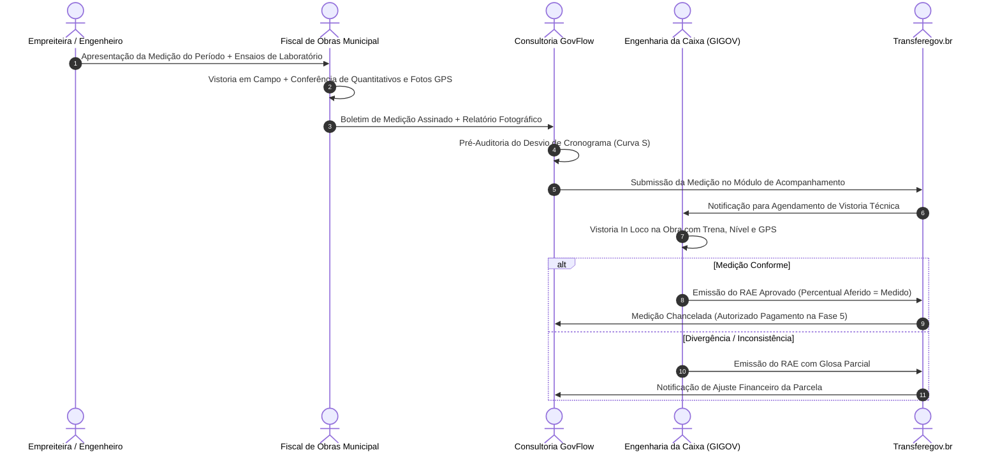
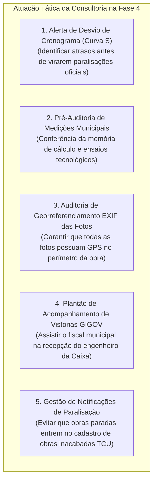
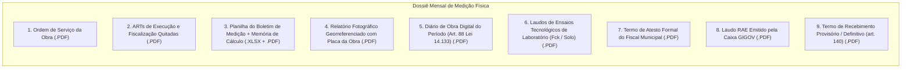

# Deep Research Especializado: Fase 4 — Execução Física da Obra, Boletins de Medição e Aferição RAE da Caixa GIGOV

> **Roteamento de Engenharia (`/deep-research` & `/domain-modeling`):**  
> Este documento formaliza o estudo aprofundado sobre a **Fase 4 (Execução Física da Obra, Gestão de Medições e Fiscalização de Engenharia)** dos convênios e contratos de repasse federais no Transferegov.br. Ele disseca a emissão da Ordem de Serviço, a obrigatoriedade do **Diário de Obras Digital** (art. 88 da Lei nº 14.133/2021), a confecção de **Boletins de Medição (BM)** com fotos georreferenciadas (GPS/EXIF), as ARTs de execução e fiscalização, o rito de vistoria *in loco* e emissão do **RAE (Relatório de Acompanhamento de Engenharia)** pela Mandatária (**Caixa Econômica Federal — GIGOV / MN AE099**), a entrega provisória e definitiva da obra (art. 140 da Lei 14.133/2021) e a modelagem de dados no **GovFlow**.

---

## 1. Visão Geral e Enquadramento Legal da Fase 4

A **Fase 4** é a materialização fática do convênio no canteiro de obras. É nesta etapa que os projetos aprovados na Fase 2 e licitados na Fase 3 se transformam em edificações, pavimentação asfáltica, postos de saúde ou sistemas de abastecimento de água.

```mermaid
flowchart TD
    subgraph Fase3Concluida [Pré-Requisito: Fase 3 Concluída]
        AIO["AIO Emitida pela Caixa GIGOV\n+ Contrato Municipal Assinado"]
    end

    subgraph InicioObra [Mobilização e Canteiro]
        AIO --> OS["1. Emissão da Ordem de Serviço (OS)\n(Marco inicial formal do prazo de execução)"]
        OS --> ARTS["2. Emissão e Registro de ARTs/RRTs\n• ART de Execução (Empreiteira Contratada)\n• ART de Fiscalização (Engenheiro da Prefeitura)"]
        ARTS --> DIARIO["3. Abertura do Diário de Obras Digital\n(Obrigatoriedade diária: clima, efetivo, máquinas e fotos)"]
    end

    subgraph CicloMensalMedicao [Ciclo Mensal de Medição e Atesto]
        DIARIO --> LEVANTAMENTO["4. Levantamento Físico em Campo\n• Memória de cálculo de quantidades executadas\n• Ensaios de laboratório (Corpos de prova Fck / Proctor)"]
        LEVANTAMENTO --> FOTOS_GPS["5. Registro Fotográfico Georreferenciado\n• Coordenadas GPS (Latitude/Longitude) + Timestamp\n• Mesmos ângulos panorâmicos + Placa do Convênio"]
        FOTOS_GPS --> BM_MUNICIPAL["6. Confecção e Atesto do Boletim de Medição (BM)\n(Assinado com CREA/CAU do Fiscal Municipal)"]
        BM_MUNICIPAL --> TG_SUBMIT["7. Submissão no Transferegov.br\n(Upload da Planilha, Fotos e Diário)"]
    end

    subgraph AuditoriaCaixa [Aferição Federal e Liberação Financeira]
        TG_SUBMIT --> VISTORIA_GIGOV["8. Vistoria Técnica In Loco da Caixa GIGOV\n(Engenheiro fiscal federal audita a obra in loco)"]
        VISTORIA_GIGOV --> RAE["9. Emissão do Laudo RAE da Caixa\n(Relatório de Acompanhamento de Engenharia)"]
        
        RAE --> DIVERGENCIA{"Percentual Caixa =\nPercentual Município?"}
        DIVERGENCIA -- Sim --> LIBERA["10. Chancelamento da Medição\n(Liberado para Fase 5: Pagamento OBTV)"]
        DIVERGENCIA -- Não / Glosa --> GLOSA["Glosa Física Provisória da Diferença\n(Pagamento liberado apenas sobre o percentual aceito no RAE)"]
        GLOSA --> LIBERA
    end
```

### Principais Marcos Legais e Normativos:
1. **Lei nº 14.133/2021 (Nova Lei de Licitações e Contratos Administrativos):**
   * *Art. 88:* Obrigatoriedade de registro das ocorrências da obra em **Diário de Obra** (ordem de serviço, condições meteorológicas, acidentes, faltas, modificações e anotações do fiscal).
   * *Art. 117:* Fiscalização obrigatória do contrato por servidor público formalmente designado com conhecimento técnico e suporte de equipe de fiscalização.
   * *Art. 140:* Rito de recebimento do objeto:
     * *Inciso I, alínea 'a':* **Recebimento Provisório** pelo fiscal em até 15 dias da comunicação escrita da contratada.
     * *Inciso I, alínea 'b':* **Recebimento Definitivo** por comissão ou servidor designado em até 90 dias, mediante termo circunstanciado.
2. **Decreto Federal nº 11.531/2023 (arts. 26 a 33):**
   * Disciplina o monitoramento físico, a vinculação aos cronogramas pactuados e a retenção de pagamentos em caso de paralisação injustificada.
3. **Portaria Conjunta MGI/MF/CGU nº 33/2023 (arts. 53 a 62):**
   * Estabelece as regras para aferição física de etapas cumpridas, critérios de medição e comprovação documental por meio de relatórios fotográficos.
   * *Art. 56:* Veda terminantemente pagamentos por serviços não executados ou antecipação de parcelas financeiras.
4. **Normativo Interno da Caixa Econômica Federal — MN AE099:**
   * Disciplina as vistorias *in loco*, a emissão do **RAE (Relatório de Acompanhamento de Engenharia)**, a apuração do percentual físico acumulado e as regras para glosas técnicas.
5. **Resoluções CONFEA nº 1.025/2009 e nº 1.094/2017:**
   * Estabelecem as regras para a emissão da Anotação de Responsabilidade Técnica (ART) e a obrigatoriedade do Livro de Ordem (Diário de Obras).

---

## 2. O Rito Mensal de Medição e Aferição Física Passo a Passo

O fluxo de execução física opera em ciclos mensais contínuos até a conclusão total da obra:

### Passo 1: Ordem de Serviço (OS) e ARTs Vinculantes
* **Ordem de Serviço:** Emitida pela Prefeitura após a AIO da Caixa. Fixa o prazo de início e a data de término contratual da obra.
* **ART de Execução:** Anotada pelo responsável técnico da construtora, contendo o valor contratado, o endereço exato da obra e a descrição das metas.
* **ART de Fiscalização:** Anotada pelo engenheiro efetivo da prefeitura municipal ou por empresa de fiscalização externa contratada. A ausência de fiscal formalmente designado é infração grave apontada pelo TCU.

### Passo 2: O Diário de Obras Digital
Conforme o art. 88 da Lei nº 14.133/2021, o Diário de Obra é um documento probatório legal obrigatório:
* Registros diários ininterruptos:
  1. Condições meteorológicas: *Sol*, *Chuva Fraca*, *Chuva Forte (impeditiva)*.
  2. Efetivo de pessoal no canteiro: quantitativo discriminado de engenheiros, mestres, pedreiros, serventes e eletricistas.
  3. Equipamentos operacionais: retroescavadeiras, betoneiras, caminhões-caçamba, rolos compactadores.
  4. Serviços executados por frente de trabalho.
  5. Acidentes de trabalho, paralisações e justificativas técnicas.
  6. Anotações e determinações expedidas pelo fiscal de obras municipal.

### Passo 3: Fechamento do Boletim de Medição (BM)
* **Apuração Física:** Medição geométrica das quantidades reais produzidas no mês (metros cúbicos de concreto, metros quadrados de alvenaria, toneladas de massa asfáltica).
* **Memória de Cálculo Detalhada:** A planilha de medição não pode conter apenas números fechados; deve apresentar a memória de cálculo das dimensões (comprimento $\times$ largura $\times$ altura) e as fórmulas matemáticas adotadas.
* **Ensaios Tecnológicos Obrigatórios:**
  * Obras de concreto armado: laudos de ruptura de corpos de prova aos 7, 14 e 28 dias (**Fck**).
  * Obras de pavimentação: ensaios de compactação de solo (ensaio Proctor Normal/Intermediário), grau de compactação da base e sub-base, e ensaios de teor de betume (ligante asfáltico).

### Passo 4: O Relatório Fotográfico Georreferenciado
A Caixa Econômica Federal e a Controladoria-Geral da União (CGU) possuem protocolos rígidos para validação fotográfica:
* **Metadados EXIF Invioláveis:** Cada fotografia deve conter em seus dados EXIF originais a **Latitude**, **Longitude** (coordenadas GPS) e o carimbo de data/hora (**Timestamp**).
* **Ângulos Panorâmicos Repetíveis:** As fotos de cada medição devem reproduzir exatamente os mesmos pontos de vista das medições anteriores, evidenciando a evolução temporal (ex: foto 1: fundação vazia; foto 2: pilares erguidos; foto 3: laje concretada).
* **Placa de Identificação Obrigatória da Obra:** Em todas as medições deve constar foto nítida da placa da obra contendo os logotipos oficiais do Governo Federal, Ministério Concedente, Caixa, Prefeitura, valor do repasse, valor da contrapartida e número do convênio Transferegov.

### Passo 5: Vistoria In Loco e Emissão do RAE pela Caixa GIGOV
* O engenheiro civil ou arquiteto da Caixa realiza vistoria técnica presencial.
* **Confronto Físico:** O fiscal da Caixa mede fisicamente o que foi executado e compara com a planilha do BM municipal.
* **Emissão do RAE (Relatório de Acompanhamento de Engenharia):**
  * O engenheiro da Caixa crava o **Percentual Físico Aferido pela Mandatária** acumulado.
  * Se o município mediu 25% e a Caixa constatou que faltam testes de carga na laje, a Caixa pode aferir apenas 20%.
  * **Consequência Financeira:** O sistema Transferegov bloqueia o pagamento sobre a diferença de 5% (glosa provisória), autorizando na Fase 5 o débito da OBTV estritamente sobre os 20% chancelados no RAE.

### Passo 6: Recebimento Provisório e Definitivo (art. 140 da Lei 14.133/2021)
Ao término integral dos serviços:
1. **Termo de Recebimento Provisório:** Lavrado pelo Fiscal de Obras em até 15 dias após a construtora comunicar a conclusão dos trabalhos.
2. **Termo de Recebimento Definitivo da Obra:** Lavrado por comissão técnica ou servidor designado após período de testes de até 90 dias, atestando a solidez, segurança e pleno funcionamento da edificação ou via pública. Este termo é documento indispensável para a Prestação de Contas Final (Fase 7).

---

## 3. O Papel da Consultoria de Gestão Municipal na Fase 4

Na Fase 4, a consultoria atua como **controladora de cronograma e conformidade técnica**:

1. **Monitoramento da Curva S (Previsto vs. Realizado):** Confrontar mensalmente o avanço físico contra o cronograma aprovado na SPA. Se a defasagem for superior a 20%, emitir alerta vermelho para a prefeitura notificar a empreiteira a aumentar o efetivo.
2. **Padronização das Medições no Padrão Caixa:** Orientar os engenheiros municipais a formatarem o boletim de medição exatamente nos padrões exigidos pela GIGOV, eliminando devoluções por falhas de preenchimento.
3. **Validação Prévia do Relatório Fotográfico:** Analisar os arquivos de foto antes do upload no Transferegov, rejeitando fotos desfocadas, sem placa da obra ou com GPS discrepante.
4. **Agendamento Ágil da Vistoria da Caixa:** Monitorar o prazo regulamentar para a Caixa designar o engenheiro vistoriador, evitando que a medição fique parada mais de 30 dias aguardando laudo RAE.

---

## 4. Dicionário de Dados e Atributos da Fase 4 no GovFlow

A modelagem de dados do GovFlow estrutura a Fase 4 através de duas entidades centrais: `core_schema.tb_metas_plano_trabalho` e `core_schema.tb_medicoes`:

### 4.1 Entidade `tb_metas_plano_trabalho` (Decomposição Física)
| Atributo | Tipo de Dado | Regra de Negócio / Descrição |
| :--- | :---: | :--- |
| `id` | `UUID (PK)` | Identificador da meta |
| `convenio_id` | `UUID (FK)` | Vinculação com o Convênio Federal |
| `numero_meta` | `INTEGER` | Sequencial da meta (ex: Meta 1, Meta 2) |
| `titulo_meta` | `VARCHAR(150)` | Nome da meta (ex: *Edificação do Bloco A*, *Pavimentação em CBUQ*) |
| `descricao` | `TEXT` | Descrição minuciosa dos serviços compreendidos |
| `valor_previsto` | `NUMERIC(15,2)` | Montante financeiro alocado na SPA para esta meta |
| `valor_executado_acumulado` | `NUMERIC(15,2)` | Soma dos valores chancelados nos RAEs anteriores |
| `percentual_fisico_concluido`| `NUMERIC(5,2)` | Percentual acumulado concluído desta meta |

### 4.2 Entidade `tb_medicoes` (Boletins de Medição e RAEs)
| Atributo | Tipo de Dado | Regra de Negócio / Descrição |
| :--- | :---: | :--- |
| `id` | `UUID (PK)` | Identificador único da medição |
| `contrato_id` | `UUID (FK)` | Contrato administrativo de execução medido |
| `convenio_id` | `UUID (FK)` | Convênio federal financiador |
| `numero_medicao` | `INTEGER` | Sequencial da medição (1ª Medição, 2ª Medição, etc.) |
| `data_inicio_periodo` | `DATE` | Marco inicial do período medido |
| `data_fim_periodo` | `DATE` | Marco final do período medido |
| `valor_medicao` | `NUMERIC(15,2)` | Valor monetário bruto apurado na medição municipal |
| `percentual_fisico_medicao` | `NUMERIC(5,2)` | Percentual físico acumulado apurado pelo Município |
| `situacao` | `VARCHAR(40)` | `EM_ELABORACAO`, `ENVIADA_CAIXA`, `EM_VISTORIA`, `APROVADA_RAE`, `GLOSADA` |
| `nome_fiscal_prefeitura` | `VARCHAR(150)` | Engenheiro civil da prefeitura que atestou o BM |
| `registro_crea_cau_fiscal` | `VARCHAR(30)` | Número de registro profissional do fiscal municipal |
| `numero_art_fiscalizacao` | `VARCHAR(50)` | Número da ART de fiscalização registrada no CREA/CAU |
| `numero_rae_caixa` | `VARCHAR(50)` | Número do Relatório de Acompanhamento de Engenharia da Caixa |
| `data_afericao_caixa` | `DATE` | Data em que a Caixa realizou a vistoria *in loco* |
| `percentual_aferido_caixa` | `NUMERIC(5,2)` | Percentual físico chancelado pelo engenheiro da Caixa no RAE |
| `valor_aferido_caixa` | `NUMERIC(15,2)` | Valor monetário chancelado e liberado para pagamento |
| `valor_glosado_caixa` | `NUMERIC(15,2)` | Valor retido preventivamente pela Caixa por inconformidade física |
| `s3_key_planilha_medicao` | `VARCHAR(500)` | Arquivo PDF e XLSX da memória de cálculo e planilha de medição |
| `s3_key_relatorio_fotografico`| `VARCHAR(500)` | PDF do relatório fotográfico com coordenadas GPS e timestamp |
| `s3_key_diario_obras` | `VARCHAR(500)` | Cópia digitalizada do Livro de Ordem / Diário de Obra do mês |
| `s3_key_laudo_rae` | `VARCHAR(500)` | Cópia do laudo oficial RAE emitido pela Caixa GIGOV |

---

## 5. Checklist Documental da Fase 4 (O Dossiê da Medição)

A cada ciclo mensal de medição, a consultoria deve compilar e arquivar o seguinte dossiê:

---

## 6. Principais Riscos Operacionais e Armadilhas na Fase 4

1. **Fotografias sem Metadados de GPS ou Fora do Polígono da Obra:**
   * A construtora anexa fotos baixadas de aplicativos de mensagens (como WhatsApp), que removem os metadados EXIF de latitude/longitude e data.
   * **Consequência:** A Caixa recusa o relatório fotográfico e suspende a vistoria até a apresentação das fotos originais não compactadas.
2. **Falta de Ensaios Tecnológicos de Concreto/Solo:**
   * Concretagem de lajes ou pavimentação asfáltica executada sem laudo de ruptura de corpos de prova (Fck) ou grau de compactação.
   * **Consequência:** O fiscal da Caixa não pode atestar a solidez estrutural e emite **glosa total da etapa** até a realização de ensaios destrutivos (extração de testemunhos).
3. **Ausência do Diário de Obras:**
   * Não preenchimento do Diário de Obras dia a dia.
   * **Consequência:** O TCU e a Caixa consideram a execução em desacordo com o art. 88 da Lei nº 14.133/2021, aplicando multas contratuais à contratada e abrindo sindicância contra o fiscal da prefeitura.
4. **Descompasso Grave de Cronograma (Risco de Paralisação):**
   * Obra com previsão de 50% atingindo apenas 15% após 4 meses.
   * **Consequência:** O Transferegov sinaliza o convênio como **"Em Risco de Descumprimento de Objeto"**, bloqueando repasses futuros e exigindo reprogramação formal do cronograma físico-financeiro.
5. **Atesto Falso / Medição Antecipada:**
   * Fiscal municipal atesta medição de 30% contendo serviços que ainda estão em fase de execução para acelerar pagamento da construtora.
   * **Consequência:** Na vistoria da Caixa, a fraude é constatada. A Caixa glosa o valor, o fiscal responde por crime de falsidade ideológica e o convênio pode ser cancelado sumariamente com tomada de contas especial (Fase 9).

---

## 7. Como o GovFlow Automatiza e Blinda a Fase 4

1. **Auditor Automático de Metadados EXIF/GPS:**
   * Ao fazer o upload das fotos da medição, o GovFlow lê instantaneamente os metadados EXIF, extrai as coordenadas geográficas e plota as fotos no mapa satélite do canteiro de obras cadastrado na SPA.
   * Se a foto estiver a mais de 200 metros do canteiro ou não tiver carimbo de data/hora, o sistema emite alerta de inconformidade imediatamente.
2. **Motor de Curva S e Alerta de Atraso Crítico:**
   * O sistema plota graficamente a evolução física acumulada contra o cronograma aprovado pela Caixa.
   * Semáforo de Risco: Verde (desvio < 5%), Amarelo (desvio de 5% a 20%), Vermelho (desvio > 20% com recomendação automática de notificação da contratada).
3. **Diário de Obras Assistido por IA:**
   * O engenheiro ou mestre de obras pode enviar notas rápidas e áudios no WhatsApp do GovFlow narrando as ocorrências do dia (chuva, efetivo, maquinário).
   * A IA formata o texto e gera automaticamente o espelho do Diário de Obras conforme a Resolução CONFEA nº 1.094/2017 e art. 88 da Lei nº 14.133/2021, pronto para assinatura digital.
4. **Calculadora Antiglosa de Medição:**
   * Ao cadastrar o BM, o sistema valida a memória de cálculo e checa se os percentuais medidos não ultrapassam os quantitativos totais previstos na planilha orçamentária contratada.
5. **Gatilho Automático para a Fase 5 (Execução Financeira):**
   * Assim que a Caixa anexa o RAE aprovado, o GovFlow notifica a Secretaria de Finanças e o setor contábil municipal com o valor exato liberado para emissão do Documento Hábil (NF-e) e comandos de pagamento (OBTV) na Fase 5.
