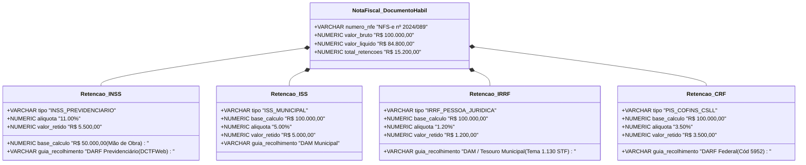
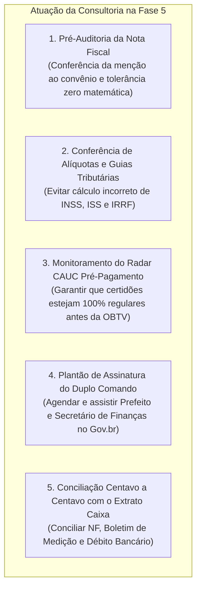
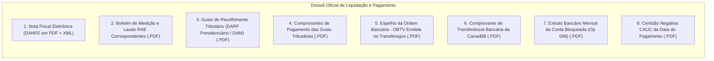

# Deep Research Especializado: Fase 5 — Execução Financeira, Documentos Hábeis, Retenções Tributárias e OBTV

> **Roteamento de Engenharia (`/deep-research` & `/domain-modeling`):**  
> Este documento formaliza o estudo aprofundado sobre a **Fase 5 (Execução Financeira, Liquidação da Despesa, Faturamento Fiscal e Pagamentos por OBTV)** dos convênios e contratos de repasse federais no Transferegov.br. Ele disseca as regras da **Lei nº 4.320/1964** (estágios de liquidação e pagamento), as exigências de documentos hábeis da **Portaria Conjunta MGI/MF/CGU nº 33/2023**, a retenção tributária compulsória na fonte (**INSS, ISS e IRRF / Tema 1.130 do STF**), o funcionamento da **Ordem Bancária de Transferências Voluntárias (OBTV)** com assinatura digital conjunta (duplo comando), a gestão de saldos na conta bloqueada e a modelagem de dados no **GovFlow**.

---

## 1. Visão Geral e Enquadramento Legal da Fase 5

A **Fase 5** representa o momento em que a execução física da obra atestada na Fase 4 (Laudo RAE da Caixa GIGOV) é convertida em **liquidação orçamentária e efetivo desembolso financeiro** a favor da empreiteira contratada e dos órgãos arrecadadores de tributos.

```mermaid
flowchart TD
    subgraph Fase4Concluida [Pré-Requisito: Fase 4 Concluída]
        RAE["Medição Atestada pelo Fiscal Municipal\n+ Laudo RAE Aferido pela Caixa GIGOV\n(Percentual e Valor Monetário Aprovados)"]
    end

    subgraph FaturamentoLiquida [1. Faturamento Fiscal & Liquidação]
        RAE --> NFE["Emissão do Documento Hábil (NF-e / NFS-e)\n• Vinculação expressa ao Convênio e Contrato\n• Valor Bruto idêntico ao Valor Aferido no RAE"]
        NFE --> RETENCOES["Apuração das Retenções Tributárias na Fonte\n• INSS Previdenciário (11% ou 3,5%)\n• ISS Municipal (2% a 5%)\n• IRRF Municipal (Tema 1.130 STF)"]
        RETENCOES --> VALIDA_ZERO["Validação Matemática de Tolerância Zero:\nValor Bruto = Valor Líquido + Retenções"]
    end

    subgraph RitoOBTV [2. Operacionalização da OBTV no Transferegov]
        VALIDA_ZERO --> COMANDOS_OBTV["Geração das Ordens de Pagamento Eletrônicas\n1. OBTV Fornecedor (Valor Líquido na Conta do Credor)\n2. OBTV Tributos (DARF / INSS da Receita Federal)\n3. OBTV Tributos (DAM / ISS do Município)"]
        COMANDOS_OBTV --> DUPLO_COMANDO["Assinatura Digital Conjunta (Duplo Comando Gov.br)\n• 1º Assinante: Prefeito Municipal (Ordenador)\n• 2º Assinante: Secretário de Finanças / Tesoureiro"]
    end

    subgraph LiquidacaoBancaria [3. Débito na Conta Bloqueada e Quitação]
        DUPLO_COMANDO --> TRANSMISSAO["Transmissão Eletrônica ao Banco Custodiante\n(Caixa Econômica Federal ou Banco do Brasil)"]
        TRANSMISSAO --> DEBITO_006["Débito na Conta Vinculada Exclusiva (Op 006)\n• Pagamento eletrônico direto da fatura líquida\n• Quitação das guias tributárias via código de barras"]
        DEBITO_006 --> CONCILIACAO["Conciliação Bancária Centavo a Centavo\n(Atualização de Repasse, Contrapartida e Rendimentos)"]
        CONCILIACAO --> PROXIMA_MEDICAO["Ciclo Encerrado! Apto para Próxima Medição ou Fase 6/7"]
    end
```

### Principais Marcos Legais e Normativos:
1. **Lei Federal nº 4.320/1964 (arts. 58 a 65):**
   * *Art. 62:* O pagamento da despesa só será efetuado quando ordenada após sua regular liquidação.
   * *Art. 63:* A liquidação consiste na verificação do direito adquirido pelo credor tendo por base os títulos comprobatórios da prestação do serviço ou entrega do bem.
   * *Art. 64:* A ordem de pagamento é o despacho exarado pela autoridade competente, determinando que a despesa liquidada seja paga.
2. **Decreto Federal nº 11.531/2023 (arts. 28, 30 e 31):**
   * Disciplina o regime financeiro das contas bancárias específicas.
   * Impõe a obrigatoriedade da realização de todos os pagamentos exclusivamente por via eletrônica na plataforma Transferegov.br.
   * Veda expressamente saques em espécie, transferências bancárias avulsas (TED/DOC/Pix) por canais bancários convencionais ou emissão de cheques.
3. **Portaria Conjunta MGI/MF/CGU nº 33/2023 (arts. 63 a 80):**
   * *Art. 64:* Vedação terminantemente a pagamentos antecipados.
   * *Art. 65 a 68:* Regras de identificação dos **Documentos Hábeis** (deve conter número do instrumento e dados das partes).
   * *Art. 70 a 74:* Operacionalização da **OBTV (Ordem Bancária de Transferências Voluntárias)**:
     * Destinação exclusiva ao credor final contratado (vedado pagamento a intermediários).
     * Retenção e recolhimento de tributos na própria fonte mediante código de barras.
   * *Art. 75:* Aplicação financeira compulsória dos saldos e retenção dos rendimentos para posterior devolução via GRU.
4. **Legislação Tributária e Previdenciária Vinculante:**
   * **INSS (Lei nº 8.212/1991, art. 31):** Retenção de 11% (ou 3,5% para empresas optantes pela desoneração da folha - Lei nº 12.546/2011) sobre o valor bruto da mão de obra na construção civil, recolhido em guia DARF Previdenciário gerada via DCTFWeb.
   * **ISS (Lei Complementar nº 116/2003):** Retenção do Imposto Sobre Serviços de Qualquer Natureza pelo tomador municipal, aplicando-se a alíquota da legislação municipal competente (de 2% a 5%).
   * **IRRF (Tema 1.130 de Repercussão Geral do STF e IN RFB nº 1.234/2012):** O Supremo Tribunal Federal fixou tese vinculante de que o produto da arrecadação do Imposto de Renda Retido na Fonte incidente sobre pagamentos efetuados pelos Municípios a pessoas jurídicas contratadas pertence **ao próprio Município convenente**.

---

## 2. O Rito Procedimental da Execução Financeira Passo a Passo

### Passo 1: Atesto e Vinculação ao Laudo RAE da Caixa
* O processo financeiro tem início no exato momento em que o engenheiro fiscal da Caixa GIGOV emite o **RAE (Relatório de Acompanhamento de Engenharia)** na Fase 4.
* **Teto Insuperável:** O valor bruto faturável da despesa está estritamente limitado ao **Valor Físico Aferido pela Caixa** no laudo RAE. Se a empreiteira emitir nota fiscal por valor superior, o Transferegov recusa o documento e a prefeitura é impedida de liquidar.

### Passo 2: Emissão e Conferência do Documento Hábil (Nota Fiscal)
A construtora emite a Nota Fiscal Eletrônica de Serviços (NFS-e) ou de Mercadorias (NF-e):
* **Menção Obrigatória no Corpo da Nota Fiscal (art. 67 da Portaria nº 33/2023):**
  * Número do Convênio Federal ou Contrato de Repasse (ex: *Convênio Transferegov nº 912345/2024*).
  * Número do Contrato Municipal de Execução (ex: *Contrato nº 042/2024*).
  * Número da Medição a que se refere (ex: *Referente à 3ª Medição de Obras*).
  * Descrição clara e concisa do objeto em conformidade com o plano de trabalho.
* **Validação Matemática de Tolerância Zero:**
  $$\text{Valor Bruto da NF} = \text{Valor Líquido da Fatura} + \sum \text{Retenções Tributárias na Fonte}$$
  Se houver discrepância de R$ 0,01 decorrente de arredondamento de alíquotas, o sistema Transferegov bloqueia o cadastramento da OBTV até a retificação da nota ou guia.

### Passo 3: Apuração das Retenções Tributárias na Fonte

1. **Retenção de INSS:** Incide sobre a parcela correspondente à mão de obra. Deve vir acompanhada da memória de cálculo e recolhida via DARF numerado expedido pela DCTFWeb no prazo legal (até o dia 20 do mês subsequente).
2. **Retenção de ISS:** Imposto municipal recolhido em favor da prefeitura do local onde a obra foi executada (art. 3º, III da LC 116/2003). Deve gerar o DAM (Documento de Arrecadação Municipal).
3. **Retenção de IRRF (Tema 1.130 STF):** O montante retido a título de imposto de renda da empreiteira não é repassado à União, mas sim transferido para a conta de receitas próprias do Tesouro Municipal, constituindo receita pública municipal legítima.

### Passo 4: Operacionalização das OBTVs Múltiplas no Transferegov
Ao aprovar o Documento Hábil, a consultoria cadastra os comandos de débito na plataforma Transferegov:
* **OBTV Fornecedor (Pagamento Líquido):**
  * Favorecido: Empreiteira contratada (CNPJ oficial).
  * Dados Bancários: Banco, Agência e Conta Corrente previamente validados no Transferegov.
  * Valor: Exatamente o **Valor Líquido** da Nota Fiscal.
* **OBTV Tributos (DARF / Previdência / Receita Federal):**
  * Favorecido: Receita Federal do Brasil / Tesouro Nacional.
  * Identificação: Leitura ou digitação do código de barras de 48 dígitos da guia DARF.
  * Valor: Montante retido de INSS / PIS / COFINS / CSLL.
* **OBTV Tributos (DAM / Fazenda Municipal):**
  * Favorecido: Secretaria de Finanças / Tesouro Municipal.
  * Identificação: Linha digitável do DAM municipal com código de barras.
  * Valor: Montante retido de ISS e IRRF.

### Passo 5: Assinatura Eletrônica em Conjunto (Duplo Comando Obrigatório)
Nenhuma ordem bancária de convênio federal pode ser disparada por um único indivíduo:
* **1º Comando (Autorização):** Realizado pelo Prefeito Municipal ou pelo Secretário de Obras (ordenador de despesas credenciado), assinando eletronicamente via conta Gov.br (Prata/Ouro) ou certificado digital ICP-Brasil (e-CPF).
* **2º Comando (Transmissão Financeira):** Realizado pelo Secretário de Finanças ou Tesoureiro Municipal com seu respectivo e-CPF.
* **Processamento Bancário:** Transmitidos os dois comandos, o barramento de integração do Transferegov comunica-se com a Caixa Econômica Federal ou Banco do Brasil, debitando a conta bloqueada da prefeitura e creditando os favorecidos no prazo de **24 a 48 horas úteis**.

### Passo 6: Conciliação Bancária da Conta Bloqueada (Op 006)
* A cada ciclo de pagamento, a consultoria extrai o extrato eletrônico da conta vinculada (Operação 006 na Caixa).
* **Quadro de Saldos Segregados:**
  * **Saldo de Repasse Disponível:** Desembolsos federais da União remanescentes.
  * **Saldo de Contrapartida Disponível:** Aportes efetuados pelo município ainda não consumidos.
  * **Rendimentos de Aplicação Compulsória:** Saldo cumulativo auferido nas aplicações automáticas em caderneta de poupança ou títulos públicos (art. 75 da Portaria nº 33/2023).

---

## 3. O Papel da Consultoria de Gestão Municipal na Fase 5

Na Fase 5, a consultoria atua como guardiã da **precisão contábil, blindagem fiscal e agilidade de caixa**:

1. **Auditoria de Conformidade da Nota Fiscal:** Rejeitar imediatamente notas fiscais emitidas sem o número do convênio ou com CNPJ de filial não contratada.
2. **Plantão de Vencimento de Guias:** Assegurar que as guias de DARF e DAM sejam pagas rigorosamente dentro da data de vencimento impressa no código de barras, pois se a guia vencer, o banco recusa a OBTV e o município fica sujeito a multas e juros mora.
3. **Sentinela do CAUC:** Se o município cair no CADIN ou tiver uma certidão do FGTS vencida no dia do pagamento, o Transferegov **trava a emissão da OBTV**. A consultoria deve manter o Radar CAUC 100% verde para não paralisar o fluxo financeiro da construtora.
4. **Orquestração do Duplo Comando:** Acompanhar a assinatura eletrônica do Prefeito e do Secretário de Finanças no mesmo dia, evitando que ordens fiquem com status `AGUARDANDO_SEGUNDO_ASSINANTE` e expirem na virada da semana.

---

## 4. Dicionário de Dados e Atributos da Fase 5 no GovFlow

A arquitetura de dados do GovFlow modela a Fase 5 através de quatro tabelas relacionais altamente conectadas:

### 4.1 Entidade `core_schema.tb_documentos_habeis` (Notas Fiscais)
| Atributo | Tipo de Dado | Regra de Negócio / Descrição |
| :--- | :---: | :--- |
| `id` | `UUID (PK)` | Identificador do documento fiscal |
| `medicao_id` | `UUID (FK)` | Boletim de medição físico correspondente |
| `contrato_id` | `UUID (FK)` | Contrato administrativo de execução |
| `convenio_id` | `UUID (FK)` | Convênio federal financiador |
| `tipo_documento_habil` | `VARCHAR(30)` | `NOTA_FISCAL_SERVICOS`, `NOTA_FISCAL_MERCADORIAS`, `RECIBO_LEGAL` |
| `numero_documento` | `VARCHAR(50)` | Número impresso da NFS-e / NF-e (ex: `2024/089`) |
| `serie_documento` | `VARCHAR(10)` | Série da nota fiscal |
| `chave_acesso_nfe` | `VARCHAR(44)` | Chave eletrônica de 44 dígitos da Receita Federal |
| `data_emissao` | `DATE` | Data em que a empresa emitiu a nota fiscal |
| `data_atesto_liquidacao` | `DATE` | Data em que o secretário municipal atestou o recebimento da despesa |
| `cnpj_favorecido` | `VARCHAR(18)` | CNPJ da construtora credora |
| `razao_social_favorecido`| `VARCHAR(200)` | Nome empresarial do favorecido |
| `valor_bruto` | `NUMERIC(15,2)` | Valor total da medição faturada |
| `valor_liquido` | `NUMERIC(15,2)` | Valor a ser pago à construtora após retenções |
| `valor_total_retencoes` | `NUMERIC(15,2)` | Soma exata de todos os tributos retidos na fonte |
| `situacao` | `VARCHAR(30)` | `EM_CONFERENCIA`, `LIQUIDADO`, `PAGO_OBTV`, `CANCELADO` |
| `s3_key_xml_documento` | `VARCHAR(500)` | Arquivo XML da nota fiscal armazenado no MinIO |
| `s3_key_pdf_documento` | `VARCHAR(500)` | Arquivo PDF do DANFE / espelho da NFS-e |

### 4.2 Entidade `core_schema.tb_retencoes_tributarias` (Tributos na Fonte)
| Atributo | Tipo de Dado | Regra de Negócio / Descrição |
| :--- | :---: | :--- |
| `id` | `UUID (PK)` | Identificador da retenção tributária |
| `documento_habil_id` | `UUID (FK)` | Documento fiscal originário |
| `tipo_tributo` | `VARCHAR(20)` | `INSS_PREVIDENCIARIO`, `ISS_MUNICIPAL`, `IRRF_PESSOA_JURIDICA`, `PIS_COFINS_CSLL` |
| `base_calculo` | `NUMERIC(15,2)` | Base de incidência do tributo |
| `aliquota_percentual` | `NUMERIC(5,2)` | Percentual aplicado (ex: 11.00, 5.00, 1.20) |
| `valor_retido` | `NUMERIC(15,2)` | Valor em Reais a recolher |
| `codigo_receita_darf` | `VARCHAR(20)` | Código oficial de receita (ex: `0588` IRRF, `2631` INSS, `5952` CRF) |
| `codigo_barras_guia` | `VARCHAR(100)` | Linha digitável da guia de recolhimento |
| `data_vencimento_guia` | `DATE` | Data fatal para pagamento da guia |
| `s3_key_guia_recolhimento`| `VARCHAR(500)`| PDF da guia DARF/DAM com código de barras |

### 4.3 Entidade `core_schema.tb_ordens_pagamento` (OBTVs)
| Atributo | Tipo de Dado | Regra de Negócio / Descrição |
| :--- | :---: | :--- |
| `id` | `UUID (PK)` | Identificador do comando de pagamento |
| `convenio_id` | `UUID (FK)` | Convênio federal debitado |
| `documento_habil_id` | `UUID (FK)` | Nota fiscal liquidada (nulo em devolução GRU) |
| `numero_obtv` | `VARCHAR(50)` | Número oficial gerado pelo Transferegov.br |
| `tipo_obtv` | `VARCHAR(40)` | `OBTV_FORNECEDOR`, `OBTV_TRIBUTOS_DARF_DAM`, `OBTV_DEVOLUCAO_SALDO_GRU` |
| `favorecido_nome` | `VARCHAR(200)` | Nome da construtora ou órgão arrecadador |
| `favorecido_documento` | `VARCHAR(18)` | CNPJ ou CPF do favorecido |
| `dados_bancarios_credor`| `JSONB` | Banco, Agência e Conta do beneficiário |
| `codigo_barras_guia` | `VARCHAR(100)` | Linha digitável do tributo pago |
| `valor_pago` | `NUMERIC(15,2)` | Valor efetivamente debitado na conta |
| `data_emissao_obtv` | `DATE` | Data do comando de pagamento |
| `data_pagamento_efetivo`| `DATE` | Data do débito no extrato bancário |
| `situacao_obtv` | `VARCHAR(40)` | `AGUARDANDO_ASSINATURA`, `ENVIADA_BANCO`, `PAGA_CONFIRMADA`, `ESTORNADA` |
| `autenticacao_bancaria` | `VARCHAR(100)` | Código de autenticação gerado pela Caixa/BB |
| `s3_key_comprovante_obtv`| `VARCHAR(500)`| Comprovante bancário definitivo da operação |

### 4.4 Entidade `core_schema.tb_contas_bancarias_vinculadas` (Custódia e Conciliação)
| Atributo | Tipo de Dado | Regra de Negócio / Descrição |
| :--- | :---: | :--- |
| `id` | `UUID (PK)` | Identificador da conta vinculada |
| `convenio_id` | `UUID (FK)` | Convênio federal custodiado |
| `banco` | `VARCHAR(50)` | `104_CAIXA_ECONOMICA` ou `001_BANCO_DO_BRASIL` |
| `agencia` | `VARCHAR(10)` | Código da agência oficial |
| `numero_conta` | `VARCHAR(20)` | Número da conta corrente vinculada exclusiva |
| `tipo_bloqueio` | `VARCHAR(30)` | `CONTA_BLOQUEADA_OBTV` (Operação 006 na Caixa) |
| `saldo_total_disponivel` | `NUMERIC(15,2)` | Saldo total disponível em conta |
| `saldo_repasse_disponivel`| `NUMERIC(15,2)` | Parcela remanescente de verba federal da União |
| `saldo_contrapartida_disponivel`| `NUMERIC(15,2)` | Parcela remanescente aportada pelo Município |
| `rendimentos_aplicacao_acumulados`| `NUMERIC(15,2)`| Rendimentos automáticos retidos em caderneta de poupança |
| `total_desembolsado_uniao`| `NUMERIC(15,2)` | Soma das parcelas federais recebidas até o momento |
| `total_aportado_contrapartida`| `NUMERIC(15,2)`| Soma dos aportes de contrapartida transferidos pela prefeitura |
| `data_ultimo_extrato` | `DATE` | Data da última conciliação bancária |

---

## 5. Checklist Documental da Fase 5 (O Dossiê de Pagamento)

Para cada liquidação e pagamento, a consultoria deve compilar e arquivar o seguinte dossiê de despesa:

---

## 6. Principais Riscos Operacionais e Armadilhas na Fase 5

1. **Pagamento Fora do Transferegov (TED/Cheque na Agência):**
   * Prefeito ou secretário que tenta realizar transferência avulsa ou pagar a construtora com recursos de outra conta municipal fora da OBTV.
   * **Consequência Gravíssima:** Infração frontal ao Decreto nº 11.531/2023. O TCU considera o pagamento **inexistente perante a União**, glosa 100% da medição e determina a Tomada de Contas Especial (Fase 9) com devolução do valor pelo patrimônio pessoal do gestor.
2. **Retenção Incorreta de Tributos (Bitributação ou Falta de Retenção):**
   * Não reter o INSS de 11% da empreiteira ou pagar a nota fiscal pelo valor bruto integral.
   * **Consequência:** A Receita Federal autua a Prefeitura Municipal como responsável tributária solidária, bloqueando o FPM (Fundo de Participação dos Municípios) e inserindo o município no CAUC/CADIN.
3. **Vencimento do Código de Barras da Guia:**
   * A prefeitura gera o DARF com vencimento para o dia 20. O secretário de finanças só entra no Transferegov para assinar o segundo comando no dia 21.
   * **Consequência:** O banco recusa a OBTV no barramento noturno. O pagamento estorna, gerando encargos de mora e retrabalho para emissão de nova guia com acréscimos legais.
4. **Descompasso entre Valor Físico do RAE e Faturamento Fiscal:**
   * Construtora emite nota de R$ 120.000,00 quando o engenheiro da Caixa só aferiu R$ 100.000,00 no laudo RAE.
   * **Consequência:** Trava do sistema e glosa obrigatória pelo concedente.
5. **Utilização Indevida de Rendimentos de Aplicação:**
   * A prefeitura utiliza o saldo de rendimentos acumulados na conta poupança para pagar a construtora sem antes firmar termo aditivo prévio de metas com a União.
   * **Consequência:** Glosa na prestação de contas final (Fase 7), com obrigatoriedade de devolução integral dos rendimentos ao Tesouro Nacional via GRU.

---

## 7. Como o GovFlow Automatiza e Blinda a Fase 5

1. **Parser Inteligente de Notas Fiscais (OCR + XML):**
   * O usuário ou a empreiteira envia o PDF ou XML da Nota Fiscal pelo WhatsApp da consultoria.
   * A IA do GovFlow processa o documento, extrai o número da nota, chave de acesso, CNPJ, valor bruto, valor líquido e todas as retenções destacadas.
   * O sistema confere instantaneamente se o número do convênio e do contrato constam no corpo da nota e se o valor bate centavo a centavo com o laudo RAE da Fase 4.
2. **Calculadora e Validador Matemático com Tolerância Zero:**
   * A plataforma confronta:
     $$\text{Valor Bruto} = \text{Valor Líquido} + \text{INSS} + \text{ISS} + \text{IRRF} + \text{CRF}$$
   * Se houver qualquer divergência de centavos, o GovFlow aponta a linha exata do erro antes que a prefeitura transmita a OBTV no Transferegov.
3. **Gerador Automático de Comandos de OBTV Múltipla:**
   * O GovFlow estrutura automaticamente o lote de pagamentos: 1 comando líquido para o credor e 1 comando para cada guia tributária com código de barras, minimizando erros de digitação manual.
4. **Sentinela do Duplo Comando via WhatsApp:**
   * Assim que o Prefeito realiza o 1º comando de assinatura, o GovFlow dispara uma mensagem imediata no WhatsApp do Secretário de Finanças:  
     *"Prefeito [Nome] autorizou o pagamento da Medição nº 3 (NF 2024/089). Falta o seu 2º comando no Transferegov para transmissão bancária antes das 16h."*
5. **Conciliador Bancário Automático da Conta Bloqueada (Op 006):**
   * O GovFlow importa os extratos bancários da Caixa e Banco do Brasil, concilia automaticamente cada débito de OBTV contra o Documento Hábil e mantém o controle em tempo real dos rendimentos de poupança que deverão ser devolvidos via GRU na Fase 7.
