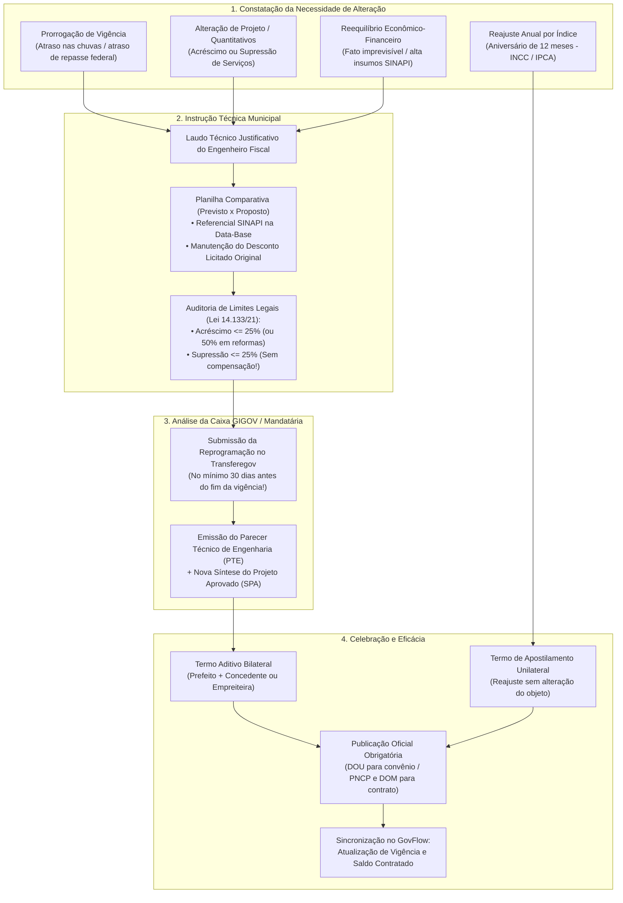
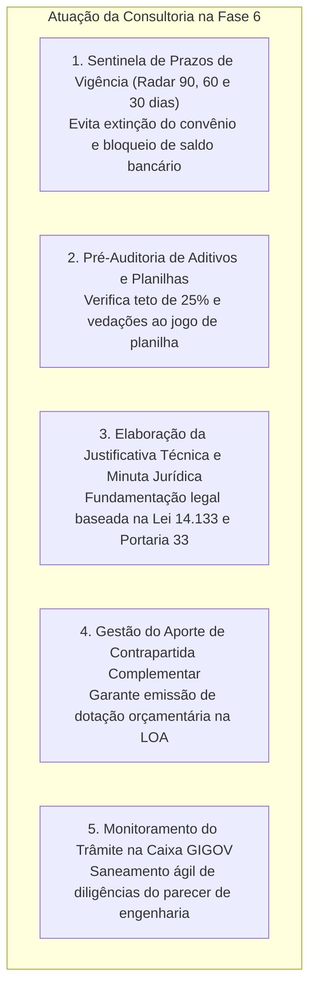
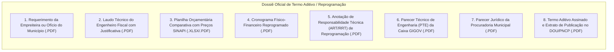

# Deep Research Especializado: Fase 6 — Gestão de Termos Aditivos, Reprogramação e Reequilíbrio Econômico-Financeiro

> **Roteamento de Engenharia (`/deep-research` & `/domain-modeling`):**  
> Este documento formaliza o estudo aprofundado sobre a **Fase 6 (Alterações do Instrumento, Termos Aditivos, Reprogramação de Metas, Reajustamento de Preços, Reequilíbrio Econômico-Financeiro e Apostilamento)** dos convênios federais e contratos administrativos de repasse. Ele disseca as regras da **Portaria Conjunta MGI/MF/CGU nº 33/2023** (arts. 55 a 62), os limites rígidos da **Lei nº 14.133/2021** (arts. 124 a 136 - limites de 25% e 50%), a jurisprudência vinculante do **Tribunal de Contas da União (TCU)** sobre "jogo de planilha" (Acórdãos 749/2010 e 2622/2013-Plenário), o rito de análise de engenharia da **Caixa Econômica Federal (GIGOV)** e a modelagem de dados no **GovFlow**.

---

## 1. Visão Geral e Enquadramento Legal da Fase 6

A **Fase 6** é o estágio do ciclo de vida em que ocorrem modificações formais nas cláusulas dos convênios federais ou nos contratos de execução de obras celebrados pelo município. Obras públicas de engenharia e projetos de infraestrutura convivem com imprevistos geotécnicos, intempéries climáticas severas, variações inflacionárias abruptas e necessidades de aprimoramento técnico.

### Principais Marcos Legais e Normativos:

1. **Portaria Conjunta MGI/MF/CGU nº 33/2023 (arts. 55 a 62 - Das Alterações):**
   * *Art. 55:* O instrumento poderá ser alterado mediante proposta de alteração devidamente justificada no Transferegov.br.
   * *Art. 56:* É vedada a alteração do objeto que descaracterize o instrumento originalmente pactuado.
   * *Art. 57 (Tempestividade Obrigatória):* A proposta de termo aditivo deve ser apresentada pelo convenente com antecedência **mínima de 30 (trinta) dias antes do término de sua vigência**.
   * *Art. 58 (Prorrogação de Ofício):* Se a União der causa ao atraso na liberação dos recursos financeiros, o concedente **deve prorrogar de ofício** a vigência pelo prazo equivalente ao atraso verificado.
   * *Art. 60:* A reprogramação de metas que não implique em alteração de valor global poderá ser formalizada por apostilamento ou termo aditivo simplificado, dispensando novo parecer jurídico quando houver minuta padronizada.

2. **Lei Federal nº 14.133/2021 (arts. 124 a 136 - Das Alterações dos Contratos e dos Preços):**
   * *Art. 124, I (Alteração Unilateral pela Administração):*
     * *a) Qualitativa:* Modificação do projeto ou das especificações para melhor adequação técnica aos seus objetivos.
     * *b) Quantitativa:* Modificação do valor contratual em virtude de acréscimo ou diminuição de quantitativos do objeto.
   * *Art. 124, II, 'd' (Reequilíbrio Econômico-Financeiro por Acordo das Partes):*
     * Para restabelecer o equilíbrio econômico-financeiro inicial em caso de força maior, caso fortuito, fato do príncipe ou fatos imprevisíveis/previsíveis de consequências incalculáveis (álea econômica extraordinária).
   * *Art. 125 (Limites Rígidos de 25% e 50%):*
     * O contratado é obrigado a aceitar acréscimos ou supressões de até **25% (vinte e cinco por cento)** do valor inicial atualizado do contrato, e, no caso de reforma de edifício ou de equipamento, de até **50% (cinquenta por cento)** para os acréscimos.
   * *Art. 136 (Termo de Apostilamento vs. Termo Aditivo):*
     * Registros que dispensam termo aditivo bilateral e são formalizados por simples apostilamento:
       1. Variação do valor contratual decorrente de reajuste de preços previsto no próprio edital/contrato (aniversário anual com índice INCC/IPCA).
       2. Atualizações financeiras ou dotações orçamentárias.

3. **Jurisprudência Vinculante do Tribunal de Contas da União (TCU):**
   * **Vedação ao Jogo de Planilha (Acórdão nº 749/2010-Plenário):**
     * É expressamente proibida a compensação entre acréscimos e supressões para fins de cômputo dos limites de 25%. Ambos devem ser apurados isoladamente: $\frac{\sum \text{Acréscimos}}{V_{\text{inicial}}} \le 25\%$ e $\frac{\sum \text{Supressões}}{V_{\text{inicial}}} \le 25\%$.
     * A alteração não pode reduzir o desconto global originalmente ofertado na licitação em relação ao orçamento de referência (Acórdão nº 2.622/2013-Plenário).

---

## 2. Tipologia Comparativa: Termos Aditivos vs. Apostilamentos

| Tipo de Instrumento | Base Legal | Instrumento Exigido | Exige Parecer Caixa GIGOV? | Limite Percentual Legal | Impacto no Objeto / Valor |
| :--- | :--- | :---: | :---: | :---: | :--- |
| **Prorrogação de Vigência** | Portaria 33/23 art. 57 / Lei 14.133 art. 107 | Termo Aditivo | Sim (análise de cronograma) | Não se aplica (prazo) | Mantém valor; estende data fatal |
| **Acréscimo de Valor/Metas** | Lei 14.133/21 art. 124, I, 'b' | Termo Aditivo | Sim (nova SPA e orçamento) | Até 25% (obras novas) / 50% (reforma) | Aumenta meta física e desembolso |
| **Supressão de Valor/Metas** | Lei 14.133/21 art. 124, I, 'b' | Termo Aditivo | Sim (adequação de metas) | Até 25% (obrigatório para contratada) | Reduz escopo e devolve saldo |
| **Remanejamento de Metas** | Portaria 33/23 art. 60 | Termo Aditivo / Apostila | Sim (reprogramação física) | Valor global permanece idêntico | Ajusta etapas internas do plano |
| **Reequilíbrio Econômico** | Lei 14.133/21 art. 124, II, 'd'| Termo Aditivo | Sim (auditoria de custos/insumos)| Não se submete aos 25% (álea extra) | Recompõe a margem líquida original |
| **Reajuste Anual por Índice**| Lei 14.133/21 art. 136, I | **Apostilamento** | Não (mera aplicação matemática)| Conforme variação do INCC/IPCA | Atualiza preços após 12 meses |

---

## 3. O Rito Operacional de Reprogramação na Caixa Econômica Federal (GIGOV)

Nos contratos de repasse com a Caixa Econômica Federal, qualquer modificação técnica que altere quantitativos, insumos ou prazos segue um rito formal e rigoroso:

```mermaid
graph TD
    subgraph FluxoCaixaReprogramacao [Rito da Caixa GIGOV para Reprogramação de Obras]
        P1["1. Município протоcola proposta no Transferegov com antecedência mínima de 30 dias"]
        P2["2. Anexação da Planilha Orçamentária Comparativa (Itens Mantidos, Excluídos e Novos)"]
        P3["3. Anexação das Composições de Custos Unitários de novos itens (Base SINAPI/SICRO)"]
        P4["4. Anexação da ART/RRT de Reprogramação Orçamentária devidamente quitada"]
        P5["5. Análise pelo Engenheiro Caixa: Emissão do Parecer Técnico de Engenharia (PTE)"]
        P6["6. Caixa emite a SPA de Reprogramação chancelando o novo orçamento"]
        P7["7. Se houver aumento de valor: Município aporta Contrapartida Complementar (ou União suplementa)"]
        P8["8. Assinatura do Termo Aditivo e publicação do extrato"]
    end
    P1 --> P2 --> P3 --> P4 --> P5 --> P6 --> P7 --> P8
```

1. **Apresentação da Planilha Comparativa:** A prefeitura deve apresentar planilha demonstrativa destacando colunas de *Quantitativo Original*, *Quantitativo Executado*, *Quantitativo Acrescido*, *Quantitativo Suprimido* e *Novo Saldo Contratual*.
2. **Preços Novos e Referencial SINAPI:** Se a reprogramação introduzir serviços novos que não constavam da planilha licitada, o preço unitário do item deve ser fixado com base no **SINAPI da data da alteração ou da data-base da licitação**, aplicando-se obrigatoriamente o mesmo percentual de desconto global concedido pela empreiteira na licitação.
3. **Contrapartida Complementar do Município:** Na esmagadora maioria dos casos, a União **não suplementa recursos** de emendas parlamentares ou transferências voluntárias. Qualquer acréscimo de valor aprovado na reprogramação deve ser suportado por **aporte exclusivo de contrapartida financeira municipal**, que deve ter dotação orçamentária prévia indicada pela Secretaria de Finanças.

---

## 4. O Papel Estratégico da Consultoria de Gestão Municipal na Fase 6

A consultoria atua como blindagem jurídica e orçamentária do prefeito, evitando as duas causas mais frequentes de condenação em Tribunais de Contas: **perda de convênio por perda de prazo de vigência** e **irregularidades em aditivos de obras**.

1. **Cronômetro Fatal de Vigência (Radar 90/60/30 Dias):** O sistema Transferegov bloqueia propostas de prorrogação protocoladas a menos de 30 dias do fim da vigência, a menos que haja justificativa excepcionalíssima aceita pelo concedente. A consultoria deve iniciar o processo com 90 dias de folga.
2. **Blindagem contra o "Jogo de Planilha":** A consultoria roda a pré-auditoria orçamentária comparando os preços antes e depois do aditivo. Se a empreiteira estiver suprimindo itens com desconto de 40% e acrescendo itens onde o desconto é 0%, o GovFlow emite alerta de alto risco de auditoria pelo TCU.
3. **Cálculo do Reequilíbrio Econômico-Financeiro:** Quando a empreiteira requer recomposição de preços por alta de insumos (ex: asfalto/cimento), a consultoria audita se a empresa demonstrou as notas fiscais de compra na época da licitação e na época do pedido, calculando exatamente a margem líquida a recompor sem conceder reajuste indevido.

---

## 5. Dicionário de Dados e Atributos da Fase 6 no GovFlow

A arquitetura de dados do GovFlow modela a Fase 6 na entidade polimórfica `core_schema.tb_termos_aditivos`, que atende tanto convênios federais quanto contratos municipais de execução:

### Entidade `core_schema.tb_termos_aditivos`
| Atributo | Tipo de Dado | Regra de Negócio / Descrição |
| :--- | :---: | :--- |
| `id` | `UUID (PK)` | Identificador universal do aditivo |
| `tenant_id` | `UUID (FK)` | Identificador da consultoria (Multi-tenant) |
| `tipo_instrumento_aditivado` | `VARCHAR(30)` | `CONVENIO_FEDERAL` ou `CONTRATO_MUNICIPAL` |
| `convenio_id` | `UUID (FK)` | Vínculo com o convênio (nulo se for aditivo de contrato não financiado) |
| `contrato_id` | `UUID (FK)` | Vínculo com o contrato municipal (nulo se for aditivo do convênio) |
| `numero_aditivo` | `INTEGER` | Sequencial do aditivo (1 para 1º Aditivo, 2 para 2º, etc.) |
| `tipo_aditivo` | `VARCHAR(50)` | `PRORROGACAO_VIGENCIA`, `VALOR_ACRESCIMO`, `VALOR_SUPRESSAO`, `REMANEJAMENTO_METAS`, `REEQUILIBRIO_ECONOMICO`, `APOSTILAMENTO_REAJUSTE` |
| `data_assinatura` | `DATE` | Data em que o termo foi formalmente assinado |
| `data_publicacao_dou_ou_dom` | `DATE` | Data de eficácia via publicação no DOU, DOM ou PNCP |
| `nova_data_fim_vigencia` | `DATE` | Novo prazo estendido (preenchido em prorrogações) |
| `valor_aditado` | `NUMERIC(15,2)` | Valor nominal acrescido ou suprimido (positivo ou negativo) |
| `percentual_aditado` | `NUMERIC(5,2)` | Percentual de acréscimo/supressão calculado sobre o valor original |
| `parecer_tecnico_caixa` | `VARCHAR(50)` | Número/Protocolo do Parecer Técnico de Engenharia da Caixa GIGOV |
| `status_aprovacao_concedente`| `VARCHAR(30)` | `EM_ELABORACAO`, `SUBMETIDO_CAIXA`, `DILIGENCIA_CAIXA`, `APROVADO_CONCEDENTE`, `REJEITADO` |
| `data_limite_solicitacao_tempestiva`| `DATE` | Data limite de 30 dias antes do fim da vigência (Portaria 33, art. 57) |
| `justificativa` | `TEXT` | Motivação fática e jurídica do aditamento |
| `s3_key_justificativa_tecnica`| `VARCHAR(500)`| Laudo técnico com fotos e memória de cálculo do engenheiro |
| `s3_key_planilha_comparativa`| `VARCHAR(500)`| Planilha orçamentária Excel/PDF comparando previsto x proposto |
| `s3_key_parecer_caixa` | `VARCHAR(500)`| Cópia do Laudo de Reprogramação da Caixa GIGOV em PDF |
| `s3_key_aditivo` | `VARCHAR(500)`| Instrumento bilateral assinado pelas partes em PDF |
| `s3_key_extrato_publicacao` | `VARCHAR(500)`| Certidão de publicação oficial no DOU ou PNCP em PDF |

---

## 6. Checklist Documental da Fase 6 (Dossiê de Alteração Contratual)

Para que um aditivo seja considerado juridicamente perfeito e imune a apontamentos da CGU e do TCU, a consultoria compila o seguinte dossiê:

---

## 7. Principais Riscos Operacionais e Armadilhas na Fase 6

1. **Perda Fatal do Prazo de Vigência (Óbito do Convênio):**
   * Deixar o convênio expirar sem que a prorrogação de vigência tenha sido protocolada no Transferegov.
   * **Consequência Irreversível:** Convênio expirado não pode ser reaberto. A Caixa bloqueia a conta bancária, os pagamentos residuais são proibidos e a prefeitura deve devolver todo o recurso não liquidado, gerando TCE contra o prefeito.
2. **Extrapolação dos Limites de 25% ou 50%:**
   * Celebrar aditivos cumulativos que ultrapassam 25% do valor original da obra nova ou 50% da reforma sem enquadramento estrito de álea extraordinária.
   * **Consequência:** Violação do art. 125 da Lei 14.133/2021. Nulidade do aditivo, responsabilização solidária do gestor e do engenheiro fiscal perante o Tribunal de Contas do Estado (TCE) e TCU.
3. **Prática Ilegal de "Jogo de Planilha":**
   * Suprimir serviços essenciais com desconto alto e acrescer serviços novos com preço cheio da tabela SINAPI, reduzindo o desconto global obtido na licitação.
   * **Consequência:** Acórdão 749/2010 do TCU. O tribunal determina a retenção de pagamentos futuros e a devolução dos valores superfaturados.
4. **Falta de Publicidade no DOU ou PNCP:**
   * Assinar o termo aditivo e não publicar o extrato no Diário Oficial da União ou PNCP dentro do prazo legal de 20 dias úteis (art. 94 da Lei 14.133).
   * **Consequência:** Falta de eficácia jurídica. Qualquer pagamento lastreado no aditivo sem publicação é considerado despesa irregular.
5. **Confusão entre Reajuste e Reequilíbrio:**
   * Tentar conceder reajuste anual por índice inflacionário sem previsão editalícia, ou conceder reequilíbrio econômico sem comprovar a variação extraordinária do custo de insumos.
   * **Consequência:** Apontamento de dano ao erário pelo Ministério Público de Contas.

---

## 8. Como o GovFlow Automatiza e Blinda a Fase 6

1. **Sentinela Preditiva de Vigência (WhatsApp Alerts):**
   * O GovFlow monitora dia a dia a data fatal de vigência de cada convênio e contrato.
   * Dispara alertas automáticos aos 90, 60, 45 e 30 dias para a equipe da consultoria e para o secretário municipal:  
     *"Atenção: O Convênio nº 912345 (Creche Municipal) vence em 45 dias (15/11/2024). Prazo limite para protocolo do Termo Aditivo de Prorrogação no Transferegov: 15/10/2024 (Portaria 33, art. 57)."*
2. **Calculadora e Validador de Limites de 25% com Bloqueio de Jogo de Planilha:**
   * Ao cadastrar um novo aditivo de valor, o GovFlow confronta os acréscimos e supressões individualmente.
   * Se $\sum \text{Acréscimos} > 0.25 \times V_{\text{original}}$, o sistema alerta em vermelho o limite legal.
   * A plataforma calcula o percentual de desconto original da licitação e garante que o desconto final pós-aditivo não caia abaixo do limiar aceito pelo TCU.
3. **Gerador Automatizado de Minutas e Dossiês:**
   * O sistema compila a memória de cálculo do aditivo, gerando a minuta padronizada de Termo Aditivo ou Termo de Apostilamento com todas as cláusulas regulamentares.
4. **Sincronização Bidirecional com o Transferegov:**
   * Assim que a reprogramação é homologada pela Caixa GIGOV e o aditivo assinado, o GovFlow atualiza automaticamente o valor contratado atual (`valor_contratado_atual` em `tb_contratos_execucao`) e a nova data de vigência do convênio, liberando a emissão das medições e documentos hábeis das fases subsequentes.
