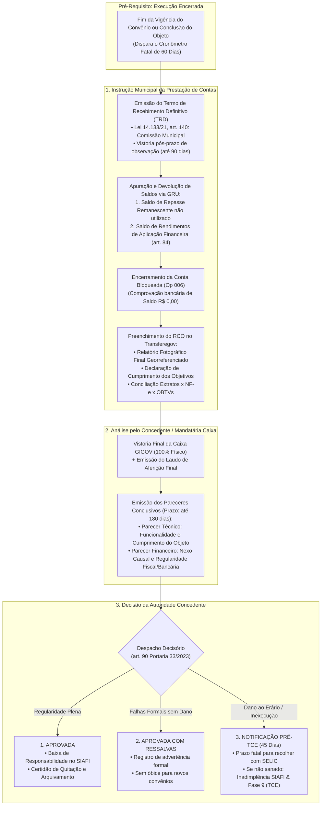
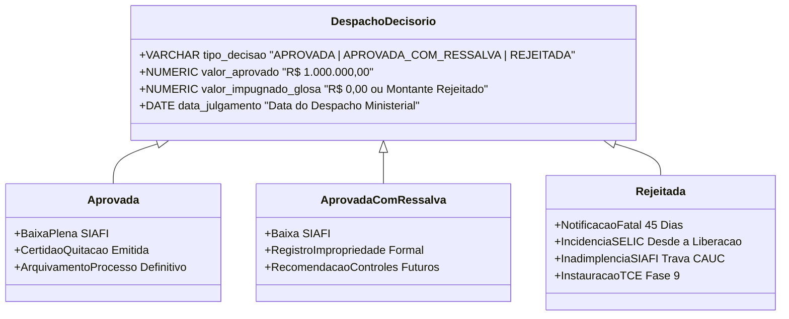
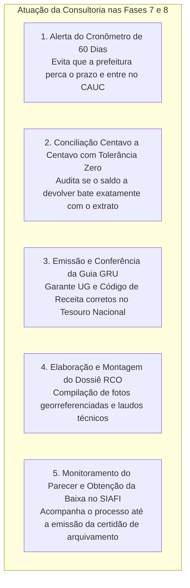
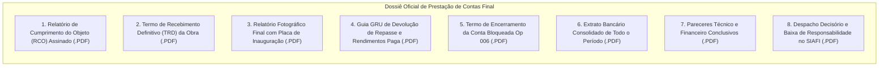

# Deep Research Especializado: Fases 7 e 8 — Prestação de Contas Final, Devolução de Saldos via GRU, Pareceres Conclusivos e Encerramento

> **Roteamento de Engenharia (`/deep-research` & `/domain-modeling`):**  
> Este documento formaliza o estudo exaustivo sobre as **Fases 7 e 8 (Prestação de Contas Final, Devolução Compulsória de Saldos e Rendimentos via GRU, Termos de Recebimento Provisório e Definitivo da Obra, Pareceres Técnico e Financeiro Conclusivos e Despacho de Encerramento/Homologação)** dos convênios e contratos de repasse federais no Transferegov.br. Ele disseca as exigências da **Portaria Conjunta MGI/MF/CGU nº 33/2023** (arts. 81 a 95), o rito de recebimento da obra da **Lei Federal nº 14.133/2021** (art. 140), o encerramento da conta bancária vinculada e a modelagem de dados no **GovFlow**.

---

## 1. Visão Geral e Enquadramento Legal das Fases 7 e 8

A conclusão física da obra e a liquidação das notas fiscais por OBTV não encerram as obrigações do município. As **Fases 7 e 8** representam o dever constitucional e regulatório de prestar contas da aplicação de cada centavo repassado pela União, culminando na homologação da regularidade dos atos ou na deflagração de medidas sancionatórias.

### Principais Marcos Legais e Normativos:

1. **Portaria Conjunta MGI/MF/CGU nº 33/2023 (arts. 81 a 95 - Da Prestação de Contas):**
   * *Art. 81:* A prestação de contas é o procedimento de controle público destinado a comprovar a boa e regular aplicação dos recursos, o cumprimento do objeto e o alcance dos objetivos e metas pactuados.
   * *Art. 82 (Prazo Improrrogável de 60 Dias):* O convenente prestará contas no prazo de **até 60 (sessenta) dias** contados do término da vigência ou da conclusão do objeto, o que ocorrer primeiro.
     * *§ 1º:* Se a prestação de contas não for apresentada no prazo legal, o concedente **assinalará prazo de 30 (trinta) dias** para sua apresentação ou recolhimento dos recursos.
     * *§ 2º:* Esgotado esse prazo suplementar sem manifestação, a autoridade concedente **registrará a inadimplência no SIAFI/Transferegov e instaurará Tomada de Contas Especial (Fase 9)**.
   * *Art. 84 (Devolução Compulsória de Saldos e Rendimentos via GRU):*
     * Os saldos financeiros remanescentes, inclusive os provenientes das receitas obtidas nas aplicações financeiras em poupança, serão devolvidos à Conta Única do Tesouro Nacional no prazo improrrogável de **30 (trinta) dias**.
     * Devolução operacionalizada exclusivamente por **Guia de Recolhimento da União (GRU)** com Unidade Gestora (UG) e Gestão do órgão concedente.
   * *Art. 85 a 88 (Prazos de Exame do Concedente):*
     * O concedente dispõe de **180 (cento e oitenta) dias**, prorrogáveis justificadamente por igual período, para emitir o parecer final sobre a prestação de contas.
   * *Art. 89 a 90 (Pareceres Conclusivos e Despacho Decisório):*
     * *Parecer Técnico:* Avalia a entrega física do bem, funcionalidade e atendimento à comunidade.
     * *Parecer Financeiro:* Audita a conciliação bancária centavo a centavo, conformidade das notas fiscais, quitação de tributos e devolução de rendimentos.
     * *Julgamento:* Aprovada, Aprovada com Ressalvas ou Rejeitada.

2. **Lei Federal nº 14.133/2021 (art. 140 - Do Recebimento do Objeto Contratual):**
   * *Recebimento Provisório (art. 140, I, 'a'):* Emitido pelo engenheiro fiscal da prefeitura em até **15 (quinze) dias** após a comunicação da construtora de conclusão dos serviços.
   * *Recebimento Definitivo (art. 140, I, 'b'):* Emitido por servidor ou comissão designada pela autoridade competente, mediante vistoria técnica minuciosa que comprove o perfeito acabamento e conformidade técnica, no prazo de até **90 (noventa) dias** após o recebimento provisório.
   * **Requisito Obrigatório no Transferegov:** A ausência do Termo de Recebimento Definitivo (TRD) obsta a aprovação da prestação de contas pelos auditores federais.

3. **Normas da Secretaria do Tesouro Nacional (STN) para Encerramento de Contas:**
   * A conta corrente vinculada exclusiva (Operação 006 na Caixa Econômica) deve ser definitivamente encerrada.
   * O banco emite o extrato com saldo R$ 0,00 e a declaração de encerramento da conta, que devem ser anexados à aba de prestação de contas do Transferegov.

---

## 2. O Rito Procedimental da Prestação de Contas Final Passo a Passo

### Passo 1: Recebimento Definitivo e Placa de Inauguração
* O engenheiro fiscal e a comissão municipal realizam a vistoria final. Constatada a perfeição da obra, lavram o **Termo de Recebimento Definitivo (TRD)**.
* **Exigência Visual:** É obrigatória a instalação da **Placa Definitiva de Inauguração da Obra**, no padrão visual estabelecido pela Secretaria de Comunicação da Presidência da República (SECOM), contendo valor, data, autor da emenda e órgãos envolvidos. O relatório fotográfico final deve conter fotos panorâmicas e detalhes da placa com coordenadas GPS.

### Passo 2: Conciliação Centavo a Centavo e Geração da GRU
A consultoria apura o quadro de saldos remanescentes na conta vinculada:
$$\text{Saldo Total em Conta} = \text{Saldo de Repasse Não Utilizado} + \text{Rendimentos Acumulados de Aplicação}$$
* **Emissão da GRU (Guia de Recolhimento da União):**
  * Favorecido: Tesouro Nacional / Ministério Concedente.
  * Código de Recolhimento: Específico para Devolução de Convênios Federais (ex: `18806-9`).
  * Pagamento: Realizado eletronicamente por comando de **OBTV Devolução GRU** no próprio Transferegov ou débito direto da conta vinculada.
  * Autenticação Bancária: Cópia do comprovante de repasse ao Tesouro Nacional.

### Passo 3: Encerramento Formal da Conta Vinculada (Op 006)
* Efetuado o débito da GRU, a prefeitura solicita o encerramento da conta na agência da Caixa ou Banco do Brasil.
* O banco expede o **Termo de Encerramento de Conta Vinculada** e o extrato bancário final com saldo zero.

### Passo 4: Transmissão do Relatório de Cumprimento do Objeto (RCO)
A consultoria preenche no Transferegov.br:
* Metas e etapas atingidas (100%);
* Relação de bens adquiridos ou construídos;
* Conciliação financeira completa (notas fiscais x medições x ordens bancárias);
* Anexação de todos os comprovantes digitais;
* Assinatura digital do Prefeito Municipal no RCO e envio para análise do Concedente.

### Passo 5: Vistoria Final da Caixa e Pareceres Conclusivos
* O engenheiro da Caixa GIGOV realiza a vistoria final de constatação do objeto e emite o **Laudo Final de Engenharia**.
* O Concedente emite:
  * **Parecer Técnico Conclusivo:** Chancelando que a obra está operando e funcional (ex: posto de saúde atendendo pacientes, creche com alunos matriculados).
  * **Parecer Financeiro Conclusivo:** Atestando que todas as despesas foram regulares e não restou nenhuma pendência contábil.

### Passo 6: Despacho Decisório e Baixa de Responsabilidade
* O Ordenador de Despesas da União profere o **Despacho Decisório**:
  * Emissão do **Termo de Aprovação e Baixa de Responsabilidade**.
  * Baixa automática do registro no SIAFI, liberando a certidão de quitação do convênio no sistema federal.

---

## 3. Tipologia das Decisões de Julgamento da Prestação de Contas

1. **Aprovação Plena:** Reconhece a perfeita execução técnica e financeira. Gera a baixa da responsabilidade no SIAFI e arquivamento definitivo.
2. **Aprovação com Ressalva:** Quando ocorrem falhas formais que não causaram dano ao erário nem prejudicaram a utilidade da obra (ex: atraso pontual na entrega de um relatório fotográfico ou divergência irrelevante de memorial descritivo).
3. **Rejeição (com Notificação Prévia de 45 Dias):** Ocorre nas seguintes hipóteses gravíssimas:
   * *Inexecução Parcial ou Total do Objeto;*
   * *Falta de Funcionalidade da Obra ("Elefante Branco"):* A obra foi concluída, mas não tem água, energia, acesso viário ou equipamentos, ficando abandonada sem utilidade pública (Súmula TCU nº 286);
   * *Desvio de Finalidade:* Utilização dos recursos em objeto diferente do pactuado;
   * *Falta de Nexo Causal:* Pagamentos realizados por canais bancários estranhos à conta vinculada;
   * *Não Apresentação da Prestação de Contas.*

---

## 4. O Papel da Consultoria de Gestão Municipal nas Fases 7 e 8

Nas Fases 7 e 8, a consultoria desempenha o papel de **fechamento de ciclo e blindagem patrimonial do gestor**:

1. **Sentinela do Prazo Fatal de 60 Dias:** Se o convênio encerrou em 31/12, a prestação de contas deve ser enviada até 01/03. O GovFlow dispara alertas decrescentes diários para evitar que a omissão gere inscrição imediata no cadastro de inadimplentes.
2. **Auditoria de Funcionalidade da Obra:** A consultoria verifica se o município já providenciou a ligação de energia elétrica, abastecimento de água e acessibilidade antes de chamar o engenheiro da Caixa para a vistoria final, evitando a temida emissão de laudo com parecer de *Objeto Inoperante / Falta de Funcionalidade*.
3. **Blindagem Contra a Perda de Rendimentos:** A consultoria assegura que os rendimentos da aplicação financeira em poupança sejam integralmente recolhidos à União, impedindo que a prefeitura retenha o montante na conta municipal, o que ensejaria glosa e cobrança com taxa SELIC.

---

## 5. Dicionário de Dados e Atributos das Fases 7 e 8 no GovFlow

A arquitetura do GovFlow modela a governança da prestação de contas na própria entidade `core_schema.tb_convenios` e nos comandos de devolução em `core_schema.tb_ordens_pagamento`:

### Entidade `core_schema.tb_convenios` (Atributos de Prestação de Contas & Encerramento)
| Atributo | Tipo de Dado | Regra de Negócio / Descrição |
| :--- | :---: | :--- |
| `data_limite_prestacao_contas` | `DATE` | Prazo fatal de 60 dias após a vigência (Portaria 33, art. 82) |
| `data_envio_prestacao_contas` | `DATE` | Data em que o município transmitiu o RCO no Transferegov |
| `situacao_prestacao_contas` | `VARCHAR(50)` | `EM_EXECUCAO`, `AGUARDANDO_ENVIO`, `ENVIADA_EM_ANALISE`, `APROVADA`, `APROVADA_COM_RESSALVAS`, `NOTIFICADA_DILIGENCIA`, `REJEITADA` |
| `valor_saldo_remanescente_devolvido` | `NUMERIC(15,2)` | Parcela de verba de repasse da União devolvida ao Tesouro |
| `valor_rendimentos_devolvidos` | `NUMERIC(15,2)` | Total de juros de poupança devolvidos via GRU (art. 84) |
| `numero_gru_devolucao` | `VARCHAR(50)` | Número de referência oficial da GRU recolhida |
| `status_parecer_tecnico` | `VARCHAR(30)` | `EM_ANALISE`, `APROVADO_SEM_RESSALVA`, `APROVADO_COM_RESSALVA`, `REJEITADO` |
| `status_parecer_financeiro` | `VARCHAR(30)` | `EM_ANALISE`, `APROVADO_SEM_RESSALVA`, `APROVADO_COM_RESSALVA`, `REJEITADO` |
| `data_homologacao_prestacao_contas`| `DATE` | Data em que a autoridade concedente proferiu o Despacho Final |
| `s3_key_relatorio_cumprimento_objeto`| `VARCHAR(500)`| Cópia digital em PDF do RCO assinado e transmitido |
| `s3_key_termo_recebimento_definitivo`| `VARCHAR(500)`| Termo de Recebimento Definitivo da Obra (art. 140 Lei 14.133) |
| `s3_key_comprovante_gru` | `VARCHAR(500)` | PDF da GRU paga com autenticação bancária no MinIO |
| `s3_key_termo_encerramento_conta`| `VARCHAR(500)`| Declaração bancária da Caixa/BB de saldo zerado e encerramento |
| `s3_key_parecer_tecnico_concedente`| `VARCHAR(500)`| Cópia do Parecer Técnico Final de Engenharia da Caixa/Ministério |
| `s3_key_parecer_financeiro_concedente`| `VARCHAR(500)`| Cópia do Parecer Financeiro Final do Concedente |

---

## 6. Checklist Documental das Fases 7 e 8 (Dossiê de Encerramento)

---

## 7. Principais Riscos Operacionais e Armadilhas nas Fases 7 e 8

1. **Omissão no Dever de Prestar Contas (Perda dos 60 Dias):**
   * Prefeito que encerra o mandato ou esquece de transmitir o RCO dentro do prazo de 60 dias.
   * **Consequência Automática:** Bloqueio imediato no CAUC, impedindo o município de receber qualquer transferência voluntária ou firmar operações de crédito. O concedente é legalmente obrigado a instaurar Tomada de Contas Especial (Fase 9).
2. **Retenção Indevida dos Rendimentos de Aplicação:**
   * Transferir os rendimentos de poupança para a conta do Tesouro Municipal em vez de devolver via GRU.
   * **Consequência:** Glosa do valor com cobrança cumulada de correção monetária e juros de mora pela taxa SELIC, imputada pessoalmente ao Prefeito.
3. **Obra Pronta mas Inoperante ("Elefante Branco"):**
   * Inaugurar a obra fisicamente, mas mantê-la de portas fechadas por falta de médicos, professores ou mobiliário.
   * **Consequência:** A Caixa emite Parecer Técnico desfavorável por "ausência de funcionalidade imediata". O TCU exige a devolução integral de todos os recursos federais aplicados na obra, ainda que a construção tenha sido perfeita.
4. **Falta de Nexo Causal entre Extrato e Notas Fiscais:**
   * Pagamento de notas fiscais com recursos misturados de outros convênios ou saques avulsos.
   * **Consequência:** Rejeição sumária pelo Parecer Financeiro Conclusivo por impossibilidade de aferir o nexo entre o recurso federal e o serviço prestado.
5. **Prefeito Sucessor que Não Presta Contas de Obra do Antecessor:**
   * O novo prefeito assume e recusa-se a prestar contas de convênio executado na gestão anterior.
   * **Consequência:** O município é bloqueado. Para se livrar do bloqueio, o prefeito sucessor é obrigado a aplicar a **Súmula nº 230 do TCU**, ingressando com Ação de Ressarcimento ao Erário / Notícia Crime contra o antecessor.

---

## 8. Como o GovFlow Automatiza e Blinda as Fases 7 e 8

1. **Sentinela Regressiva dos 60 Dias (Radar CAUC):**
   * Assim que a vigência encerra ou a última medição é atestada, o GovFlow inicia a contagem regressiva diária (D-60, D-45, D-30, D-15, D-5).
   * Alertas automáticos no WhatsApp alertam o Prefeito e a Consultoria:  
     *"Convênio nº 912345: Faltam 30 dias para o prazo final de transmissão do RCO no Transferegov. Risco iminente de negativação no CAUC."*
2. **Calculadora Automática da Guia GRU:**
   * O sistema puxa os extratos bancários integrados, cruza repasses creditados, pagamentos efetuados e juros de poupança acumulados.
   * Apura centavo a centavo o saldo remanescente e emite automaticamente os dados para o preenchimento da GRU, evitando erros de cálculo ou pagamento insuficiente.
3. **Auditoria Prévia de Funcionalidade e Checklist de Documentos:**
   * O GovFlow confere se os 8 documentos do Dossiê Final estão anexados antes de permitir a submissão do RCO, garantindo que o Termo de Recebimento Definitivo e as fotos da placa de inauguração não fiquem de fora.
4. **Rastreamento Pós-Envio dos Prazos do Concedente:**
   * Monitora o prazo de 180 dias da Caixa/Ministério para emissão dos pareceres conclusivos, gerando notificações caso o órgão federal atrase a homologação e deixe o convênio indefinidamente em aberto.
