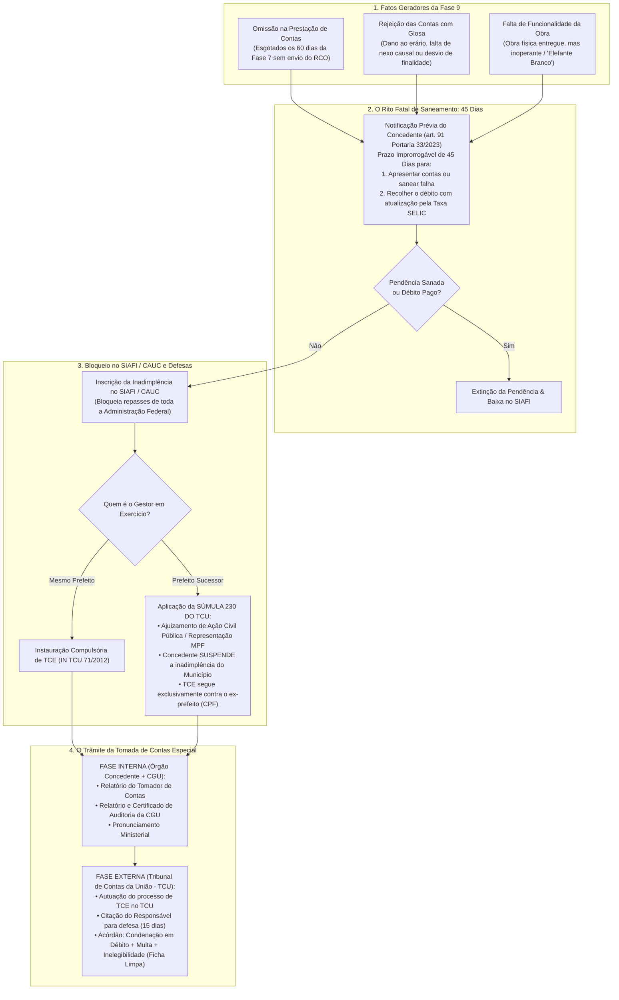
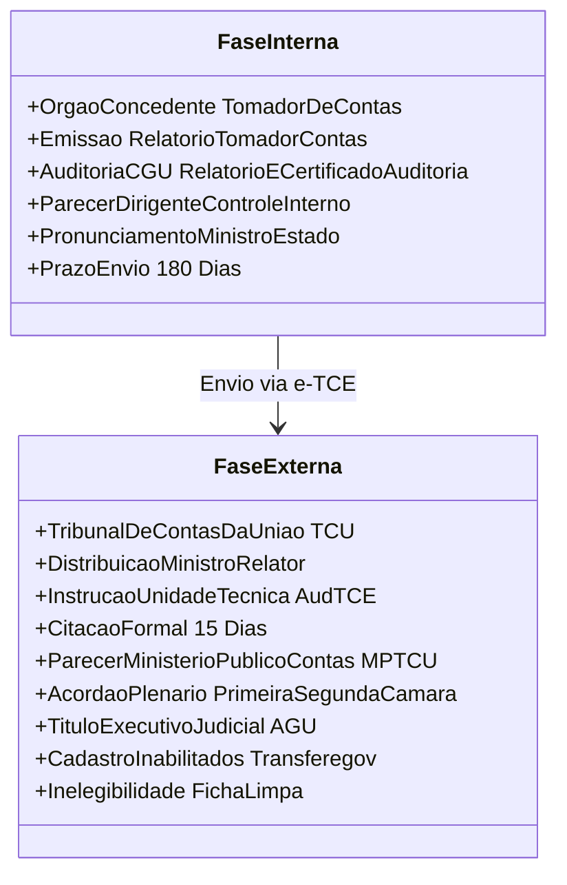
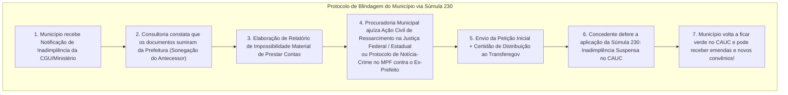
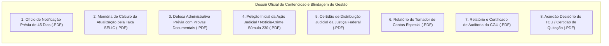

# Deep Research Especializado: Fase 9 — Gestão de Inadimplência, Notificação de 45 Dias, Súmula 230 do TCU e Tomada de Contas Especial (TCE)

> **Roteamento de Engenharia (`/deep-research` & `/domain-modeling`):**  
> Este documento formaliza o estudo aprofundado sobre a **Fase 9 (Contencioso, Inadimplência no SIAFI/CAUC, Notificação Prévia de 45 Dias com Taxa SELIC, Aplicação da Súmula nº 230 do TCU para Prefeitos Sucessores e Instauração da Tomada de Contas Especial - TCE)** dos convênios e contratos de repasse federais. Ele disseca as regras da **Portaria Conjunta MGI/MF/CGU nº 33/2023** (arts. 91 a 95), a **Instrução Normativa TCU nº 71/2012** (com redação da IN TCU nº 88/2020), a **Lei Orgânica do TCU (Lei nº 8.443/1992)**, o marco prescricional da **Resolução TCU nº 344/2022** (Tema 899 do STF) e a modelagem de dados no **GovFlow**.

---

## 1. Visão Geral e Enquadramento Legal da Fase 9

A **Fase 9** é o estágio patológico e de exceção do ciclo de vida dos convênios. Ela é deflagrada quando há quebra do dever de prestar contas, rejeição técnica/financeira do objeto, dano ao erário ou desvio de finalidade, culminando no bloqueio das transferências federais para o município e na responsabilização pessoal do gestor (CPF) perante a Controladoria-Geral da União (CGU) e o Tribunal de Contas da União (TCU).

### Principais Marcos Legais e Normativos:

1. **Portaria Conjunta MGI/MF/CGU nº 33/2023 (arts. 91 a 95 - Da Inadimplência e da TCE):**
   * *Art. 91 (Notificação Prévia de 45 Dias):* O concedente expedirá notificação fixando o prazo improrrogável de **45 (quarenta e cinco) dias** para que o convenente apresente a prestação de contas, saneie a irregularidade ou recolha o valor do dano atualizado monetariamente pela **taxa SELIC** (desde a data do repasse).
   * *Art. 92 (Registro da Inadimplência):* Esgotado o prazo sem manifestação, o concedente registrará a **inadimplência no SIAFI/Transferegov** e providenciará a imediata instauração da Tomada de Contas Especial.
   * *Art. 93 (Piso de Alçada do TCU):* Fica dispensada a instauração de TCE quando o dano ao erário for inferior a **R$ 120.000,00** (valor atualizado pela IN TCU nº 71/2012 e 88/2020), registrando-se o débito em conta de controle para cobrança administrativa.
   * *Art. 94 (Efeito Paralisante da Inadimplência):* O registro no SIAFI impede o recebimento de qualquer nova transferência voluntária da União e paralisa os desembolsos de outros convênios do município.

2. **A Súmula nº 230 do Tribunal de Contas da União (TCU):**
   * *"Compete ao prefeito sucessor apresentar as contas referentes aos recursos federais recebidos por seu antecessor, quando este não o tiver feito ou, na impossibilidade de fazê-lo, adotar as medidas legais visando ao resguardo do patrimônio público com a instauração da competente ação judicial de ressarcimento ao erário ou representação ao Ministério Público, sob pena de co-responsabilidade."*
   * **Condição de Blindagem do Município:** O atual prefeito não pode ser punido por desmandos do antecessor, desde que comprove ter acionado a Justiça Federal/Estadual ou o Ministério Público Federal contra o ex-prefeito. Com isso, o Concedente altera o status no SIAFI para `INADIMPLENCIA_SUSPENSA_SUMULA_230`, desobstruindo as certidões do município.

3. **Lei Orgânica do TCU (Lei nº 8.443/1992):**
   * *Art. 8º:* Instauração da TCE pela autoridade competente para apuração dos fatos, identificação dos responsáveis e quantificação do dano.
   * *Art. 16, III:* Julgamento das contas como **IRREGULARES** em caso de omissão, dano ao erário ou desvio de bens.
   * *Art. 19 e 23:* A decisão do TCU que imputa débito ou comina multa possui **eficácia de título executivo extrajudicial** (passível de execução fiscal direta pela Procuradoria-Geral da União / AGU).
   * *Art. 57:* Aplicação de multa de até 100% do valor atualizado do dano ao erário.
   * *Art. 60:* Declaração de **inabilitação para o exercício de cargo em comissão ou função de confiança** por prazo de 5 a 8 anos.

4. **Prescrição no Controle Externo (Resolução TCU nº 344/2022 & STF Tema 899):**
   * Prescrição principal: **5 (cinco) anos** a contar da data de apresentação da prestação de contas ou da data em que ela deveria ter sido apresentada.
   * Prescrição intercorrente: **3 (três) anos** se o processo de TCE ficar paralisado em um mesmo setor sem despacho de mero expediente.

---

## 2. As Fases da Tomada de Contas Especial (TCE) em Detalhes

A TCE é um processo administrativo de rito formal e contraditório, dividido em duas fases estanques:

### Fase Interna (Órgão Concedente + CGU):
1. **Nomeação do Tomador de Contas:** Servidor designado para apurar os fatos. Ele quantifica o débito atualizado pela SELIC, identifica as notas fiscais inidôneas e individualiza as condutas dos responsáveis (Prefeito, Secretários e Empreiteira).
2. **Relatório do Tomador de Contas:** Peça acusatória que instrui os autos.
3. **Auditoria da CGU:** A Controladoria-Geral da União audita o processo e emite o **Relatório de Auditoria** e o **Certificado de Auditoria**, opinando pela irregularidade das contas.
4. **Pronunciamento do Ministro:** O Ministro de Estado atesta haver tomado conhecimento das apurações e remete os autos eletronicamente ao TCU via sistema **e-TCE**.

### Fase Externa (Tribunal de Contas da União - TCU):
1. **Autuação e Citação:** O TCU autua o processo (`TC-XXXXXX/AAAA-X`) e expede citação pessoal ao responsável (AR com aviso de recebimento no CPF do ex-gestor), concedendo prazo de 15 dias para recolher o valor ou apresentar defesa.
2. **Instrução Técnica (AudTCE) e Parecer do MPTCU:** O corpo técnico do tribunal analisa a defesa e o Ministério Público junto ao TCU opina pelo julgamento.
3. **Julgamento pelo Plenário/Câmaras:**
   * Condenação ao ressarcimento integral do dano aos cofres federais;
   * Aplicação de multa pessoal do art. 57 da LOTCU;
   * Comunicação à Justiça Eleitoral para fins de **inelegibilidade por 8 anos (Lei da Ficha Limpa - LC nº 64/90)**;
   * Envio à Procuradoria-Geral da União (AGU) para ajuizamento de **Execução Fiscal perante a Justiça Federal**.

---

## 3. A Estratégia de Defesa do Município: Aplicação Prática da Súmula 230 do TCU

Um dos maiores desafios das prefeituras brasileiras é a transição de mandato, quando o novo gestor herda convênios inadimplentes do antecessor.

* **Requisito Indispensável:** Não basta alegar que o antecessor não deixou documentos. A jurisprudência do TCU (Acórdão 2.456/2018-Plenário) exige a demonstração inequívoca de que o sucessor **adotou medidas judiciais concretas** para responsabilizar o antecessor.
* **Resultado para o Município:** O nome da Prefeitura é baixado do cadastro de restrições do SIAFI/CAUC, e o débito permanece inscrito exclusivamente em nome da **pessoa física do ex-prefeito**.

---

## 4. O Papel da Consultoria de Gestão Municipal na Fase 9

A atuação da consultoria na Fase 9 visa a **estancar o dano institucional e proteger o erário municipal**:

1. **Sentinela do Cronômetro dos 45 Dias:** Ao receber a notificação, a consultoria audita a glosa imediatamente. Se a prefeitura conseguir demonstrar a documentação faltante (ex: ART, boletim de medição complementar ou comprovante bancário), a consultoria protocola a defesa técnica antes do 45º dia, evitando a inscrição da inadimplência.
2. **Instrução Técnica da Súmula 230:** A consultoria elabora o relatório técnico circunstanciado que subsidia a Procuradoria Jurídica do município na petição judicial contra o antecessor, formatando os documentos no padrão exigido pelo Concedente.
3. **Auditoria de Prescrição (Resolução TCU nº 344/2022):** Se a prestação de contas foi apresentada há mais de 5 anos e o ministério ficou inerte sem analisar, a consultoria suscita a **prescrição da pretensão punitiva e ressarcitória**, requerendo o arquivamento definitivo da TCE sem cobrança.

---

## 5. Dicionário de Dados e Atributos da Fase 9 no GovFlow

A arquitetura de dados do GovFlow modela o contencioso da Fase 9 em `core_schema.tb_convenios`:

### Entidade `core_schema.tb_convenios` (Atributos de Inadimplência e TCE)
| Atributo | Tipo de Dado | Regra de Negócio / Descrição |
| :--- | :---: | :--- |
| `status_inadimplencia_siafi` | `VARCHAR(30)` | `ADIMPLENTE`, `NOTIFICADO_45_DIAS`, `INADIMPLENTE_SUSPENSO`, `INADIMPLENTE_BLOQUEADO` |
| `motivo_inadimplencia` | `VARCHAR(50)` | `OMISSAO_PRESTACAO_CONTAS`, `GLOSA_REJEICAO_CONTAS`, `FALTA_FUNCIONALIDADE`, `DESVIO_FINALIDADE`, `DANO_AO_ERARIO` |
| `data_notificacao_cgu` | `DATE` | Data em que o Concedente expediu a notificação fatal |
| `data_limite_defesa_45_dias` | `DATE` | Prazo fatal de 45 dias para resposta ou recolhimento com SELIC (Portaria 33, art. 91) |
| `valor_glosa_apurado` | `NUMERIC(15,2)` | Montante financeiro impugnado pela auditoria |
| `valor_debito_atualizado_selic`| `NUMERIC(15,2)`| Valor do débito corrigido pela taxa SELIC para recolhimento |
| `fase_tce` | `VARCHAR(30)` | `NAO_INSTAURADA`, `NOTIFICACAO_PREVIA`, `FASE_INTERNA_MINISTERIO`, `AUDITORIA_CGU`, `FASE_EXTERNA_TCU`, `JULGADA_CONDENATORIA`, `ARQUIVADA_QUITADA`, `PRESCRITA` |
| `processo_tce_numero_tcu` | `VARCHAR(50)` | Número oficial do processo autuado no TCU (ex: `TC 012.345/2024-8`) |
| `amparado_sumula_230_tcu` | `BOOLEAN` | Flag indicando ação judicial do sucessor para suspensão no CAUC |
| `numero_processo_judicial_sucessor`| `VARCHAR(100)`| Número CNJ da Ação Civil Pública / Notícia-Crime no MPF |
| `data_ajuizamento_sumula_230`| `DATE` | Data do protocolo judicial da ação pelo município |
| `s3_key_notificacao_cgu` | `VARCHAR(500)`| PDF da notificação de 45 dias expedida pelo concedente |
| `s3_key_defesa_previa` | `VARCHAR(500)`| PDF da defesa técnica administrativa protocolada no prazo |
| `s3_key_peticao_judicial_sucessor`| `VARCHAR(500)`| Cópia da petição judicial e certidão de distribuição da Súmula 230 |
| `s3_key_acordao_tcu` | `VARCHAR(500)`| Cópia do Acórdão proferido pelo Tribunal de Contas da União |

---

## 6. Checklist Documental da Fase 9 (Dossiê do Contencioso e TCE)

---

## 7. Como o GovFlow Automatiza e Blinda a Fase 9

1. **Sentinela do Prazo Fatal de 45 Dias:**
   * Contagem regressiva diária com alertas de urgência máxima no WhatsApp do Prefeito e Procurador Municipal:  
     *"URGENTE: Convênio nº 912345 recebeu notificação da CGU. Restam 15 dias para apresentação da defesa ou recolhimento sob taxa SELIC antes da trava automática no CAUC e abertura de TCE."*
2. **Calculadora SELIC Integrada:**
   * Conecta-se à API de séries temporais do Banco Central do Brasil (SGS - código 11) e calcula a atualização exata do valor glosado dia a dia.
3. **Gerador do Pacote de Blindagem Súmula 230 do TCU:**
   * Monta automaticamente o dossiê com a qualificação do ex-gestor, o histórico de repasses e a minuta de Ação de Ressarcimento ao Erário, facilitando o protocolo imediato pela Procuradoria Municipal.
4. **Rastreamento Preditivo de Prescrição (Resolução TCU nº 344/2022):**
   * Avalia a linha do tempo do convênio. Se o processo estiver parado há mais de 3 anos sem movimentação processual ou se a notificação ocorreu após 5 anos do encerramento, o GovFlow sugere a tese de prescrição para o corpo jurídico municipal.
