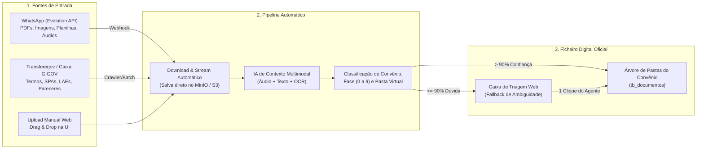

# Módulo 2: GED & Ficheiro Digital do Convênio

## 1. Visão Geral e Responsabilidades
O Módulo de Gestão Eletrônica de Documentos (GED) é o Bounded Context projetado para substituir definitivamente o sistema rudimentar de pastas do Windows utilizado pelas consultorias municipais por um **Ficheiro Digital Inteligente** e auditável.

### Principais Dores Solucionadas
1. **Hiperespecialização Prematura em Notas Fiscais**: O esquema anterior limitava a tabela `tb_documentos` a tipos fiscais (`NOTA_FISCAL_SERVICOS`, `NOTA_FISCAL_MERCADORIAS`, `RECIBO_LEGAL`). O GovFlow agora suporta nativamente **todos os tipos de documentos** produzidos e recebidos ao longo do ciclo de vida do convênio.
2. **Desorganização de Arquivos Locais**: Documentos espalhados em drives locais, WhatsApps de funcionários e e-mails são centralizados sob a taxonomia oficial do convênio, organizados pelas 10 Fases do Ciclo de Vida.
3. **Falta de Versionamento e Rastreabilidade**: Cada documento possui metadados, autor de upload, tags de busca, status de conferência, hash SHA-256 e trilha de auditoria completa.

---

## 2. Taxonomia Oficial do Ficheiro Digital (Árvore por Fases)

Cada convênio possui um diretório raiz virtual estruturado automaticamente nas 10 Fases:

```
📁 [Prefeitura] / [Convênio SICONV #954120 - Objeto]
├── 📁 00_Habilitacao_e_Proposta
│   ├── Certidões CAUC (16 itens do art. 25 LRF)
│   ├── Proposta Formal e Plano de Trabalho Inicial
│   ├── Pareceres Técnicos de Emenda / SIOP
│   └── Dossiê de Declarações (Capacidade Técnica, Não Duplicidade, LOA)
├── 📁 01_Celebracao_e_Formalizacao
│   ├── Termo de Convênio / Contrato de Repasse Assinado
│   ├── Publicação no Diário Oficial da União (DOU)
│   └── Notificação de Abertura de Conta Vinculada (Op 006)
├── 📁 02_Clausula_Suspensiva_e_Engenharia
│   ├── Projetos de Engenharia (Plantas, Memoriais Descritivos, ART/RRT)
│   ├── Planilha Orçamentária SINAPI / Curva ABC / BDI
│   ├── Licenças Ambientais (LP, LI, LO)
│   ├── Comprovação de Titularidade do Imóvel / Desapropriação
│   └── SPA (Síntese do Projeto Aprovado) e LAE emitidos pela Mandatária
├── 📁 03_Licitacao_e_Contratacao
│   ├── Edital de Licitação e Parecer Jurídico
│   ├── Atas de Sessão e Homologação do Certame
│   ├── Contrato Administrativo de Execução (Lei 14.133/2021)
│   ├── Parecer VRPL (Verificação do Resultado do Processo Licitatório)
│   └── AIO (Autorização de Início de Objeto expedida pela União/Caixa)
├── 📁 04_Execucao_Fisica_e_Medicoes
│   ├── Boletins de Medição (BMs assinados pelo fiscal)
│   ├── Relatórios Fotográficos Georreferenciados da Obra
│   ├── Diários de Obra
│   └── RAE (Relatório de Acompanhamento de Engenharia da Caixa)
├── 📁 05_Execucao_Financeira_e_Pagamentos
│   ├── Documentos Hábeis (Notas Fiscais de Serviços e Mercadorias, Recibos)
│   ├── Guias de Retenções Tributárias (DARF, DAM, GPS, FGTS)
│   ├── Comprovantes de Liquidação e Ordens Bancárias OBTV
│   └── Extratos da Conta Vinculada (Op 006)
├── 📁 06_Alteracoes_Contratuais_e_Aditivos
│   ├── Termos Aditivos de Prorrogação de Vigência
│   ├── Termos Aditivos de Valor (Acréscimo/Supressão até 25%)
│   ├── Apostilamentos de Reajuste Anual (INCC/IPCA)
│   └── Pareceres de Reprogramação da Caixa GIGOV
├── 📁 07_Prestacao_Contas_e_Termo_Recebimento
│   ├── Termo de Recebimento Provisório
│   ├── Termo de Recebimento Definitivo da Obra (art. 140 Lei 14.133/21)
│   ├── Relatório de Cumprimento do Objeto (RCO protocolado)
│   └── Placa de Inauguração (Registro fotográfico)
├── 📁 08_Encerramento_Financeiro_e_Saldos
│   ├── GRU de Recolhimento dos Saldos Remanescentes e Rendimentos
│   └── Comprovante Bancário de Encerramento com Saldo R$ 0,00
└── 📁 09_Notificacoes_e_Passivo_Juridico
    ├── Notificações de Glosa e Diligências da Mandatária
    ├── Notificação SELIC de 45 Dias
    ├── Peças de Defesa e Ações de Ressarcimento (Súmula 230 TCU)
    └── Processos de Tomada de Contas Especial (TCE)
```

---

## 3. Modelo de Dados Relacional (PostgreSQL)

O modelo separa o **Documento Base Universal** (comum a todos os tipos) da **Especialização Fiscal** (`DocumentoHabil`), garantindo desacoplamento e flexibilidade.

```sql
-- 1. Tabela Universal de Documentos do Ficheiro Digital
CREATE TABLE IF NOT EXISTS core_schema.tb_documentos (
    id UUID PRIMARY KEY DEFAULT gen_random_uuid(),
    tenant_id UUID NOT NULL REFERENCES core_schema.tb_consultorias(id) ON DELETE CASCADE,
    prefeitura_id UUID NOT NULL REFERENCES core_schema.tb_prefeituras(id) ON DELETE CASCADE,
    convenio_id UUID REFERENCES core_schema.tb_convenios(id) ON DELETE SET NULL,
    
    -- Localização no Ficheiro Digital
    fase_ciclo_vida VARCHAR(40) NOT NULL, -- 'FASE_00_PROPOSTA', 'FASE_01_CELEBRACAO', 'FASE_02_CLAUSULA_SUSPENSIVA', etc.
    categoria_documento VARCHAR(50) NOT NULL, -- 'PROJETO_ENGENHARIA', 'LICENCA_AMBIENTAL', 'LICITACAO', 'MEDICAO', 'DOCUMENTO_HABIL', 'TERMO_ADITIVO', etc.
    pasta_virtual VARCHAR(255) NOT NULL DEFAULT '/',
    
    -- Armazenamento Físico S3 / MinIO
    s3_bucket VARCHAR(100) NOT NULL,
    s3_key VARCHAR(500) NOT NULL,
    nome_arquivo_original VARCHAR(255) NOT NULL,
    content_type VARCHAR(100) NOT NULL,
    tamanho_bytes BIGINT NOT NULL,
    hash_sha256 VARCHAR(64),
    
    -- Ciclo de Revisão e Status
    status VARCHAR(30) NOT NULL DEFAULT 'RECEBIDO', -- 'RECEBIDO', 'EM_CONFERENCIA', 'APROVADO', 'REJEITADO', 'SUBMETIDO_TRANSFEREGOV'
    origem_canal VARCHAR(30) NOT NULL DEFAULT 'UPLOAD_MANUAL', -- 'UPLOAD_MANUAL', 'WHATSAPP', 'TRANSFEREGOV_CRAWLER', 'EMAIL'
    
    -- Metadados de Indexação e Busca
    tags TEXT[],
    metadados_json JSONB, -- Metadados livres específicos do tipo de documento
    
    -- Responsável pelo Upload / Ingestão
    criado_por_usuario_id UUID REFERENCES core_schema.tb_usuarios(id) ON DELETE SET NULL,
    motivo_rejeicao TEXT,
    created_at TIMESTAMP WITH TIME ZONE NOT NULL DEFAULT CURRENT_TIMESTAMP,
    updated_at TIMESTAMP WITH TIME ZONE NOT NULL DEFAULT CURRENT_TIMESTAMP
);

CREATE INDEX IF NOT EXISTS idx_documentos_tenant ON core_schema.tb_documentos(tenant_id);
CREATE INDEX IF NOT EXISTS idx_documentos_convenio_fase ON core_schema.tb_documentos(convenio_id, fase_ciclo_vida);
CREATE INDEX IF NOT EXISTS idx_documentos_status ON core_schema.tb_documentos(status);
CREATE INDEX IF NOT EXISTS idx_documentos_categoria ON core_schema.tb_documentos(categoria_documento);

-- 2. Tabela Especializada para Documentos Hábeis / Fiscais (1:1 com tb_documentos quando categoria = 'DOCUMENTO_HABIL')
CREATE TABLE IF NOT EXISTS core_schema.tb_documentos_habeis_dados (
    documento_id UUID PRIMARY KEY REFERENCES core_schema.tb_documentos(id) ON DELETE CASCADE,
    tipo_documento_habil VARCHAR(30) NOT NULL, -- 'NOTA_FISCAL_SERVICOS', 'NOTA_FISCAL_MERCADORIAS', 'RECIBO_LEGAL'
    numero_documento VARCHAR(50),
    serie_documento VARCHAR(10),
    chave_acesso_nfe VARCHAR(44),
    data_emissao DATE,
    cnpj_credor VARCHAR(18),
    razao_social_credor VARCHAR(200),
    descricao_servico TEXT,
    valor_bruto NUMERIC(15, 2),
    valor_total_deducoes NUMERIC(15, 2) DEFAULT 0.00,
    valor_liquido NUMERIC(15, 2),
    status_validacao_matematica BOOLEAN NOT NULL DEFAULT FALSE,
    confidence_score_ia NUMERIC(4, 3) DEFAULT 0.000,
    dados_extracao_ia_json JSONB,
    bounding_boxes_json JSONB,
    dados_revisao_json JSONB
);

-- 3. Histórico e Trilha Imutável de Auditoria
CREATE TABLE IF NOT EXISTS core_schema.tb_documentos_auditoria (
    id UUID PRIMARY KEY DEFAULT gen_random_uuid(),
    tenant_id UUID NOT NULL,
    documento_id UUID NOT NULL REFERENCES core_schema.tb_documentos(id) ON DELETE CASCADE,
    usuario_id UUID NOT NULL REFERENCES core_schema.tb_usuarios(id),
    acao VARCHAR(30) NOT NULL, -- 'UPLOAD', 'CLASSIFICACAO', 'APROVACAO', 'REJEICAO', 'MOVIDO_DE_PASTA', 'DOWNLOAD'
    justificativa TEXT,
    snapshot_anterior_json JSONB,
    snapshot_atual_json JSONB,
    realizado_em TIMESTAMP WITH TIME ZONE NOT NULL DEFAULT CURRENT_TIMESTAMP
);

CREATE INDEX IF NOT EXISTS idx_doc_auditoria_doc ON core_schema.tb_documentos_auditoria(documento_id);
```

---

## 4. Endpoints da API REST (Ficheiro Digital)

### 4.1 Navegação e Consulta do Ficheiro
- `GET /api/v1/convenios/{convenioId}/ficheiro`:
  - Retorna a árvore hierárquica completa de pastas e arquivos daquele convênio.
- `GET /api/v1/convenios/{convenioId}/ficheiro/fases/{fase}`:
  - Lista os documentos pertencentes especificamente àquela fase (ex: `FASE_02_CLAUSULA_SUSPENSIVA`).
- `GET /api/v1/documentos/{id}`:
  - Detalha os metadados do documento e dados especializados (se for fiscal).

### 4.2 Upload, Download e Operações de Arquivo
- `POST /api/v1/convenios/{convenioId}/ficheiro/upload`:
  - Multipart/form-data para upload direto na interface web.
  - Campos: `arquivo`, `faseCicloVida`, `categoriaDocumento`, `tags`.
- `GET /api/v1/documentos/{id}/download`:
  - Download do arquivo com Content-Disposition e streaming a partir do MinIO/S3.
- `GET /api/v1/documentos/{id}/preview`:
  - Geração de URL assinada ou stream inline para visualizador de PDF/imagem no navegador.
- `GET /api/v1/convenios/{convenioId}/ficheiro/download-zip`:
  - Compacta em ZIP pastas selecionadas ou o convênio inteiro para backup local da consultoria.
- `PATCH /api/v1/documentos/{id}/mover`:
  - Move um documento de fase ou categoria (ex: documento classificado incorretamente pela IA corrigido com 1 clique).

---

## 5. Ingestão e Arquivamento Automático (WhatsApp + IA + Transferegov)

O Ficheiro Digital do Convênio não depende de upload manual diário. Ele opera como o **ponto de convergência automático** de todas as entradas documentais:



### 5.1 O Ciclo de Download e Arquivamento Automático

1. **Download Automático do WhatsApp (Zero Intervenção Manual)**:
   - Quando um fiscal, engenheiro, secretário ou agente envia um documento pelo WhatsApp, o `whatsapp-service` intercepta o webhook e realiza o **download e streaming binário imediato** do arquivo temporário da Evolution API diretamente para o bucket persistente do MinIO/S3 (`MediaStorageHandler`).
   - O analista **nunca precisa** abrir o WhatsApp Web, clicar em baixar arquivo na pasta "Downloads" do Windows e subir manualmente no sistema.

2. **Classificação e Injeção Automática no Ficheiro pela IA**:
   - Assim que o arquivo é gravado no S3, o RabbitMQ notifica a IA (`ai-service`).
   - A IA transcreve áudios anteriores, analisa o texto das mensagens recentes do remetente e executa OCR no documento.
   - Identificado o convênio (ex: `SICONV #954120 - Escola`) e a fase (ex: `FASE_04_EXECUCAO_FISICA_E_MEDICOES`), a IA cria automaticamente o registro na tabela `core_schema.tb_documentos` vinculando-o à pasta virtual correspondente (ex: `/04_Execucao_Fisica_e_Medicoes/Boletim_Medicao_03.pdf`).
   - O arquivo passa a aparecer **instantaneamente** na árvore do Ficheiro Digital daquele convênio no Cockpit Web.

3. **Fallback Resiliente (Caixa de Triagem)**:
   - Se o remetente enviar um documento genérico sem texto e atuar em múltiplos convênios, o sistema não descarta nem perde o arquivo: ele armazena o binário no MinIO e gera um card na **Caixa de Triagem Web** do Agente responsável. Com **1 clique**, o agente confirma a qual convênio e fase o documento pertence, e o sistema move o arquivo para a pasta definitiva no Ficheiro.

4. **Sincronização com Transferegov.br**:
   - Peças oficiais geradas na esfera federal (publicação do convênio no DOU, pareceres técnicos da Caixa GIGOV, relatórios de prestação de contas protocolados) são ingeridas via crawler/API e arquivadas automaticamente nas Fases 00, 01, 02 e 07.

5. **Download em Lote para o Computador da Consultoria (Exportação)**:
   - Embora o ficheiro viva na nuvem, o analista pode a qualquer momento clicar no botão **"Baixar Convênio Completo (ZIP)"** ou **"Baixar Pasta da Fase (ZIP)"**. O backend compacta todos os arquivos preservando a nomenclatura limpa e a árvore de diretórios oficial, permitindo que a consultoria grave em pendrives ou envie cópias integrais a auditorias e órgãos de controle.

---

## 6. Roteiro de Teste Manual Passo a Passo (Playbook Operacional do Módulo 2)

### 6.1 Teste Manual de Banco de Dados e Metadados (PostgreSQL)
1. **Verificação de Estrutura Generalizada**:
   ```sql
   \d core_schema.tb_documentos
   \d core_schema.tb_documentos_habeis_dados
   ```
   - *Validação*: Confirmar que `tb_documentos` contém as colunas `fase_ciclo_vida`, `categoria_documento`, `pasta_virtual`, `metadados_json`, e que colunas hiperespecializadas fiscais foram migradas para `tb_documentos_habeis_dados`.
2. **Inserção e Leitura de Documento Polimórfico**:
   ```sql
   INSERT INTO core_schema.tb_documentos (
       id, tenant_id, prefeitura_id, convenio_id, fase_ciclo_vida, categoria_documento,
       pasta_virtual, nome_original, s3_key, s3_bucket, mime_type, tamanho_bytes,
       hash_sha256, metadados_json, status_processamento
   ) VALUES (
       'd0000001-0000-0000-0000-000000000001',
       'c0a80101-0000-0000-0000-000000000001',
       'p0a80101-0000-0000-0000-000000000001',
       'c9999999-0000-0000-0000-000000000001',
       'FASE_02_CLAUSULA_SUSPENSIVA',
       'PROJETO_BASICO_ENGENHARIA',
       '/02_Clausula_Suspensiva/Projetos_Engenharia',
       'Projeto_Pavimentacao_Patos.pdf',
       'tenants/c0a80101-0000-0000-0000-000000000001/prefeituras/p0a80101-0000-0000-0000-000000000001/convenios/c9999999-0000-0000-0000-000000000001/fases/02/d0000001_Projeto_Pavimentacao_Patos.pdf',
       'govflow-documentos',
       'application/pdf',
       2048500,
       'e3b0c44298fc1c149afbf4c8996fb92427ae41e4649b934ca495991b7852b855',
       '{"autor": "Eng. Silva", "artNumero": "PB202601928", "extensaoKm": 2.4}'::jsonb,
       'CONCLUIDO'
   );
   ```
   - *Validação*: Inserção bem-sucedida confirmando flexibilidade de metadados JSONB.

### 6.2 Teste Manual de Upload e Navegação Web na Árvore de Pastas
1. **Acessar o Ficheiro Digital**:
   - No navegador, acessar `http://localhost:4200/convenios/{convenioId}/cockpit` e clicar na aba "Ficheiro Digital".
   - *Validação*: A árvore hierárquica das 10 Fases é renderizada. Pastas vazias exibem indicador visual discreto (ex: "0 arquivos") e pastas com documentos exibem contador.
2. **Upload Manual Drag & Drop**:
   - Clicar na pasta `02_Clausula_Suspensiva` e na subpasta `Licencas_Ambientais`.
   - Arrastar um arquivo de licença prévia (`LP_0123_2026.pdf`) para a área de upload.
   - Selecionar a categoria: "Licença Ambiental (LP/LI/LO)".
   - Clicar em "Salvar no Ficheiro".
   - *Validação*: Barra de progresso reativa, arquivo listado na tabela da pasta com tamanho, data e autor do envio.

### 6.3 Teste Manual de Armazenamento no MinIO (Console Web)
1. **Acessar MinIO Console**:
   - Abrir `http://localhost:9001` no navegador (Login: `minioadmin` / `minioadmin`).
   - Clicar em "Buckets" -> `govflow-documentos`.
2. **Navegar na Árvore Física**:
   - Acompanhar a hierarquia de pastas criada automaticamente:
     `tenants/` -> `{tenantId}/` -> `prefeituras/` -> `{prefeituraId}/` -> `convenios/` -> `{convenioId}/` -> `fases/02/`.
   - Clicar no arquivo `LP_0123_2026.pdf`.
   - *Validação*: Content-Type registrado como `application/pdf`, tamanho idêntico ao do computador e metadados S3 preservados.

### 6.4 Teste Manual de Pré-Visualização Inline de PDF
1. **Acionar Preview na Interface**:
   - Na listagem de arquivos da Fase 02 no frontend, clicar no ícone de "Visualizar" (Olho).
2. **Inspeção de Rede (DevTools F12)**:
   - Constatar requisição `GET /api/v1/documentos/{id}/preview`.
   - Constatar resposta com `{ "url": "http://localhost:9000/govflow-documentos/...?X-Amz-Signature=..." }`.
   - *Validação*: O modal de visualização abre e exibe o PDF renderizado página por página diretamente na tela, sem exigir download para o disco rígido do usuário.

### 6.5 Teste Manual de Download em Lote (Exportação ZIP)
1. **Solicitar Backup em ZIP**:
   - Na tela do Ficheiro Digital, marcar os checkboxes de 3 arquivos em pastas distintas (ex: 1 na Fase 01, 1 na Fase 02, 1 na Fase 04).
   - Clicar no botão "Baixar Selecionados (ZIP)".
   - *Validação*: Download do arquivo `Dossie_Convenio_{numeroSiconv}.zip` inicia instantaneamente via streaming.
2. **Conferência da Integridade do ZIP**:
   - Abrir o ZIP baixado no Windows Explorer:
     - Constatar que os arquivos estão organizados em subpastas idênticas à árvore do sistema:
       `/01_Celebracao_e_Formalizacao/Termo_Convenio.pdf`
       `/02_Clausula_Suspensiva/LP_0123_2026.pdf`
       `/04_Execucao_Fisica_e_Medicoes/Boletim_Medicao_01.pdf`
     - Abrir cada um dos arquivos extraídos e constatar integridade de 100% (nenhum arquivo corrompido).


