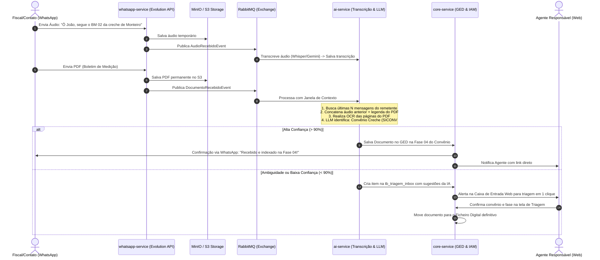
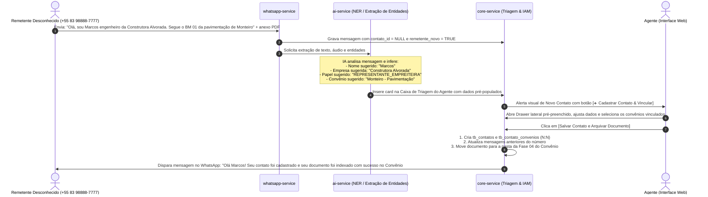

# Módulo 3: Comunicação, WhatsApp & IA de Contexto

## 1. Visão Geral e Responsabilidades
O Módulo de Comunicação & WhatsApp é o Bounded Context encarregado da recepção omnicanal de mensagens, áudios e arquivos externos, roteamento multi-convênio e integração com modelos de inteligência artificial generativa/multimodal.

### Principais Dores Solucionadas
1. **Acoplamento Incorreto de Contatos a 1 Prefeitura ou 1 Convênio**: No modelo original, um contato telefônico estava rigidamente vinculado a apenas uma prefeitura (`prefeitura_id`). Na vida real, engenheiros fiscais, secretários regionais e prestadores de serviços atuam em **múltiplos convênios (relação 1:N)** e até em prefeituras diferentes.
2. **Ingestão Cega sem Contexto de Conversa**: Processar um documento PDF isoladamente sem ler as mensagens de áudio ou texto que o acompanharam impedia a IA de saber a qual obra o documento se referia. A nova arquitetura implementa uma **Janela de Contexto de Conversa**, onde as mensagens recentes da conversa são passadas para o LLM.
3. **Estratégia "Agnóstica na Entrada, Classificadora na Saída"**: O serviço de WhatsApp não tenta adivinhar ou restringir se o arquivo é uma nota fiscal ou medição. Ele aceita qualquer arquivo/áudio/texto, armazena de forma durável e delega para a esteira de IA identificar o convênio, a fase e a categoria do documento.
4. **Resolução Híbrida (IA + Caixa de Triagem)**: Se a IA deduzir com alta confiança (> 90%), o documento é automaticamente indexado na fase correta do Ficheiro Digital e o Agente responsável é notificado. Se houver dúvida ou múltiplos convênios possíveis, o documento é encaminhado para a **Caixa de Triagem Web** do Agente responsável.

---

## 2. Modelo de Dados Relacional (PostgreSQL)

```sql
-- 1. Contatos Externos (Desacoplados de Prefeitura Exclusiva)
CREATE TABLE IF NOT EXISTS whatsapp_schema.tb_contatos (
    id UUID PRIMARY KEY DEFAULT gen_random_uuid(),
    tenant_id UUID NOT NULL,
    phone_number VARCHAR(30) NOT NULL UNIQUE, -- Formato E.164 sanitizado (ex: 5583999998888)
    nome VARCHAR(150) NOT NULL,
    papel VARCHAR(100), -- 'FISCAL_ENGENHEIRO', 'SECRETARIO_MUNICIPAL', 'REPRESENTANTE_EMPREITEIRA', 'AGENTE_CONSULTORIA'
    empresa_ou_orgao VARCHAR(150),
    ativo BOOLEAN NOT NULL DEFAULT TRUE,
    created_at TIMESTAMP WITH TIME ZONE NOT NULL DEFAULT CURRENT_TIMESTAMP,
    updated_at TIMESTAMP WITH TIME ZONE NOT NULL DEFAULT CURRENT_TIMESTAMP
);

CREATE INDEX IF NOT EXISTS idx_contatos_phone ON whatsapp_schema.tb_contatos(phone_number);
CREATE INDEX IF NOT EXISTS idx_contatos_tenant ON whatsapp_schema.tb_contatos(tenant_id);

-- 2. Associação N:N entre Contato e Convênios
CREATE TABLE IF NOT EXISTS whatsapp_schema.tb_contato_convenios (
    contato_id UUID NOT NULL REFERENCES whatsapp_schema.tb_contatos(id) ON DELETE CASCADE,
    convenio_id UUID NOT NULL,
    prefeitura_id UUID NOT NULL,
    papel_especifico VARCHAR(100), -- ex: 'RESPONSAVEL_TECNICO_OBRA', 'FISCAL_TITULAR'
    criado_em TIMESTAMP WITH TIME ZONE NOT NULL DEFAULT CURRENT_TIMESTAMP,
    PRIMARY KEY (contato_id, convenio_id)
);

CREATE INDEX IF NOT EXISTS idx_contato_conv_convenio ON whatsapp_schema.tb_contato_convenios(convenio_id);
CREATE INDEX IF NOT EXISTS idx_contato_conv_prefeitura ON whatsapp_schema.tb_contato_convenios(prefeitura_id);

-- 3. Mensagens Inbound com Trilha de Contexto
CREATE TABLE IF NOT EXISTS whatsapp_schema.tb_mensagens_inbound (
    id UUID PRIMARY KEY DEFAULT gen_random_uuid(),
    tenant_id UUID,
    contato_id UUID REFERENCES whatsapp_schema.tb_contatos(id) ON DELETE SET NULL,
    external_message_id VARCHAR(150) NOT NULL UNIQUE,
    sender_phone VARCHAR(30) NOT NULL,
    sender_name VARCHAR(150),
    message_type VARCHAR(30) NOT NULL, -- 'TEXT', 'AUDIO', 'DOCUMENT', 'IMAGE'
    content_text TEXT,
    audio_transcription TEXT, -- Preenchido após transcrição por IA
    s3_bucket VARCHAR(100),
    s3_key VARCHAR(500),
    media_mimetype VARCHAR(100),
    file_size_bytes BIGINT,
    processed BOOLEAN NOT NULL DEFAULT FALSE,
    created_at TIMESTAMP WITH TIME ZONE NOT NULL DEFAULT CURRENT_TIMESTAMP
);

-- 4. Fila / Caixa de Triagem do Agente (Inbox de Ambiguidade)
CREATE TABLE IF NOT EXISTS core_schema.tb_triagem_inbox (
    id UUID PRIMARY KEY DEFAULT gen_random_uuid(),
    tenant_id UUID NOT NULL REFERENCES core_schema.tb_consultorias(id) ON DELETE CASCADE,
    agente_responsavel_id UUID REFERENCES core_schema.tb_usuarios(id) ON DELETE SET NULL,
    mensagem_inbound_id UUID,
    documento_id UUID REFERENCES core_schema.tb_documentos(id) ON DELETE CASCADE,
    
    -- Sugestão da IA
    convenio_sugerido_id UUID REFERENCES core_schema.tb_convenios(id) ON DELETE SET NULL,
    fase_sugerida VARCHAR(40),
    confidence_score NUMERIC(4, 3) NOT NULL DEFAULT 0.000,
    motivo_ambiguidade TEXT, -- ex: 'Remetente associado aos convênios #954120 e #943201; texto não especificou a obra.'
    
    -- Status da Triagem
    status VARCHAR(30) NOT NULL DEFAULT 'PENDENTE', -- 'PENDENTE', 'RESOLVIDO', 'IGNORADO'
    resolvido_em TIMESTAMP WITH TIME ZONE,
    created_at TIMESTAMP WITH TIME ZONE NOT NULL DEFAULT CURRENT_TIMESTAMP
);

CREATE INDEX IF NOT EXISTS idx_triagem_agente ON core_schema.tb_triagem_inbox(agente_responsavel_id);
CREATE INDEX IF NOT EXISTS idx_triagem_status ON core_schema.tb_triagem_inbox(status);
```

---

## 3. Pipeline de Processamento e Contexto de IA



---

## 4. Janela de Contexto da Conversa (Prompt Engineering)

Ao enviar o payload para a IA classificar o documento, o serviço injeta o histórico recente da conversa:

```json
{
  "remetente": {
    "telefone": "+5583999998888",
    "nome": "Eng. Roberto Carlos",
    "papel": "FISCAL_ENGENHEIRO",
    "convenios_associados": [
      { "id": "uuid-1", "siconv": "954120/2026", "municipio": "Monteiro", "objeto": "Construção de Creche Municipal" },
      { "id": "uuid-2", "siconv": "942100/2025", "municipio": "Monteiro", "objeto": "Pavimentação em Paralelepípedo" }
    ]
  },
  "historico_recente_conversa": [
    { "timestamp": "2026-09-29T10:14:00Z", "tipo": "AUDIO", "transcricao": "Fala pessoal, tô enviando a segunda medição da creche, conseguimos fechar a alvenaria ontem." },
    { "timestamp": "2026-09-29T10:15:10Z", "tipo": "DOCUMENT", "nome_arquivo": "BM_02_MEDICAO.pdf" }
  ],
  "conteudo_ocr_documento": "PREFEITURA MUNICIPAL DE MONTEIRO - BOLETIM DE MEDIÇÃO Nº 02 - CONTRATO 045/2026..."
}
```

Essa estrutura elimina alucinações e garante assertividade máxima na identificação automática.

---

## 5. Fluxo de Cadastro de Contatos a partir de Mensagens Recebidas (Inbound UX)

No cenário real, secretários municipais, engenheiros fiscais e fornecedores frequentemente iniciam o contato via WhatsApp antes de estarem cadastrados na base do GovFlow. O sistema não deve descartar essas mensagens nem exigir que o agente saia da tela para criar um cadastro manual em outro módulo.

### 5.1 O Ciclo Operacional de Cadastro com 1 Clique



### 5.2 Experiência Visual no Frontend (UI/UX Intuitiva)

Na Caixa de Triagem (`/triagem`) e no Hub de WhatsApp (`/whatsapp`):

1. **Card de Mensagem Não Identificada**:
   - Destaque com borda âmbar e badge: `⚠️ Número Novo Não Cadastrado (+55 83 98888-7777)`.
   - Exibição do nome do perfil do WhatsApp (ex: *"Marcos Alvorada"*) e da prévia do texto/áudio transcrito.
   - Botão de ação primária em destaque: **`[ ➕ Cadastrar Contato & Vincular ]`**.

2. **Quick Drawer Lateral (Sem Sair da Tela)**:
   - Ao clicar no botão, desliza um drawer lateral mantendo a conversa visível ao lado para consulta:
     - **Telefone**: Preenchido e bloqueado com o número que enviou a mensagem (`+55 83 98888-7777`).
     - **Nome Completo**: Campo com texto sugerido pela IA (ex: *"Marcos"*), permitindo edição rápida.
     - **Papel / Cargo**: Dropdown com opções pré-definidas (`Engenheiro Fiscal`, `Secretário Municipal`, `Representante de Empreiteira`, `Contador Municipal`).
     - **Empresa / Órgão**: Sugerido pela IA (ex: *"Construtora Alvorada Ltda"*).
     - **Vincular a Convênios (Relação 1:N)**:
       - Lista com busca e checkboxes dos convênios das prefeituras atendidas pelo agente logado.
       - A IA já deixa pré-marcado o convênio mais provável (ex: `☑ Convênio SICONV #942100 - Pavimentação Asfáltica (Monteiro - PB)`).
     - **Ação Conjunta de Arquivamento**:
       - Checkbox ativado por padrão: `☑ Arquivar imediatamente o documento em anexo na pasta da Fase 04 (Medições) do convênio selecionado`.
     - **Botão Final**: `[ Salvar Contato e Arquivar Documento (1 Clique) ]`.

---

## 6. Endpoints da API REST (Contatos e Triagem)

- `GET /api/v1/contatos`:
  - Lista contatos da consultoria com filtros por prefeitura, convênio ou telefone.
- `POST /api/v1/contatos`:
  - Cadastro avulso de contato externo com vinculação de convênios.
  - Body: `{ nome, phoneNumber, papel, empresaOuOrgao, conveniosIds: [UUID] }`.
- `POST /api/v1/triagem/{inboxId}/cadastrar-contato-e-arquivar`:
  - Endpoint transacional atômico acionado pelo drawer do frontend:
    - Cria o contato em `tb_contatos`.
    - Associa o contato aos convênios em `tb_contato_convenios`.
    - Atualiza as mensagens daquele número com o novo `contato_id`.
    - Indexa o documento anexo diretamente na pasta do convênio no GED (`tb_documentos`).
    - Resolve o item da `tb_triagem_inbox`.
- `GET /api/v1/triagem/pendentes`:
  - Retorna a lista de itens pendentes de triagem atribuídos ao agente logado (incluindo flag `remetenteNovo: true` e sugestões da IA).

---

## 7. Roteiro de Teste Manual Passo a Passo (Playbook Operacional do Módulo 3)

### 7.1 Teste Manual de Banco de Dados (Contatos 1:N Convênios)
1. **Verificação de Tabelas Desacopladas**:
   ```sql
   \d whatsapp_schema.tb_contatos
   \d whatsapp_schema.tb_contato_convenios
   \d whatsapp_schema.tb_triagem_inbox
   ```
   - *Validação*: Confirmar que `tb_contatos` não possui chave estrangeira engessada para uma única prefeitura e que `tb_contato_convenios` gerencia a relação N:N.
2. **Teste de Associação de Contato a Múltiplos Convênios**:
   ```sql
   -- Inserir contato que atua em 2 convênios de municípios diferentes:
   INSERT INTO whatsapp_schema.tb_contatos (id, tenant_id, phone_number, nome, papel_contato, orgao_empresa)
   VALUES ('c0000001-0000-0000-0000-000000000001', 'c0a80101-0000-0000-0000-000000000001', '+5583988887777', 'Eng. Roberto Farias', 'ENGENHEIRO_EMPREITEIRA', 'Construtora Vale do Sol');

   INSERT INTO whatsapp_schema.tb_contato_convenios (contato_id, convenio_id, principal)
   VALUES 
   ('c0000001-0000-0000-0000-000000000001', 'c1111111-0000-0000-0000-000000000001', TRUE),
   ('c0000001-0000-0000-0000-000000000001', 'c2222222-0000-0000-0000-000000000001', FALSE);
   ```
   - *Validação*: Consulta retornando o mesmo engenheiro vinculado aos dois convênios.

### 7.2 Teste Manual de Simulação de Webhook (WhatsApp Evolution API via cURL)
1. **Enviar Webhook com Mensagem de Número Desconhecido**:
   ```bash
   curl -i -X POST http://localhost:8082/api/v1/webhook/whatsapp \
     -H "Content-Type: application/json" \
     -d '{
       "event": "messages.upsert",
       "instance": "govflow-core",
       "data": {
         "key": {
           "remoteJid": "5583977775555@s.whatsapp.net",
           "fromMe": false,
           "id": "MSG-TEST-WPP-999"
         },
         "pushName": "Fiscal Marcos",
         "message": {
           "conversation": "Bom dia, envio a medição da reforma da creche de Monteiro."
         },
         "messageTimestamp": 1727600000
       }
     }'
   ```
   - *Validação*: HTTP `200 OK` retornado pelo `whatsapp-service`.
2. **Conferência da Gravação da Mensagem e Entrada na Triagem**:
   ```sql
   SELECT id, phone_number, push_name, status FROM whatsapp_schema.tb_triagem_inbox WHERE phone_number = '+5583977775555';
   ```
   - *Validação*: Registro criado com `status = 'PENDENTE'` e flag de remetente novo.

### 7.3 Teste Manual de Mensageria e IA (Whisper + OCR)
1. **Simular Envio de Áudio e Anexo**:
   - Disparar webhook com anexo de áudio `.ogg` e PDF da medição.
2. **Inspecionar RabbitMQ Management**:
   - Abrir `http://localhost:15672` e acessar a fila `fila.documentos.processados`.
   - *Validação*: Evento consumido e roteado para o `ai-service`.
3. **Inspecionar Logs do AI-Service**:
   - Executar `docker logs -f govflow-ai-service`.
   - *Validação*: Log exibindo transcrição de áudio: *"Bom dia, envio a medição..."* e extração OCR do cabeçalho do documento sem falhas de timeout.

### 7.4 Teste Manual da Caixa de Triagem e Quick Drawer no Frontend
1. **Acessar Tela de Triagem**:
   - No navegador, acessar `http://localhost:4200/whatsapp` e olhar a seção "Caixa de Triagem".
   - *Validação*: O card do número `+5583977775555` aparece com badge "Novo Contato", trecho do áudio transcrito e badge "Sugestão da IA: Convênio Creche Monteiro".
2. **Abrir Quick Drawer Lateral**:
   - Clicar sobre o card de triagem.
   - O drawer desliza pela lateral direita com os campos pré-preenchidos pela IA.
3. **Completar Cadastro e Vinculação**:
   - Nome: `Marcos Vinícius Silva`
   - Cargo / Papel: `Fiscal de Obras Municipal`
   - Órgão: `Secretaria de Obras de Monteiro`
   - Conferir checkbox marcado: `☑ Convênio Creche Municipal (#942100)`.
   - Manter ativada a opção: `☑ Arquivar automaticamente o documento na Fase 04 (Medições)`.
   - Clicar no botão `[ Salvar Contato e Arquivar Documento ]`.
   - *Validação*: Toast de sucesso "Contato cadastrado e documento arquivado no Ficheiro Digital com sucesso!". Card desaparece da lista de pendências da triagem.

### 7.5 Teste Manual de Verificação no Ficheiro Digital (GED)
1. **Navegar até o Convênio no Cockpit**:
   - Acessar `http://localhost:4200/convenios/{id_creche_monteiro}/cockpit` e clicar na aba "Ficheiro Digital".
   - Abrir a pasta `04_Execucao_Fisica_e_Medicoes`.
   - *Validação*: O documento recebido pelo WhatsApp está listado na pasta com o nome do remetente "Marcos Vinícius Silva", data/hora de recebimento e pronto para visualização ou auditoria.


