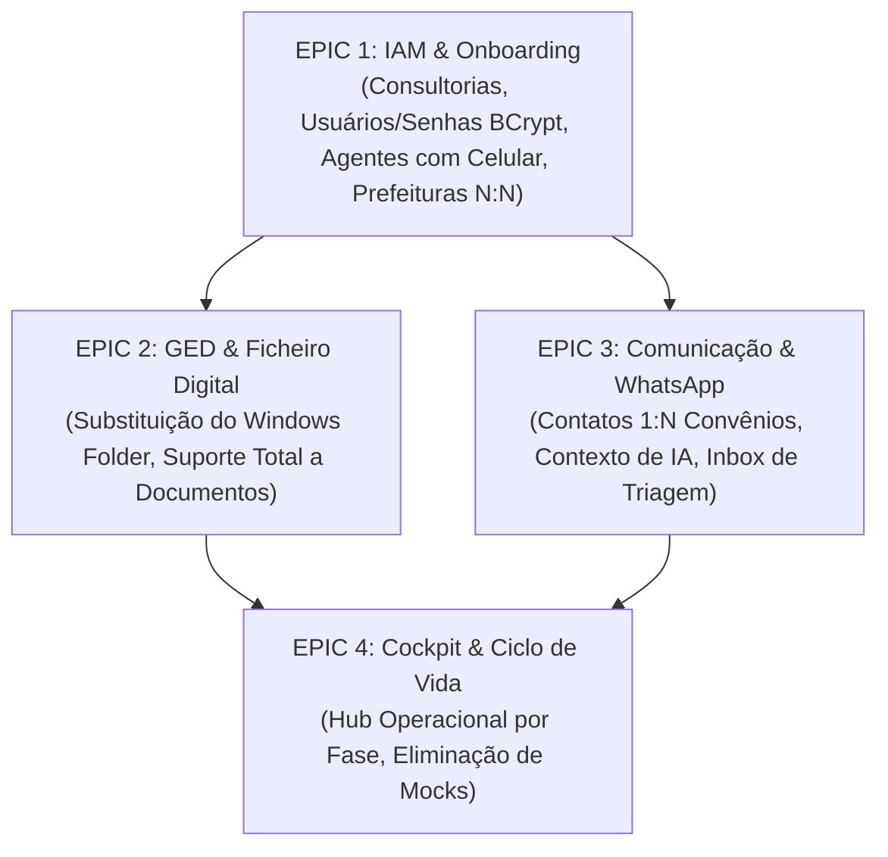
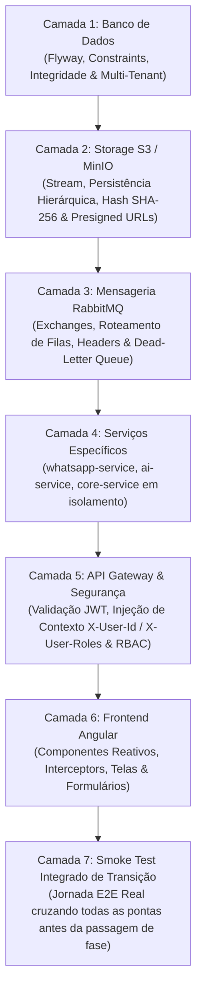

# Plano de Refatoração e Backlog de Tickets (GovFlow Modular)

## 1. Visão Geral da Transição Arquitetural
Este documento organiza o plano de execução para refatorar as falhas críticas diagnosticadas no sistema, transitando do estado legado/remendado para a nova **Arquitetura Modular dos 4 Bounded Contexts**.

A execução é dividida em 4 Epics sequenciais, priorizando o alicerce fundamental de Identidade e Acesso (**Módulo 1: IAM**), seguido do Repositório de Documentos (**Módulo 2: GED**), Comunicação Omnicanal (**Módulo 3: WhatsApp & IA**) e a Experiência Operacional de Ponta (**Módulo 4: Cockpit de Ciclo de Vida**).

---

## 1.1 Diagnóstico Detalhado do Módulo 1 (Dívidas Técnicas & Remendos Identificados)

A auditoria no código implementado até o momento revelou as seguintes fragilidades críticas no Módulo 1:

1. **Inexistência de Persistência de Usuários (`tb_usuarios` ausente)**:
   - No backend (`AuthController.java`), o cadastro de consultoria (`POST /api/v1/auth/register`) apenas persiste a empresa (`tb_consultorias`).
   - O usuário Administrador **não é persistido no banco**: o sistema apenas gera um `administradorId = UUID.randomUUID()` em memória no momento da requisição e assina o token JWT.
2. **Senhas Não Armazenadas nem Validadas**:
   - O campo `request.senha()` é completamente descartado no registro.
   - No login (`POST /api/v1/auth/login`), **não há qualquer conferência de senha**. Qualquer string digitada no campo de senha permite autenticação imediata.
   - O login tenta buscar a consultoria pelo e-mail e gera um ID determinístico em memória (`UUID.nameUUIDFromBytes(...)`). Se não encontrar a consultoria, inventa um `tenantId` aleatório e emite o token mesmo assim.
3. **Cegueira para o Usuário Logado no `core-service`**:
   - O `gateway` já possui filtros que injetam `X-Tenant-Id`, `X-User-Id` e `X-User-Roles`.
   - Contudo, o `TenantInterceptor` do `core-service` só lê `X-Tenant-Id`. Não existe um `UserContext` para armazenar o ID do usuário autenticado nem seus papéis (`ADMIN` vs `AGENTE`).
4. **Ausência de Gestão de Agentes e Telefone Celular**:
   - Inexistência de entidade `Agente` no domínio.
   - Inexistência de endpoints REST para listar, cadastrar, atualizar ou inativar agentes da consultoria.
   - Inexistência de persistência para o **número de telefone celular do agente** (necessário para identificação no WhatsApp e notificações operacionais).
5. **Inexistência de Vinculação Agente ↔ Prefeituras (N:N)**:
   - Falta da tabela associativa `tb_usuario_prefeituras`.
   - Como consequência, o `PrefeituraController` lista todas as prefeituras da consultoria indistintamente. Um agente vê e altera prefeituras de outros agentes por falta de filtro de escopo.
6. **Frontend sem Módulo de Equipe**:
   - O frontend possui as páginas de login e cadastro da consultoria, mas não oferece interface para o Administrador gerenciar seus agentes, cadastrar seus celulares ou associar as prefeituras que cada um atende.

---

## 2. Matriz de Dependência entre os Epics



---

## 3. Backlog Detalhado de Tickets de Execução

### EPIC 1: Módulo 1 — Identidade, Organização e Acesso (IAM & Onboarding)
*Objetivo: Substituir o cadastro remendado por uma base sólida de segurança, persistência real de usuários com BCrypt, papéis ADMIN e AGENTE, telefone celular para o WhatsApp e alocação N:N de prefeituras com visão restrita.*
*Status: [x] Concluído com Sucesso (100% dos testes e Playbook E2E validados)*

- **[x] [TICKET-IAM-01] Migração de Banco de Dados: Tabelas de Usuários e Alocação de Prefeituras**
  - **Serviço**: `flyway` / `core_schema`
  - **Arquivo**: `flyway/sql/V19__create_usuarios_and_agente_prefeituras_tables.sql`
  - **Status**: [x] Concluído
  - **Entregáveis**:
    - Tabela `core_schema.tb_usuarios`:
      - `id` (UUID PK), `tenant_id` (UUID FK), `nome` (VARCHAR 150), `email` (VARCHAR 150 UNIQUE), `senha_hash` (VARCHAR 255), `telefone_celular` (VARCHAR 30), `role` (VARCHAR 30: 'ADMIN' ou 'AGENTE'), `ativo` (BOOLEAN DEFAULT TRUE), timestamps.
    - Tabela `core_schema.tb_usuario_prefeituras`:
      - `usuario_id` (UUID FK), `prefeitura_id` (UUID FK), `atribuido_em` (TIMESTAMP). PK composta `(usuario_id, prefeitura_id)`.
    - Ajuste de constraint em `core_schema.tb_prefeituras` para unicidade composta `(tenant_id, cnpj)`.
    - Seed de compatibilidade para garantir que tenants de desenvolvimento pré-existentes possuam usuário `ADMIN` associado com hash BCrypt (custo 12) da senha `GovFlow2026!`.

- **[x] [TICKET-IAM-02] Infraestrutura de Segurança & Contexto de Usuário (`UserContext`)**
  - **Serviço**: `core-service`
  - **Status**: [x] Concluído
  - **Arquivos**:
    - `pom.xml`: Adicionado `spring-security-crypto`.
    - `infrastructure/config/SecurityConfig.java`: Bean de `PasswordEncoder` (`BCryptPasswordEncoder` com cost 12).
    - `infrastructure/interceptor/UserContext.java`: ThreadLocal com `userId`, `tenantId`, `roles` e `prefeiturasAtribuidasIds`, com métodos auxiliares `isAdmin()`, `isAgente()`, `hasAccessToPrefeitura(id)`.
    - `infrastructure/interceptor/TenantInterceptor.java`: Captura os headers repassados pelo Gateway (`X-User-Id`, `X-User-Roles`) além do `X-Tenant-Id` e popula o `UserContext`, limpando no `afterCompletion`.

- **[x] [TICKET-IAM-03] Modelo de Domínio e Persistência de Usuários**
  - **Serviço**: `core-service`
  - **Status**: [x] Concluído
  - **Arquivos**:
    - `domain/model/usuario/Usuario.java` (Aggregate Root puro) e `RoleUsuario.java` (`ADMIN`, `AGENTE`).
    - Exceções ricas: `AcessoNegadoException`, `CredenciaisInvalidasException`, `UsuarioInativoException`, `UsuarioNaoEncontradoException`, `EmailJaCadastradoException`, mapeadas no `GlobalExceptionHandler`.
    - `application/port/out/UsuarioRepositoryPort.java`.
    - `infrastructure/adapter/out/persistence/entity/UsuarioJpaEntity.java`, `UsuarioPrefeituraJpaEntity.java` e `UsuarioPrefeituraId.java`.
    - `infrastructure/adapter/out/persistence/mapper/UsuarioPersistenceMapper.java`.
    - `infrastructure/adapter/out/persistence/repository/SpringDataUsuarioRepository.java` e `SpringDataUsuarioPrefeituraRepository.java`.
    - `infrastructure/adapter/out/persistence/UsuarioRepositoryAdapter.java`.

- **[x] [TICKET-IAM-04] Use Cases & Endpoints de Autenticação Segura**
  - **Serviço**: `core-service`
  - **Status**: [x] Concluído
  - **Arquivos**:
    - `application/port/in/AutenticarUsuarioUseCase.java`, `CadastrarConsultoriaComAdminUseCase.java` e `ObterUsuarioAutenticadoUseCase.java`.
    - `application/service/AuthService.java`:
      - `cadastrarComAdmin`: Cria a `Consultoria` e em seguida cria o primeiro `Usuario` com `role: ADMIN`, persistindo `senha_hash` via BCrypt e `telefone_celular` no padrão E.164.
      - `autenticar`: Busca `Usuario` por email, valida a senha com `passwordEncoder.matches(...)`, carrega as prefeituras vinculadas e emite token JWT real assinado com claims (`roles`, `userId`, `tenantId`).
      - `obterPorId`: Permite obter o perfil completo para a rota `/me`.
    - `infrastructure/adapter/in/rest/AuthController.java`:
      - Atualizado `POST /api/v1/auth/register` (e `/register-consultoria`) e `POST /api/v1/auth/login` conectando aos novos use cases reais.
      - Criado `GET /api/v1/auth/me` para retornar o perfil completo do usuário autenticado e suas prefeituras atribuídas.

- **[x] [TICKET-IAM-05] Gestão de Agentes, Celular e Alocação de Prefeituras**
  - **Serviço**: `core-service`
  - **Status**: [x] Concluído
  - **Arquivos**:
    - `application/port/in/GerenciarAgenteUseCase.java` (Criar, Listar, Atualizar, Inativar e Alocar Prefeituras).
    - `application/service/AgenteService.java`:
      - Validação de perfil (somente `ADMIN` pode gerenciar agentes, verificado via `UserContext`).
      - Sanitização e validação de telefone celular no formato E.164 (ex: `+5583999998888`).
      - Vinculação transacional de `prefeituraIds` na `tb_usuario_prefeituras`.
    - `infrastructure/adapter/in/rest/AgenteController.java`:
      - `POST /api/v1/agentes` (criar novo agente da consultoria com celular e prefeituras associadas).
      - `GET /api/v1/agentes` (listar equipe de agentes e prefeituras de cada um).
      - `GET /api/v1/agentes/{id}` (obter detalhes do agente).
      - `PUT /api/v1/agentes/{id}` (editar dados, celular e prefeituras).
      - `DELETE /api/v1/agentes/{id}` (inativar agente).

- **[x] [TICKET-IAM-06] Restrição de Escopo de Prefeituras por Papel no Backend**
  - **Serviço**: `core-service`
  - **Status**: [x] Concluído
  - **Arquivos**:
    - `application/service/PrefeituraService.java`:
      - Injeta e inspeciona `UserContext`.
      - Se `UserContext.getRole() == ADMIN`: retorna todas as prefeituras ativas da consultoria.
      - Se `UserContext.getRole() == AGENTE`: filtra a consulta SQL via `listarPorIds` e `contarPorIds` para retornar **apenas** as prefeituras atribuídas na `tb_usuario_prefeituras`.
      - No método `buscarPorId(prefeituraId)`: lança `AcessoNegadoException` (403 Forbidden) caso o agente tente acessar uma prefeitura não atribuída.
      - Bloqueia mutações (`cadastrar`, `atualizar`, `inativar`) se o usuário for `AGENTE`.

- **[x] [TICKET-IAM-07] Frontend Angular: Gestão da Equipe de Agentes e Celular**
  - **Serviço**: `frontend`
  - **Status**: [x] Concluído
  - **Arquivos**:
    - `core/services/agente.service.ts`: Métodos `listarAgentes()`, `obterPorId()`, `cadastrarAgente()`, `atualizarAgente()`, `inativarAgente()` com fallback gracioso para modo demo.
    - Criado componente standalone `AgentesListPageComponent` em `/admin/agentes`:
      - Listagem da equipe com avatar, nome, e-mail, celular com formato nacional/E.164, badge de role e chips das prefeituras vinculadas.
      - Modal `CadastrarAgenteModalComponent`: Formulário com Nome, E-mail, Senha temporária, Celular com máscara `(00) 00000-0000` e checkboxes para seleção das prefeituras da consultoria.
    - Atualizado `auth.service.ts` com métodos reativos (`isAdmin()`, `isAgente()`, `prefeiturasAtribuidasIds()`, `carregarPerfilMe()`).
    - Atualizado `sidebar.component.ts` com o link "Equipe de Agentes" visível exclusivamente para perfil `ADMIN`.

- **[x] [TICKET-IAM-08] Frontend Angular: Adaptação do Header e Contexto de Prefeituras**
  - **Serviço**: `frontend`
  - **Status**: [x] Concluído
  - **Arquivos**:
    - `core/context/municipio-context.service.ts`:
      - Carrega municípios respeitando o retorno filtrado da API de acordo com o escopo do usuário logado.
    - `core/layout/header/header.component.ts`:
      - Exibe badge dinâmico do papel do usuário (`ADMIN` vs `AGENTE`) com cores e ícones distintos.
      - Botão "Cadastrar Nova Prefeitura" oculto para usuários com perfil `AGENTE`.
      - Seletor de municípios exibe apenas as prefeituras que o usuário tem permissão de operar.

---

### EPIC 2: Módulo 2 — GED & Ficheiro Digital do Convênio
*Objetivo: Substituir definitivamente o sistema de pastas do Windows das consultorias por um Ficheiro Digital inteligente organizado pelas 10 Fases, com streaming/download automático do WhatsApp, classificação pela IA, pré-visualização inline e exportação de backups em lote (ZIP).*

#### Diagnóstico Técnico do Módulo 2 (Dívidas Atuais)
1. **Hiperespecialização Prematura da Tabela de Documentos**: `core_schema.tb_documentos` foi projetada exclusivamente para notas fiscais (com campos diretos como `chave_acesso_nfe`, `cnpj_credor`, `valor_bruto`, `valor_liquido`), impossibilitando o armazenamento limpo de projetos de engenharia, licenças ambientais, editais e diários de obra.
2. **Inexistência de Mapeamento por Fases e Pastas Virtuais**: O banco não registra a qual das 10 Fases do Ciclo de Vida o arquivo pertence nem a sua localização virtual dentro da árvore do convênio.
3. **Download e Streaming Não Integrados ao Ficheiro**: O `whatsapp-service` faz streaming temporário de mídia, mas o evento gerado é tratado no `core-service` exclusivamente pelo `DocumentoProcessadoListener` esperando extração fiscal da IA, em vez de salvar e classificar o documento no Ficheiro Digital do convênio.
4. **Interface Baseada em Mocks**: O Cockpit exibe `MOCK_DOCS` e não possui interface de visualizador de arquivos (PDF/Image Viewer), nem árvore navegável de pastas por fase, nem ferramenta de download em lote (ZIP).

#### Backlog Detalhado de Tickets do Módulo 2

- **[TICKET-GED-01] Migração de Banco de Dados: Generalização de Documentos e Tabelas Especializadas**
  - **Serviço**: `flyway` / `core_schema`
  - **Arquivo**: `flyway/sql/V20__generalize_documentos_and_create_ficheiro_tables.sql`
  - **Entregáveis**:
    - Expandir `core_schema.tb_documentos`:
      - Adicionar `fase_ciclo_vida` (VARCHAR 40: `FASE_00_PROPOSTA` a `FASE_09_PASSIVO_JURIDICO`).
      - Adicionar `categoria_documento` (VARCHAR 50: `PROJETO_ENGENHARIA`, `LICENCA_AMBIENTAL`, `LICITACAO`, `MEDICAO`, `DOCUMENTO_HABIL`, `TERMO_ADITIVO`, `PRESTACAO_CONTAS`, etc.).
      - Adicionar `pasta_virtual` (VARCHAR 255 DEFAULT '/').
      - Adicionar `tags` (TEXT[]), `hash_sha256` (VARCHAR 64), `metadados_json` (JSONB) e `origem_canal` (VARCHAR 30: `UPLOAD_MANUAL`, `WHATSAPP`, `TRANSFEREGOV_CRAWLER`, `EMAIL`).
      - Adicionar `criado_por_usuario_id` (UUID FK `tb_usuarios`).
    - Criar tabela satélite `core_schema.tb_documentos_habeis_dados` (1:1 com `tb_documentos` para reter campos tributários e fiscais de notas fiscais).
    - Criar `core_schema.tb_documentos_auditoria` (trilha imutável de ações: `UPLOAD`, `CLASSIFICACAO`, `APROVACAO`, `REJEICAO`, `MOVIDO_DE_PASTA`, `DOWNLOAD`).

- **[TICKET-GED-02] Domínio e Portas Hexagonais do Ficheiro Digital**
  - **Serviço**: `core-service`
  - **Arquivos**:
    - `domain/model/documento/Documento.java` (Aggregate Root universal).
    - `domain/model/documento/FicheiroDigital.java` (Árvore hierárquica do convênio por fases).
    - Enums: `FaseCicloVida.java`, `CategoriaDocumento.java`, `StatusDocumento.java`, `OrigemCanal.java`.
    - `application/port/out/DocumentoRepositoryPort.java` e `FicheiroRepositoryPort.java`.
    - `application/port/out/DocumentoStoragePort.java`.
    - Entidades JPA e Mappers (`DocumentoJpaEntity`, `DocumentoHabilDadosJpaEntity`, `DocumentoAuditoriaJpaEntity`).

- **[TICKET-GED-03] Backend Storage MinIO/S3: Estrutura Hierárquica e Presigned URLs**
  - **Serviço**: `core-service`
  - **Arquivos**:
    - `infrastructure/adapter/out/storage/MinioDocumentoStorageAdapter.java`:
      - Gravação com chave estruturada: `tenants/{tenantId}/prefeituras/{prefeituraId}/convenios/{convenioId}/fases/{fase}/{docId}_{nomeArquivo}`.
      - Cálculo e validação de hash SHA-256 no stream de upload.
      - Geração de presigned URL temporária (15 minutos) para renderização inline de PDFs e imagens no frontend (`/preview`).
      - Streaming de download seguro com validação de permissões de tenant e prefeituras do usuário.

- **[TICKET-GED-04] Backend Engine de Download em Lote (Exportação ZIP)**
  - **Serviço**: `core-service`
  - **Arquivos**:
    - `application/service/ExportarFicheiroZipService.java`:
      - Criação sob demanda de arquivo `.zip` contendo os documentos das fases selecionadas ou do convênio integral.
      - Organização interna do ZIP espelhando a árvore de pastas oficial do convênio:
        `[SICONV_954120]/02_Clausula_Suspensiva/Projeto_Basico.pdf`, etc.
      - Endpoint `GET /api/v1/convenios/{id}/ficheiro/download-zip` e `GET /api/v1/convenios/{id}/ficheiro/fases/{fase}/download-zip`.

- **[TICKET-GED-05] Pipeline de Ingestão e Arquivamento Automático (WhatsApp + IA)**
  - **Serviço**: `core-service` / `whatsapp-service` / `ai-service`
  - **Arquivos**:
    - `infrastructure/adapter/in/amqp/DocumentoClassificadoListener.java`:
      - Consome `DocumentoClassificadoEvent` publicado pela IA após análise de contexto (áudio + texto + OCR).
      - Se `confidenceScore > 0.90`:
        - Registra o arquivo em `tb_documentos` vinculando-o diretamente ao `convenio_id`, `fase_ciclo_vida` e `pasta_virtual` recomendada.
        - Registra trilha de auditoria (`ORIGEM_WHATSAPP_AUTO`).
        - Envia confirmação via WhatsApp ao remetente informando a indexação na fase correspondente.
      - Se `confidenceScore <= 0.90`:
        - Insere o registro em `core_schema.tb_triagem_inbox` atribuído ao Agente responsável pela prefeitura do convênio sugerido.

- **[TICKET-GED-06] Backend REST API: Endpoints do Ficheiro Digital e Operações de Pasta**
  - **Serviço**: `core-service`
  - **Arquivos**:
    - `infrastructure/adapter/in/rest/FicheiroDigitalController.java`:
      - `GET /api/v1/convenios/{convenioId}/ficheiro`: Retorna a árvore hierárquica das 10 Fases com totalizadores de arquivos e tamanho em bytes.
      - `GET /api/v1/convenios/{convenioId}/ficheiro/fases/{fase}`: Lista documentos detalhados de uma fase específica.
      - `POST /api/v1/convenios/{convenioId}/ficheiro/upload`: Upload manual multipart/form-data direto na fase selecionada.
      - `PATCH /api/v1/documentos/{id}/mover`: Move o documento entre fases ou pastas virtuais (correção rápida em 1 clique).
      - `DELETE /api/v1/documentos/{id}`: Soft delete com justificativa de auditoria.

- **[TICKET-GED-07] Frontend Angular: Componente Explorer do Ficheiro Digital (Árvore e Pastas)**
  - **Serviço**: `frontend`
  - **Arquivos**:
    - `core/services/ficheiro-digital.service.ts`: Cliente HTTP com métodos de árvore, upload com barra de progresso, mover pasta e download ZIP.
    - Criar componente standalone `FicheiroDigitalComponent` (`/convenios/:id/ficheiro`):
      - Painel estilo "Windows Explorer / Google Drive": barra lateral com as 10 Fases numeradas, contadores de arquivos e alertas de pendências.
      - Visualização central em Grade de Cards ou Tabela detalhada (Nome, Categoria, Tamanho, Data, Autor/Origem, Status).
      - Zona de Drag-and-Drop para múltiplos arquivos com seleção automática de categoria.
      - Botões de exportação: "Baixar Convênio Completo (ZIP)" e "Baixar Pasta da Fase (ZIP)".

- **[TICKET-GED-08] Frontend Angular: Visualizador Rápido Inline (PDF & Image Viewer)**
  - **Serviço**: `frontend`
  - **Arquivos**:
    - Criar componente standalone `DocumentoPreviewModalComponent`:
      - Renderizador em tela cheia/modal de arquivos PDF e imagens sem forçar download local.
      - Barra lateral retrátil com metadados do documento, hash SHA-256, histórico de auditoria e botão de mover pasta / reclassificar fase.

---

### EPIC 3: Módulo 3 — Comunicação Omnicanal, WhatsApp & IA de Contexto
*Objetivo: Desacoplar contatos de prefeitura exclusiva (permitindo relação 1:N convênios), implementar ingestão agnóstica de arquivos/áudios e análise de contexto de conversa com triagem web em caso de ambiguidade.*

- **[TICKET-WPP-01] Migração de Banco de Dados: Contatos 1:N e Caixa de Triagem (Inbox)**
  - **Serviço**: `flyway` / `whatsapp_schema` e `core_schema`
  - **Arquivo**: `flyway/sql/V21__decouple_whatsapp_contatos_and_create_triagem_inbox.sql`
  - **Ações**:
    - Criar `whatsapp_schema.tb_contatos` e tabela associativa `whatsapp_schema.tb_contato_convenios` (contato_id, convenio_id, prefeitura_id).
    - Criar `core_schema.tb_triagem_inbox` para itens com ambiguidade de classificação.

- **[TICKET-WPP-02] WhatsApp Service: Ingestão Agnóstica e Gravação de Histórico**
  - **Serviço**: `whatsapp-service`
  - **Ações**:
    - Atualizar `ContactResolutionService` para buscar por telefone e retornar todos os convênios aos quais o remetente está associado (ou verificar se é o celular de um Agente cadastrado no IAM).
    - Garantir persistência durável no MinIO de qualquer formato de arquivo (PDF, imagens, planilhas, áudios OGG/MP3).
    - Emitir `DocumentoRecebidoEvent` e `AudioRecebidoEvent` enriquecidos com a lista de convênios candidatos.

- **[TICKET-WPP-03] AI Service: Janela de Contexto de Conversa e Classificação Multimodal**
  - **Serviço**: `ai-service`
  - **Ações**:
    - Implementar busca das últimas 5 mensagens da conversa do remetente (áudios transcritos + textos).
    - Montar prompt com a conversa recente + OCR do arquivo + lista de convênios do remetente.
    - Se certeza > 90%: postar no RabbitMQ como classificado para indexação direta no GED.
    - Se certeza <= 90%: postar evento para encaminhamento à Caixa de Triagem do Agente.

- **[TICKET-WPP-04] Frontend Angular: Caixa de Triagem do Agente (Inbox)**
  - **Serviço**: `frontend`
  - **Ações**:
    - Criar tela de Triagem (`/triagem`) mostrando documentos e mensagens recebidas via WhatsApp com sugestões da IA.
    - Badges distintos para "Ambiguidade de Convênio" e "⚠️ Remetente Novo Não Cadastrado".
    - Botões de confirmação rápida com 1 clique para atribuir ao convênio e fase corretos.

- **[TICKET-WPP-05] Backend Core: Endpoint Atômico de Cadastro de Contato e Arquivamento**
  - **Serviço**: `core-service`
  - **Arquivos**:
    - `application/service/CadastrarContatoETriarService.java`:
      - Endpoint `POST /api/v1/triagem/{inboxId}/cadastrar-contato-e-arquivar`.
      - Executa transacionalmente: criação do contato (`tb_contatos`), amarração N:N com convênios (`tb_contato_convenios`), atualização de mensagens anteriores e movimentação do documento para a pasta virtual do convênio no GED.

- **[TICKET-WPP-06] Frontend Angular: Quick Drawer Lateral de Cadastro de Contato com 1 Clique**
  - **Serviço**: `frontend`
  - **Arquivos**:
    - Criar componente standalone `CadastrarContatoDrawerComponent`:
      - Desliza lateralmente ao clicar em `[ ➕ Cadastrar Contato & Vincular ]` na Caixa de Triagem ou no WhatsApp Hub.
      - Campos pré-preenchidos pela inferência da IA (Nome, Telefone travado, Papel, Empresa).
      - Seleção por checkboxes dos convênios das prefeituras atendidas pelo agente.
      - Checkbox de arquivamento imediato do anexo na pasta da fase correspondente.
      - Toast de feedback e atualização reativa da lista.

---

### EPIC 4: Módulo 4 — Cockpit de Ciclo de Vida & Hub Operacional
*Objetivo: Eliminar dados mockados, transformando o Cockpit em um Hub Operacional integrado por fase com checklist legal, prazos fatais e conexão direta com o Ficheiro Digital.*

- **[TICKET-COCKPIT-01] Backend Core: Orquestração do Dossiê por Fase**
  - **Serviço**: `core-service`
  - **Ações**:
    - Implementar endpoint `GET /api/v1/convenios/{id}/fases/{fase}/dossie`, consultando o status dos 3 pilares da cláusula suspensiva, licitações, medições e documentos anexados no GED para aquela fase.
    - Endpoint para atualizar status de itens de checklist e disparar notificações ao contato responsável via WhatsApp.

- **[TICKET-COCKPIT-02] Frontend Angular: Redesenho do Cockpit e Integração Reativa**
  - **Serviço**: `frontend`
  - **Ações**:
    - Remover completamente `MOCK_DOCS` e `MOCK_PRAZOS` de `convenio-cockpit-page.component.ts`.
    - Ao clicar em qualquer fase da esteira, renderizar o "Dossiê da Fase": Checklist de Pendências, Arquivos daquela fase no GED e Alertas de Prazos Fatais.
    - Conectar botão de "Notificar via WhatsApp" ao serviço de mensageria outbound.

- **[TICKET-COCKPIT-03] Backend Core: Schemas de Extração Multidocumental e Propagação de Domínio**
  - **Serviço**: `core-service` / `ai-service`
  - **Arquivos**:
    - `application/service/ProcessarDocumentoGenericoExtraidoService.java`:
      - Schemas tipados de extração e validação para BM, ART/RRT, Licença Ambiental e Certidão CAUC.
      - Ao aprovar BM: alimenta `tb_medicoes` automaticamente.
      - Ao aprovar ART ou Licença Ambiental: marca como `SUPERADO` o pilar correspondente em `tb_condicionantes_suspensivas` (Fase 02).
      - Ao aprovar Certidão: atualiza o radar CAUC (Fase 00).

- **[TICKET-COCKPIT-04] Frontend Angular: Auditor Side-by-Side Multidocumental Polimórfico**
  - **Serviço**: `frontend`
  - **Arquivos**:
    - Refatorar `extraction-form.component.ts` e `audit-checklist.component.ts` para formulários dinâmicos com base na `categoria_documento`.
    - Exibir campos específicos e regras de consistência da IA para Boletins de Medição, ART, Licenças e Certidões ao lado do visualizador de PDF (`media-workspace`).
    - Botão de aprovação com efeito em cascata no ciclo de vida do convênio.

---

## 4. Fluxo de Teste Progressivo entre Fases (Quality Gate Multi-Camadas)

Nenhum Epic/Fase é considerado concluído sem passar pelo **Quality Gate Progressivo**. O avanço para a fase seguinte só é autorizado quando a cadeia completa de integração for validada de forma ascendente:



---

### 4.1 A Pirâmide de Validação por Camada Técnica

1. **Camada 1: Banco de Dados (PostgreSQL & Flyway)**:
   - Execução das migrações SQL sem erros em base limpa e sobre base existente.
   - Teste de integridade referencial: foreign keys em cascata controlada (`ON DELETE SET NULL` ou `CASCADE`).
   - Teste de isolamento multi-tenant: validação de que consultas com `X-Tenant-Id: A` não retornam dados do `Tenant B`.
   - Validação de constraints de unicidade compostas (ex: `(tenant_id, cnpj)` em prefeituras).

2. **Camada 2: Storage de Objetos (MinIO / S3)**:
   - Validação de streaming direto (sem buffer excessivo em heap).
   - Verificação da convenção de chave hierárquica: `tenants/{t}/prefeituras/{p}/convenios/{c}/fases/{f}/{id}_{arquivo}`.
   - Cálculo e comparação de integridade de hash SHA-256 no upload e download.
   - Teste de presigned URLs com expiração configurada (15 min) para visualização inline segura.

3. **Camada 3: Mensageria Assíncrona (RabbitMQ)**:
   - Teste de declaração de exchanges do tipo `topic` e bindings de filas.
   - Validação de serialização/deserialização JSON de eventos canônicos (`DocumentoRecebidoEvent`, `DocumentoClassificadoEvent`, `AudioRecebidoEvent`).
   - Verificação da propagação de metadados nos headers AMQP (`X-Correlation-Id`, `X-Tenant-Id`).
   - Teste de Dead Letter Queue (DLQ): envio de payload inválido deve rejeitar sem requeue infinito (`AmqpRejectAndDontRequeueException`).

4. **Camada 4: Serviços Específicos**:
   - **`whatsapp-service`**: Simulação de webhook com áudio e documento PDF; validação de streaming assíncrono e resolução de remetente.
   - **`ai-service`**: Extração de texto de áudio (Whisper), OCR em PDF e teste de inferência do LLM com prompt de conversa contextual.
   - **`core-service`**: Execução de use cases puros de negócio via testes unitários e de integração com MockMvc e JPA.

5. **Camada 5: API Gateway & Segurança Transversal**:
   - Validação de rotas públicas vs rotas autenticadas.
   - Validação de token JWT assinado: decodificação correta de `tenant_id`, `user_id` e `roles`.
   - Propagação correta dos headers downstream para os serviços internos (`X-Tenant-Id`, `X-User-Id`, `X-User-Roles`).
   - Teste de autorização: agente tentando acessar prefeitura não vinculada recebe HTTP `403 Forbidden`.

6. **Camada 6: Frontend Angular**:
   - Execução de testes unitários com Karma/Jasmine: `npm test -- --watch=false`.
   - Teste de componentes, formulários reativos, máscaras de CNPJ/Telefone, estados de carregamento e toasts de feedback.
   - Validação de guards de rota e interceptors HTTP injetando o Bearer Token.

7. **Camada 7: Smoke Test Integrado de Transição (E2E)**:
   - Roteiro operacional executável manualmente no navegador e via terminal cruzando todas as camadas antes da liberação da fase seguinte.

---

### 4.2 Quality Gates de Passagem entre os Epics

| Epic / Fase | Quality Gate Mandatório para Conclusão | Critério de Liberação para Próxima Fase |
| :--- | :--- | :--- |
| **Passagem do EPIC 1 (IAM) para EPIC 2** | **Smoke Test de Identidade & Escopo**: Cadastro de Consultoria -> Login com verificação BCrypt -> Cadastro de Agente com celular e vinculação de Prefeituras -> Verificação de que o Agente só lista as prefeituras atribuídas no Header e na API. | - Migração V19 aplicada com sucesso.<br/>- 100% dos testes de Auth e Prefeitura verdes.<br/>- Nenhum ID volátil ou senha em texto claro. |
| **Passagem do EPIC 2 (GED) para EPIC 3** | **Smoke Test do Ficheiro Digital**: Upload de arquivo em fase específica do convênio -> Gravação com chave hierárquica no MinIO -> Leitura no Explorer do Ficheiro -> Preview inline do PDF -> Download em lote ZIP íntegro. | - Migração V20 aplicada.<br/>- MinIO operando com paths por fase.<br/>- ZIP gerado descompacta com a árvore completa de pastas. |
| **Passagem do EPIC 3 (WPP/IA) para EPIC 4** | **Smoke Test de Ingestão Inbound**: Envio de mensagem/anexo de número desconhecido no WhatsApp -> Mensagem gravada no banco -> Áudio transcrito + OCR -> Card surge na Caixa de Triagem -> Agente clica no Quick Drawer, cadastra o contato, vincula convênios e arquiva anexo no Ficheiro em 1 clique. | - Migração V21 aplicada.<br/>- RabbitMQ roteia eventos sem perda.<br/>- Ingestão agnóstica classifica e arquiva no GED. |
| **Passagem do EPIC 4 (Cockpit) para Produção** | **Smoke Test de Ciclo de Vida Multidocumental**: Abertura do Cockpit de convênio real sem nenhum mock -> Clique nas 10 Fases abrindo o Dossiê com checklist e arquivos reais -> Abertura de BM ou ART no Auditor Side-by-Side -> Aprovação propagando o avanço das fases e condicionantes suspensivas. | - Zero mocks no frontend (`MOCK_DOCS` e `MOCK_PRAZOS` eliminados).<br/>- Auditor side-by-side opera dinamicamente por tipo documental.<br/>- 100% dos testes de regressão verdes em todo o monorepo. |

---

### 4.3 Roteiros de Teste Manual Passo a Passo por Camada Técnica

#### 4.3.1 Camada 1: Banco de Dados (PostgreSQL)
- **Ferramenta**: Terminal (`psql -h localhost -p 5432 -U govflow_user -d govflow_db`) ou cliente SQL (DBeaver / pgAdmin).
- **Roteiro de Verificação Manual**:
  1. **Conferência de Migrações Aplicadas**:
     ```sql
     SELECT version, description, installed_on, success FROM core_schema.flyway_schema_history ORDER BY installed_rank DESC LIMIT 5;
     ```
     *Resultado Esperado*: Migrações correspondentes (`V19`, `V20`, `V21`, etc.) listadas com `success = true`.
  2. **Verificação de Estrutura e Hash BCrypt**:
     ```sql
     SELECT id, tenant_id, email, senha_hash, telefone_celular, role, ativo FROM core_schema.tb_usuarios;
     ```
     *Resultado Esperado*: `senha_hash` com prefixo `$2a$12$` ou `$2b$12$` e 60 caracteres. Nenhuma senha legível.
  3. **Teste Manual de Constraint de Unicidade**:
     ```sql
     -- Tentar reinserir o mesmo email no mesmo tenant ou outro tenant:
     INSERT INTO core_schema.tb_usuarios (id, tenant_id, nome, email, senha_hash, role)
     VALUES (gen_random_uuid(), 'c0a80101-0000-0000-0000-000000000001', 'Duplicado', 'teste@govflow.com.br', 'hash', 'AGENTE');
     ```
     *Resultado Esperado*: Erro de violação de constraint única (`duplicate key value violates unique constraint "uk_usuarios_email"`).
  4. **Teste Manual de Integridade em Cascata (N:N)**:
     ```sql
     SELECT * FROM core_schema.tb_usuario_prefeituras WHERE usuario_id = '<ID_DO_AGENTE>';
     -- Excluir o usuário e constatar remoção automática dos vínculos sem orfãos:
     DELETE FROM core_schema.tb_usuarios WHERE id = '<ID_DO_AGENTE>';
     SELECT count(*) FROM core_schema.tb_usuario_prefeituras WHERE usuario_id = '<ID_DO_AGENTE>'; -- Deve retornar 0.
     ```

#### 4.3.2 Camada 2: Storage de Objetos (MinIO / S3)
- **Ferramenta**: MinIO Console Web em `http://localhost:9001` (Credenciais: `minioadmin` / `minioadmin`) ou AWS CLI.
- **Roteiro de Verificação Manual**:
  1. **Conferência do Bucket**: Acessar o console e verificar se o bucket `govflow-documentos` está criado com permissão privada.
  2. **Navegação na Árvore Hierárquica**:
     - Realizar o upload de um arquivo via API ou interface.
     - No MinIO Console, navegar no path: `tenants/` -> `{tenantId}/` -> `prefeituras/` -> `{prefeituraId}/` -> `convenios/` -> `{convenioId}/` -> `fases/` -> `{fase}/`.
     - Confirmar que o objeto está nomeado como `{documentoId}_{nomeOriginal}`.
  3. **Validação de Presigned URL**:
     - Obter a URL pré-assinada gerada pelo endpoint `GET /api/v1/documentos/{id}/download-url`.
     - Colar a URL em aba anônima do navegador dentro de 15 minutos: o arquivo deve ser exibido diretamente.
     - Aguardar a expiração do link e recarregar a página: deve retornar XML com erro `AccessDenied` / `Request has expired`.
  4. **Validação de Integridade SHA-256**:
     - Baixar o arquivo pelo console e executar no PowerShell: `Get-FileHash -Algorithm SHA256 ./arquivo.pdf`.
     - Comparar com o valor registrado na coluna `hash_sha256` da tabela `core_schema.tb_documentos`.

#### 4.3.3 Camada 3: Mensageria Assíncrona (RabbitMQ)
- **Ferramenta**: RabbitMQ Management UI em `http://localhost:15672` (Credenciais: `guest` / `guest`).
- **Roteiro de Verificação Manual**:
  1. **Inspeção de Exchanges e Bindings**:
     - Na aba "Exchanges", verificar a existência de `govflow.events` e `whatsapp.events` (tipo `topic`, Durable).
     - Clicar na exchange e checar os bindings com as filas (`fila.documentos.processados`, `fila.notificacoes.whatsapp`, etc.).
  2. **Publicação Manual de Evento de Teste**:
     - Na exchange `whatsapp.events`, abrir a seção "Publish message".
     - Roteamento: `whatsapp.mensagem.recebida`.
     - Headers: `X-Correlation-Id: test-corr-123`, `X-Tenant-Id: c0a80101-0000-0000-0000-000000000001`.
     - Payload:
       ```json
       {
         "mensagemId": "msg-001",
         "remetente": "+5583999998888",
         "tipo": "TEXTO",
         "conteudo": "Segue em anexo a ART da obra para conferência",
         "timestamp": "2026-09-29T12:00:00Z"
       }
       ```
     - Clicar em "Publish message" e verificar nas filas se a mensagem foi consumida e o ack processado.
  3. **Teste de Dead Letter Queue (DLQ)**:
     - Publicar um payload propositalmente inválido/corrompido (ex: JSON quebrado `{corrompido: `) na fila.
     - Verificar que a fila primária não entra em loop infinito e a mensagem é roteada para a fila correspondente terminada em `.dlq`.

#### 4.3.4 Camada 4: Serviços Específicos em Isolamento
- **`whatsapp-service`**:
  - Teste manual via cURL simulando o webhook da Evolution API:
    ```bash
    curl -X POST http://localhost:8082/api/v1/webhook/whatsapp \
      -H "Content-Type: application/json" \
      -d '{
        "event": "messages.upsert",
        "data": {
          "key": {"remoteJid": "5583999998888@s.whatsapp.net", "fromMe": false, "id": "WPP-TEST-001"},
          "message": {"conversation": "Bom dia! Segue o projeto aprovado da creche."}
        }
      }'
    ```
  - Checar logs: `docker logs -f govflow-whatsapp-service`.
- **`ai-service`**:
  - Acessar a documentação interativa FastAPI em `http://localhost:8000/docs`.
  - Executar manualmente o endpoint `/ocr` com upload de um PDF digitalizado: verificar tempo de resposta e extração textual de campos chave.
  - Executar `/classify` enviando o texto extraído: confirmar retorno de `{ "categoria": "ART", "faseSugerida": "02_CLAUSULA_SUSPENSIVA", "confianca": 0.96 }`.
- **`core-service`**:
  - Acessar `http://localhost:8080/swagger-ui/index.html`.
  - Executar use cases manuais nos controllers, verificando status codes HTTP (`200`, `201`, `400`, `404`).

#### 4.3.5 Camada 5: API Gateway & Segurança Transversal
- **Ferramenta**: Postman / cURL.
- **Roteiro de Verificação Manual**:
  1. **Tentativa de Acesso sem Token**:
     ```bash
     curl -i http://localhost:8080/api/v1/convenios
     ```
     *Resultado Esperado*: HTTP `401 Unauthorized`.
  2. **Chamada de Rota Pública**:
     ```bash
     curl -i -X POST http://localhost:8080/api/v1/auth/login \
       -H "Content-Type: application/json" \
       -d '{"email":"gestor@planejabrasil.com.br","senha":"GovFlow2026!"}'
     ```
     *Resultado Esperado*: HTTP `200 OK` contendo token JWT.
  3. **Conferência de Injeção de Headers Downstream**:
     - Capturar os logs do `core-service` durante a requisição autenticada e verificar os headers:
       `X-Tenant-Id: <UUID>`, `X-User-Id: <UUID>`, `X-User-Roles: ADMIN`.
  4. **Teste de Bloqueio RBAC (403 Forbidden)**:
     - Realizar login com as credenciais de um `AGENTE` associado apenas à Prefeitura A.
     - Executar requisição para consultar convênio pertencente à Prefeitura B:
       ```bash
       curl -i -X GET http://localhost:8080/api/v1/prefeituras/<ID_PREFEITURA_B> \
         -H "Authorization: Bearer <TOKEN_DO_AGENTE>"
       ```
     *Resultado Esperado*: HTTP `403 Forbidden` com payload padronizado (`AcessoNegadoException`).

#### 4.3.6 Camada 6: Frontend Angular
- **Ferramenta**: Navegador (Google Chrome / Edge / Firefox) em `http://localhost:4200` com DevTools aberto (F12).
- **Roteiro de Verificação Manual**:
  1. **Validação de Formulários Reativos & Máscaras**:
     - Tentar submeter campos vazios: constatar bordas vermelhas e mensagens de erro descritivas.
     - Digitar CNPJ e Telefone: constatar aplicação automática de máscaras (`00.000.000/0000-00` e `(00) 00000-0000`).
  2. **Inspeção de Rede (Network Tab)**:
     - Constatar que nenhuma requisição autenticada trafega sem o cabeçalho `Authorization: Bearer <token>`.
     - Confirmar que erros HTTP 401 disparam redirecionamento automático para a tela `/login`.
     - Confirmar que erros HTTP 403 exibem toast de alerta em vermelho: "Você não possui permissão para acessar esta prefeitura".
  3. **Testes de Estado Reativo**:
     - Alterar a prefeitura selecionada no Header dropdown: constatar atualização instantânea de todos os componentes da tela sem recarregar a página (Signals / RxJS).

---

### 4.4 Roteiros de Teste Manual Integrados por Fase (Playbooks Operacionais E2E)

#### 4.4.1 Playbook Manual da Fase 1 (IAM & Onboarding)
1. **Passo 1: Cadastro da Consultoria e Administrador**:
   - Abrir o navegador em `http://localhost:4200/register`.
   - Preencher dados da Consultoria (Razão Social, Nome Fantasia, CNPJ) e dados do Gestor (Nome, Email, Senha `GovFlow2026!`, Celular `+5583999998888`).
   - Clicar em "Finalizar Cadastro".
   - *Validação*: Redirecionamento com sucesso e token JWT salvo no storage.
2. **Passo 2: Verificação de Banco de Dados**:
   - Rodar query: `SELECT email, senha_hash, role FROM core_schema.tb_usuarios;`.
   - *Validação*: Senha criptografada com BCrypt e role `ADMIN`.
3. **Passo 3: Teste de Autenticação & Validação de Senha**:
   - Fazer logout.
   - Na tela `/login`, tentar logar com o email cadastrado e senha propositalmente errada (`123456`).
   - *Validação*: Rejeição com status 401 e mensagem amigável no toast ("E-mail ou senha inválidos").
   - Digitar a senha correta (`GovFlow2026!`): login efetuado com sucesso.
4. **Passo 4: Cadastro de Agente e Alocação de Prefeituras**:
   - Acessar o menu superior -> "Gestão de Agentes" (`/admin/agentes`).
   - Clicar em "Novo Agente".
   - Preencher: Nome: "João Analista", Email: "joao@planejabrasil.com.br", Celular: "+5583988881111", Senha temporária.
   - Na listagem de prefeituras, marcar apenas "Prefeitura Municipal de Patos" e salvar.
   - *Validação*: Card do agente aparece na lista com o chip da prefeitura atribuída.
5. **Passo 5: Validação de Escopo do Agente**:
   - Fazer logout e logar com a conta do "João Analista".
   - Observar o seletor de municípios no topo da tela: deve conter **apenas** "Patos".
   - Tentar acessar diretamente via URL `/prefeituras/{id_de_outro_municipio}`.
   - *Validação*: Tela de bloqueio ou toast de erro 403 Forbidden.

#### 4.4.2 Playbook Manual da Fase 2 (GED & Ficheiro Digital)
1. **Passo 1: Acesso ao Ficheiro Digital do Convênio**:
   - Entrar no Cockpit de um convênio de obras em execução e clicar na aba "Ficheiro Digital".
   - Verificar a árvore virtual exibindo as pastas das 10 Fases estruturadas (da Fase 00 à Fase 09).
2. **Passo 2: Upload Direto em Pasta Específica**:
   - Expandir a pasta `Fase 02 - Cláusula Suspensiva / Projetos de Engenharia`.
   - Arrastar e soltar um arquivo PDF de projeto arquitetônico.
   - Selecionar a categoria: "Projeto Básico / Executivo".
   - Clicar em "Enviar Documento".
   - *Validação*: Barra de progresso reativa, arquivo listado com badge de status "Disponível".
3. **Passo 3: Validação de Armazenamento no MinIO**:
   - Abrir o console MinIO (`http://localhost:9001`) e navegar até a pasta da Fase 02 do convênio.
   - *Validação*: Arquivo presente no path correto e acessível.
4. **Passo 4: Pré-Visualização Inline**:
   - No frontend, clicar no botão de "Visualizar" ao lado do arquivo enviado.
   - *Validação*: Visualizador de PDF abre na tela renderizando as páginas do documento através de URL pré-assinada sem falha de CORS.
5. **Passo 5: Download em Lote (Backup ZIP do Dossiê)**:
   - Selecionar múltiplos arquivos de diferentes pastas ou clicar em "Baixar Dossiê Completo (ZIP)".
   - *Validação*: Download de arquivo ZIP gerado instantaneamente via streaming. Ao descompactar no computador local, a estrutura das pastas das fases e os nomes originais dos arquivos estão perfeitamente preservados.

#### 4.4.3 Playbook Manual da Fase 3 (Comunicação WhatsApp & IA Contextual)
1. **Passo 1: Simulação de Recebimento de Mensagem de Novo Contato**:
   - Executar o comando cURL simulando o webhook da Evolution API com mensagem de áudio e anexo PDF vindos de um número desconhecido (`+5583977776666`).
2. **Passo 2: Processamento e Transcrição pela IA**:
   - Observar o RabbitMQ: evento `AudioRecebidoEvent` publicado e consumido pelo `ai-service`.
   - *Validação*: Logs do `ai-service` mostram a transcrição Whisper do áudio e OCR no documento anexo sem travamento.
3. **Passo 3: Triagem Visual no Frontend**:
   - Acessar `/whatsapp` no frontend do GovFlow.
   - *Validação*: Na coluna "Caixa de Triagem", surge um novo card com badge "Número Desconhecido (+55 83 97777-6666)", transcrição do áudio exibida em texto e miniatura do documento.
4. **Passo 4: Quick Drawer de Cadastro de Contato 1:N**:
   - Clicar sobre o card de triagem: o Quick Drawer lateral abre instantaneamente.
   - Preencher: Nome: "Dr. Marcos Engenheiro", Cargo: "Fiscal de Obras", Órgão: "Secretaria de Infraestrutura".
   - No campo "Vincular Convênios", selecionar 2 convênios diferentes que ele fiscaliza.
   - Marcar o checkbox "Arquivar anexo automaticamente no Ficheiro Digital da Fase 04 do Convênio principal".
   - Clicar em "Salvar Contato e Arquivar".
5. **Passo 5: Validação do Ficheiro**:
   - Navegar até o Ficheiro Digital do convênio selecionado.
   - *Validação*: O documento enviado pelo WhatsApp está devidamente arquivado na pasta da Fase 04, associado ao histórico do Dr. Marcos.

#### 4.4.4 Playbook Manual da Fase 4 (Cockpit Operacional & Auditor Side-by-Side)
1. **Passo 1: Verificação de Dados Reais no Cockpit**:
   - Acessar o Cockpit de um convênio (`/convenios/{id}/cockpit`).
   - Abrir o console do navegador (F12) e filtrar por logs de mock.
   - *Validação*: Nenhum dado proveniente de `MOCK_DOCS` ou `MOCK_PRAZOS`. Todas as informações de prazos, checklist legal e documentos são retornadas diretamente da API `/api/v1/convenios/{id}/fases/{fase}/dossie`.
2. **Passo 2: Navegação Interativa pelas 10 Fases**:
   - Clicar em sequência nas fases da esteira (ex: Fase 01 -> Fase 02 -> Fase 04).
   - *Validação*: O Dossiê Operacional renderiza os cards de condicionantes legais, status de aprovação de projetos, licitações homologadas e boletins de medição correspondentes àquela fase.
3. **Passo 3: Auditoria Side-by-Side Multidocumental**:
   - Clicar em "Auditar" em um Boletim de Medição (BM) pendente.
   - A tela divide-se: à esquerda, o visualizador do PDF do BM; à direita, o formulário de auditoria com os valores de medição acumulada, período de medição e itens de planilha extraídos pela IA.
   - Alterar manualmente um campo de observação e clicar em "Aprovar Medição".
4. **Passo 4: Propagação de Domínio**:
   - Verificar a tabela `core_schema.tb_medicoes`: novo registro de medição aprovada criado com os dados auditados.
   - Voltar ao Cockpit: o percentual de execução física do convênio é recalculado e refletido imediatamente na barra de progresso visual.


