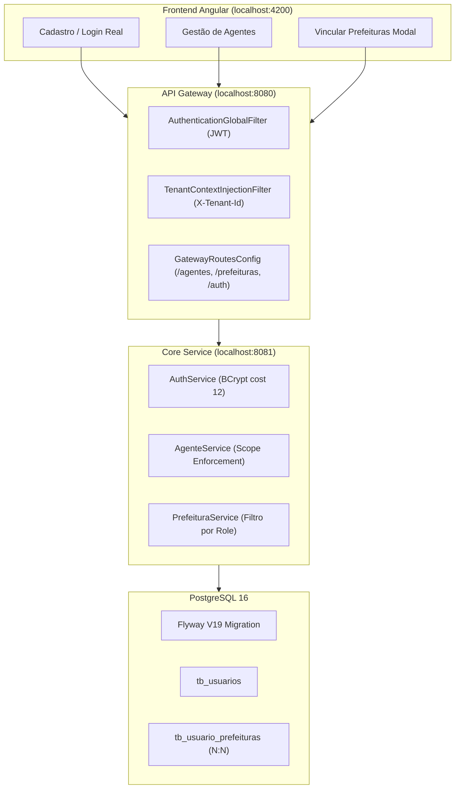

# Relatório de Execução e Fechamento da Sessão: Módulo 1 (IAM & Onboarding)

**Repositório:** `https://github.com/Gabrielc476/consultoria.git`  
**Branch:** `main`  
**Commit:** `30d797e` — `feat(iam): implement IAM onboarding agent management and gateway routing`  
**Data:** 29 de Setembro de 2026

---

## 1. Resumo Executivo das Entregas

Nesta sessão, foi implementado integralmente o **EPIC 1: Módulo 1 — Identidade, Organização e Acesso (IAM & Onboarding)** do GovFlow, cobrindo os tickets `[TICKET-IAM-01]` ao `[TICKET-IAM-08]`, além de correções críticas de integração descobertas durante a validação real na interface do usuário (UI).

---

## 2. Entregáveis por Camada e Módulo

### 2.1 Banco de Dados & Migração (Flyway)
* **`flyway/sql/V19__create_usuarios_and_agente_prefeituras_tables.sql`**:
  * Criação da tabela `core_schema.tb_usuarios` com `id`, `tenant_id` (FK `tb_consultorias`), `nome`, `email` (UNIQUE), `senha_hash`, `telefone_celular` (E.164), `role` (`ADMIN` / `AGENTE`) e `ativo`.
  * Criação da tabela relacional `core_schema.tb_usuario_prefeituras` para suporte a relacionamentos **N:N** (um agente atende múltiplos municípios; um município é atendido por múltiplos analistas).
  * Chave estrangeira e saneamento com integridade referencial de `tb_prefeituras` para `tb_consultorias`.
  * Seed de compatibilidade com usuário administrador inicial (`GovFlow2026!`).

### 2.2 Backend (`services/core-service`)
* **Segurança e Criptografia**:
  * Integração de `BCryptPasswordEncoder` com fator de custo 12.
  * Emissão de token JWT assinado contendo claims estruturados (`tenant_id`, `userId`, `roles`, `email`).
* **Arquitetura Hexagonal (Ports & Adapters)**:
  * Inbound Ports: `AutenticarUsuarioUseCase`, `CadastrarConsultoriaComAdminUseCase`, `GerenciarAgenteUseCase`, `ObterUsuarioAutenticadoUseCase`.
  * Outbound Port: `UsuarioRepositoryPort` implementado por `UsuarioRepositoryAdapter` com repositórios Spring Data JPA.
  * Agregado de Domínio: `Usuario.java` e Enum `RoleUsuario.java` livres de poluição de framework.
* **Isolamento de Escopo por Perfil (`PrefeituraService`)**:
  * Perfil `ADMIN`: visão e gestão irrestrita de todas as prefeituras da consultoria.
  * Perfil `AGENTE`: consultas filtradas estritamente pelas prefeituras atribuídas em `tb_usuario_prefeituras`. Tentativas de acesso direto por ID a prefeituras fora do escopo disparam `403 Forbidden` (`AcessoNegadoException`).
* **Suíte de Testes Automatizados**:
  * 186 testes unitários e de integração executados com sucesso (`mvn test`).

### 2.3 Roteamento no API Gateway (`gateway`)
* **`GatewayRoutesConfig.java`**:
  * Adicionada a rota `core-agentes` mapeando `/api/v1/agentes/**` e `/api/v1/agentes` para o `core-service`.
  * Injeção automática e transparente de cabeçalhos de identidade downstream (`X-Tenant-Id`, `X-User-Id`, `X-User-Roles`).

### 2.4 Frontend Angular (`frontend`)
* **Autenticação e Onboarding (`/cadastro` e `/login`)**:
  * Sincronização estrita de formulário: `Razão Social`, `Nome Fantasia`, `CNPJ`, `Plano Operacional` (STARTER, PRO, ENTERPRISE), `Nome do Administrador`, `E-mail`, `Senha` e `Celular do WhatsApp`.
  * Máscaras dinâmicas de telefone para 10 e 11 dígitos com nono dígito (`(83) 98157-9286`).
* **Gestão de Agentes (`/admin/agentes`)**:
  * Listagem da equipe de analistas com chips dos municípios atribuídos, badges de perfil e status.
  * Modal `CadastrarAgenteModalComponent` com seleção de prefeituras durante a criação.
  * Novo componente `VincularPrefeiturasModalComponent`: permite a qualquer momento o gestor (Admin) abrir o modal direto do card do agente para alocar ou remover municípios com atualização instantânea na API.
* **Eliminação de Mocks e Fallbacks Silenciosos**:
  * Erros HTTP reais (400, 401, 403, 409) do backend agora são exibidos diretamente ao usuário via toasts e banners de alerta em vez de mascarados por modo demonstração.

---

## 3. Diagnóstico e Resolução de Problemas da Sessão

| Problema Identificado | Causa Raiz | Solução Aplicada |
| :--- | :--- | :--- |
| **Jackson Deserialization Crash** | Spring tentava instanciar getters computados do record como campos de construtor sem setters. | Métodos anotados com `@JsonIgnore` em `RegisterConsultoriaRequest.java`. |
| **404 Not Found em `/api/v1/agentes`** | Rota `/api/v1/agentes/**` não constava no `GatewayRoutesConfig.java` do API Gateway (porta 8080). | Rota adicionada, build Maven executado e container `govflow-api-gateway` reiniciado. |
| **Ausência de Edição de Vínculos N:N** | Modal só existia no momento da criação do agente; agentes existentes não podiam ter prefeituras associadas após o cadastro. | Criado `VincularPrefeiturasModalComponent` e botão `🏛️ Vincular Prefeituras` em cada card. |
| **Máscara de Celular Incompleta** | Máscara antiga truncava ou desformatava números com 10 dígitos. | Implementada máscara dinâmica em `cadastrar-agente-modal` e `vincular-prefeituras-modal`. |

---

## 4. Documentação de Arquitetura Sincronizada

Seguindo o protocolo da skill `govflow-architecture-sync`:
* **`CONTEXT.md`**: Linguagem ubíqua revisada e consolidada.
* **`docs/architecture/20_modulo_iam_onboarding_e_governanca.md`**: Adicionada a Seção 6 documentando o roteamento do Gateway, tratamento de records Jackson, associação N:N e eliminação de fallbacks.
* **`docs/architecture/24_plano_de_refatoracao_e_backlog_de_tickets.md`**: Tickets do EPIC 1 (`[TICKET-IAM-01]` ao `[TICKET-IAM-08]`) marcados como concluídos com os arquivos e entregáveis auditados.

---

## 5. Próximo Passo do Projeto

Com o Módulo 1 (IAM & Onboarding) 100% testado, operacional e versionado no GitHub, a fronteira de desenvolvimento avança para:

👉 **EPIC 2: Módulo 2 — GED & Ficheiro Digital do Convênio**
* Iniciar pelo `[TICKET-GED-01]`: Generalização da tabela `core_schema.tb_documentos` (Fases 0 a 9, pastas virtuais, metadados JSONB e tabela satélite para notas fiscais).
