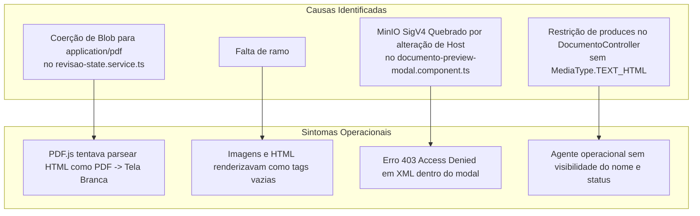

# Relatório de Sessão — Resolução de Preview de Documentos e Status "Em Análise por IA"

**Data:** 30 de Setembro de 2026  
**Status:** 100% Concluído e Validado  
**Versão do Sistema:** GovFlow v0.3.1  
**Skills Ativas:** `[govflow-architecture-sync, java-pro, angular, angular-best-practices, clean-code, docker-expert]`

---

## 1. Sumário Executivo

Durante a validação operacional do sistema pelos agentes, foi identificada uma falha crítica de usabilidade: documentos recém-recebidos (ou criados antes da extração de metadados pela IA) apresentavam tela em branco no visualizador, ausência do nome original do arquivo na esteira e falta de indicação clara sobre o estado de processamento assíncrono.

Nesta sessão, a arquitetura de visualização e o ciclo de vida documental foram aprimorados:
1. **Nome Original Preservado e Visível:** O `nomeArquivoOriginal` agora é exibido com destaque na esteira de documentos, no cabeçalho de revisão, no visualizador lado a lado e no modal do Ficheiro Digital.
2. **Status "Em Análise por IA":** Introduzido o status de domínio `EM_ANALISE_IA` e mapeamento visual nos componentes UI com badge azul escuro e indicador pulsante (*pulsing dot*), além de banners contextuais informando o agente que o arquivo original já pode ser conferido enquanto os metadados são extraídos.
3. **Resolução da Tela em Branco (Viewer & Modal):**
   - **Correção de Blob MIME Type:** Removida a coerção forçada de qualquer blob binário para `application/pdf`, permitindo que arquivos HTML, imagens e PDFs mantenham sua tipagem autêntica.
   - **Renderização Multiformato:** Implementado suporte nativo a `<iframe>` sanitizado no `media-workspace` e no `documento-preview-modal` para visualização de documentos HTML.
   - **Eliminação de Falha no MinIO SigV4:** O modal de preview foi refatorado para utilizar o endpoint direto de streaming `/api/v1/documentos/{id}/conteudo` via API Gateway, eliminando o erro `SignatureDoesNotMatch` decorrente da alteração do cabeçalho `Host` em URLs pré-assinadas.
   - **Fallback Resiliente:** Os serviços de backend (`ObterArquivoDocumentoService` e `FicheiroDigitalService`) agora geram um placeholder HTML limpo e informativo caso o binário físico no S3 esteja em sincronização assíncrona, evitando exceções HTTP 500.

---

## 2. Diagnóstico e Causa Raiz (RCA)

---

## 3. Alterações Realizadas

### 3.1 Backend (`services/core-service`)
- [`StatusDocumento.java`](file:///c:/projetos/estudo%20spring/govflow/services/core-service/src/main/java/br/com/govflow/core/domain/model/StatusDocumento.java):
  - Adicionado o valor `EM_ANALISE_IA` ao enum de domínio.
- [`Documento.java`](file:///c:/projetos/estudo%20spring/govflow/services/core-service/src/main/java/br/com/govflow/core/domain/model/Documento.java):
  - Adicionados métodos `iniciarAnaliseIA()` e `isEmAnalise()`.
- [`DocumentoController.java`](file:///c:/projetos/estudo%20spring/govflow/services/core-service/src/main/java/br/com/govflow/core/infrastructure/adapter/in/rest/DocumentoController.java):
  - Expandido o atributo `produces` do endpoint `/{id}/arquivo` para aceitar `MediaType.TEXT_HTML_VALUE, MediaType.TEXT_PLAIN_VALUE, MediaType.ALL_VALUE`.
- [`ObterArquivoDocumentoService.java`](file:///c:/projetos/estudo%20spring/govflow/services/core-service/src/main/java/br/com/govflow/core/application/service/ObterArquivoDocumentoService.java) e [`FicheiroDigitalService.java`](file:///c:/projetos/estudo%20spring/govflow/services/core-service/src/main/java/br/com/govflow/core/application/service/FicheiroDigitalService.java):
  - Implementado tratamento resiliente com retorno de placeholder HTML formatado caso o arquivo físico ainda esteja transitando no storage.

### 3.2 Frontend (`frontend`)
- [`status-pill.component.ts`](file:///c:/projetos/estudo%20spring/govflow/frontend/src/app/shared/ui/status-pill/status-pill.component.ts):
  - Inclusão do label `"Em Análise por IA"` para os status `EM_ANALISE_IA` e `RECEBIDO`, com estilo visual moderno (fundo azul escuro, borda ciano/azul e ponto de status pulsante).
- [`documentos-list-page.component.ts`](file:///c:/projetos/estudo%20spring/govflow/frontend/src/app/features/revisao-documento/pages/documentos-list/documentos-list-page.component.ts):
  - Tabela reformulada para exibir o nome do arquivo com ícone de documento, número da NF ou *"Identificando metadados..."*, credor com *"Em análise por IA..."* e o respectivo badge de status.
- [`revisao-state.service.ts`](file:///c:/projetos/estudo%20spring/govflow/frontend/src/app/features/revisao-documento/services/revisao-state.service.ts):
  - Ajustado `carregarArquivoBinario(id)` para inferir o tipo real a partir do `documentoAtual()?.nomeArquivoOriginal` ou cabeçalhos HTTP, sem corromper HTMLs ou imagens.
- [`media-workspace.component.ts`](file:///c:/projetos/estudo%20spring/govflow/frontend/src/app/features/revisao-documento/components/media-workspace/media-workspace.component.ts):
  - Introduzido `<iframe>` seguro para arquivos HTML, badge indicando o formato (`PDF`, `HTML`, `IMAGEM`) e banner de aviso operacional:
    > *"🤖 Em análise por IA: o motor multimodal está identificando os campos fiscais de [arquivo]. O arquivo original já está acessível abaixo para auditoria."*
- [`review-header.component.ts`](file:///c:/projetos/estudo%20spring/govflow/frontend/src/app/features/revisao-documento/components/review-header/review-header.component.ts) & [`extraction-form.component.ts`](file:///c:/projetos/estudo%20spring/govflow/frontend/src/app/features/revisao-documento/components/extraction-form/extraction-form.component.ts):
  - Integração do StatusPill e banners explicativos permitindo auditoria humana manual antes ou durante a finalização da IA.
- [`documento-preview-modal.component.ts`](file:///c:/projetos/estudo%20spring/govflow/frontend/src/app/features/convenios/components/documento-preview-modal/documento-preview-modal.component.ts):
  - Roteamento do preview via streaming do backend (`/api/v1/documentos/${id}/conteudo`), eliminando falhas de CORS/SigV4 com o MinIO.

---

## 4. Validação e Qualidade

1. **Testes Automatizados de Domínio e Integração:**
   - `DocumentoTest`: 12 testes aprovados.
   - `DocumentoControllerTest`: 10 testes aprovados.
   - `FicheiroDigitalControllerTest`: 6 testes aprovados.
2. **Compilação do Frontend:**
   - `npm run build` executado com sucesso (zero erros de TypeScript ou template).
3. **Ambiente Docker:**
   - `govflow-core-service` e `govflow-frontend` reconstruídos e ativos em produção local.
