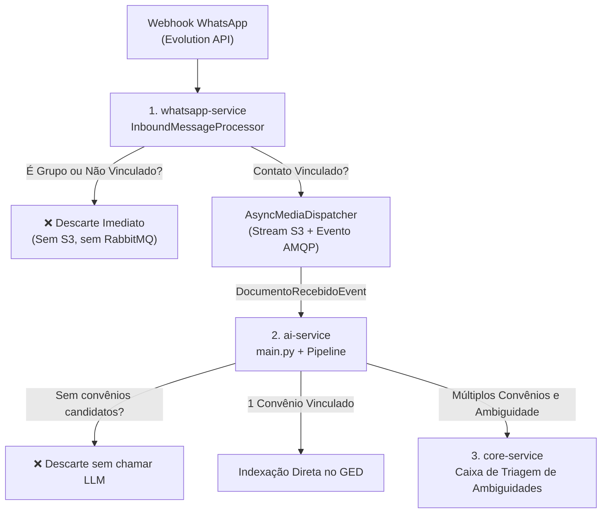

# Relatório de Sessão — Filtro Estrito para Ingestão: Apenas Documentos de Contatos Vinculados

**Data:** 01 de Outubro de 2026  
**Status:** 100% Concluído e Validado  
**Versão do Sistema:** GovFlow v0.3.2  
**Skills Ativas:** `[govflow-architecture-sync, java-pro, architecture-patterns, clean-code, docker-expert]`

---

## 1. Sumário Executivo e Problema Diagnosticado

Durante a operação prática do módulo de WhatsApp, constatou-se que mídias e documentos recebidos de grupos promocionais do WhatsApp (ex: listas de transmissão, grupos de ofertas com identificadores longos) ou remetentes não vinculados a nenhum convênio estavam:
1. Sendo gravados no MinIO e despachados via RabbitMQ;
2. Acionando chamadas de extração pelo modelo de linguagem multimodal (LLM) no `ai-service`, gerando consumo desnecessário de tokens;
3. Criando dezenas de itens de ruído na Caixa de Triagem (`tb_triagem_inbox`) e na esteira (`tb_documentos`) com o status "Remetente novo não cadastrado".

A diretriz de negócio mandatória foi definida pelo gestor:
> **"Apenas documentos de contatos vinculados sejam extraídos ou mandados para triagem, o resto não precisa passar pelo sistema."**

Nesta sessão, foi implementado o filtro estrito de ponta a ponta através de uma estratégia de **Defesa em Profundidade** (3 camadas de validação).

---

## 2. Conceito de "Contato Vinculado" (Linguagem Ubíqua)

Um contato é considerado **Contato Vinculado** quando cumpre cumulativamente:
1. Está cadastrado e ativo em `whatsapp_schema.tb_contatos`;
2. Possui pelo menos uma associação com convênio ativo em `whatsapp_schema.tb_contato_convenios` (`conveniosCandidatos.size() >= 1`).

Remetentes não cadastrados, contatos cadastrados sem nenhum convênio vinculado, bem como grupos do WhatsApp (`@g.us`), **são sumariamente ignorados na borda**, não entrando no ciclo de vida documental.

---

## 3. Arquitetura da Solução em 3 Camadas

### 3.1 Camada 1: `whatsapp-service` (Proteção na Borda)
- **`ContactResolutionService`**:
  - Implementado `isContatoVinculado()` no record `ResolvedContact`.
  - Adicionado descarte automático de mensagens provenientes de grupos do WhatsApp ou canais de transmissão (`@g.us` ou identificadores com mais de 16 caracteres numéricos).
- **`InboundMessageProcessor`**:
  - Se a mensagem contiver documento ou áudio (`dto.isDocument() || dto.isAudio()`) e o contato não for vinculado (`!contact.isContatoVinculado()`), a requisição retorna `IGNORED` e nada é persistido.
- **`AsyncMediaDispatcher`**:
  - Trava de segurança adicional: caso o método assíncrono seja acionado sem `conveniosCandidatos`, o streaming para o MinIO S3 e a publicação no RabbitMQ são abortados.

### 3.2 Camada 2: `ai-service` (Economia de LLM)
- **`main.py` (`handle_recebido`)**:
  - Se `not event.payload.convenios_candidatos` ou `event.payload.remetente_novo`, a mensagem é descartada antes de qualquer chamada ao Gemini/Gemma, evitando consumo indevido de tokens de IA.
- **`document_pipeline.py` (`classify`)**:
  - Removido o direcionamento de contatos novos/desconhecidos para triagem. A Caixa de Triagem agora existe exclusivamente para resolver ambiguidades de contatos previamente vinculados a múltiplos convênios.

### 3.3 Camada 3: `core-service` (Imutabilidade do GED)
- **`DocumentoClassificadoListener`**:
  - Valida se `remetenteNovo == true` ou se não há convênio nem direcionamento de ambiguidade válido. Caso positivo, descarta o evento sem criar registros em `tb_documentos` nem em `tb_triagem_inbox`.
  - Itens na `tb_triagem_inbox` agora representam exclusivamente contatos legítimos com dúvida de qual convênio vincular.

---

## 4. Limpeza de Dados e Validação

1. **Purga de Dados Legados/Ruído**:
   - Deletados 55 registros de spam/grupos que estavam acumulados na `core_schema.tb_triagem_inbox`.
   - Deletados 35 registros de documentos órfãos vinculados à pasta `/triagem` na `core_schema.tb_documentos`.
2. **Testes Unitários Automatizados**:
   - `whatsapp-service`: 22 testes aprovados com sucesso (`deveDescartarDocumentoDeContatoNaoVinculado`).
   - `core-service`: 4 testes aprovados no `DocumentoClassificadoListenerTest` (`deveDescartarDocumentoQuandoRemetenteNaoVinculado`).
3. **Build e Deploy Docker**:
   - Todos os 12 containers do ecossistema GovFlow reinicializados e em execução saudável.
