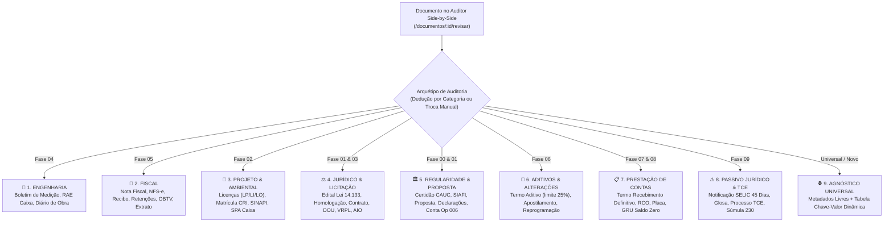

# Relatório de Sessão — Auditor Side-by-Side Polimórfico Extensível: Os 9 Arquétipos Documentais e Auditoria Agnóstica

**Data:** 01 de Outubro de 2026  
**Status:** 100% Concluído e Validado  
**Versão do Sistema:** GovFlow v0.3.4  
**Skills Ativas:** `[govflow-architecture-sync, angular, java-pro, clean-code, architecture-patterns]`

---

## 1. Sumário Executivo e Diretriz de Negócio

Durante o refinamento da esteira de conferência Human-in-the-Loop, o gestor estabeleceu uma diretriz arquitetural mandatória:
> **"O problema dessa especificação é que só esses documentos podem ser auditados, sendo que como está posto nas documentações podem ter muito mais variedades de documentos. Se for pra deixar extremamente específico, preciso que você prepare as telas e cenários para cada um desse tipo de documento e um agnóstico pra caso venha um novo tipo de documento."**

A plataforma GovFlow gerencia as 10 Fases do Ciclo de Vida dos Convênios Federais (Fases 00 a 09), compreendendo mais de 30 categorias documentais formais. A tela de auditoria não podia ficar engessada apenas para Nota Fiscal ou Boletim de Medição.

Nesta sessão, foi desenhada e implementada uma **Arquitetura Polimórfica Baseada em 9 Arquétipos Funcionais**, acompanhada de um **Modo Agnóstico Universal** com campos chave-valor dinâmicos e um **Carrossel Interativo de Cenários de Teste**.

---

## 2. Mapa dos 9 Arquétipos de Auditoria

---

## 3. Especificação dos 9 Cenários Interativos Integrados

| # | Arquétipo | Ícone | Categoria Exemplo | Pilares do Checklist Lateral | Campos de Extração Dedicados |
|---|---|:---:|---|---|---|
| 1 | **Engenharia** | 📐 | `BOLETIM_MEDICAO` (BM-03) | Aferição Física, Empreiteira & ART, Fiscalização Técnica | Nº BM, Contrato Municipal, Período, 4 Cards (Desta Medição, Acumulado Anterior/Atual, Saldo), Barra de Progresso Físico, Atesto do Engenheiro Fiscal |
| 2 | **Fiscal** | 📄 | `DOCUMENTO_HABIL` (NFS-e) | Matemática Fiscal, Retenções na Fonte, Credor & Empenho | Nº Nota, Série, Chave NF-e (44 dígitos), Empenho, Tabela Dinâmica de Retenções (INSS, ISS, IRRF, PIS, COFINS, CSLL), Bruto e Líquido |
| 3 | **Projeto & Ambiental** | 🌿 | `LICENCA_AMBIENTAL` (LI) | Licença & Vigência, Condicionantes Atendidas, Cláusula Suspensiva | Tipo de Licença (LP/LI/LO), Órgão Emissor (SUDEMA/IBAMA), Data Validade, Nº Processo, BDI (%), Condicionantes Cumpridas |
| 4 | **Jurídico & Licitação** | ⚖️ | `CONTRATO_ADMINISTRATIVO` | Processo & Edital, Publicidade no DOU, VRPL & AIO Mandatária | Modalidade Lei 14.133, Edital, Data de Homologação, DOU (Seção/Página/Data), Parecer VRPL e Nº AIO Caixa, Vencedora |
| 5 | **Regularidade & CAUC** | 🏛️ | `CERTIDAO_CAUC` | Situação CAUC, Prazo de Validade, Emenda & Conta Vinculada | Tipo de Certidão, Situação (Regular / Efeito Negativa), Validade, Emenda Parlamentar, Dados Conta Op 006 BB/Caixa |
| 6 | **Aditivos & Alterações** | 🔄 | `TERMO_ADITIVO` | Limite Legal (25%), Nova Vigência Fatal, Reajuste & Parecer | Tipo Aditamento, Nº Aditivo, Nova Data Vigência, % Acréscimo (validação automática <= 25%), Índice (INCC/IPCA), Justificativa |
| 7 | **Prestação de Contas** | 📋 | `RELATORIO_CUMPRIMENTO_OBJETO` | Recebimento Definitivo, Funcionalidade RCO, Saldo & GRU | Termo Recebimento, Comissão Portaria, Funcionalidade Plena atestada, Placa de Inauguração instalada, GRU e Saldo Zero |
| 8 | **Passivo & TCE** | ⚠️ | `NOTIFICACAO_SELIC_45_DIAS` | Prazo Fatal 45 Dias, Glosa & SELIC, Súmula 230 TCU | Tipo Notificação, Processo TC no TCU, Contador Regressivo de Dias Restantes, Órgão Notificante, Glosa SELIC, Ação Súmula 230 |
| 9 | **Agnóstico Universal** | 🌐 | `OUTROS` (Novo Tipo) | Legibilidade, Tempestividade & Emissor, Vinculação ao Convênio | Classificação Categoria/Fase, Título, Protocolo, Emissor, Valor Opcional, **Tabela Dinâmica de Metadados Chave-Valor** |

---

## 4. O Arquétipo Agnóstico Universal (Proteção contra Tipos Desconhecidos)

Para qualquer novo documento que chegue via WhatsApp, upload manual ou integração externa:
1. **Classificação Flexível:** O analista pode selecionar a Categoria e a Fase do Ciclo de Vida em dropdowns intuitivos;
2. **Campos Universais:** Título do Documento, Protocolo/Número, Data de Emissão, Órgão Emissor, CNPJ/CPF e Valor Envolvido (opcional);
3. **Metadados Dinâmicos Chave-Valor:** Permite ao analista ou à IA adicionar pares customizados (ex: `Chave: "Portaria de Nomeação"`, `Valor: "Nº 142/2026"`; `Chave: "Setor"`, `Valor: "Secretaria de Obras"`), permitindo enriquecer o registro sem depender de novas alterações no esquema do banco;
4. **Destino Dinâmico:** Botão "Aprovar e Custodiar no GED", encaminhando a peça para a pasta da fase correspondente no Ficheiro Digital.

---

## 5. Implementação Técnica

### 5.1 Backend (`core-service`):
- **`TipoDocumentoHabil.java`**: Adicionadas todas as categorias de arquétipos e `DOCUMENTO_GENERICO`, com métodos auxiliares `isFiscal()` e `isMedicao()`.
- **`DadosFiscais.java`**: Refatorados `validarCamposObrigatorios()` e `validarConsistenciaMatematica()`. Regras tributárias estritas são exigidas apenas para notas fiscais; medições exigem apuração física; e documentos administrativos e agnósticos são aprovados sem exigir valores brutos positivos ou retenções.
- **`DadosRevisaoRequest.java`**: Flexibilizado Bean Validation para permitir `valorBruto` zerado ou opcional em atos administrativos.
- **Testes Unitários:** `mvn test` executou 28 testes com 0 falhas e 0 erros.

### 5.2 Frontend (`Angular`):
- **`documento.model.ts`**: Modelados `ArquetipoAuditoria`, `CenarioDemonstracao`, `MetadadoItem` e todos os campos específicos dos 9 arquétipos.
- **`revisao-state.service.ts`**: Implementado catálogo `CENARIOS_DEMONSTRACAO`, signals de arquétipo ativo (`arquetipoAtivo`), métodos de seleção de cenários (`selecionarCenario`) e manipulação de metadados customizados (`adicionarMetadadoCustomizado`, etc.).
- **`audit-checklist.component.ts`**: Template polimórfico cobrindo os 3 pilares de conformidade de cada um dos 9 arquétipos.
- **`extraction-form.component.ts`**: Carrossel horizontal de cenários com 9 botões instantâneos, alternância de modo Leitura/Edição, formulários especializados e botão de aprovação dinâmico.
- **Compilação:** `npm run build` concluído com sucesso (código 0, 1.90 MB total).
