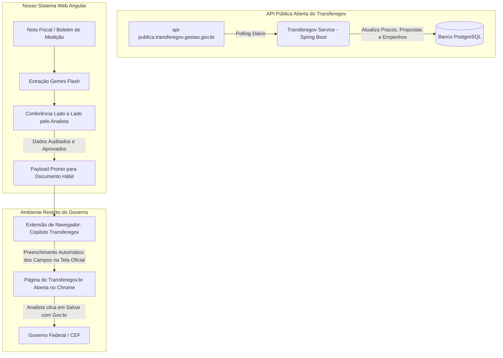
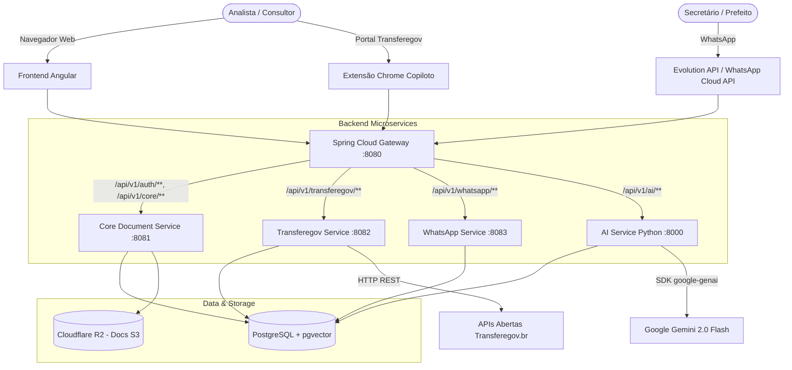

# Deep Research: Seleção de Modelos de IA, Custos, Fluxo Transferegov e Arquitetura de Microsserviços

**Objetivo:** Especificação técnica e arquitetural da plataforma focada exclusivamente no **Transferegov**, sob o paradigma **Human-in-the-Loop (Revisão Lado a Lado com Aprendizado Ativo)**, utilizando microsserviços em **Spring Boot 3 (Java 21)**, **Python FastAPI** e **Angular**.

---

## 1. Benchmark & Seleção dos Melhores e Mais Baratos Modelos de IA

Para atender à exigência de **confiança inegociável, custo irrisório e suporte a documentos e áudios do WhatsApp**, analisamos as principais opções do mercado:

### Tabela Comparativa de Modelos de IA (Visão, Documentos e Áudio)

| Modelo / Serviço | Preço Entrada (por 1M tokens) | Preço Saída (por 1M tokens) | Custo Médio por Nota/Medição (PDF 3 págs) | Leitura Nativa de PDF / Imagem | Transcrição de Áudio Nativa | Saída Estruturada (JSON Schema) | Suporte a Coordenadas (Bounding Boxes) | Veredito para o Projeto |
| :--- | :--- | :--- | :--- | :--- | :--- | :--- | :--- | :--- |
| **Google Gemini 2.0 Flash** *(Recomendado)* | **$0.10** (~R$ 0,58) | **$0.40** (~R$ 2,32) | **$0.0003** (R$ 0,0017) | **Sim (Nativo em bytes)** | **Sim (Nativo)** | **Excelente (Pydantic)** | **Sim (Normalizado 0-1000)** | **VENCEDOR ABSOLUTO** |
| **Google Gemini 1.5 Flash** | $0.075 | $0.30 | $0.00025 | Sim | Sim | Excelente | Sim | Excelente alternativa de fallback |
| **OpenAI GPT-4o-mini** | $0.15 | $0.60 | $0.0008 + conversão | Requer converter PDF para imagem | Não (Requer Whisper à parte) | Excelente | Parcial | Mais lento e 3x mais caro |
| **Claude 3.5 Haiku** | $0.80 | $4.00 | $0.0028 | Sim | Não | Excelente | Não | 8x a 10x mais caro |
| **DeepSeek V3** | $0.14 | $0.28 | N/A (Apenas texto) | **Não (Cego)** | Não | Boa | Não | Inviável para documentos escaneados |
| **AWS Textract / Google Doc AI** | $1.50 a $10.00 por 1.000 págs | N/A | $0.0045 a $0.0150 | Sim | Não | Rígido | Sim | **30x a 50x mais caro**, sem raciocínio |

---

### Por que o Gemini 2.0 Flash é a Escolha Definitiva?
1. **Leitura Multimodal Direta:** Você envia o PDF cru do documento (Nota Fiscal, Boletim de Medição ou Extrato Bancário) diretamente para a API. Ele entende tabelas complexas, carimbos, texto manuscrito e assinaturas sem precisar de uma esteira complexa de OCR prévio (Tesseract/Textract).
2. **Custo Praticamente Zero:**
   - Um documento padrão (3 páginas) consome cerca de 1.500 tokens de entrada e 400 tokens de saída.
   - **Custo unitário:** menos de **R$ 0,002 (dois décimos de centavo de real)** por documento!
   - Uma consultoria processando **2.000 documentos por mês** gastará menos de **R$ 5,00/mês de API de IA**.
3. **Detecção de Coordenadas (Bounding Boxes):**
   - O Gemini 2.0 Flash é capaz de retornar as coordenadas `[ymin, xmin, ymax, xmax]` onde encontrou cada campo no PDF. Isso permite que a tela em Angular ilumine o retângulo exato onde o valor foi lido.
4. **Áudios do WhatsApp:**
   - Mensagens de voz do WhatsApp chegam em formato `.ogg` (Opus).
   - O Gemini 2.0 Flash aceita o arquivo `.ogg` diretamente e executa **transcrição + extração de intenção em uma única chamada de 1,5 segundo**:
     *Entrada:* Áudio do secretário do interior.  
     *Saída da IA:* `"Transcrição: 'Gabriel, segue a medição 3 da creche...'. Intenção: Envio de Medição. Município: Massaranduba. Convênio: 912345."`

---

## 2. A Arquitetura de Confiança: Human-in-the-Loop & Active Learning

Para blindar o analista e garantir que erros nunca cheguem ao Transferegov:

```
                            FLUXO DE CONFIANÇA & APRENDIZADO
+-----------------------------------------------------------------------------------------------+
| 1. EXTRAÇÃO COM SCORE DE CONFIANÇA                                                            |
|    IA analisa o documento e gera a extração com pontuação (0.0 a 1.0) por campo.               |
|                                                                                               |
| 2. TELA DE CONFERÊNCIA EM ANGULAR (Lado a Lado)                                               |
|    +---------------------------------------+------------------------------------------------+ |
|    |      VISUALIZADOR PDF (Esquerda)      |            CAMPOS EXTRAÍDOS (Direita)          | |
|    |  [Caixa Verde em volta da NF] ------->|  🟢 Número NF: 1542 (Confiança: 99%)           | |
|    |  [Caixa Verde em volta do CNPJ] ----->|  🟢 CNPJ: 08.123.456/0001-90 (Confiança: 100%) | |
|    |  [Caixa Amarela em Retenção INSS] --->|  🟡 Retenção INSS: R$ 4.520,00 (Confiança: 82%)| |
|    +---------------------------------------+------------------------------------------------+ |
|                                                                                               |
| 3. AÇÃO DO ANALISTA                                                                           |
|    - Se o dado estiver certo: clica em "Confirmar" (ou atalho de teclado `Enter`).            |
|    - Se estiver errado/duvidoso: edita o valor na caixa em 2 segundos.                       |
|                                                                                               |
| 4. MEMÓRIA DINÂMICA DE PADRÕES (Aprendizado Ativo Sem Retreinamento)                          |
|    Ao salvar uma correção, o Python grava uma regra específica para aquele CNPJ/Município:   |
|    "Para o fornecedor X, a retenção de INSS fica no campo de observações adicionais".         |
|    Na próxima vez, a IA injeta essa regra no prompt (Few-Shot) e NÃO ERRA MAIS.              |
|                                                                                               |
| 5. LOG DE AUDITORIA E BACKUP                                                                  |
|    O banco registra: { "aprovado_por": "analista_gabriel", "data": "2026-09-04 14:30" }.     |
+-----------------------------------------------------------------------------------------------+
```

---

## 3. Como Funciona a Solução com o Transferegov na Prática

O Transferegov é dividido em dados públicos e ambiente restrito de execução:



### O Passo a Passo Operacional:

#### Passo 1: O Monitoramento Automático de Prazos
* O **Transferegov Service (Spring Boot)** consulta diariamente as APIs públicas federais:
  - `https://api-publica.transferegov.gestao.gov.br/parcerias/proposta`
  - `https://api-publica.transferegov.gestao.gov.br/parcerias/parceria`
  - `https://api-publica.transferegov.gestao.gov.br/parcerias/analise-proposta`
* O sistema identifica sozinho: novos convênios assinados, prazos de cláusula suspensiva vencendo e notas de empenho emitidas.

#### Passo 2: O Lançamento do "Documento Hábil" (O Gargalo Diário)
Para prestar contas ou solicitar liberação de recursos, o analista precisa cadastrar a liquidação no Transferegov. O formulário oficial exige os seguintes campos (mapeados diretamente da API):
* `nr_documento_habil`: Número da Nota Fiscal ou Recibo.
* `tp_documento_habil`: Tipo (Nota Fiscal de Serviço, Venda, etc.).
* `dt_emissao`: Data de emissão.
* `vl_documento_habil`: Valor bruto total.
* `cd_credor_devedor`: CNPJ da empreiteira.
* `nm_credor_devedor`: Razão social da empreiteira.
* `nr_empenho_dh`: Número da Nota de Empenho vinculada.
* `tx_observacao`: Descrição da medição / etapa.

**Como o analista preenche:**
1. Os dados já foram conferidos na tela em Angular.
2. O analista abre a página oficial do Transferegov no Chrome e acessa a tela de **"Incluir Documento Hábil"**.
3. A nossa **Extensão do Chrome (Copiloto Transferegov)** detecta a URL e mostra um botão flutuante: **"Preencher Documento da Medição 3"**.
4. O analista clica e **todos os 8 campos são injetados no DOM da página oficial em 1 segundo**.
5. O analista só anexa o PDF e clica no botão oficial de salvar do Transferegov.
6. **Vantagem:** Não precisamos custodiar senhas Gov.br ou certificados digitais no nosso servidor, eliminando 100% dos riscos jurídicos e de segurança cibernética!

---

## 4. Arquitetura de Microsserviços Detalhada

Seguindo a estrutura definida por você, a solução é composta por:
- **API Gateway:** Spring Cloud Gateway (Java 21 / Spring Boot 3.x)
- **4 Microsserviços Backend:**
  1. `ai-service` (Python / FastAPI)
  2. `whatsapp-service` (Spring Boot 3.x / Java 21)
  3. `transferegov-service` (Spring Boot 3.x / Java 21)
  4. `core-service` (Spring Boot 3.x / Java 21)
- **Frontend:** Angular (v19/v20) + Extensão Chrome (Manifest V3)



---

### Especificação de Cada Microsserviço

#### 1. API Gateway (`api-gateway`) - Spring Boot / Java 21
* **Tecnologia:** Spring Cloud Gateway + Spring Security (JWT / OAuth2).
* **Porta:** `8080`.
* **Responsabilidades:**
  - Ponto de entrada unificado para o Frontend Angular e a Extensão Chrome.
  - Autenticação JWT e validação de tenant (Consultoria).
  - Rate limiting e proteção contra abusos.
  - Roteamento de rotas para os 4 serviços internos.

#### 2. Core & Document Management Service (`core-service`) - Spring Boot / Java 21
* **Tecnologia:** Spring Boot 3.x, Spring Data JPA, Flyway, PostgreSQL, AWS SDK (S3 client).
* **Porta:** `8081`.
* **Responsabilidades:**
  - Gerenciamento de entidades: `Consultoria`, `Prefeitura`, `Convenio`, `Documento`, `ExtracaoRevisao`.
  - Integração com o Cloudflare R2 (armazenamento de PDFs, fotos e arquivos com zero taxa de tráfego de dados).
  - Controle de auditoria e trilha de revisão do analista (quem aprovou cada campo).

#### 3. Transferegov Service (`transferegov-service`) - Spring Boot / Java 21
* **Tecnologia:** Spring Boot 3.x, WebClient / RestClient, Spring Batch ou `@Scheduled`.
* **Porta:** `8082`.
* **Responsabilidades:**
  - Rotina agendada diária (cron) que consulta as APIs públicas do Transferegov.br para sincronizar propostas, empenhos e análises das prefeituras cadastradas.
  - Cálculo de alertas de prazos (ex: 30, 15 e 5 dias para vencimento de cláusula suspensiva).
  - Endpoint de payload para a Extensão do Chrome: formata os dados revisados exatamente no padrão esperado pelo formulário de "Documento Hábil".

#### 4. WhatsApp Service (`whatsapp-service`) - Spring Boot / Java 21
* **Tecnologia:** Spring Boot 3.x, WebSockets / SSE para atualização em tempo real no Angular.
* **Porta:** `8083`.
* **Responsabilidades:**
  - Recebe webhooks da Evolution API (ou WhatsApp Cloud API).
  - Trata mensagens de texto, áudios e arquivos anexos.
  - Quando um áudio ou arquivo chega, salva no storage provisório e aciona o `ai-service`.
  - Dispara mensagens e relatórios semanais aprovados pela equipe no WhatsApp dos prefeitos e secretários.

#### 5. AI Service (`ai-service`) - Python / FastAPI
* **Tecnologia:** Python 3.12+, FastAPI, Pydantic v2, `google-genai` SDK, `pdf2image`, `PyMuPDF`.
* **Porta:** `8000`.
* **Responsabilidades:**
  - **Endpoint `/ai/transcribe-audio`:** Recebe arquivo de áudio (`.ogg`), chama Gemini 2.0 Flash e retorna transcrição + resumo + intenção.
  - **Endpoint `/ai/extract-document`:** Recebe PDF/imagem, aplica prompt com schema Pydantic rigoroso, extrai campos do Documento Hábil com coordenadas visuais (Bounding Boxes) e Score de Confiança.
  - **Endpoint `/ai/audit-consistency`:** Cruza os dados da Nota Fiscal com o Boletim de Medição e o Contrato, alertando discrepâncias antes da revisão humana.
  - **Endpoint `/ai/feedback`:** Registra regras e correções feitas pelos analistas para aprendizado em poucas tentativas (Few-Shot Prompting).

#### 6. Frontend Web (Angular v19/v20) + Extensão Chrome
* **Angular:**
  - Componentes Standalone e Signals.
  - Visualizador de PDF interativo (com caixas de destaque coloridas sincronizadas aos campos).
  - Painel de controle geral com status semafórico de cada convênio e município.
  - Caixa de entrada do WhatsApp integrada com reprodução de áudio e transcrição imediata.
* **Extensão Chrome (Manifest V3):**
  - Injeta um botão discreto na tela de Documento Hábil do Transferegov.
  - Autentica com nosso Gateway e injeta os dados revisados nos campos da página governamental.
