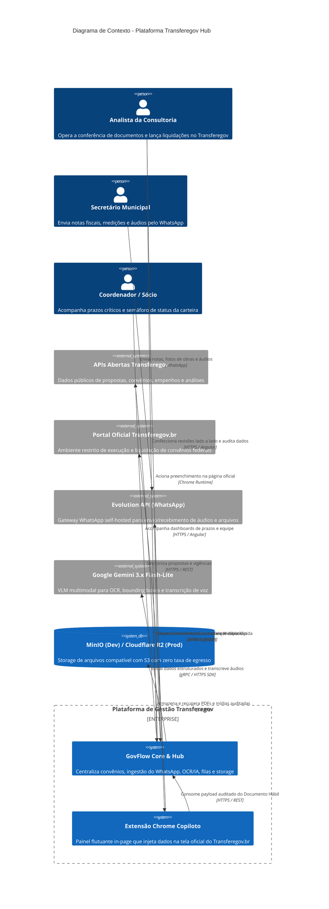
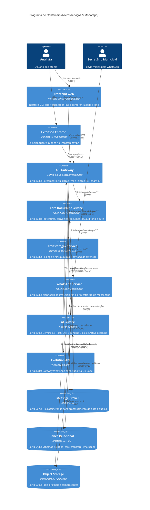

# Documento de Contexto, Arquitetura e Decisões Técnicas (ADRs)

**Projeto:** Plataforma Operacional para Consultorias Municipais (Foco: Transferegov)  
**Data da Consolidação:** Setembro de 2026  
**Status:** Arquitetura Validada e Consolidada via `/grill-me`  

---

## 1. Visão Geral e Proposta de Valor

A plataforma atua como o sistema operacional diário de consultorias municipais especializadas em convênios federais (Transferegov), substituindo o fluxo arcaico de pastas locais do Windows, anotações desatualizadas no Google Docs e digitação manual exaustiva de documentos de liquidação.

### O Princípio Fundamental: Human-in-the-Loop & Zero Risco
A IA nunca atua como uma "caixa preta" autônoma que posta dados diretamente no governo. Ela atua como um copiloto que:
1. Ingesta, transcreve e organiza documentos e áudios que chegam via WhatsApp;
2. Extrai os campos do **Documento Hábil** com pontuação de confiança (*confidence score*);
3. Apresenta uma **tela de conferência lado a lado** para validação do analista com memorização de correções (*active learning*);
4. Facilita o preenchimento na tela oficial do governo através de uma **Extensão de Navegador (Copiloto)** com injeção direta no DOM e botões de cópia em 1 clique como salvaguarda.

---

## 2. Diagrama C4 - Nível 1: Contexto do Sistema (System Context)



---

## 3. Diagrama C4 - Nível 2: Containers & Microsserviços



---

## 4. Estrutura do Monorepo

```
/ (Raiz do Monorepo)
├── docker-compose.yml              # Orquestração local de todos os serviços e infra
├── .env.example                    # Variáveis de ambiente padronizadas
├── gateway/                        # Spring Cloud Gateway (Java 21 / Maven)
│   └── src/main/java/...
├── services/
│   ├── core-service/               # Spring Boot 3 (Gestão de Entidades, Auth, Storage S3)
│   ├── transferegov-service/       # Spring Boot 3 (APIs Federais, Polling, Extensão Payload)
│   ├── whatsapp-service/           # Spring Boot 3 (Evolution API Abstraction & Webhooks)
│   └── ai-service/                 # Python 3.12+ / FastAPI (Gemini 3.x, OCR, Audio, Schemas)
├── frontend/                       # Angular 19/20 SPA (ngx-extended-pdf-viewer, Signals)
├── extension/                      # Extensão do Chrome (Manifest V3 / TypeScript)
└── docs/
    └── adr/                        # Architecture Decision Records
```

---

## 5. Índice Consolidado de ADRs (Architecture Decision Records)

### ADR-001: Adoção de Monorepo com Docker Compose
* **Status:** Aceito.
* **Contexto:** Desenvolver múltiplos microsserviços em repositórios separados na fase inicial gera overhead excessivo de CI/CD, sincronização de branches e versionamento de contratos.
* **Decisão:** Unificar todos os serviços em um único repositório Git, orquestrados localmente via `docker-compose.yml`.
* **Consequências:** Agilidade extrema no desenvolvimento local, contratos compartilhados e deploy facilitado.

### ADR-002: Persistência com Instância Única de PostgreSQL e Schemas Isolados
* **Status:** Aceito.
* **Contexto:** Rodar 4 instâncias de bancos relacionais isoladas em containers consome muita memória RAM localmente e complica backups na nuvem.
* **Decisão:** Usar uma única instância PostgreSQL com schemas lógicos independentes (`core_schema`, `transferegov_schema`, `whatsapp_schema`).
* **Consequências:** Cada microsserviço conecta-se exclusivamente ao seu schema via usuário/role dedicado, preservando o isolamento de dados do DDD com baixo consumo de recursos.

### ADR-003: Comunicação Assíncrona com RabbitMQ para Mídias e IA
* **Status:** Aceito.
* **Contexto:** O processamento de PDFs complexos e áudios de secretários leva entre 1 e 3 segundos. Chamadas síncronas HTTP bloqueariam threads do Gateway e do WhatsApp Webhook.
* **Decisão:** Implementar mensageria assíncrona com RabbitMQ (Spring AMQP no Java e Pika no Python) com suporte a retries exponenciais e Dead Letter Queue (DLQ).
* **Consequências:** Nenhuma mensagem ou arquivo recebido no WhatsApp é perdido em caso de reinicialização ou lentidão temporária do serviço de IA.

### ADR-004: Abstração do WhatsApp com Evolution API (Self-Hosted) no MVP
* **Status:** Aceito.
* **Contexto:** A API Oficial da Meta exige validação burocrática de CNPJ no Business Manager, pré-aprovação de templates de mensagens e custo por conversa.
* **Decisão:** Criar uma interface agnóstica (`WhatsAppClient`) no Spring Boot, com implementação inicial na Evolution API (self-hosted no Docker Compose via QR Code), permitindo alternar para a Meta Cloud API no futuro sem alterar a regra de negócio.
* **Consequências:** O MVP roda com custo zero de mensagens e conecta a qualquer número de teste em minutos.

### ADR-005: Extensão Chrome com Painel In-Page e Fallback de "Cópia em 1 Clique"
* **Status:** Aceito.
* **Contexto:** Interfaces governamentais (como o Transferegov.br) sofrem atualizações pontuais no HTML/DOM, o que poderia quebrar scripts de injeção automática.
* **Decisão:** A extensão injeta um painel flutuante com o botão "Preencher Formulário Oficial" no DOM e, ao mesmo tempo, exibe botões de "Copiar com 1 clique" ao lado de cada campo como fallback imediato.
* **Consequências:** Resiliência total. Se um seletor mudar, o analista continua preenchendo o formulário em segundos sem travar o expediente.

### ADR-006: Pipeline de IA Cloud-First com Gemini 3.x Flash-Lite e Fallback Multi-Modelo
* **Status:** Aceito.
* **Contexto:** Processamento de notas e medições com layouts complexos, carimbos e áudios em português regional (.ogg) a custo viável.
* **Decisão:** Utilização do Google Gemini 3.x Flash-Lite como motor principal em Python FastAPI, com fallback automático configurado para Gemini 3.7 Flash ou GPT-4o-mini caso a confiança calculada seja inferior a 75%.
* **Consequências:** Custo inferior a R$ 0,01 por documento, zero necessidade de placa de vídeo (GPU) dedicada no servidor e suporte multimodal nativo.

### ADR-007: Visualizador de PDF com `ngx-extended-pdf-viewer` no Angular
* **Status:** Aceito.
* **Contexto:** O analista precisa de uma experiência rica de conferência lado a lado, com zoom, busca textual e marcação visual de campos.
* **Decisão:** Adoção da biblioteca `ngx-extended-pdf-viewer` integrada a componentes Standalone do Angular 19/20, utilizando a camada de anotações para destacar os dados extraídos.
* **Consequências:** Interface de PDF completa e familiar para o analista, com manutenção simplificada no frontend.

### ADR-008: Autenticação Stateless JWT e Multi-Tenancy com Hibernate 6 `@TenantId`
* **Status:** Aceito.
* **Contexto:** Consultorias concorrentes nunca podem visualizar dados de outros municípios ou contratos.
* **Decisão:** O Core Service gera JWT stateless com a claim `tenant_id`. O Spring Cloud Gateway valida o token e propaga o cabeçalho `X-Tenant-ID`. Nos serviços Spring Boot, o Hibernate 6 `@TenantId` isola automaticamente as consultas por consultoria em nível de banco.
* **Consequências:** Segurança absoluta de dados contra vazamentos entre consultorias clientes, sem complexidade de múltiplos schemas dinâmicos.

### ADR-009: Storage Local com MinIO e Produção com Cloudflare R2
* **Status:** Aceito.
* **Contexto:** Desenvolver localmente sem internet ou sem criar credenciais na nuvem, mas mantendo compatibilidade de API com a nuvem de produção.
* **Decisão:** Subir um container do MinIO (S3-compatible) no Docker Compose para testes locais e apontar para o Cloudflare R2 em ambiente de homologação/produção.
* **Consequências:** Código único de cliente S3 da AWS no Spring Boot e FastAPI, sem custo de saída de dados (zero egress fees) em produção.
