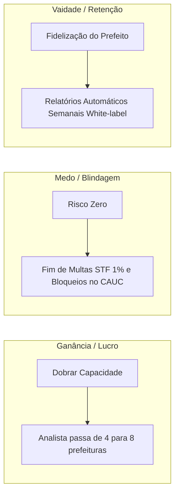
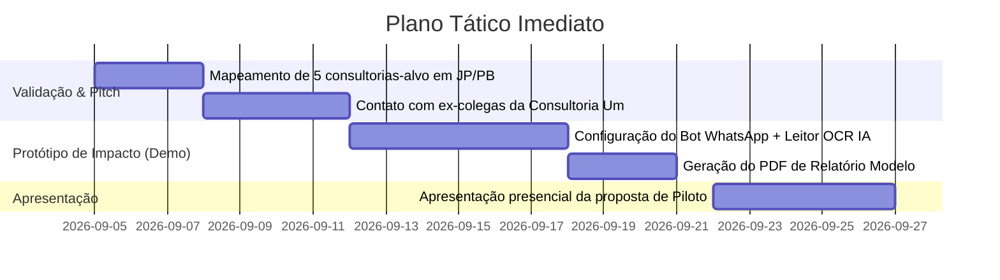

# Estratégia de Escopo, Proposta de Valor e Pitch Comercial para Consultorias Municipais

**Público-Alvo:** Donos, Sócios e Coordenadores Técnicos de Consultorias de Prefeituras (João Pessoa e Paraíba)  
**Tese Central:** Tirar a consultoria do "feijão com arroz" (Windows Explorer + Google Docs + WhatsApp caótico) não através de um apelo à "organização", mas demonstrando **aumento imediato de margem de lucro, destravamento de capacidade de novos clientes e blindagem jurídica contra perda de contratos**.

---

## 1. A Matemática da Ineficiência: Por Que o "Feijão com Arroz" Custa Muito Caro

Para fazer o dono da consultoria abandonar pastas do Windows e Google Docs, você não deve falar sobre "tecnologia moderna" ou "IA revolucionária". Você deve falar sobre **quanto dinheiro ele está perdendo todo mês sem perceber**.

### O Custo Real de um Analista de Convênios na Paraíba:
* **Salário Médio + Encargos:** R$ 3.500 a R$ 4.500/mês (CLT ou PJ correspondente).
* **Capacidade Típica:** 1 analista pleno cuida de **3 a 4 prefeituras** no modelo manual.
* **Distribuição do Tempo do Analista:**
  ```
  [==================== 45% ====================] Cobrar secretários no WhatsApp e baixar arquivos
  [============= 25% =============] Renomear arquivos e organizar pastas no Windows / Docs
  [====== 15% ======] Preencher dados no Transferegov / CREA / TCE
  [=== 10% ===] Resolver incêndios de prazos estourados ou certidões vencidas
  [= 5% =] Atendimento estratégico ao Prefeito/Secretário
  ```
* **O Diagnóstico:** Mais de **70% do salário do analista (R$ 2.500 a R$ 3.100/mês)** é gasto fazendo trabalho braçal de "secretária de arquivos" e "cobrador de WhatsApp".
* **O Gargalo de Escala:** Se a consultoria quer pegar mais 4 prefeituras, o dono é obrigado a contratar outro analista e alugar mais espaço ou computadores. **O custo marginal de crescer é quase igual à receita nova.**

---

## 2. As 3 Alavancas de Valor que Forçam a Mudança

Nenhum empresário troca o que já funciona (mesmo rudimentar) por comodidade. Ele troca por três motivos: **Medo (Risco), Ganância (Escala) ou Vaidade (Retenção do Cliente).**



### Alavanca 1: "Dobre sua carteira sem contratar mais ninguém" (Alavanca da Escala)
* **A Dor:** O dono da consultoria quer crescer, mas sabe que cada nova cidade traz uma montanha de retrabalho e descontrole.
* **A Solução:** Ao automatizar a ingestão de documentos, validação prévia e cobrança de pendências, a capacidade de um analista sobe de 3–4 cidades para **7–8 cidades**.
* **O Argumento Financeiro:** Se a consultoria cobra R$ 3.500/mês por prefeitura, colocar 4 novas prefeituras na carteira gera **+R$ 14.000/mês de faturamento bruto**. O software custa uma fração minúscula disso (R$ 1.500 a R$ 2.000/mês).

### Alavanca 2: "Blindagem jurídica contra a 'Dino-multa' e o CAUC" (Alavanca do Medo)
* **A Dor:** A recente decisão do STF (Min. Flávio Dino, ADPF 854) estipulou **multa diária de 1%** sobre o valor de emendas para municípios que não apresentarem planos de trabalho e relatórios de gestão no Transferegov. Além disso, uma certidão negativa (CND) vencida bloqueia a cidade no CAUC, parando repasses de milhões.
* **O Risco do Feijão com Arroz:** Em pastas locais e Google Docs, ninguém sabe quando um prazo de cláusula suspensiva está a 3 dias de estourar até ser tarde demais. Se o prefeito for multado ou a cidade perder R$ 1 milhão, **o contrato da consultoria é rescindido no mesmo dia**.
* **A Solução:** Radar ativo conectado às APIs do Transferegov e certidões que emite alertas preventivos com contagem regressiva visual.

### Alavanca 3: "O Prefeito nunca mais vai cogitar trocar sua consultoria" (Alavanca da Retenção)
* **A Dor:** O prefeito raramente vê o trabalho duro dos bastidores da consultoria. Ele só lembra que paga um boleto todo mês e só recebe notícias quando falta papel ou dá problema.
* **A Solução:** O software gera e envia automaticamente toda segunda-feira, às 8h da manhã, no WhatsApp do Prefeito e Secretários, um **"Boletim Executivo de Convênios & Obras" com o logotipo da própria consultoria (White-label)**.
* **O Impacto:** O prefeito abre o celular e vê: *"Massaranduba tem R$ 5.4M em execução, 3 obras com medições em dia, CAUC 100% adimplente. Trabalho realizado por: Consultoria Um"*. A percepção de valor explode.

---

## 3. O Escopo Cirúrgico da Solução (O que o MVP Precisa Fazer)

Para vencer o Google Docs e as pastas do Windows, o sistema não pode ser um ERP pesado e burocrático. Ele precisa ser um **"Assistente de Operações Inteligente"** focado no fluxo real de trabalho:

```
                                FLUXO OPERACIONAL CIRÚRGICO
+-----------------------------------------------------------------------------------------+
|                                                                                         |
| 1. INGESTÃO NO WHATSAPP                                                                 |
|    Secretário envia foto/PDF/áudio no WhatsApp                                          |
|    └─► IA identifica: Município, Tipo de Documento, Convênio / Obra                     |
|                                                                                         |
| 2. VALIDAÇÃO & REPOSITÓRIO AUTOMÁTICO                                                   |
|    IA analisa se o documento está completo:                                             |
|    ├─ Se OK: Salva na pasta nuvem correta, extrai dados (valor, data, ART)              |
|    └─ Se FALTAR algo: Bot responde no zap: "Recebi a medição, mas falta a ART do CREA" |
|                                                                                         |
| 3. RADAR DE PRAZOS & COBRANÇA PREVENTIVA                                                |
|    Integração direta com Transferegov + TransferePB + CAUC                               |
|    └─► Robô avisa o secretário com 15, 7 e 2 dias de antecedência do vencimento         |
|                                                                                         |
| 4. PAINEL DE CONTROLE DA CONSULTORIA                                                    |
|    Tela única para os analistas: todas as prefeituras em semáforo (Verde, Amarelo, Vermelho) |
|                                                                                         |
| 5. BOLETIM WHITE-LABEL PARA O PREFEITO                                                  |
|    PDF executivo automático disparado semanalmente no WhatsApp do Gestor                |
|                                                                                         |
+-----------------------------------------------------------------------------------------+
```

### Funcionalidades Essenciais do Módulo 1 (V1):
1. **Inbox Integrado de WhatsApp Multi-Prefeitura:**
   - Cada prefeitura tem um canal/grupo monitorado.
   - O analista responde tudo por uma tela central, sem precisar usar o WhatsApp pessoal no celular.
2. **Auto-Organizador de Documentos:**
   - O secretário mandou um PDF intitulado `SCAN00124.pdf`.
   - A IA lê o conteúdo, descobre que é a *Medição 02 da Creche Municipal de Juripiranga*, renomeia para `Juripiranga_Creche_Medicao_02_Assinada.pdf` e armazena na árvore da nuvem correspondente.
3. **Robô Cobrador Elegante (Follow-up Automático):**
   - O analista não precisa ficar lembrando de mandar mensagem cobrando a certidão do FGTS. O sistema dispara a solicitação automática com base no calendário de obrigações.
4. **Alerta Preventivo de Prestação de Contas (Transferegov / CREA-PB):**
   - Monitoramento das propostas e transferências especiais (Emendas Pix) extraídas da API pública do Transferegov.

---

## 4. O Roteiro de Pitch Comercial para o Dono da Consultoria

Este é o script estruturado para você agendar uma reunião e conduzir a conversa com os tomadores de decisão em consultorias como a Consultoria Um, ASSP, RWR e afins.

---

### Passo 1: A Abordagem Inicial (Gatilho de Curiosidade e Dor)
*Mensagem direta para o dono ou diretor via WhatsApp / LinkedIn / Café:*

> *"Olá, [Nome do Sócio]. Tudo bem?  
> Como atuei no setor de consultoria municipal aqui em João Pessoa, sei o sufoco que as equipes passam todo mês para conseguir arrancar extrato da Caixa, boletim de medição e ART de secretário do interior pelo WhatsApp, tendo que controlar tudo em Google Docs e pastas no Windows.  
> Com essa nova exigência do STF e TCU de prestação de contas de Emendas Pix no Transferegov sob pena de multa de 1% ao dia, o risco de deixar escapar um prazo aumentou muito.  
> Nós desenvolvemos uma tecnologia focada exatamente na rotina das consultorias da Paraíba: ela recebe o documento direto no WhatsApp do secretário, valida se está faltando folha ou assinatura, organiza na nuvem e ainda cobra as pendências automaticamente.  
> Queria te mostrar em 15 minutos como uma consultoria do seu porte consegue absorver de 5 a 10 prefeituras a mais sem precisar contratar mais nenhum analista. Você teria 15 minutos na terça ou na quinta para eu passar aí no escritório?"*

---

### Passo 2: A Abertura da Reunião (Identificando o Sangramento)
*Não abra o computador mostrando telas. Comece fazendo as perguntas certas:*

1. *"Hoje, quantas prefeituras cada analista de vocês consegue gerenciar com folga?"*
2. *"Quanto tempo da semana do seu analista é gasto simplesmente pedindo documento no WhatsApp e conferindo se veio a nota fiscal ou a ART certa?"*
3. *"Se um analista seu pedir demissão hoje, as informações dos convênios estão documentadas com histórico ou estão presas no WhatsApp e no computador dele?"*
4. *"Você já teve alguma situação de quase perder um prazo de convênio ou o município ficar inadimplente no CAUC porque o secretário do interior demorou a mandar um papel?"*

*(Deixe o sócio desabafar. Ele vai confirmar exatamente as dores que você já conhece).*

---

### Passo 3: O Momento "Uau" (A Demonstração Prática de 3 Minutos)
*Mostre um caso prático na tela:*

1. **Pegue o celular:** Envie um arquivo PDF ou foto de um documento de teste (ex: uma Nota Fiscal ou Medição fictícia) para o número do robô no WhatsApp com a legenda: *"Segue a medição do posto de saúde de Massaranduba"*.
2. **Mostre a tela do sistema:**
   - O arquivo cai instantaneamente classificado na pasta `Massaranduba > Saúde > Posto Bairro X > Medições`.
   - A IA lê o valor, a data e aponta: *"Identificado: Medição 03. Valor: R$ 45.000,00. Pendência: Falta o comprovante de pagamento da ART."*
3. **Mostre a resposta imediata no WhatsApp:**
   - O bot responde educadamente solicitando a ART faltante.
4. **Finalize mostrando o Relatório do Prefeito:**
   - Abra o PDF de 1 página com o logotipo da consultoria gerado automaticamente com todos os convênios do município.

---

### Passo 4: Contornando as Objeções Típicas

| Objeção Típica | A Resposta Mortal |
| :--- | :--- |
| *"Nós já temos o Google Drive e o Docs, funciona bem e não custa nada."* | *"O Google Drive armazena o arquivo, mas ele não avisa que a ART está faltando, não cobra o secretário no WhatsApp e não conecta com o Transferegov para avisar do prazo final. O 'grátis' do Drive custa de 15 a 20 horas por semana do seu analista que você paga em salário. Se o analista puder cuidar de 8 cidades em vez de 4, quanto a mais sua consultoria fatura todo mês?"* |
| *"Meus secretários do interior têm mais de 50 anos, não vão usar sistema nenhum."* | *"Eles não vão usar sistema nenhum mesmo, e nem devem! Eles vão continuar mandando mensagens e fotos exatamente como fazem hoje: pelo WhatsApp. Quem faz o trabalho inteligente é o nosso robô no bastidor."* |
| *"Tenho receio de colocar dados de clientes em software novo por causa de sigilo."* | *"Todos os dados são armazenados com criptografia bancária em servidores isolados e respeitando 100% a LGPD. Inclusive, ter os dados na plataforma é muito mais seguro do que ter PDFs espalhados no computador local de estagiários ou em celulares pessoais."* |

---

### Passo 5: O Fechamento com Risco Zero (Piloto Beta Fechado)
*Não tente vender um contrato anual de cara. Elimine toda a barreira de risco:*

> *"Eu não quero que você tome uma decisão agora sem ver o resultado na sua rotina.  
> Nós vamos selecionar apenas 2 consultorias de referência aqui em João Pessoa para rodar um **piloto com 3 prefeituras da sua carteira durante 30 dias**.  
> Minha equipe faz toda a configuração inicial. Você só coloca 1 analista seu para operar essas 3 cidades por dentro da ferramenta.  
> Se em 30 dias esse analista não economizar pelo menos 10 horas semanais e você não tiver um controle muito superior dos prazos, a gente encerra e não te custa um centavo. Mas se você constatar que a equipe ganhou capacidade para pegar mais clientes, nós fechamos a mensalidade para a carteira toda.  
> Podemos começar o piloto na próxima segunda-feira?"*

---

## 5. Cronograma de Ação para as Próximas 2 Semanas



1. **Lista de Contatos Quentes:** Mapeie os nomes dos sócios e coordenadores da Consultoria Um e mais 3 consultorias locais (ex: ASSP na Torre, RWR nos Expedicionários, escritórios contábeis/projetos em Campina Grande).
2. **Demo Funcional:** Ter uma tela simples e um número de WhatsApp onde você possa demonstrar ao vivo: mandar um PDF e ver a IA categorizar e validar. Isso causa 10x mais impacto do que qualquer apresentação de slides.
