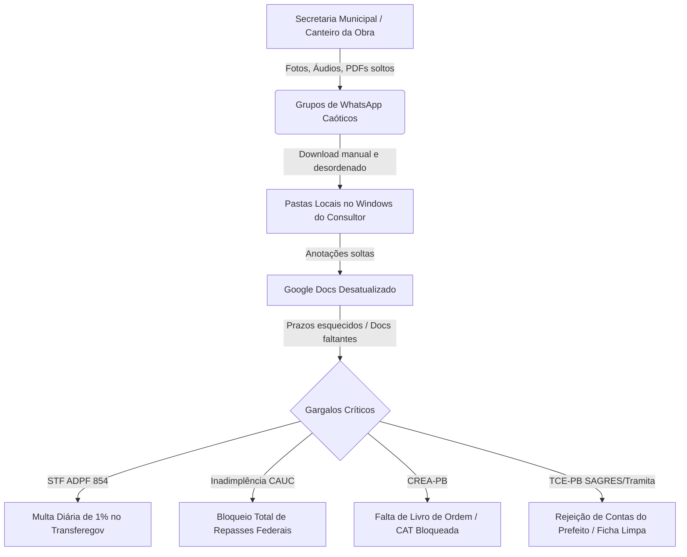
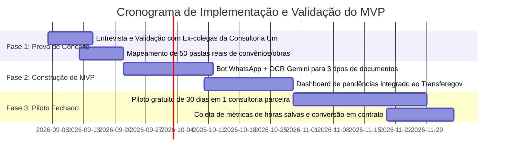

# Deep Research: Estudo de Viabilidade Técnica, Operacional e Financeira para Solução GovTech na Paraíba

**Foco Geográfico:** João Pessoa e Municípios da Paraíba  
**Objeto:** Plataforma de Organização Documental, Roteamento/Agentes WhatsApp, Gestão de Convênios (Transferegov / TransferePB), Obras/CREA-PB e Relatórios Inteligentes para Consultorias Municipais e Prefeituras  
**Data:** Setembro de 2026  

---

## 1. Sumário Executivo & Veredito

| Dimensão | Nota | Diagnóstico Resumido |
| :--- | :---: | :--- |
| **Viabilidade Técnica** | **9.2 / 10** | Alta. Integração com WhatsApp (Cloud API/Evolution), APIs abertas do Transferegov e modelos modernos de visão/OCR (Gemini Flash) resolvem o problema a custo irrisório. |
| **Aderência ao Usuário (UX/Adoção)** | **9.5 / 10** | Excelente. O uso do WhatsApp como interface de entrada elimina a barreira clássica de adoção em prefeituras do interior. O secretário não precisa aprender um software novo. |
| **Timing Regulatório de Mercado** | **9.8 / 10** | Momento perfeito. Decisões rigorosas do STF (Min. Flávio Dino) com aplicação de **multa diária de 1%** por falta de prestação de contas de Emendas Pix no Transferegov, somadas à criação do **TransferePB** (Decreto 46.545/2025) e exigências do CREA-PB (Livro de Ordem). |
| **Lucratividade & Margem Bruta** | **8.8 / 10** | Margem bruta de software estimada entre **82% e 89%**. Custos de API e nuvem baixos por município gerenciado. |
| **Veredito Geral** | **VIÁVEL E ALTAMENTE LUCRATIVO** | **Recomendação:** Iniciar como **B2B (SaaS para Consultorias de Prefeituras sediadas em João Pessoa/Campina Grande)** como cavalo de troia, antes de tentar vender B2Gov direto via licitação. |

---

## 2. Raio-X do Mercado Paraibano: Dados Demográficos e Estruturais

Para comprovar a viabilidade com dados confiáveis, foram extraídos dados oficiais do **Censo Demográfico do IBGE (2022)** e dos sistemas de prestação de contas paraibanos:

```
Distribuição Populacional dos 223 Municípios da Paraíba (IBGE 2022):
========================================================================
[==================================================] Até 10.000 hab: 141 cidades (63,2%)
[=================] 10.001 a 20.000 hab: 50 cidades (22,4%)
[=======] 20.001 a 50.000 hab: 22 cidades (9,9%)
[===] Acima de 50.000 hab: 10 cidades (4,5%)
========================================================================
Total de Municípios com < 20.000 habitantes: 191 de 223 (85,7%)
```

### Por que esse dado é fundamental para o seu negócio?
1. **Incapacidade Técnica Própria:** Municípios com menos de 20 mil habitantes (coeficiente FPM 0.6 a 1.2) não possuem corpo técnico efetivo de engenharia, arquitetura e especialistas em transferências da União. Eles operam no limite da folha da Lei de Responsabilidade Fiscal (LRF).
2. **Terceirização Obrigatória:** Por não terem servidores qualificados, **mais de 80% das prefeituras paraibanas contratam consultorias externas** em João Pessoa e polos regionais para captar recursos, cadastrar propostas, acompanhar obras e prestar contas.
3. **Volume de Recursos Federais na PB:** Apenas no módulo de transferências discricionárias do Transferegov, constam mais de **3.860 propostas registradas para municípios paraibanos**. No módulo de Transferências Especiais (Emendas Pix), **100% dos 223 municípios da Paraíba são beneficiários ativos**.

---

## 3. Mapeamento do Ecossistema de Consultorias em João Pessoa e PB

A consultoria citada na sua vivência (**Consultoria Um**, razão social *SME Serviços Especializados Ltda.*, CNPJ `13.519.354/0001-99`) não é um caso isolado. Ela representa o modelo padrão de operação de assessoria municipal no estado:

### Perfil dos Players Locais Identificados:
* **Consultoria Um / SME Serviços Especializados (João Pessoa):** Contratos com dezenas de prefeituras (ex: Juripiranga, Massaranduba, Remígio, Juazeirinho, etc.) com valores médios recorrentes de R$ 30.000 a R$ 48.000 anuais por contrato básico (R$ 2.500 a R$ 4.000/mês por prefeitura).
* **ASSP – Assessoria e Planejamento (Bairro da Torre, João Pessoa):** Especializada em projetos técnicos, gestão de convênios federais e prestação de contas.
* **RWR Consultoria e Assessoria (Ed. Metropolitan, Expedicionários, João Pessoa):** Foco em controle interno, gestão orçamentária e defesas no TCE-PB.
* **Empresas Regionais (Campina Grande, Patos, Sousa, Cajazeiras):** Escritórios de engenharia pública e contabilidade municipal que atendem grupos de 5 a 20 prefeituras no Sertão, Borborema e Curimataú.

### O "Buraco" Tecnológico Atual:
Os sistemas existentes no mercado paraibano (como **PublicSoft**, **Elmar Tecnologia**, **Aspec**) são **ERPs contábeis e de folha de pagamento**. Eles servem para fechar balancetes e enviar o SAGRES ao TCE-PB.

> [!IMPORTANT]
> **Nenhum ERP público resolve a camada operacional e de comunicação entre prefeitura e consultoria.**  
> O trabalho de coletar fotos de pavimentação, cobrar ART de engenheiro, pegar comprovante bancário da Caixa e cadastrar no Transferegov é feito hoje em um "vácuo tecnológico", sustentado precariamente por:
> - **WhatsApp informal** (grupos caóticos onde fotos perdem resolução e arquivos somem);
> - **Pastas do Windows Explorer** locais nos computadores dos consultores;
> - **Google Docs / Planilhas** estáticas preenchidas manualmente.

---

## 4. As Dores Críticas e o Risco Existencial das Prefeituras

O seu produto ataca dores com penalidades legais e financeiras severas:



1. **Multa Diária de 1% (Decisão do STF / ADPF 854 - Min. Flávio Dino):**
   - Municípios que deixarem de alimentar planos de trabalho ou relatórios de gestão de Emendas Pix no Transferegov sofrem **multa diária de 1%** e investigação da CGU/PF. Prefeitos estão em estado de alerta máximo.
2. **Bloqueio no CAUC (Cadastro Único de Convênios):**
   - Se uma única certidão (FGTS, CND, prestação de contas de convênio antigo) expirar por 24 horas, o município entra no CAUC e **não recebe um centavo de novos repasses**.
3. **Exigências do CREA-PB (Resolução Confea 1.024/1.094):**
   - Para liberar medição e emitir Certidão de Acervo Técnico (CAT), o CREA-PB exige o **Livro de Ordem Eletrônico** preenchido com relatórios diários de visita, fotos e ocorrências. Fiscais e secretários esquecem de alimentar, travando o pagamento de construtoras.
4. **Novo TransferePB (Decreto Estadual 46.545/2025):**
   - O Governo do Estado da Paraíba passou a exigir o mesmo rigor do sistema federal para as emendas e convênios estaduais, dobrando a carga de trabalho das consultorias.

---

## 5. Arquitetura da Solução Proposta: "GovFlow PB"

Para substituir o Windows Explorer e o Google Docs, a solução deve ter 5 módulos integrados:

### Módulo 1: Intake & Roteamento Inteligente via WhatsApp
* **Entrada Sem Atrito:** O Secretário de Obras ou Assessor envia uma mensagem de áudio, PDF ou foto no WhatsApp:  
  *Exemplo:* *"Oi Gabriel, segue o boletim de medição nº 3 do asfalto do bairro Novo e a nota fiscal da empreiteira."*
* **Processamento por IA:**
  - Identifica o Município emissor (pelo número do WhatsApp e contexto).
  - Reconhece o tipo de documento (Boletim de Medição, Nota Fiscal, ART).
  - Associa ao Convênio / Obra correspondente no sistema.
* **Roteamento Humano-Robô:**
  - Notifica o consultor especialista responsável (Engenheiro ou Analista de Convênios) com o ticket pronto.
  - Se faltar documento, o bot responde automaticamente no WhatsApp:  
    *"Recebemos a NF e o Boletim da Medição 3. Constatamos que ainda falta a ART de fiscalização do CREA-PB e as fotos georreferenciadas do trecho. Por favor, envie para darmos entrada no Transferegov até sexta-feira."*

### Módulo 2: O "Google Docs Inteligente" (Repositório & Auditoria em Nuvem)
* Substitui o sistema de arquivos do Windows por uma árvore estruturada padronizada por município:
  ```
  [Município: Massaranduba-PB]
   ├── [Convênios Federais - Transferegov]
   │    └── [Convênio 912345/2024 - Creche Tipo 1]
   │         ├── Proposta & Plano de Trabalho
   │         ├── Medição 01 (Boletim, Fotos, NF, OBTV)
   │         └── Prestação de Contas Parcial
   ├── [Emendas Especiais - Pix]
   ├── [CREA-PB - Obras] (ARTs, Livro de Ordem, Diários)
   └── [Certidões & CAUC] (Alertas de validade)
  ```
* Cada arquivo possui metadados extraídos automaticamente (CNPJ, valor, data de emissão, número de empenho, chave de acesso da NF-e).

### Módulo 3: Conexão Automática com APIs Oficiais
* Integração direta com os endpoints públicos do Governo Federal:
  - `https://api-publica.transferegov.gestao.gov.br/parcerias/proposta`
  - `https://api-publica.transferegov.gestao.gov.br/especiais/beneficiarios-especiais`
  - `https://api-publica.transferegov.gestao.gov.br/especiais/relatorios-gestao-especiais`
* O sistema sincroniza sozinho a lista de convênios do município, alertando quando há cláusula suspensiva a vencer ou prestação pendente.

### Módulo 4: Relatórios Executivos Automáticos
* Toda segunda-feira de manhã, o sistema gera e envia automaticamente em PDF no WhatsApp do Prefeito e dos Secretários um relatório executivo de 1 página:
  - Total de recursos federais e estaduais sob gestão;
  - Obras em andamento com % físico vs. % financeiro;
  - Prazos críticos da semana (Transferegov / CREA / TCE-PB);
  - Status do CAUC (verde/limpo ou risco de pendência).

---

## 6. Estratégia de Negócio: B2B vs. B2Gov

A escolha do modelo comercial é o fator determinante para a lucratividade rápida:

| Critério | Caminho A: Vender Direto para Prefeituras (B2Gov) | Caminho B: Vender para Consultorias (B2B SaaS) - **RECOMENDADO** |
| :--- | :--- | :--- |
| **Ciclo de Venda** | Lento (3 a 9 meses). Depende de dispensa de licitação ou pregão. | **Ultra-rápido (1 a 3 semanas).** Decisão direta do dono da consultoria. |
| **Risco Político** | Alto. Mudança de prefeito ou secretário pode cancelar contratos. | **Baixo.** A consultoria tem interesse comercial em manter e escalar. |
| **Efeito Alavanca** | 1 venda = 1 prefeitura. | **1 venda = 10 a 25 prefeituras de uma vez só.** |
| **Inadimplência** | Risco de atraso de empenho público em anos eleitorais. | Baixo (cobrança SaaS via cartão ou boleto corporativo). |
| **Preço Praticável** | R$ 2.500 a R$ 4.500 / mês por prefeitura. | R$ 1.500 a R$ 3.500 / mês por consultoria (ou taxa por município ativo). |

> [!TIP]
> **A Estratégia "Cavalo de Troia":**
> Fechar primeiro com **3 a 5 consultorias em João Pessoa** (como a própria Consultoria Um, ASSP, etc.). Ao fazer isso, o seu software já passa a gerenciar **50 a 100 prefeituras** indiretamente. Com cases consolidados e marca forte, você pode futuramente criar uma versão B2Gov institucional para vender diretamente a prefeituras maiores.

---

## 7. Modelagem Financeira & Unit Economics

### Custos Operacionais Diretos (COGS) por Prefeitura Monitorada:
* **WhatsApp Cloud API (Meta):** Pacote de mensagens de utilidade/serviço ~ R$ 35,00 / mês.
* **LLM & OCR (Google Gemini 1.5/2.0 Flash):** Leitura de PDFs, fotos e transcrição de áudios a $0.10 por milhão de tokens de entrada ~ R$ 12,00 / mês.
* **Armazenamento em Nuvem (Cloudflare R2 - zero taxa de tráfego):** ~ R$ 5,00 / mês por 50GB de documentos.
* **Infraestrutura Servidor (VPS gerenciada):** ~ R$ 15,00 / mês proporcional.
* **Custo Total por Prefeitura Gerenciada:** **~ R$ 67,00 / mês**

### Modelo de Precificação Sugerido (B2B para Consultorias):

| Plano | Perfil da Consultoria | Prefeituras Ativas | Valor Mensal (MRR) | Margem Bruta |
| :--- | :--- | :--- | :--- | :--- |
| **Starter** | Consultor autônomo / Pequeno escritório | Até 5 prefeituras | **R$ 890,00** | ~ 62% |
| **Professional** | Consultoria consolidada (ex: porte da Consultoria Um) | Até 15 prefeituras | **R$ 1.890,00** | ~ 76% |
| **Enterprise** | Grandes consultorias regionais | Até 30 prefeituras | **R$ 3.290,00** | ~ 84% |
| **Adicional** | Por prefeitura extra | Individual | **R$ 180,00** | ~ 63% |

### Projeção de Faturamento e Lucratividade (Mercado Paraíba):

```
Cenário 1: Validação Inicial (Meses 1 a 6)
- 4 Consultorias clientes em João Pessoa (média de 12 prefeituras cada = 48 prefeituras)
- Faturamento Recorrente Mensal (MRR): R$ 7.560,00
- Custos de Infraestrutura/APIs: R$ 1.800,00
- Lucro Operacional Bruto Mensal: R$ 5.760,00 (Margem: 76%)

Cenário 2: Consolidação Paraíba (Meses 7 a 18)
- 12 Consultorias clientes (João Pessoa, Campina Grande, Patos = ~150 prefeituras)
- Faturamento Recorrente Mensal (MRR): R$ 24.680,00
- Faturamento Anual (ARR): R$ 296.160,00
- Custos de Infraestrutura/APIs: R$ 4.800,00
- Lucro Operacional Bruto Mensal: R$ 19.880,00 (Margem: 80,5%)

Cenário 3: Expansão Regional (PE, RN e PB - Ano 3)
- 35 Consultorias clientes
- Faturamento Recorrente Mensal (MRR): R$ 78.500,00
- Faturamento Anual (ARR): R$ 942.000,00
- Margem Operacional: > 82%
```

---

## 8. Principais Riscos e Como Mitigá-los

1. **Risco de Bloqueio no WhatsApp:**
   - *Ameaça:* Uso de bots não oficiais (web scrapers de WhatsApp) resulta em banimento do número.
   - *Mitigação:* Usar a **API Oficial do WhatsApp Cloud (Meta)** ou gateways homologados (Z-API/Evolution com compliance corporativo) com número verificado da consultoria.
2. **Resistência dos Consultores Internos:**
   - *Ameaça:* Funcionários acostumados a salvar no Windows acharem que o sistema gera "trabalho duplo".
   - *Mitigação:* O sistema deve gerar valor no ato: ao arrastar um arquivo ou receber no WhatsApp, a IA já renomeia, extrai os campos e preenche a ficha do convênio. Se o sistema poupar trabalho manual, a adesão é de 100%.
3. **Segurança de Dados e LGPD:**
   - *Ameaça:* Documentos de prefeituras contêm CPFs e dados fiscais.
   - *Mitigação:* Arquitetura multi-tenant isolada no banco de dados, criptografia em repouso (AES-256) e backups diários com logs de auditoria imutáveis.

---

## 9. Plano de Ação Recomendado para Validação Imediata (90 Dias)



1. **Semana 1 a 2 — Validação Qualitativa com Contatos Próprios:**
   - Como você já possui relacionamento na Consultoria Um, converse com um coordenador ou ex-colega para mapear: quais são os 5 tipos de documentos que mais atrasam a vida da equipe? (ex: ART do CREA, Extrato Bancário da Caixa, Fotos de Obra, CND).
2. **Semana 3 a 5 — MVP Mínimo Focado em WhatsApp & Repositório:**
   - Construa apenas a ponta mais dolorosa: um número de WhatsApp onde o secretário envia o documento, a IA identifica a obra e salva na pasta correta na nuvem, notificando o consultor.
3. **Semana 6 a 8 — Conexão com API Aberta do Transferegov:**
   - Adicione o alerta de prazos de prestação de contas usando as APIs públicas federais já testadas neste relatório.
4. **Semana 9 a 12 — Primeiro Contrato Pago:**
   - Apresente a redução de horas gastas pela consultoria e feche o primeiro piloto comercial pago.
